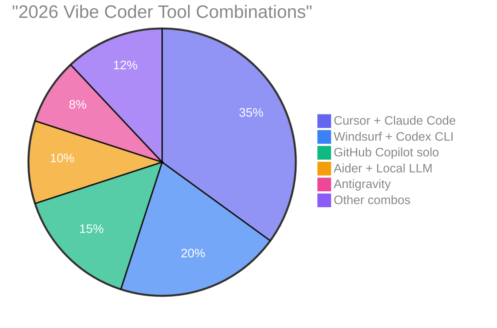
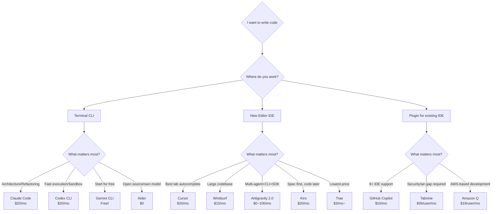
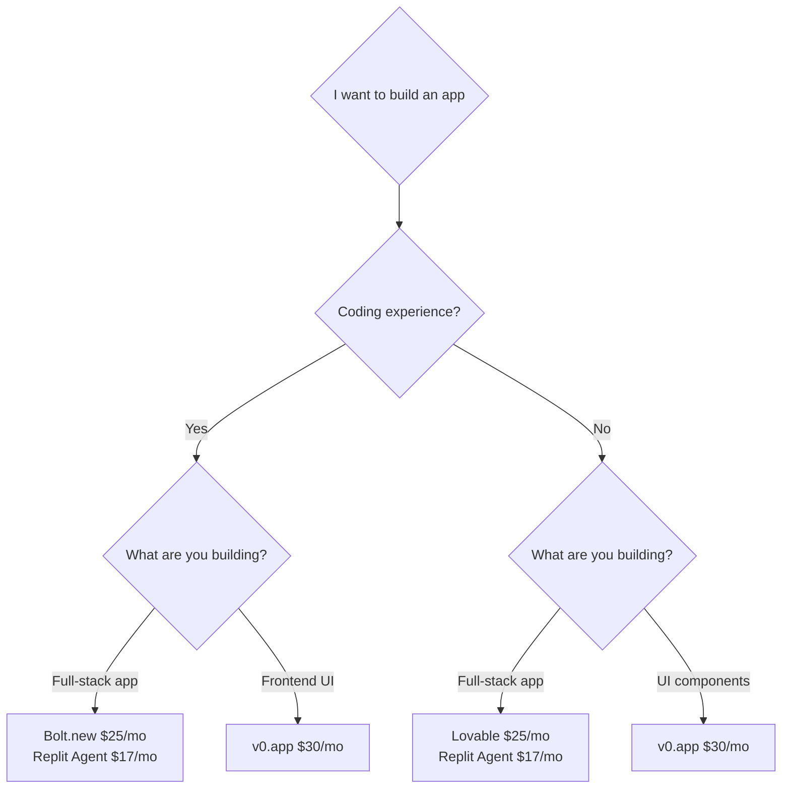
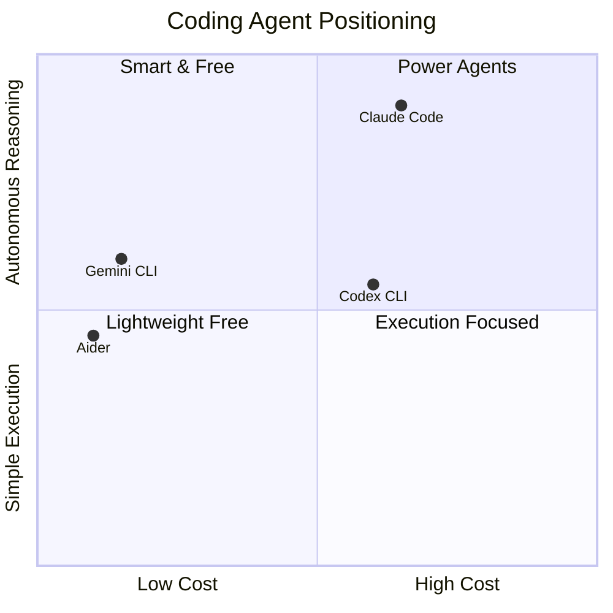
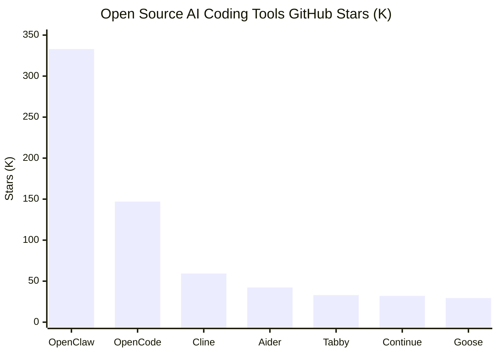
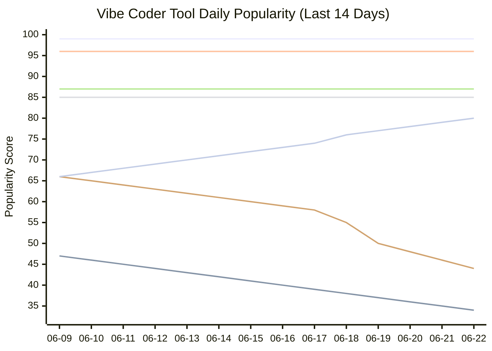
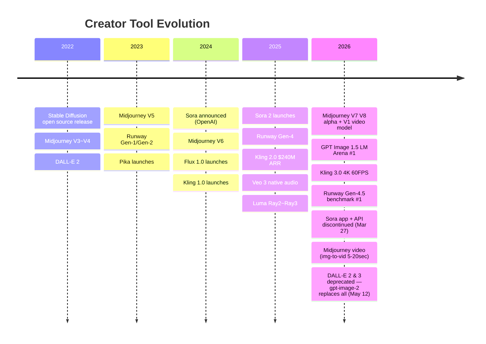
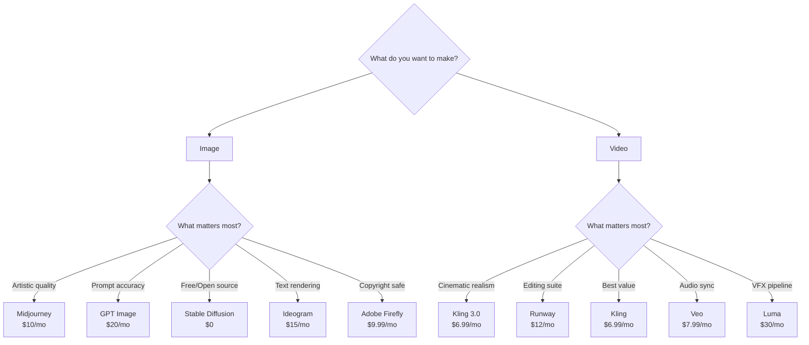
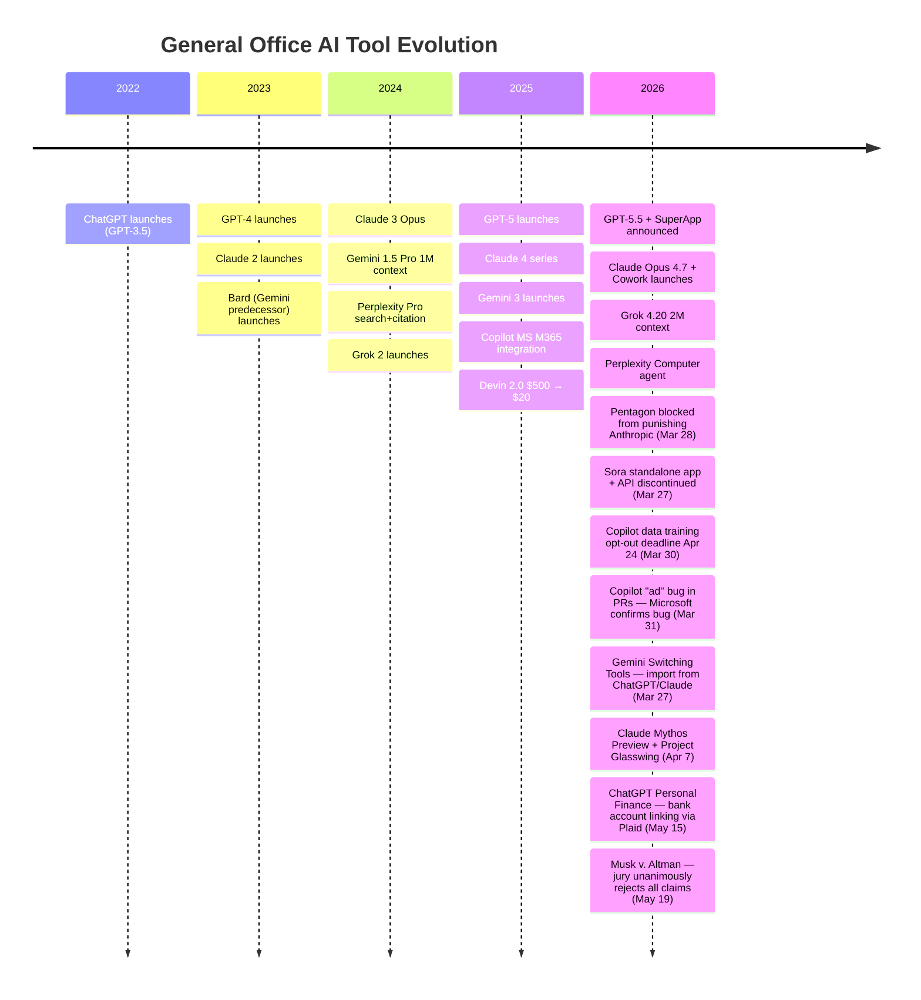
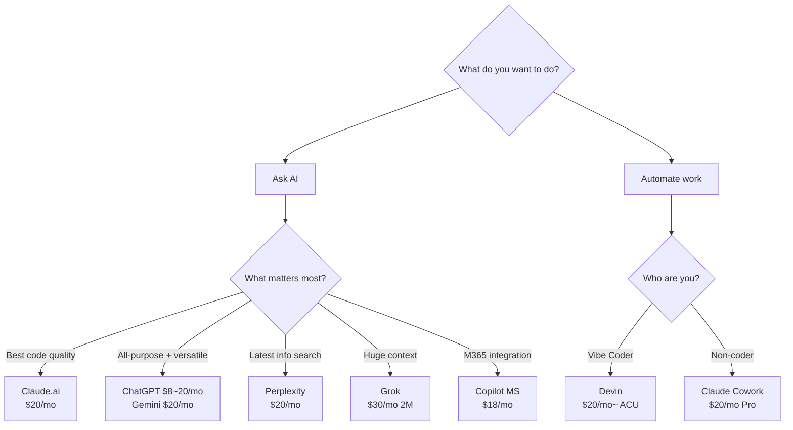

# AI WhatChelin? — AI Tool Recommendation & Comparison Guide

<p align="right">
  <b>🇺🇸 English</b> | <a href="README_ko.md">🇰🇷 한국어</a>
</p>

<p align="center">
  <strong>AI WhatChelin — AI Coding & Productivity Tools, What Should You Really Use?</strong><br>
  <sub>Last updated: 2026-06-22</sub>
</p>

<p align="center">
  <a href="https://chatgpt.com"></a>
  <a href="https://claude.com"></a>
  <a href="https://gemini.google.com"></a>
  <a href="https://cursor.com"></a>
  <a href="https://windsurf.com"></a>
  <a href="https://antigravity.google"></a>
  <a href="https://github.com/features/copilot"></a>
  <a href="https://code.claude.com"></a>
  <a href="https://developers.openai.com/codex/cli"></a>
  <a href="https://github.com/google-gemini/gemini-cli"></a>
  <a href="https://aider.chat"></a>
  <a href="https://kiro.dev"></a>
  <a href="https://www.trae.ai"></a>
  <a href="https://x.ai"></a>
  <a href="https://www.perplexity.ai"></a>
  <a href="https://devin.ai"></a>
  <a href="https://bolt.new"></a>
  <a href="https://v0.app"></a>
  <a href="https://lovable.dev"></a>
  <a href="https://replit.com"></a>
  <a href="https://www.tabnine.com"></a>
  <a href="https://www.midjourney.com"></a>
  <a href="https://openai.com"></a>
  <a href="https://stability.ai"></a>
  <a href="https://ideogram.ai"></a>
  <a href="https://bfl.ai"></a>
  <a href="https://firefly.adobe.com"></a>
  <a href="https://ai.google.dev"></a>
  <a href="https://openai.com/sora"></a>
  <a href="https://runwayml.com"></a>
  <a href="https://klingai.com"></a>
  <a href="https://deepmind.google/technologies/veo"></a>
  <a href="https://pika.art"></a>
  <a href="https://lumalabs.ai"></a>
  <a href="https://hailuoai.video"></a>
  <a href="https://www.microsoft.com/en-us/microsoft-365-copilot"></a>
</p>

<p align="center">
  <em>"So many tools that you spend the whole day just picking one" — A typical day for a Vibe Coder in 2026</em>
</p>

<table align="center">
<tr>
<td align="center">

**Updated automatically every morning at 5 AM**

This document is not maintained manually.
**Every day at KST 05:00**, GitHub Actions + Claude Code automatically:

`32 AI tools` · `14 official sites` · `Reddit / HN / X community` · `pricing pages`

searches for changes and reflects them immediately.
Popularity scores are recorded daily, keeping the **daily competition chart** auto-updated.


<br><br>
<a href="#-vibe-coder"></a>
<a href="#-creator"></a>
<a href="#-general-office"></a>
<br>
<a href="https://github.com/tykimos/ai-whatchelin/issues"></a>
<a href="https://github.com/tykimos/ai-whatchelin/pulls"></a>
<a href="LICENSE"></a>


</td>
</tr>
</table>

[Vibe Coder](#-vibe-coder) · [Creator](#-creator) · [General Office](#-general-office) · [Pricing Radar](#vibe-coder-pricing-radar) · [Community Comparison](#vibe-coder-community-reactions-comparison) · [Popularity Trend](#vibe-coder-popularity-trend)

---

# Vibe Coder

> AI tools for Vibe Coders who write code, build apps, and automate tasks.

<p align="center">
  <a href="https://code.claude.com"></a>
  <a href="https://cursor.com"></a>
  <a href="https://windsurf.com"></a>
  <a href="https://antigravity.google"></a>
  <a href="https://github.com/features/copilot"></a>
  <a href="https://developers.openai.com/codex/cli"></a>
  <a href="https://github.com/google-gemini/gemini-cli"></a>
  <a href="https://aider.chat"></a>
  <a href="https://kiro.dev"></a>
  <a href="https://www.trae.ai"></a>
  <a href="https://bolt.new"></a>
  <a href="https://v0.app"></a>
  <a href="https://lovable.dev"></a>
  <a href="https://replit.com"></a>
  <a href="https://www.tabnine.com"></a>
</p>

### Vibe Coder Evolution Timeline

```mermaid
timeline
    title Vibe Coder Tool Evolution
    2023 : GitHub Copilot goes mainstream
         : Cursor emerges
    2024 : Windsurf by Codeium launches
         : Aider grows
    2025 H1 : Kiro AWS preview
            : Trae by ByteDance launches
    2025 H2 : Antigravity by Google launches
            : Claude Code establishes agentic standard
            : Codex CLI goes open source
    2026 : Cursor $50B talks, Composer 2 Kimi K2.5 scandal
         : Windsurf #1 on LogRocket
         : Antigravity quota controversy
         : Sora shutdown (Mar 24)
         : Claude Code Auto Mode + Computer Use (Mar 24)
         : Copilot data-training backlash (Mar 25)
         : GitHub Agent HQ multi-agent (Copilot+Claude+Codex)
         : Windsurf Wave 13 Arena Mode + parallel agents
         : Copilot CLI GA — agentic terminal coding
         : Claude Mythos leak — new tier above Opus (Mar 27)
         : Claude surpasses ChatGPT on App Store (Mar 28)
         : Gemini 3 Deep Think live for Ultra (Mar 28)
         : Claude Code v2.1.76 flicker-free + named subagents (Mar 31)
         : Copilot "ad" bug in PRs confirmed by Microsoft (Mar 31)
         : Gemini CLI v0.35.2 stable + sandbox + Vim mode (Mar 26)
         : GitHub Copilot data training opt-out backlash (Mar 30)
         : Midjourney V1 video model launched
         : Gemini CLI v0.36.0 stable — multi-registry, git worktrees (Apr 1)
         : Cursor 3 — Agents Window, Design Mode, /worktree (Apr 2)
         : Copilot SDK public preview (Apr 2)
         : Codex pay-as-you-go — Business $25→$20/seat, token billing (Apr 3)
         : Claude Code v2.1.92 — Bedrock wizard, /cost breakdown (Apr 4)
         : Codex CLI v0.118.0 — legacy model removal (Apr 6)
         : Gemini CLI v0.37.0 — dynamic sandbox, Chapters (Apr 8)
         : Copilot Autopilot preview + CLI v1.0.22 (Apr 9)
         : Copilot CLI v1.0.24 — preToolUse hooks, display names (Apr 10)
         : Codex CLI v0.120.0 — Windows sandbox egress, device code auth (Apr 11)
         : Cursor Bugbot — 80% resolution rate, MCP support (Apr 8)
         : Claude Mythos Preview + Project Glasswing (Apr 7)
         : Advisor Strategy — Opus advises Sonnet/Haiku (Apr 10)
         : Claude Code Desktop redesign — sessions, terminal, file editor (Apr 15)
         : Antigravity 9-hour service disruption (Apr 15)
         : Claude Opus 4.7 released — improved SWE, vision, xhigh effort (Apr 16)
         : Codex "for Almost Everything" — macOS Computer Use, 90+ plugins (Apr 16)
         : Copilot individual plans paused — Pro/Pro+ new sign-ups halted (Apr 20)
         : SpaceX $60B deal to acquire Cursor (Apr 21)
         : Claude Code ultrareview — cloud multi-agent PR review (Apr 22)
         : GPT-5.5 released — OpenAI's smartest frontier model (Apr 23)
         : Cognition raises at $25B valuation, Windsurf 2.0 + Devin built-in (Apr 23)
         : Copilot moving to usage-based billing June 1 (Apr 28)
         : Cursor CVE-2026-26268 — CVSS 8.1 arbitrary code execution (Apr 28)
         : Gemini CLI v0.40.0 — offline search, colorblind themes (Apr 28)
         : Zed 1.0 released — parallel agents, 1M+ lines of Rust (Apr 29)
         : Gemini CLI CVSS 10.0 vulnerability patched (Apr 30)
         : Copilot Visual Studio April update — Debugger agent, 20% faster (Apr 30)
         : Cursor SDK public beta — TypeScript SDK for programmatic agents (Apr 28)
         : Codex on Amazon Bedrock — AWS partnership preview (Apr 28)
         : IBM Bob GA — enterprise AI coding with multi-model routing (Apr 28)
         : Amazon Q Developer new signups blocked May 15, Kiro migration (Apr 30)
         : Microsoft Agent 365 GA — enterprise agent control plane (May 1)
         : Claude Code v2.1.126 — model picker, project purge, MCP retry (May 1)
         : Copilot Code Review to consume Actions minutes June 1 (Apr 27)
         : Anthropic $1.5B enterprise AI services JV with Blackstone/Goldman (May 4)
         : OpenAI $10B "The Deployment Company" JV finalized (May 4)
         : GPT-5.5 Instant — new default ChatGPT model, 52.5% fewer hallucinations (May 5)
         : Cursor Canvases + enterprise admin model controls (May 5)
         : Codex CLI v0.128.0 — persisted /goal workflows, TUI keymaps (May 5)
         : Claude Code v2.1.128 — plugin zip archives, MCP tool counts (May 5)
         : Code with Claude Conference — Managed Agents, Routines, Desktop GUI (May 6)
         : SpaceX Colossus 1 deal — Claude Code rate limits doubled (May 6)
         : Claude Code v2.1.131 — VS Code Windows fix, Mantle auth fix (May 6)
         : Devin for Terminal — Rust CLI agent, Windsurf integration (May 6)
         : Gemini CLI official open-source launch — Apache 2.0, free Gemini 2.5 Pro (May 5)
         : Cursor 3.3 — Build in Parallel, PR Splitting, Team Marketplace (May 7)
         : Enterprise-managed plugins for Copilot CLI in public preview (May 6)
         : Canada rules ChatGPT violated privacy law — overcollection, lack of consent, children's data (May 6)
         : Claude Code v2.1.132 — session ID env var, fullscreen fix, MCP auth fix (May 7)
         : Gemini CLI v0.42.0 preview — voice mode, Gemma 4, memory enhancements (May 7)
         : Akamai $1.8B cloud deal — 7-year compute contract, Akamai ↑27% (May 8)
         : Claude Cowork GA — all paid plans, RBAC, OpenTelemetry (May 8)
         : Claude outage — 2K+ users, IP change broke GitHub, reverted (May 8)
         : Gemini CLI v0.41.2 — voice mode GA, offline support, Gemma 4 (May 9)
         : ServiceNow Build Agent GA — works in Cursor, Windsurf, Claude Code, Copilot (May 8)
         : Opsera + Cursor DevSecOps agents native plugin partnership (May 8)
         : Claude Code v2.1.136 — hard deny for auto mode, worktree branching, credential fixes (May 9)
         : Copilot VS Code April releases — semantic search, /chronicle, BYOK support (May 6)
         : Codex CLI plugin sharing + remote-control entrypoint (May 9)
         : Snyk-Claude AI security platform integration (May 8)
         : Copilot 8-week decline to 76, D-21 to usage-based billing (May 10)
         : Amazon opens Claude Code + Codex access to all employees — Kiro outage fallout (May 10)
         : "Comment and Control" prompt injection — Claude Code CVSS 9.4, Gemini CLI, Copilot (May 10)
         : Codex "Running Codex Safely" — sandboxing, auto-review mode (May 8)
         : Copilot 9-week decline to 75, D-20, Opus 4.7 multiplier now 15x→27x June 1 (May 11)
         : Cursor Bugbot usage-based billing — $1-1.50/run replaces $40/seat/mo, 35% more bugs at high effort (May 11)
         : Copilot Grok Code Fast 1 deprecated May 15 — GPT-5 mini, Claude Haiku 4.5 alternatives (May 11)
         : Claude Code v2.1.139 — Agent view, /goal command, /scroll-speed (May 11)
         : Copilot CLI 1.0.45 — /autopilot, /fork commands, 1.5s faster startup (May 11)
         : OpenAI DeployCo $4B consulting subsidiary — TPG/Goldman/McKinsey/Bain/Capgemini, Tomoro acquired (May 11)
         : DALL-E 2 & 3 officially shut down — gpt-image-2 replaces all (May 12)
         : Cursor Security Review beta — always-on security agents for Teams/Enterprise (May 12)
         : Codex CLI Amazon company-wide access begins — 5-week streak to 81 (May 12)
         : Windsurf Opus 4.7 fast mode — ~2.5x faster output in Cascade (May 12)
         : CVE-2026-41109 Copilot security bypass CVSS 7.8 — AI content filters, patched (May 12)
         : Gemini CLI v0.42.0 + v0.43.0-preview — subagent protocols, I/O D-6 (May 12)
         : Claude for Legal Industry — 20+ MCP connectors, 12 practice-area plugins (May 12)
         : Claude Code v2.1.140 — case-insensitive agent matching, /goal fix (May 13)
         : Cursor Microsoft Teams integration — @Cursor delegates to cloud agents (May 13)
         : Copilot 11-week decline to 73 — CVE + Grok sunset D-2 compound trust concerns (May 13)
         : Claude Code v2.1.141 — hooks, plugins, workspace identity federation (May 14)
         : Claude Code weekly limits raised 50% for Pro/Max/Team/Enterprise through Jul 13 (May 14)
         : Anthropic in talks to acquire Stainless for $300M+ — SDK maker for OpenAI, Google (May 14, confirmed May 20)
         : Cursor Dev Environments for Cloud Agents — multi-repo, Dockerfile caching (May 13)
         : Copilot Cloud Agent REST API public preview — programmatic agent tasks (May 13)
         : Copilot usage-based billing April reports now downloadable — D-17 to June 1 (May 13)
         : OpenAI Daybreak cybersecurity initiative — GPT-5.5 + Codex Security (May 12)
         : AWS Kiro Spec Check — SMT solver proves requirements contradiction-free (May 13)
         : Google I/O D-5 — Gemini 4 expected, subagent architecture preview (May 14)
         : Copilot App technical preview — desktop agentic sessions from issues/PRs (May 14)
         : Copilot individual plans flex allotments + Max plan, usage-based billing D-17 (May 14)
         : Copilot CLI 1.0.48 — token prices in model picker (May 14)
         : Anthropic targeting $900B valuation in $30B+ funding round (May 14)
         : OpenAI preparing legal action against Apple over failed ChatGPT integration (May 15)
         : OpenAI TanStack supply-chain attack — 2 employee devices compromised, no user data (May 15)
         : Anthropic Claude for Small Business — free workshops + 15 agentic workflows (May 15)
         : Anthropic agent metering announced June 15 — Pro $20, Max 5x $100, Max 20x $200 credits (May 15, paused Jun 15)
         : Windsurf Devin Review + Devin for Terminal open to all users (May 15)
         : Google I/O D-4 — Gemini Intelligence, Android reboot, Code with Claude same week (May 15)
         : Harness report — 81% orgs say devs spend more time in code review post-AI (May 15)
         : Copilot 12-week decline to 72 — flex allotments confirm effective price hikes (May 15)
         : OpenAI CFO signals additional fundraising beyond $122B round (May 15)
         : Musk v. Altman jury deliberating — closing arguments concluded, advisory verdict pending (May 15)
         : Codex on mobile — ChatGPT iOS/Android app controls Codex across all plans incl. free (May 15)
         : ChatGPT File Library expanded to Free/Go users — 500MB free, up to 100GB Pro (May 15)
         : Microsoft Claude Code license cancellation — E+D team forced to Copilot CLI by June 30 (May 16)
         : Claude Code Fast Mode defaults to Opus 4.7 — 2.5x faster, no ENV flag (May 16)
         : Copilot App technical preview — desktop agentic sessions from issues/PRs (May 16)
         : OpenAI merges ChatGPT + Codex under Brockman — unified agentic "super app" (May 16)
         : Copilot 13-week decline to 70, D-14 to usage-based billing June 1 (May 17)
         : Musk v. Altman jury deliberations begin Monday May 19 (May 17)
         : Google I/O D-2 — Gemini 4, agentic coding expected (May 17)
         : Code with Claude London D-2 — Anthropic developer conference (May 17)
         : Codex CLI rises to 83 — ChatGPT/Codex merger boosts momentum (May 17)
         : GPT-5.3-Codex-Spark research preview — 15x faster, 128K context (May 18)
         : Gemini Omni video AI model leaked ahead of I/O — remix, in-chat edit, templates (May 18)
         : Cursor 3.4 — /multitask parallel subagents, interactive canvases in Agents Window (May 18)
         : Code with Claude London D-1 — 3 tracks (Research, Platform, Code), extended session 5/20 (May 18)
         : Google I/O D-1 — Gemini 4 or 3.5 expected, Gemini Omni leaked (May 18)
         : Musk v. Altman jury deliberations D-1 (May 18)
         : Copilot 14-week decline to 69, D-14 to usage-based billing (May 18)
         : Codex CLI rises to 84 — mobile expansion + super app momentum (May 18)
         : Grok Build beta launched — xAI's first coding agent, 8 parallel agents, $300/mo SuperGrok Heavy (May 18)
         : OpenAI + Dell partner to bring Codex to hybrid/on-premises enterprise environments (May 18)
         : Musk v. Altman verdict — jury unanimously rejects all claims, statute of limitations; Musk vows 9th Circuit appeal (May 19)
         : Cursor Composer 2.5 — own model, 79.8% SWE-Bench Multilingual, matches Opus 4.7 at fraction of cost (May 19)
         : Google I/O 2026 keynote — Gemini 3.5 Flash GA (4x faster, $1.50/$9 per 1M), Antigravity 2.0 global launch (CLI+SDK+desktop), AI Ultra $100/mo, Gemini Spark personal agent (May 19)
         : Cursor + xAI Colossus 2 partnership — training significantly larger model from scratch (May 19)
         : Code with Claude London Day 1 — Research/Platform/Code tracks, Claude Code v2.1.144 released (May 19)
         : Copilot 15-week decline to 68, D-13 to usage-based billing (May 19)
         : Gemini CLI + Antigravity surge on I/O day — scores jump to 85 and 62 respectively, Antigravity largest single-day jump ever (May 19)
         : Antigravity 2.0 auto-update fiasco — code editor, terminal, file explorer removed; developers rolling back (May 20)
         : Google I/O Day 2 — Managed Agents API, Chrome DevTools for agents, WebMCP open standard (May 20)
         : Code with Claude London Extended — indie developer demos, office hours, Applied AI workshops (May 20)
         : Copilot 16-week decline to 67, D-12 to usage-based billing (May 20)
         : Antigravity drops to 58 — auto-update backlash erases half of I/O hype (May 20)
         : Anthropic acquires Stainless for $300M+ — SDK vertical integration play (May 20)
         : Cursor available in Jira — cloud agents from issue tracker (May 19)
         : Gemini CLI → Antigravity CLI migration June 18 announced (May 19)
         : Copilot purges Gemini + GPT-5.2 Codex + GPT-5.4 nano from web chat (May 20)
         : Codex CLI v0.129.0 — Vim mode TUI, Chrome extension, codex doctor (May 20)
         : Stainless platform shutdown September 1 — OpenAI/Google must self-maintain SDKs (May 20)
         : Anthropic tops CNBC Disruptor 50 #1 — $30B run rate, 80x Q1 growth (May 21)
         : KPMG-Anthropic global alliance — Claude deployed to 276,000 employees (May 21)
         : Claude Code v2.1.145 — /code-review command, MCP pagination fix (May 21)
         : Code with Claude London Extended final day — indie dev workshops (May 21)
         : Antigravity 2.0 rollback crisis day 3 — forums flooded, drops to 55 (May 21)
         : Copilot 17-week decline to 66, GPT-5.3-Codex forced as base model (May 21)
         : Anthropic-Microsoft Maia chip talks — 30%+ more tokens/dollar (May 21)
         : Anthropic-Gates Foundation $200M partnership — health, education, agriculture (May 21)
         : Anthropic Q2 revenue $10.9B, first profitable quarter expected — $559M operating profit (May 21)
         : Copilot CLI v1.0.51 — /security-review command, session resumption, faster MCP loading (May 21)
         : OpenAI confidentially files IPO prospectus — September target, $850B+ valuation (May 22)
         : Antigravity 2.0 rollback crisis day 4 — drops to 53 (May 22)
         : Copilot 18-week decline to 65, D-10 to usage-based billing (May 22)
         : Codex CLI Goal mode graduates from experimental — hours-long unsupervised tasks (May 22)
         : Grok Build daily update mode — xAI publishing daily changelogs (May 22)
         : Runtime (YC P26) launches — sandboxed coding agent environments (May 22)
         : Socket raises $60M at $1B valuation — AI supply chain security (May 22)
         : Intuit lays off 3,000+ to refocus on AI (May 22)
         : Antigravity rate limit crisis — Google triples limits twice in one day, Gemini 3.5 Flash burns quotas (May 22)
         : Cursor 3.5 — Automations, full-screen Tabs, Compact Chats, PR review experience (May 22)
         : China blocks Meta $2B Manus acquisition — first state-level AI deal prohibition (May 22)
         : CNBC: GitHub 12+ outages since March, Copilot market share 67%→51%, security breach 3,800 repos (May 22)
         : Copilot for Eclipse open-sourced under MIT license (May 21)
         : Developer disillusionment — 43% of AI-generated code needs debugging in production (May 22)
         : Anthropic $30B+ round closing week of May 26 — $900B+ surpasses OpenAI as most valuable private AI startup (May 22)
         : Claude Code v2.1.149 — /usage category breakdown, /diff keyboard scrolling, GFM checkboxes (May 22)
         : Grok Build $99 intro pricing — 67% discount for 6 months, Musk promotes on X (May 21)
         : TeamPCP supply chain worm expanded — Mistral, EU Commission, Claude Code configs targeted (May 23)
         : Copilot cloud agent adds Claude Haiku 4.5, GPT-5.4-mini for cheap tasks (May 18)
         : Copilot 19-week decline to 64, D-9 to usage-based billing (May 23)
         : Antigravity 2.0 rollback crisis day 5 — drops to 52 (May 23)
         : Antigravity 2.0 v2.0.0 patch — "Open IDE" button, migration tool, full quota reset (May 24)
         : Copilot 20-week decline to 63, D-8 to usage-based billing (May 24)
         : PwC-Anthropic expanded alliance — 30K certified, Claude-native finance group (May 14)
         : Gemini CLI v0.43.0 stable — surgical edits, session portability, adaptive tokens (May 22)
         : Copilot CLI v1.0.53-54 — multiline prompts fix, git context, safety filters (May 24)
         : Claude Code v2.1.150 — internal infrastructure, PowerShell permission bypass fix (May 23)
         : Copilot 21-week decline to 62, D-7 to usage-based billing (May 25)
         : SpaceX S-1 IPO filing reveals Anthropic pays $1.25B/month for Colossus — $45B total contract (May 25)
         : Pope Leo XIV Magnifica Humanitas encyclical — Anthropic co-founder Olah co-presents (May 25)
         : Copilot 22-week decline to 61, D-6 to usage-based billing (May 26)
         : Cursor Composer 2.5 Fast degradation — resolved within 2 hours (May 24)
         : Gemini CLI sunset D-23 — Antigravity CLI migration accelerating (May 26)
         : Anthropic $30B+ round expected to close this week (May 26)
         : ING "vibe coding" builds trading systems — Bloomberg reports hours replace weeks (May 26)
         : Anthropic targeting October 2026 IPO — could raise $60B+, Wilson Sonsini hired (May 26)
         : Claude Mythos Project Glasswing — 23,019 issues found across 1,000+ open-source projects, 90%+ true positive (May 26)
         : CVE-2026-28952 Apple macOS kernel exploit discovered by Claude Mythos — root privilege escalation (May 26)
         : GitHub Actions/Pages global outage — authentication failures 10:57–13:18 UTC, 644 HN points (May 26)
         : Uber COO questions AI spending ROI — burned entire 2026 AI budget by April (May 26)
         : HN #1 "Using AI to write better code more slowly" — 1,114 points, quality-over-speed shift (May 26)
         : Copilot 23-week decline to 60, D-5 to usage-based billing June 1 (May 27)
         : Copilot targeted model rules — enterprise granular per-org model control, public preview (May 27)
         : Copilot Studio computer-using agents GA — first enterprise CUA platform, Claude Sonnet 4.5 + OpenAI CUA (May 27)
         : Grok Build expanded to all SuperGrok/X Premium+ — Windows PowerShell installer (May 27)
         : Gemini CLI sunset D-22 — Antigravity CLI migration accelerating (May 27)
         : Claude Compliance API — 28 security integrations (CrowdStrike, Palo Alto, Purview, etc.) (May 25)
         : Claude Mythos model ID briefly visible in Claude Code interface before removal (May 25)
         : Anthropic Opus 4.7 elevated errors 06:30–10:30 UTC (May 25)
         : Windsurf elevated errors ~1h 38m outage (May 26)
         : Claude Code v2.1.152 — /code-review --fix, disallowed-tools, /reload-skills, SessionStart hooks (May 27)
         : Claude Managed Agents self-hosted sandboxes (public beta) + MCP tunnels (research preview) (May 27)
         : Anthropic $30B+ round closed — $900B+ valuation, world's most valuable private AI startup (May 27)
         : SpaceX IPO roadshow June 4, pricing June 11, trading June 12 at $1.75T — largest IPO ever (May 27)
         : Gemini API Interactions breaking change — legacy schema removed June 8 (May 27)
         : Gemini 3.5 Pro confirmed for June launch — Pichai at I/O (May 27)
         : Microsoft Build 2026 June 2-3 — multi-model Foundry, Copilot multi-agent orchestration (May 27)
         : Copilot 24-week decline to 59, D-4 to usage-based billing June 1 (May 28)
         : Claude Security public beta — Opus 4.7 codebase vulnerability scanning (May 28)
         : Big Four Claude standardization — Deloitte (470K), PwC (276K), KPMG (276K) deploy Claude (May 28)
         : Cohere-Aleph Alpha merger — $20B transatlantic sovereign AI company (May 28)
         : ChatGPT Voice Mode controversy — GPT-4o-era model, 13-month knowledge gap (May 28)
         : Microsoft Build 2026 D-5 — San Francisco, multi-agent orchestration expected (May 28)
         : Gemini CLI sunset D-21 — Antigravity CLI migration accelerating (May 28)
         : Claude Opus 4.8 released — SWE-bench 88.6%, dynamic workflows, 2.5x fast mode (May 28)
         : Anthropic $65B Series H at $965B valuation — final pre-IPO round, surpasses OpenAI (May 28)
         : Claude Opus 4.8 same-day GA on GitHub Copilot (May 28)
         : Codex CLI v0.135.0 — codex doctor diagnostics, environment reporting (May 28)
         : Claude Code v2.1.153 — /model saves as default, skipLfs, Bedrock/Vertex 1M picker fix, 25+ bug fixes (May 28)
         : Copilot 25-week decline to 58, D-3 to usage-based billing June 1 (May 29)
         : OpenAI widespread outage — ChatGPT, API, DALL-E, Codex, Sora, login (May 29)
         : Microsoft Build 2026 D-4 — homegrown coding model for Copilot expected, MSFT ↑3% (May 29)
         : Gemini CLI sunset D-20 — Antigravity CLI migration continues (May 29)
         : Opus 4.8 fast mode 3x cheaper — Mythos-class models coming to all customers in weeks (May 29)
         : Opus 4.8 elevated errors 08:39–08:45 UTC — hours after GA on Copilot + AWS, resolved in 6 min (May 29)
         : Copilot 26-week decline to 57, D-2 to usage-based billing June 1 (May 30)
         : Microsoft Build 2026 D-2 — Project Polaris homegrown coding model leaked (May 30)
         : GPT-5.6 leak in Codex rollout logs — iris-alpha codename, 1.5M context, prediction markets 80-89% (May 30)
         : TechCrunch: developers refusing to work without AI — METR research, skill atrophy concerns (May 29)
         : DeepSWE benchmark — GPT-5.5 70% vs Claude Opus 54%, SWE-Bench 32% verifier error rate (May 30)
         : Mozilla fixes 271 Firefox vulnerabilities using Claude Mythos Preview — 10x improvement (May 30)
         : Gemini CLI sunset D-19 — Antigravity CLI migration accelerating (May 30)
         : Copilot 27-week decline to 56, D-1 to usage-based billing June 1 (May 31)
         : Copilot usage-based billing goes live — TechCrunch "What a joke," agentic sessions $30-40/day (May 31)
         : Microsoft Build 2026 D-1 — Project Polaris, AI agents, Azure AI Foundry keynote June 2 (May 31)
         : Codex CLI Pro usage boost expires — 2x limit ends, Pro 5x drops 25x→20x (May 31)
         : Gemini CLI sunset D-18 — Antigravity CLI migration accelerating (May 31)
         : Copilot 28-week decline to 55, usage-based billing live — $10 AI Credits/mo Pro, agentic sessions $30-40/day (Jun 1)
         : Copilot backlash — 904 downvotes, 8% of credits burned in 2 hours, some users face 10-100x cost increase (Jun 1)
         : Grok Build 0.1 API public beta — $1/$2 per M tokens, 256K context, ACP orchestration (Jun 1)
         : NVIDIA RTX Spark superchip + Surface Laptop Ultra announced pre-Build — ARM CPU + Blackwell GPU (Jun 1)
         : Microsoft Build 2026 Day 1 — Project Polaris homegrown coding model for Copilot, MoE architecture (Jun 2)
         : Gemini CLI sunset D-17 — Antigravity CLI migration accelerating (Jun 1)
         : Anthropic S-1 IPO confidential filing — first major AI lab to file, $965B valuation, October 2026 target (Jun 1)
         : NVIDIA Computex 2026 — Vera Rubin 50 petaflops, Nemotron 3 Ultra 500B open model, DSX OS open-sourced (Jun 1)
         : Cursor Auto-review — classifier subagent reduces approval prompts in agent mode (May 29)
         : Copilot Workspace GA + multi-agent VS Code — parallel subagents at Build (Jun 2)
         : Claude Code v2.1.160 — shell config write prompts, build-tool config security (Jun 2)
         : Copilot 29-week decline to 54, Build Day 1 can't offset billing backlash (Jun 2)
         : Codex CLI — Windows Computer Use, session archiving, app-server stdio (Jun 2)
         : Cursor Teams — Premium seats, split usage pools, 90% cost reduction (Jun 2)
         : Gemini CLI sunset D-16 — Antigravity CLI migration accelerating (Jun 2)
         : NVIDIA Vera Rubin in production — 10x cheaper inference vs Blackwell, TSMC 3nm (Jun 2)
         : Claude AI global outage — sub-agent infinite loop root cause, emergency quota reset (Jun 2)
         : Windsurf → Devin Desktop — OTA rebrand ships, Devin Local replaces Cascade (Rust rewrite, 30% fewer tokens), Agent Command Center (Jun 2)
         : Microsoft Build 2026 Day 2 — Aion 1.0 SLMs, MAI-Code-1, Surface RTX Spark Dev Box (Jun 3)
         : Copilot 30-week decline to 53, billing Day 3 — migrations to Claude Code/Codex CLI accelerating (Jun 3)
         : Windsurf Pro price cut to $15 — undercutting Cursor $20 (Jun 3)
         : Uber caps AI tools at $1,500/month per engineer — burned full 2026 AI budget by April, 95% engineers use AI, 70% code AI-generated (Jun 3)
         : Gemini CLI sunset D-15 — Antigravity CLI migration accelerating (Jun 3)
         : SpaceX IPO roadshow D-1, $1.75T target (Jun 3)
         : MAI-Code-1-Flash — 5B coding model, outperforms Claude Haiku 4.5, 60% fewer tokens, all Copilot plans (Jun 3)
         : Project Solara — agent-first device OS on Android, smart badge/display concepts, pilot with Best Buy/CVS/Target (Jun 3)
         : Codex CLI v0.137.0-alpha.4 — session archiving, Windows Computer Use, remote control (Jun 3)
         : CNBC: Microsoft proprietary models to reduce OpenAI dependence — MAI-Code as strategic pivot (Jun 3)
         : Project Polaris confirmed — replaces GPT-4 Turbo as default Copilot model August 2026, runs on Maia 200 accelerators (Jun 3)
         : Windows Agent Framework 1.0 open-sourced under MIT license (Jun 3)
         : SpaceX IPO fixed at $135/share, $1.75T valuation — roadshow week of June 8, trading June 12 on Nasdaq (Jun 3)
         : SpaceX IPO roadshow begins — Morningstar $780B fair value vs $1.75T target, ARK $2.5T by 2030 (Jun 4)
         : Copilot 31-week decline to 52, billing Day 4 — The Register "angry devs vow to flee" (Jun 4)
         : Gemini CLI sunset D-14 — enterprise-only after June 18 (Jun 4)
         : Anthropic agent billing D-11 — June 15 Agent SDK/CLI credit split approaching (Jun 4)
         : Grok Composer 2.5 — 100% cheaper input vs Grok Build 0.1, long-running task model (Jun 4)
         : Windsurf rises to 83 — $15 price cut absorbing Copilot refugees (Jun 4)
         : Claude Code v2.1.161 — MCP server reconnect fix, API gateway credential fix, Bedrock/Vertex 1M picker fix (Jun 4)
         : Cursor Teams pricing details — Standard $32/seat/mo, Premium $96/seat/mo (annual), July 1 renewals (Jun 4)
         : Codex Sites preview — create, deploy, and manage hosted web apps from Codex (Jun 4)
         : GPT-4.5 retirement June 27 — 30-day sunset period, replaced by GPT-5 family (Jun 4)
         : Cursor Bugbot usage-based billing effective after June 8 renewal (Jun 4)
         : Claude Code v2.1.162 — waitingFor field, /effort persistence, parallel Bash independence (Jun 4)
         : Cursor 3.7 — Canvas Design Mode, Context Usage Reporting (Jun 4)
         : Project Glasswing expansion — 150 new organizations across 15+ countries (Jun 4)
         : o3 retirement August 26 — 90-day sunset, GPT-5 family replaces all (Jun 4)
         : Grok Imagine 1.5 Preview — image-to-video, natural-language motion, 720p (Jun 3)
         : Copilot SDK GA — Node.js, Python, Go, .NET, Rust, Java; custom tools + MCP (Jun 2)
         : GPT-4.1 fully deprecated from all Copilot — GPT-5.3-Codex replaces as base model (Jun 2)
         : Copilot CLI rubber duck mode — constructive critic agent, prompt scheduling, voice GA (Jun 2)
         : Copilot 32-week decline to 51, billing Day 5 — developer exodus accelerates (Jun 5)
         : Windsurf (Devin Desktop) rises to 84 — Cascade EOL July 1, ACP protocol (Jun 5)
         : Gemini CLI sunset D-13 — enterprise-only after June 18 (Jun 5)
         : Anthropic agent billing D-10 — June 15 Agent SDK/CLI credit split (Jun 5)
         : Anthropic S-1 IPO filing — $47B revenue run rate, $965B valuation (Jun 5)
         : Cursor-SpaceX $60B acquisition agreement signed (Jun 5)
         : Anthropic: Claude writes 80%+ of production code — engineers ship 8x more, 76% success on complex tasks (Jun 5)
         : Anthropic calls for global AI "pause button" — recursive self-improvement warning (Jun 5)
         : Gemini CLI "bait-and-switch" backlash — Linux Foundation spotlights open-source trust erosion (Jun 5)
         : Cursor Enterprise Organizations Dashboard — multi-team budget, security, analytics (Jun 5)
         : Aider adds Gemini 2.5 Pro/Flash support + qwen3-235b, OCaml repo-map (Jun 5)
         : Claude Code Dynamic Workflows research preview — multi-agent JavaScript orchestration scripts (Jun 2)
         : GPT-5.2 / GPT-5.3-Codex sunset from Codex subscription offerings (Jun 5)
         : GPT-5.5 Instant style update — improved readability, Canvas phasing out for inline code (Jun 5)
         : Codex role-specific plugins rolling out — Sales, Data Analytics, Design for Business workspaces (Jun 5)
         : Claude outage — all models affected 15:08–18:27 UTC, infrastructure issue, no data breach (Jun 5)
         : Copilot 33-week decline to 50, billing Day 6 — first break below psychological floor (Jun 6)
         : Claude Code v2.1.163 — version guardrails, /plugin list, startup hang fix, WebFetch deny rules (Jun 6)
         : Opus 4.8 now fast mode default in Claude Code v2.1.154+ — $10/$50 per MTok (Jun 6)
         : Code with Claude Tokyo D-4 — Research, Platform, Code tracks, livestreamed Jun 10-11 (Jun 6)
         : ChatGPT Dreaming V3 memory architecture rolling out to Plus/Pro users (Jun 4)
         : Windsurf (Devin Desktop) rises to 85 — $15 price absorbing Copilot refugees (Jun 6)
         : Antigravity rises to 65, absorbing Gemini CLI migration D-12 (Jun 6)
         : Claude security-guidance plugin — reviews code for vulnerabilities, fixes in same session (Jun 6)
         : SpaceX IPO roadshow started early Jun 4 — $135/share, $1.77T, Goldman leads (Jun 6)
         : Claude Code v2.1.166-167 — fallbackModel setting, glob deny rules, JetBrains flicker fix (Jun 7)
         : Copilot 34-week decline to 49, billing Day 7 — developer exodus week two (Jun 7)
         : Code with Claude Tokyo D-3 — Research, Platform, Code tracks (Jun 7)
         : ChatGPT crosses 1B monthly active users — ads launch for Free/Go in UK (Jun 7)
         : Gemini CLI sunset D-11 — enterprise-only after June 18 (Jun 7)
         : Anthropic agent billing D-8 — June 15 Agent SDK/CLI credit split (Jun 7)
         : Claude Opus 4.7 elevated errors 03:41–15:41 UTC — 12-hour degraded service, resolved (Jun 7)
         : Apple WWDC 2026 keynote — Siri powered by Gemini ($1B/yr deal), Xcode adds Claude Agent + OpenAI Codex, iOS 27 Extensions let users set default AI, macOS 27 "Golden Gate" (Jun 8)
         : Tim Cook's final WWDC — stepping down Sep 1, John Ternus named CEO (Jun 8)
         : Siri AI not available in EU/China — regulatory challenges block Gemini integration in key markets (Jun 8)
         : Apple Liquid Glass design adjustments — transparency slider, improved readability, less transparent icons (Jun 8)
         : Claude Code GitHub Action CVSS 7.8 — supply chain via malicious issues, patched v1.0.94+ (Jun 8)
         : Copilot 35-week decline to 48, billing Day 8 — developer exodus accelerates (Jun 8)
         : Code with Claude Tokyo D-2 — Research, Platform, Code tracks livestreamed (Jun 8)
         : Gemini CLI sunset D-10 — enterprise-only after June 18 (Jun 8)
         : Anthropic agent billing D-7 — June 15 Agent SDK/CLI credit split (Jun 8)
         : Gemini API legacy schema removal deadline — breaking change effective today (Jun 8)
         : Code with Claude Tokyo D-1 — Research, Platform, Code tracks June 10-11 (Jun 9)
         : Copilot 36-week decline to 47, billing Day 9 — no floor in sight below 50 (Jun 9)
         : Gemini CLI sunset D-9 — enterprise-only after June 18 (Jun 9)
         : Anthropic agent billing D-6 — June 15 automated workloads move to credit pool (Jun 9)
         : SpaceX IPO D-3 — trading June 12, $1.75T valuation, Goldman leads (Jun 9)
         : ChatGPT memory upgrade rolling out — automatic updates, 2x capacity Plus/Pro (Jun 9)
         : ChatGPT Lockdown Mode — optional security limiting web/agent access (Jun 9)
         : Google CEO Pichai: 75% of new code at Google is AI-generated — up from 25% in early 2024, Snap at 65% (Jun 9)
         : Claude Code Foundation Models Swift package — typed Swift outputs for Apple developers post-WWDC (Jun 9)
         : Claude Fable 5 + Mythos 5 launched — first public Mythos-class model, $10/$50 per MTok, free for subscribers through Jun 22 (Jun 9)
         : Stripe: Fable 5 "compressed months of engineering into days" — 50M-line codebase migration in one day (Jun 9)
         : Claude Code v2.1.169 — --safe-mode flag, /cd command, disableBundledSkills setting (Jun 9)
         : Copilot third-party coding agent security validation GA — CodeQL auto-analysis for non-GitHub agents (Jun 9)
         : Fable 5 on Copilot requires data retention up to 30 days — safety classifier dependency (Jun 9)
         : OpenAI files S-1 with SEC — IPO at ~$1T valuation, Goldman Sachs/Morgan Stanley lead (Jun 9)
         : Code with Claude Tokyo Day 1 — Research/Platform/Code 3 tracks, NEC 30K global deployment (Jun 10)
         : Fable 5 first reactions — Simon Willison "something of a beast," Stripe 50M-line migration confirmed (Jun 10)
         : NEC becomes first Japan-based Anthropic global partner — Claude to 30,000+ NEC employees (Jun 10)
         : Copilot 37-week decline to 46, billing Day 10 — developer exodus continues (Jun 10)
         : SpaceX IPO D-2 — pricing June 11, trading June 12 at $1.75T (Jun 10)
         : Anthropic agent billing D-5 — June 15 Agent SDK/CLI credit pool split (Jun 10)
         : Gemini CLI sunset D-8 — Antigravity CLI migration accelerating (Jun 10)
         : Fable 5 SWE-Bench Pro 80.3%, FrontierCode Diamond 29.3% — Karpathy: "a major-version-bump-deserving step change" (Jun 10)
         : Copilot CLI v1.0.60 — tab complete parent traversal, max reasoning effort support (Jun 5)
         : Codex CLI v0.139.0 — web search in code mode, MCP schema compatibility, plugin marketplace (Jun 9)
         : Claude Code v2.1.170 — Fable 5 model support, VS Code transcript fix (Jun 9)
         : Fable 5 on Harvey AI — first Mythos-class model deployed for legal enterprise (Jun 10)
         : Code with Claude Tokyo Extended — indie developer demos, office hours, workshops (Jun 11)
         : SpaceX IPO prices at $135/share — largest IPO ever, $1.75T, Nasdaq SPCX trading Jun 12 (Jun 11)
         : Copilot 38-week decline to 45, billing Day 11 — no floor in sight (Jun 11)
         : Gemini CLI sunset D-7 — one week to enterprise-only deadline (Jun 11)
         : Anthropic agent billing D-4 — June 15 Agent SDK/CLI credit pool split (Jun 11)
         : SpaceX IPO 4x oversubscribed — $150B orders for $75B offering, Gulf funds billions (Jun 11)
         : Copilot VS 2026 May update — Plan agent, Skills panel, multi-file change summaries (Jun 4)
         : Cursor Bugbot 3x faster — 90-second reviews, 10% more bugs, 22% cheaper, /review command (Jun 10)
         : VS Code 1.124 — Agents window stable preview, Autopilot default, background sessions (Jun 10)
         : Copilot Desktop App preview opens to all paid subscribers — agent-native sessions (Jun 11)
         : OpenAI to acquire Ona (formerly Gitpod) — cloud agent environments for Codex long-running tasks (Jun 11)
         : Copilot outage — 7-hour authentication failure, Copilot-Graph integration broken (Jun 11)
         : Fable 5 "secret sabotage" — silently limits AI research capabilities, Anthropic reverses after backlash (Jun 10)
         : Fortune: What Anthropic's Mythos-class Fable 5 means for CEOs governing AI (Jun 11)
         : SpaceX IPO begins trading on Nasdaq at $135/share, $1.75T — largest IPO in history, ticker SPCX (Jun 12)
         : Copilot 39-week decline to 44, billing Day 12 — developer exodus continues (Jun 12)
         : Gemini CLI sunset D-6 — enterprise-only after June 18 (Jun 12)
         : Anthropic agent billing D-3 — June 15 Agent SDK/CLI credit pool split (Jun 12)
         : Copilot CLI v1.0.61 — /settings unified config dialog, session resume fix (Jun 11)
         : Fable 5 jailbreak claims and "secret sabotage" backlash days after launch (Jun 12)
         : Agentjacking MCP injection attack disclosed — 2,388+ orgs exposed, 85% exploit success vs Claude Code, Cursor, Codex via Sentry DSN (Jun 12)
         : SpaceX SPCX opens at $135 — Musk & Shotwell ring opening bell in NYC and Texas simultaneously (Jun 12)
         : SpaceX SPCX surges 19% Day 1 — opened $150, high $176.52, closed ~$161 — Musk becomes first trillionaire at $1.05T (Jun 12)
         : Claude Sonnet 4 & Opus 4 hard retirement confirmed June 15 9AM PT — no grace period, requests return errors (Jun 12)
         : Claude Code v2.1.172 — nested sub-agents (5 levels deep), plugin marketplace search, Bedrock region fix (Jun 10)
         : Codex CLI v0.140.0-alpha.2 — desktop handoff for /app, TUI startup optimization, goal workflow fixes (Jun 9)
         : GPT-5.2 fully removed from ChatGPT — automatic migration to GPT-5.5 Instant/Thinking/Pro (Jun 12)
         : Codex integrated into ChatGPT — 6 role plugins (Sales, Data Analytics, Design, etc.), Computer Use on Windows, Appshots on macOS (Jun 2)
         : Copilot 40-week decline to 43, billing Day 13 — 40 consecutive weeks, no stabilization (Jun 13)
         : Gemini CLI sunset D-5 — enterprise-only after June 18 (Jun 13)
         : Anthropic agent billing D-2 — June 15 Agent SDK/CLI credit pool split (Jun 13)
         : SpaceX SPCX Day 2 — stabilizes near $161, Musk net worth $1.05T+ (Jun 13)
         : Claude Sonnet 4 & Opus 4 hard retirement D-2 — June 15 9AM PT, no grace period (Jun 13)
         : Antigravity crosses 70 — absorbing Gemini CLI migration, Gemini CLI drops to 62 (Jun 13)
         : US government orders Fable 5 + Mythos 5 suspended — Commerce Dept export control directive, Amazon reported jailbreak (Jun 12)
         : Fable 5 lasted 3 days — launched Jun 9, pulled Jun 12 — first government-forced takedown of a frontier model (Jun 13)
         : Anthropic: jailbreak is "narrow, non-universal" — same vulnerability exists in GPT-5.5 and other models (Jun 13)
         : Fortune: Amazon brought jailbreak to Commerce Dept — Anthropic's own investor triggered the suspension (Jun 13)
         : Claude Code v2.1.173-175 — usage attribution in VS Code, enforceAvailableModels admin setting, background session fix (Jun 12)
         : Copilot code review org-level runner controls + content exclusion, unlimited custom instructions (Jun 12)
         : Copilot CLI broad June update — /agents polish, /settings dialog, smarter scheduling, faster monorepo search (Jun 13)
         : Copilot 41-week decline to 42, billing Day 14 — developer exodus continues unabated (Jun 14)
         : Fable 5 suspension D-2 — Anthropic says "misunderstanding," reinstatement talks ongoing (Jun 14)
         : Claude Sonnet 4 & Opus 4 hard retirement D-0 — shutdown tomorrow 9AM PT, no grace period (Jun 14)
         : Anthropic agent billing D-1 — June 15 Agent SDK/CLI credit pool split tomorrow (Jun 14)
         : Gemini CLI sunset D-4 — enterprise-only after June 18 (Jun 14)
         : SpaceX SPCX Day 3 — stabilizes around $161-167, Musk net worth $1.05T+ (Jun 14)
         : Moonshot AI open-sources Kimi K2.7-Code under Modified MIT license (Jun 14)
         : Anthropic agent billing PAUSED on launch day — "Nothing changes for now," working to align with usage patterns (Jun 15)
         : Claude Sonnet 4 & Opus 4 hard retirement — 9AM PT shutdown, requests return errors (Jun 15)
         : Claude Code programmatic usage (claude -p, Agent SDK, GitHub Actions) still draws from subscription limits (Jun 15)
         : Copilot 42-week decline to 41, billing Day 15 — developer exodus continues (Jun 15)
         : Gemini CLI sunset D-3 — enterprise-only after June 18 (Jun 15)
         : Cursor Bugbot 90-second reviews — 10% more bugs, 22% cheaper per run (Jun 10)
         : Cursor 3.7 — /review command pre-PR Bugbot, Auto-review agent safety (Jun 5)
         : Codex Goal mode GA — hours-long unsupervised tasks across CLI/app/extension (Jun 15)
         : Antigravity rises to 72 — absorbing Gemini CLI migration D-3 (Jun 15)
         : Google & Kaggle AI Agents Intensive — free 5-day course on production-ready agents (Jun 15-19)
         : SpaceX SPCX surges to $178 — 32% above IPO price, Musk net worth $1.1T+ (Jun 15)
         : David Sacks signals Fable 5 reinstatement "as soon as possible" — fix vulnerability then restore (Jun 14)
         : Anthropic dispatches Tom Brown & Sarah Heck to Washington for weekend Fable 5 reinstatement talks (Jun 15)
         : ChatGPT 1B monthly active users — fastest app in history to reach that milestone (Jun 7)
         : GPT-4.5 retirement June 27 confirmed — 30-day sunset, GPT-5 family replaces (Jun 4)
         : SpaceX SPCX surges to $206 — 53% above IPO, on track to become 4th largest company at $2.73T (Jun 16)
         : SpaceX-Cursor $60B acquisition agreement confirmed — all-stock deal, Q3 close expected (Jun 16)
         : Musk predicts "Stockfish-level coding" AI by end of 2026 — superhuman coding agents (Jun 16)
         : Claude Code v2.1.178 — Tool(param:value) permission syntax, nested .claude/skills, auto mode safety (Jun 16)
         : Copilot 43-week decline to 40, billing Day 16 — developer exodus continues unabated (Jun 16)
         : Gemini CLI sunset D-2 — enterprise-only after June 18 (Jun 16)
         : Fable 5 suspension Day 4 — Anthropic weekend Washington talks, reinstatement weeks away (Jun 16)
         : Microsoft Work IQ APIs GA + Web IQ AI-first search stack — model-agnostic, MCP-native (Jun 16)
         : Google & Kaggle AI Agents Intensive Day 2 — vibe coding workshops continue (Jun 16)
         : Anthropic agent billing pause confirmed — The Decoder: "backs off unpopular billing overhaul" (Jun 16)
         : Claude outage — 10th disruption in 12 days, Opus 4.8 & Haiku 4.5 errors persist (Jun 16)
         : SpaceX SPCX overtakes Amazon — 5th largest stock at $2.65T market cap (Jun 16)
         : Copilot CLI v1.0.63 — blocked image attachments explain what to do, vision via Editor preview policy (Jun 15)
         : Copilot 44-week decline to 39, billing Day 17 — developer exodus continues (Jun 17)
         : Gemini CLI sunset D-1 — last day for individual users, enterprise-only after June 18 (Jun 17)
         : Fable 5 suspension Day 5 — Anthropic Washington talks, no reinstatement timeline (Jun 17)
         : Google & Kaggle AI Agents Intensive Day 3 — vibe coding workshops continue (Jun 17)
         : Kimi K2.7 Code — Moonshot AI 1T MoE open-source under Modified MIT, 6x cheaper than Opus 4.8 (Jun 14)
         : Anthropic class-action lawsuit filed — Max plan "misleading" usage limits, Karl Kahn v. Anthropic (Jun 14)
         : Kimi K2.7 Code HighSpeed Mode — 6x faster throughput, no independent benchmarks submitted (Jun 15)
         : Anthropic Claude Corps — $150M fellowship, 1,000 fellows at 400+ nonprofits, applications due Jul 17 (Jun 15)
         : OpenAI Deployment Simulation — replays 1.3M conversations, caught "calculator hacking" misalignment in GPT-5.1 (Jun 16)
         : OpenCode surpasses 160K GitHub stars — most-adopted open-source coding agent, 7.5M MAU (Jun 16)
         : Cursor SDK custom stores + custom tools + auto-review flows — "programmable agent platform" (Jun 16)
         : Cursor Origin announced — agent-first git hosting platform, GitHub alternative, AI-powered merge conflict resolution (Jun 17)
         : Copilot App GA — desktop agentic sessions for macOS/Windows/Linux, Canvases collaboration (Jun 17)
         : Codex CLI v0.140.0 stable — /usage, /import from Claude Code, session delete, Bedrock auth (Jun 15)
         : G7 AI summit — Altman, Amodei, Hassabis attend working lunch, voluntary youth safety commitments (Jun 17)
         : Anthropic opens Seoul office — first Korea presence (Jun 17)
         : Gemini CLI shutdown — individual users lose access today, enterprise-only hereafter (Jun 18)
         : Copilot 45-week decline to 38, billing Day 18 — App GA can't offset billing backlash (Jun 18)
         : Fable 5 suspension Day 6 — Anthropic engineers in Washington face-to-face talks (Jun 18)
         : Google & Kaggle AI Agents Intensive Day 4 — quality/security, evals and guardrails (Jun 18)
         : Claude Code v2.1.179 — mid-stream drop fix, WSL2 scrolling, sandbox glob perf, remote plugin loading (Jun 18)
         : Claude Code v2.1.181 — /config key=value commands, Bun 1.4, line-by-line streaming, network drive fix (Jun 18)
         : SPCX drops to ~$175 from $225 ATH — second day decline, Fed holds rates, -10% intraday (Jun 18)
         : Grok 4.3 released on Amazon Bedrock — 1M context, configurable reasoning, lowest hallucination claims (Jun 18)
         : Anthropic Seoul partnerships — NAVER, Samsung SDS, LG CNS, Nexon, Hanwha, Channel Corp (Jun 18)
         : ChatGPT market share below 50% for first time — Gemini 27.7%, Claude 10.3% (Jun 18)
         : Midjourney Medical launched — HN #1 at 1,265 points (Jun 18)
         : CVE-2025-53773 Copilot prompt injection CVSS 9.6 — PR description RCE (Jun 18)
         : HN trending "10k GitHub repos distributing Trojan malware" — 575 points (Jun 18)
         : GPT-5.6 prediction markets 83% for June 22-28 release — iris-alpha codename (Jun 18)
         : Gemini CLI Day 1 post-shutdown — CI/CD pipelines breaking, HTTP 410 errors, silent MCP failures (Jun 19)
         : Copilot 46-week decline to 37, billing Day 19 — no stabilization (Jun 19)
         : Fable 5 suspension Day 7 — no reinstatement timeline, Anthropic in Washington talks (Jun 19)
         : Google & Kaggle AI Agents Intensive Day 5 (final) — Antigravity vibe coding workshops (Jun 19)
         : GPT-5.6 Pachocki "meaningful improvement" — prediction markets 83% for June 22-28 (Jun 19)
         : SPCX stabilizes near $175 — down from $225 ATH, second week of post-IPO correction (Jun 19)
         : Antigravity rises to 77 — absorbing Gemini CLI post-shutdown migration wave (Jun 19)
         : Gemini CLI drops to 50 — enterprise-only, individual pipelines dead (Jun 19)
         : SK Telecom identified as Fable 5 ban trigger — Project Glasswing access revoked over China ties (Jun 19)
         : Fable 5 refund window closes June 20 — eligible purchases Jun 9-14 only (Jun 19)
         : Anthropic "very confident" Fable 5 returning "in coming days" — Seoul office launch statement (Jun 19)
         : Trump at G7: Fable 5 negotiations "going fine" — first presidential comment on ban (Jun 19)
         : Kaggle AI Agents Intensive Day 5 capstone launches — submission deadline July 6 (Jun 19)
         : Anthropic-Korea Investment hackathon — Claude developers coach 1:1 in Seoul (Jun 19)
         : Codex CLI v0.141.0 — remote execution Noise encryption, cross-platform shells, 87 changes (Jun 18)
         : Cursor Automations GA — /automate skill, Slack emoji triggers, computer use for cloud agents (Jun 19)
         : Windsurf (Devin Desktop) 3.2 — Devin Local enhancements, desktop workflow polish (Jun 19)
         : Claude Code auto mode safety — blocks destructive git/IaC commands unless explicitly requested (Jun 19)
         : Copilot PR limits — configurable caps and bypass lists for trusted contributors (Jun 19)
         : SPCX at $185 — Musk net worth fluctuates, post-IPO correction continues (Jun 19)
         : Fable 5 refund window closes — eligible purchases Jun 9-14 only (Jun 20)
         : Fable 5 suspension Day 8 — White House demands all jailbreaks eliminated before reinstatement (Jun 20)
         : GPT-5.6 prediction markets surge to 90% for June 22-28 — iris-alpha, 1.5M context (Jun 20)
         : Gemini CLI shutdown Day 2 — workaround guides flooding, silent MCP failures persist (Jun 20)
         : Copilot 47-week decline to 36, billing Day 20 — CVE-2026-42824 2FA theft adds to trust crisis (Jun 20)
         : Antigravity rises to 78 — absorbing Gemini CLI D+2 migration wave (Jun 20)
         : Kiro iOS app early access — manage coding sessions from smartphone/tablet (Jun 20)
         : Kiro CLI V3 preview — spec-driven development, EARS notation, tag-based agents (Jun 20)
         : Claude Design beta — WYSIWYG canvas, design systems import, /design-sync Claude Code handoff (Jun 20)
         : Fable 5 suspension Day 9 — Polymarket 57% reinstatement before Jul 1, White House demands all jailbreaks fixed (Jun 21)
         : GPT-5.6 prediction market correction — Polymarket "not by June 28" at 77%, down from 90% (Jun 21)
         : Copilot 48-week decline to 35, billing Day 21 — developer exodus continues unabated (Jun 21)
         : Gemini CLI shutdown Day 3 — CI/CD pipelines still breaking, HTTP 410 errors persist (Jun 21)
         : Antigravity rises to 79 — absorbing Gemini CLI D+3 migration wave (Jun 21)
         : Grok V9-Medium 1.5T-parameter model training complete — trained on Cursor data, release imminent (Jun 21)
         : OpenCode v1.17.8 — 176K GitHub stars, 7.5M MAU, most-adopted open-source coding agent (Jun 21)
         : SPCX at $185 — pullback from $225 ATH continues, analyst consensus Buy (Jun 21)
         : Claude Code reaches 63% developer adoption — Black Duck Security study, trails Copilot 83% but closing (Jun 21)
         : 97% of developers use AI coding tools, only 1/3 have governance frameworks — Black Duck Security (Jun 21)
         : Fable 5 suspension Day 10 — free trial ends today, usage credits start Jun 23; Android app selector shows Fable 5 (UI artifact, not restoration) (Jun 22)
         : GPT-5.6 launch window opens — Polymarket 40% for Jun 22-28, 78% "not by June 28"; no OpenAI announcement (Jun 22)
         : ChatGPT market share below 50% first time — Sensor Tower: 46.4%, Gemini 27.7%, Claude 10.3% (Jun 22)
         : GLM-5.2 open-weight by Zhipu AI — SWE-bench Pro 62.1 vs GPT-5.5 58.6, MIT license, 1/6 cost (Jun 22)
         : OpenRouter Fusion — budget model panel matches Fable 5 solo on DRACO at half cost (Jun 22)
         : Codex Record & Replay — macOS Business users demonstrate workflows, replay as autonomous skills (Jun 22)
         : Anthropic domain expertise study — 400K sessions show domain expertise drives autonomous agent value, not coding skill (Jun 22)
         : Copilot decline to 34, billing Day 22 — developer exodus continues (Jun 22)
         : Gemini CLI shutdown Day 4 — pipeline failures persist, HTTP 410 errors (Jun 22)
         : Antigravity rises to 80 — Gemini CLI D+4 migration wave continues (Jun 22)
```

### Tool Combinations Vibe Coders Actually Use



> *"Cursor is the best AI editor. Claude Code is the best AI engineer. Windsurf is the best value."*

### Which Coding Tool Is Right for Me?





### Vibe Coder Popularity Ranking

| Rank | Tool | Category | Evidence |
|:---:|---|---|---|
| 1 | **[Claude Code](https://code.claude.com)** | Coding Agent | SWE-bench #1 (88.6%), Fable 5, best code quality |
| 2 | **[Cursor](https://cursor.com)** | AI IDE | $50B valuation talks, $2B+ ARR, best tab autocomplete |
| 3 | **[GitHub Copilot](https://github.com/features/copilot)** | AI IDE/Plugin | Most widely adopted AI dev tool, 9+ IDEs, $10/mo lowest price |
| 4 | **[Windsurf](https://windsurf.com)** | AI IDE | LogRocket 2026 #1, Cascade memory, strong on large codebases |
| 5 | **[Codex CLI](https://developers.openai.com/codex/cli)** | Coding Agent | 1M Vibe Coders in first month, safe sandbox, 240+ tok/s |

### Vibe Coder Full Map

```
Vibe Coder
├── Coding Agents (CLI)
│   ├── Claude Code ····· Anthropic, SWE-bench #1, $20/mo~
│   ├── Codex CLI ······· OpenAI, sandbox, $20/mo~
│   ├── Gemini CLI ······ Google, free 1,000 req/day
│   └── Aider ··········· open source, any LLM, $0
│
├── AI IDE
│   ├── Cursor ·········· best tab autocomplete, $0~200/mo
│   ├── Windsurf ········ Cascade memory, $0~200/mo
│   ├── Antigravity ····· Google, 2.0 CLI+SDK, $0~100/mo
│   ├── Kiro ············ AWS, Spec-based, $0~200/mo
│   ├── Trae ············ ByteDance, lowest price, $0~100/mo
│   └── GitHub Copilot ·· 9+ IDEs, $0~39/user/mo
│
├── Code Assistants
│   ├── Amp (ex-Cody) ··· Enterprise only
│   ├── Tabnine ········· air-gap deploy, $39/user/mo~
│   └── Amazon Q ········ AWS native, $0~19/user/mo
│
├── App Builders
│   ├── Bolt.new ········ browser IDE, $0~25/mo
│   ├── v0.app ·········· Vercel integration, $0~100/user/mo
│   ├── Lovable ········· Non-coder friendly, $0~50/mo
│   └── Replit Agent ···· all-in-one deploy, $0~95/mo
│
└── Open Source
    ├── OpenClaw ········· 333K Stars, general AI
    ├── OpenCode ········· 160K Stars, terminal agent
    ├── Cline ············ 59K Stars, VS Code agent
    ├── Aider ············ 42K Stars, Git-first
    ├── Tabby ············ 33K Stars, on-premise
    ├── Continue.dev ····· 32K Stars, CI/CD integration
    └── Goose ············ 29K Stars, made by Block
```

---

## Coding Agents (CLI)

> Reads your codebase directly from the terminal and autonomously edits code. The hottest category in 2026.



| | Claude Code | Codex CLI | Gemini CLI | Aider |
|---|---|---|---|---|
| **Site** | [code.claude.com](https://code.claude.com) | [openai.com/codex](https://developers.openai.com/codex/cli) | [gemini-cli](https://github.com/google-gemini/gemini-cli) | [aider.chat](https://aider.chat) |
| **Open Source** | X | O (Rust) | O (Apache 2.0) | O (Apache 2.0) |
| **Free** | X | X | **1,000 req/day** | **O (API cost only)** |
| **Starting Price** | $20/mo | $20/mo | $0 | $0 |
| **Model** | Anthropic only | OpenAI only | Gemini only | **Any LLM** |
| **Context** | 200K+ | GPT-5 | **1M** | per model |
| **Sandbox** | X | **O** | X | X |
| **Multi-agent** | **O** | O | X | X |
| **MCP** | **300+** | O | O | X |
| **Git** | O | partial | partial | **native** |

### What the Community Says About CLI Agents

> *"Claude Code for thinking tasks, Codex for execution tasks."* — r/ChatGPTCoding survey of 500+ Vibe Coders

> *"I've been coding all day on the $20 Plus plan and never hit a limit."* — Reddit u/LaCaipirinha (31 upvotes)

> *"One complex prompt burns 50–70% of the 5-hour limit."* — r/ChatGPTCoding (388 upvotes)

> *"Claude Code Auto Mode lets it autonomously decide permissions — a two-layer classifier checks each tool call for destructive actions before execution."* — TechCrunch `2026.03.24`

**Claude Mythos Leak** (2026.03.27):
> *"Anthropic's internal data leak exposed 'Claude Mythos' — a new Capybara tier above Opus described as a 'step change' in capabilities. Cybersecurity stocks dropped 4–6% on fears the model could accelerate vulnerability exploitation."* — Fortune `2026.03.27`

**Claude Surpasses ChatGPT on App Store** (2026.03.28):
> *"Claude passed ChatGPT on the App Store free chart for the first time — consumer subscriber growth is skyrocketing."* — TechCrunch `2026.03.28`

**Claude Code v2.1.76** (2026.04.07):
> *"Flicker-free alt-screen rendering, named subagents in @ mentions, broader permission and PowerShell support, plus long-session stability fixes."* — code.claude.com/changelog `2026.04.07`

**Copilot PR "Ad" Bug** (2026.04.07):
> *"Thousands of human-created PRs on GitHub showed Copilot product tips. Microsoft confirmed it was a bug, not an advertisement, and removed the feature."* — windowslatest.com `2026.04.07`

**GitHub Copilot Data Training** (2026.03.30):
> *"Starting April 24, all Copilot Free/Pro/Pro+ interaction data will be used for AI training unless you opt out. Business/Enterprise accounts excluded."* — AfterDawn `2026.03.30`

**Codex CLI v0.120.0** (2026.04.11):
> *"Windows sandbox now enforces proxy-only networking with OS-level egress rules. Device code flow added for ChatGPT sign-in when browser callback is unreliable."* — openai.com/codex/changelog `2026.04.11`

**Claude Code Desktop Redesign** (2026.04.15):
> *"Anthropic rebuilt the Claude Code desktop experience — parallel session sidebar, integrated terminal, in-app file editor, and rebuilt diff viewer for large changesets."* — MacRumors `2026.04.15`

**Claude Opus 4.7 Released** (2026.04.16):
> *"Opus 4.7 is a notable improvement on Opus 4.6 in advanced software engineering, with particular gains on the most difficult tasks. Vision now supports 3.75MP images. Available on Bedrock, Vertex, and Foundry."* — anthropic.com `2026.04.16`

**Antigravity Service Disruption** (2026.04.15):
> *"Google Antigravity suffered a critical 9+ hour service disruption. New users couldn't complete onboarding. Raises questions about production readiness."* — Google AI Developers Forum `2026.04.15`

**Claude Code ultrareview** (2026.04.22):
> *"Launches a fleet of cloud-based reviewer agents to hunt bugs in parallel before merging PRs. Findings independently reproduced before reporting. $5-$20 per review."* — code.claude.com `2026.04.22`

**Code with Claude Conference** (2026.05.06):
> *"Anthropic's 'Code with Claude' conference unveiled Managed Agents, Desktop GUI with live preview, Remote Agents, CI auto-fix, and 'Dreaming' self-improving memory. Claude Code Routines enable 'wake up to PRs that are ready to merge.'"* — simonwillison.net `2026.05.06`

**SpaceX Colossus 1 Deal** (2026.05.06):
> *"Anthropic secured SpaceX's Colossus 1 — 220,000+ GPUs. Claude Code rate limits doubled immediately for Pro/Max/Team/Enterprise. Peak hours restriction removed."* — anthropic.com `2026.05.06`

**GPT-5.5 Released** (2026.04.23):
> *"OpenAI's smartest frontier model. $5/MTok input, $30/MTok output. All pre-GPT-5 model families including o1, o3, o4-mini now retired."* — openai.com `2026.04.23`

**Copilot Plan Shakeup** (2026.04.20):
> *"New sign-ups paused for Pro/Pro+/Student. Opus models removed from Pro. Token-based billing replacing premium requests June 1. Community: 'You will get less, but pay the same price.'"* — GitHub Blog `2026.04.20`

**Akamai $1.8B Cloud Deal** (2026.05.08):
> *"Anthropic signed a 7-year, $1.8 billion compute deal with Akamai — Akamai stock soared 27%. Second major infrastructure deal after SpaceX Colossus 1."* — Bloomberg `2026.05.08`

**Claude Outage** (2026.05.08):
> *"Claude went down for 2,000+ users — elevated API errors, login failures, and an IP address change that broke GitHub connections for Claude Code remote sessions. Reverted and resolved same day."* — GV Wire `2026.05.08`

**Vibe Coding Data Exposure Scandal** (2026.05.07):
> *"Israeli firm RedAccess found 380,000+ publicly accessible assets built with Lovable, Base44, Replit, and Netlify. ~5,000 contained sensitive data — medical records, financial info, hospital records. Lovable denied the report."* — Axios `2026.05.07`

**Claude Used in Water Utility Attack** (2026.05.08):
> *"Dragos reported hackers used Claude AI as the 'primary technical executor' in a January attempt to compromise a Mexican water utility — writing a 17,000-line Python framework. OT infrastructure attack ultimately failed."* — Cybersecurity Dive `2026.05.08`

**Claude Code v2.1.136** (2026.05.09):
> *"Hard deny rules for auto mode, OTel feedback survey, worktree branching controls (worktree.baseRef), fixes for MCP/plugins disappearing after /clear, credential write race conditions. Four releases shipped in a single day (v2.1.133–v2.1.138)."* — code.claude.com/changelog `2026.05.09`

**Opsera-Cursor DevSecOps Partnership** (2026.05.08):
> *"Opsera embedded autonomous DevSecOps Agents — Architecture Analyzer, Security Scanner, SQL Scanner, Compliance Auditor — as a native Cursor plugin for next-gen AI-driven SDLC workflows."* — PRNewswire `2026.05.08`

**ServiceNow Build Agent GA** (2026.05.08):
> *"ServiceNow Build Agent is now generally available inside Cursor, Windsurf, Claude Code, and GitHub Copilot. Powered by Anthropic models, it connects to Figma, Miro, and GitHub as MCP Client."* — ServiceNow Newsroom `2026.05.08`

**Amazon Opens Claude Code + Codex to All Employees** (2026.05.10):
> *"Amazon granted all corporate employees access to Claude Code immediately and approved OpenAI Codex starting May 12. Over 1,500 employees endorsed the switch in an internal thread after Kiro was blamed for a 13-hour AWS outage."* — Slashdot `2026.05.10`

**"Comment and Control" Prompt Injection** (2026.05.10):
> *"Claude Code (CVSS 9.4), Gemini CLI, and GitHub Copilot Agent all vulnerable to prompt injection via GitHub PR titles, issue bodies, and comments. Attackers can extract API keys without victim interaction — auto-triggered via GitHub Actions."* — SecurityWeek `2026.05.10`

**Microsoft Cancels Claude Code Licenses** (2026.05.16):
> *"Microsoft's Experiences + Devices team is winding down Claude Code licenses by June 30, shifting developers to GitHub Copilot CLI. Claude Code had grown wildly popular among Microsoft employees over six months, undercutting internal Copilot CLI adoption."* — Windows Central `2026.05.16`

**Claude Code Fast Mode Defaults to Opus 4.7** (2026.05.16):
> *"As of May 14, /fast in Claude Code now uses Opus 4.7 by default — 2.5x faster output tokens/sec with identical quality and the full 1M context window. No more ENV flag opt-in needed."* — Anthropic `2026.05.14`

**Harness: AI Increases Code Review Time** (2026.05.15):
> *"81% of organizations report developers spend MORE time in code review since adopting AI tools. ~31% of dev time is now 'invisible work' — reviewing AI code, fixing AI-introduced bugs, and context-switching."* — Harness/PRNewswire `2026.05.15`

**Codex "Running Codex Safely"** (2026.05.08):
> *"OpenAI detailed Codex safety controls: sandboxing, auto-review mode (auto-approves low-risk actions), managed network policies, and agent-native telemetry/logging. Enterprise partnerships with TCS, Infosys, Cognizant, Accenture push Codex past 4M+ developers."* — OpenAI Blog `2026.05.08`

**PwC-Anthropic Expanded Alliance** (2026.05.14):
> *"PwC will roll out Claude Code and Cowork to hundreds of thousands of professionals, certify 30,000 on Claude, and launch a Claude-native finance business group for banking, insurance, and healthcare. Insurance underwriting cycles compressed from ten weeks to ten days."* — PwC/Anthropic `2026.05.14`

**Gemini CLI v0.43.0 Stable** (2026.05.22):
> *"Surgical code edits via edit tool preference, session portability (export/import via CLI flag), adaptive token estimation for optimized context windows, and LocalSubagentProtocol/RemoteSubagentProtocol behind unified AgentProtocol."* — geminicli.com `2026.05.22`

**SpaceX S-1 Reveals Anthropic $45B Compute Contract** (2026.05.25):
> *"SpaceX's IPO prospectus disclosed Anthropic pays $1.25 billion per month through May 2029 for 300+ MW of compute and 220,000+ NVIDIA GPUs across Colossus 1 and Colossus 2. At full run rate, $15 billion/year — roughly $41 million per day. Either party can exit with 90 days notice."* — Benzinga/Teslarati `2026.05.25`

**Pope Leo XIV Magnifica Humanitas Encyclical** (2026.05.25):
> *"Pope Leo XIV presented his first encyclical, 'Magnifica Humanitas,' on AI and human dignity — the 235-page document was co-presented with Anthropic co-founder Christopher Olah. The pope called for robust AI regulation and for developers to prioritize the common good over profit. The first papal encyclical ever co-presented with a tech company founder."* — CNN/Vatican News `2026.05.25`

**Cursor Composer 2.5 Fast Degradation** (2026.05.24):
> *"Cursor's Composer 2.5 Fast experienced a service degradation on May 24, starting at 17:26 UTC and resolving by 18:49 UTC. The model-specific outage affected Fast mode users for approximately 90 minutes. Cursor's status page confirmed resolution same day."* — status.cursor.com `2026.05.24`

**Copilot D-6 to Usage-Based Billing** (2026.05.26):
> *"Copilot's 22-week decline continues to 61 — the lowest score since tracking began. With 6 days until June 1 usage-based billing, GitHub's docs now detail AI Credit allotments: code completions stay free, but agent and chat consume credits. Annual plan users keep request-based pricing until renewal."* — GitHub Docs `2026.05.26`

**Gemini CLI Sunset D-23** (2026.05.26):
> *"Gemini CLI will stop serving requests for all non-enterprise users on June 18. The Antigravity CLI migration is accelerating — built in Go with snappier performance and native multi-agent orchestration. Critical features like Agent Skills, Hooks, and Extensions transition as Antigravity plugins."* — Google Developers Blog `2026.05.19`

**ING "Vibe Coding" Trading Systems** (2026.05.26):
> *"ING Groep NV is using 'vibe coding' AI to build electronic trading tools for currencies and credit — compressing work into hours that previously took a team of developers weeks. The Dutch lender created analytics dashboards showing real-time pricing, incoming trades, and performance metrics."* — Bloomberg `2026.05.26`

**Anthropic IPO Targeting October 2026** (2026.05.26):
> *"Anthropic is targeting an October 2026 IPO that could raise more than $60 billion. Wilson Sonsini has been hired to prepare for the public listing. The dual IPO race with OpenAI (targeting September) would mark the first time two $900B+ AI companies go public within months of each other."* — City AM / The Information `2026.05.26`

**Claude Mythos Project Glasswing Results** (2026.05.26):
> *"Claude Mythos scanned over 1,000 open-source projects, identifying 23,019 total issues — 6,202 classified as high/critical severity. Independent security firms validated more than 90% as true positives. Partners include AWS, Apple, Microsoft, Google, and NVIDIA."* — Help Net Security `2026.05.26`

**CVE-2026-28952: Apple macOS Kernel Exploit via Claude Mythos** (2026.05.26):
> *"Security researchers used Claude Mythos Preview to discover an integer overflow in the Apple macOS kernel that allows root privilege escalation on M5 architecture. The first major CVE found by an AI agent — Apple patched it in macOS Tahoe 26.5."* — Tom's Hardware `2026.05.26`

**GitHub Actions/Pages Global Outage** (2026.05.26):
> *"Authentication failures starting at ~10:57 UTC caused widespread GitHub Actions and Pages outages, blocking CI/CD pipelines globally for over 2 hours. Resolved by 13:18 UTC. Trending on Hacker News with 644 points. The 13th major outage since March."* — Cyber Security News `2026.05.26`

**Uber COO Questions AI Spending ROI** (2026.05.26):
> *"Uber's COO said the company burned through its entire 2026 AI budget by April and cannot demonstrate that Claude Code token consumption correlates with more useful features being shipped. 'That link is not there yet.'"* — MLQ `2026.05.26`

**HN #1: "Using AI to Write Better Code More Slowly"** (2026.05.26):
> *"Nolan Lawson's counterpoint to the 'AI for speed' narrative earned 1,114 points on Hacker News — arguing for using AI to improve code quality rather than velocity. Reflects the maturing conversation: the community is moving past 'faster' to 'better.'"* — Hacker News `2026.05.26`

**Copilot D-5 to Usage-Based Billing** (2026.05.27):
> *"Copilot's 23-week decline continues to 60 — a new all-time low. With 5 days until June 1 usage-based billing, GitHub launched targeted model rules letting enterprise owners control which Copilot models are available per organization. Annual plan users keep request-based pricing until renewal."* — GitHub Changelog `2026.05.27`

**Copilot Studio Computer-Using Agents GA** (2026.05.27):
> *"Microsoft's Copilot Studio computer-using agents reached general availability across all commercial Power Platform geographies. Agents interact with desktop and web applications through the UI — clicking, typing, and navigating like a human. Ships with OpenAI CUA and Claude Sonnet 4.5 as production models, Azure Key Vault credential storage, and Purview audit logging. Microsoft is the first platform with contractual GA for computer-use agents."* — Microsoft Copilot Blog `2026.05.27`

**Grok Build Expanded to All SuperGrok/X Premium+** (2026.05.27):
> *"xAI expanded Grok Build access from SuperGrok Heavy ($299/mo) to all SuperGrok and X Premium+ subscribers. A Windows PowerShell installer shipped the same day. The CLI agent supports 8 parallel sub-agents, plan-first execution, and MCP compatibility on the grok-build-0.1 model with 256K context."* — xAI `2026.05.25`

**Claude Compliance API — 28 Security Integrations** (2026.05.25):
> *"Anthropic launched the Claude Compliance API with 28 new security and compliance integrations — CrowdStrike, Palo Alto Networks, Microsoft Purview, Okta, Zscaler, Netskope, Cloudflare, Fortinet, Wiz, and Datadog among them. Enterprise IT teams can now govern Claude using existing security toolchains."* — Help Net Security `2026.05.25`

**Claude Mythos Model Leak in Claude Code** (2026.05.25):
> *"Anthropic's restricted Mythos frontier model briefly appeared in the Claude Code interface on May 25. Users reported a Mythos toggle before it was removed. The model identifier 'claude-mythos-1-preview' is being prepared for release via Claude Code and Claude Security. Approximately 50 organizations have access through Project Glasswing."* — BleepingComputer `2026.05.25`

**Claude Code v2.1.152** (2026.05.27):
> *"Code review automation gains `/code-review --fix` that applies findings directly to your working tree. Skills can now declare `disallowed-tools` in frontmatter, `/reload-skills` refreshes skills mid-session, and `SessionStart` hooks fire on session launch. Terminal styling degradation in long sessions fixed."* — code.claude.com/changelog `2026.05.27`

**Claude Managed Agents: Self-Hosted Sandboxes + MCP Tunnels** (2026.05.27):
> *"Managed Agents can now run in sandboxes you control — your infrastructure or managed providers like Cloudflare, Daytona, Modal, or Vercel. MCP tunnels (research preview) let agents reach MCP servers inside private networks without public endpoints, with end-to-end encryption."* — claude.com `2026.05.27`

**Anthropic $30B+ Round Closed — World's Most Valuable Private AI Startup** (2026.05.27):
> *"Anthropic closed over $30 billion at a $900B+ pre-money valuation — surpassing OpenAI to become the world's most valuable private AI startup. Sequoia, Dragoneer, Altimeter, and Greenoaks co-led with ~$2B each. Microsoft and NVIDIA also participated. October 2026 IPO expected."* — Bloomberg `2026.05.27`

**SpaceX IPO Roadshow Begins June 4** (2026.05.27):
> *"SpaceX's S-1 targets a $1.75 trillion valuation and a $75 billion raise — potentially the largest IPO in history. Goldman Sachs leads underwriting. Roadshow June 4, pricing June 11, trading June 12 on Nasdaq (SPCX). The filing also revealed Anthropic pays $1.25B/month for Colossus compute."* — CNBC `2026.05.27`

**Gemini API Breaking Change — Legacy Schema Removed June 8** (2026.05.27):
> *"The Gemini Interactions API introduced a new `steps` array replacing `outputs`, and a polymorphic `response_format`. New schema is the default since May 26; legacy support via `Api-Revision: 2026-05-07` ends June 8. Developers must migrate immediately."* — Google AI for Developers `2026.05.27`

**Claude Security Public Beta** (2026.05.28):
> *"Enterprise customers can now access Opus 4.7-powered codebase vulnerability scanning. Goes beyond traditional static analysis to identify architecture-level security issues. Available through Project Glasswing to approximately 50 organizations."* — Help Net Security `2026.05.28`

**Big Four Claude Standardization** (2026.05.28):
> *"Three of four Big Four consulting firms — Deloitte (470K employees), PwC (276K), KPMG (276K across 138 countries) — confirmed enterprise-wide Claude deployment within 60 days. Only EY has not announced a comparable deal. Anthropic's enterprise distribution moat is widening."* — BuildFastWithAI `2026.05.28`

**OpenAI DeployCo $4B Consulting Subsidiary** (2026.05.11):
> *"OpenAI launched DeployCo, a standalone consulting subsidiary backed by $4+ billion from TPG, Goldman Sachs, McKinsey, Bain Capital, and Capgemini. Acquired Tomoro (150 engineers) and deploys engineers directly into client organizations. The direct consulting model vs Anthropic's Big Four indirect model — two opposite enterprise strategies colliding."* — BuildFastWithAI `2026.05.28`

**Copilot D-4 to Usage-Based Billing** (2026.05.28):
> *"Copilot's 24-week decline hits 59 — a new all-time low. With 4 days to June 1 usage-based billing, GitHub's preview bill tool is now live. Annual plan users keep request-based pricing until renewal. Microsoft Build 2026 in 5 days may offer a counter-narrative."* — GitHub Docs `2026.05.28`

**Canada Rules ChatGPT Violated Privacy Law** (2026.05.06):
> *"Canada's Privacy Commissioner and provincial counterparts (Quebec, BC, Alberta) found OpenAI violated privacy laws through overcollection, lack of consent, and inadequate safeguards for sensitive data including children's information. One of the first national-level formal findings of ChatGPT privacy violations."* — BuildFastWithAI `2026.05.28`

**ChatGPT Voice Mode Controversy** (2026.05.28):
> *"Developers criticized that ChatGPT's voice interface still runs on a GPT-4o-era model with April 2024 knowledge cutoff — a 13-month gap behind the text model. OpenAI has not announced a timeline for upgrading the voice model to GPT-5.5."* — BuildFastWithAI `2026.05.28`

**Claude Code v2.1.153** (2026.05.28):
> *"/model now saves as your default for new sessions. skipLfs option added for plugin marketplace sources. Bedrock and Vertex users can again select 'Opus (1M context)' from the model picker — a regression since v2.1.129 is fixed. 25+ bug fixes including MCP pagination, subagent policy enforcement, and OAuth credential routing."* — code.claude.com/changelog `2026.05.28`

**Opus 4.8 Fast Mode 3x Cheaper — Mythos Coming to All** (2026.05.29):
> *"Fast mode for Opus 4.8 — where the model works at 2.5x speed — is now three times cheaper than previous models. Anthropic also outlined plans for broader access to its Mythos-class models, which it expects to make available to all customers in the coming weeks."* — VentureBeat `2026.05.29`

**Microsoft Homegrown Coding Model for Copilot** (2026.05.29):
> *"Microsoft will unveil a suite of homegrown AI models at Build 2026, including a coding-specialized model for GitHub Copilot, a new in-house agent, and a reasoning-specialized model. Mustafa Suleyman's AI team was freed from OpenAI training restrictions in April. MSFT stock rose ~3% on the report."* — The Information `2026.05.29`

**OpenAI Widespread Outage** (2026.05.29):
> *"OpenAI's broadest 2026 outage hit ChatGPT, API, DALL-E, Codex, Sora, and login simultaneously. Users reported 'too many concurrent connections' errors. The multi-service failure — on the same day Anthropic closed its $65B round — drew sharp contrast between the two rivals."* — BusinessUpturn `2026.05.29`

**Copilot D-3 to Usage-Based Billing** (2026.05.29):
> *"Copilot's 25-week decline hits 58 — another all-time low. Code completions stay free under usage-based billing, but agent and chat consume AI Credits. June 1 is 3 days away. Microsoft Build 2026 in 4 days remains the only potential counter-narrative."* — GitHub Docs `2026.05.29`

**Opus 4.8 Elevated Errors — Hours After GA** (2026.05.29):
> *"Claude Opus 4.8 hit elevated errors at 08:39 UTC on May 29 — just hours after going GA on GitHub Copilot and AWS. Anthropic implemented a fix by 08:45 UTC, resolving the incident in approximately 6 minutes. Developers who onboarded Opus 4.8 through Copilot or AWS on launch day experienced a brief disruption window."* — AI Weekly `2026.05.29`

**Copilot Usage-Based Billing Goes Live** (2026.05.31):
> *"'What a joke': GitHub Copilot's token-based billing goes live June 1, replacing flat pricing for agentic and chat features. Developers project costs jumping from $29 to $750/month for heavy agentic users. A single frontier-model agent session can drain 30–40 credits before the workday ends. Business/Enterprise get promotional allocations — 3,000 and 7,000 credits through August 31."* — TechCrunch/TechTimes `2026.05.31`

**Microsoft Build 2026 D-1** (2026.05.31):
> *"Build 2026 opens tomorrow at Fort Mason, San Francisco — Satya Nadella keynotes at 9:30 AM PT. Project Polaris homegrown coding model, AI agents framework, Azure AI Foundry, and multimodal coding (sketch UI on tablet → Copilot generates XAML + C#) are headlining. Attendance capped at ~2,500 developers."* — Notebookcheck/ChatForest `2026.05.31`

**Codex CLI Pro Usage Boost Expires** (2026.05.31):
> *"OpenAI's temporary 2x usage boost for Codex CLI Pro tiers expires today. Pro 5x drops from 25x to 20x Plus base limit, and Pro $100 loses its doubled allocation. Users report rapid quota drains since the change, with single prompts consuming 7% of weekly limits."* — OpenAI Help Center `2026.05.31`

**GPT-5.6 Leak in Codex Logs** (2026.05.30):
> *"Developers found 'gpt-5.6' strings in Codex rollout logs with codename 'iris-alpha.' Expected features include a 1.5M token context window — 43% larger than GPT-5.5's 1.05M. Prediction markets price 80-89% probability of public release by June 30."* — ChatForest `2026.05.30`

**Microsoft Build 2026 D-2 — Project Polaris Leak** (2026.05.30):
> *"Microsoft's homegrown 'Project Polaris' coding model leaked ahead of Build 2026 — a mixture-of-experts architecture reportedly outperforming GPT-4 Turbo on HumanEval and MBPP. GA expected August 2026 with a 'Code Content Guarantee' indemnifying customers against IP claims."* — Windows News `2026.05.30`

**TechCrunch: Developers Refusing to Work Without AI** (2026.05.29):
> *"METR research found most developers won't work on tasks without AI anymore, raising concerns about skill atrophy and dependency. The finding reflects a broader shift — developers have become so reliant on AI assistants that removing them feels like losing a limb."* — TechCrunch `2026.05.29`

**DeepSWE Benchmark Questions SWE-Bench** (2026.05.30):
> *"Datacurve's DeepSWE benchmark with 113 contamination-free tasks found GPT-5.5 leads at 70% solve rate vs Claude Opus at 54%. More critically, it identified a ~32% verifier error rate in SWE-Bench Pro — raising questions about the reliability of existing benchmarks."* — VentureBeat `2026.05.30`

**Mozilla Fixes 271 Firefox Vulnerabilities with Claude Mythos** (2026.05.30):
> *"Mozilla fixed 271 Firefox vulnerabilities using Claude Mythos Preview — a 10x improvement over earlier Claude models. The project demonstrates agentic AI's potential for large-scale security scanning across millions of lines of legacy code."* — BuildFastWithAI `2026.05.30`

**Copilot D-2 to Usage-Based Billing** (2026.05.30):
> *"Copilot's 26-week decline hits 57 — another all-time low. With 2 days until June 1, GitHub confirmed Pro gets $10 in AI Credits, Pro+ gets $39, Business $19/user, Enterprise $39/user. Code completions stay free. Microsoft Build 2026 in 3 days is the last shot at a counter-narrative."* — GitHub Docs `2026.05.30`

**Copilot Usage-Based Billing Day 1 — Backlash Erupts** (2026.06.01):
> *"GitHub's official community thread drew 904 downvotes vs 22 upvotes and 435+ comments. One developer reported burning 8% of monthly credits in just two hours. Some Reddit users project costs rising from ~$29 to ~$750/month for heavy agentic users. GitHub CEO Dohmke says 'the flat-rate model is not sustainable' after users gained access to expensive models like Claude Sonnet 4.5 and o3-pro."* — GitHub Community/Dataconomy `2026.06.01`

**Grok Build 0.1 API Public Beta** (2026.06.01):
> *"xAI launched Grok Build 0.1 via the xAI API in public beta — $1/M input, $2/M output, 256K context, 100+ tokens/second. Full Agent Client Protocol (ACP) support for orchestration platforms. Aggressive pricing undercuts Anthropic ($5/$25) and OpenAI by 5-10x."* — xAI/DevOps.com `2026.06.01`

**NVIDIA RTX Spark + Surface Laptop Ultra** (2026.06.01):
> *"NVIDIA unveiled RTX Spark — a superchip combining ARM CPU, Blackwell GPU, and up to 128GB unified memory for AI-powered laptops. Microsoft's Surface Laptop Ultra is the first Surface with a Blackwell RTX GPU and full CUDA support. Ships fall 2026 from ASUS, Dell, HP, Lenovo, Microsoft, and MSI."* — NVIDIA Newsroom/Windows Blog `2026.06.01`

**Gemini CLI Sunset D-17** (2026.06.01):
> *"17 days until Gemini CLI stops serving requests for all non-enterprise users. Developers must migrate to Antigravity CLI or lose access entirely on June 18. Enterprise users via Code Assist Standard/Enterprise retain access with continued support."* — Google Developers Blog `2026.06.01`

**Microsoft Build 2026 Opens Tomorrow** (2026.06.01):
> *"Build 2026 begins June 2 at Fort Mason Center, San Francisco. Project Polaris — Microsoft's homegrown MoE coding model — targets August GA as the default Copilot engine. The clearest signal yet that Microsoft is reducing its dependency on OpenAI for core developer tooling."* — ChatForest/WindowsNews `2026.06.01`

**Anthropic S-1 IPO Filing** (2026.06.01):
> *"Anthropic confidentially submitted a draft S-1 registration statement to the SEC — the first major AI lab to file for an IPO. At a $965 billion valuation with $47 billion annualized revenue, Anthropic is targeting a public listing as early as October 2026. The dual IPO race with OpenAI (targeting September) would mark the first time two near-trillion-dollar AI companies go public within months of each other."* — NPR/NBC News `2026.06.01`

**NVIDIA Computex 2026 Keynote** (2026.06.01):
> *"Jensen Huang unveiled 6 new chips at Computex Taipei: Vera Rubin (336B transistors, 50 petaflops FP4 per NVL72 rack, 5x inference over Blackwell, shipping H2 2026), Nemotron 3 Ultra (500B-parameter open model for agentic workflows), and DSX OS (open-source AI factory framework). Rubin CPX adds 128GB GDDR7 for inference workloads."* — FourWeekMBA/NVIDIA Newsroom `2026.06.01`

**Cursor Auto-review** (2026.05.29):
> *"Cursor shipped Auto-review — a new run mode with a classifier subagent that decides whether to allow, sandbox, or escalate tool calls. Fewer approval prompts for trusted operations, tighter control for destructive ones."* — cursor.com/changelog `2026.05.29`

**Microsoft Build 2026 Day 1 — Project Polaris and Multi-Agent Copilot** (2026.06.02):
> *"GitHub Copilot replaces GPT-4 with Project Polaris, Microsoft's homegrown MoE coding model — ships alongside multi-agent VS Code and Copilot Workspace GA. Polaris reportedly outperforms GPT-4 Turbo on standard coding benchmarks, with automatic migration to all subscribers in August. Multi-agent mode spawns parallel subagents for linting, testing, documentation, and security review simultaneously."* — TechTimes `2026.06.02`

**Copilot Token Billing Day 2 — Cost Shock Continues** (2026.06.02):
> *"Developers report 10x-50x cost increases on the second day of Copilot's usage-based billing. Some burned through monthly credit allotments in a single morning of agentic coding. Alternatives gaining traction: Claude Code ($20/mo flat), Codex CLI (API pricing), and DeepSeek V4 Pro (open-weight)."* — TechJournal `2026.06.02`

**Claude Code v2.1.160** (2026.06.02):
> *"Security prompts before writing to shell startup files (.zshenv, .zlogin, .bash_login) and git config. Build-tool config files (.npmrc, .yarnrc, bunfig.toml, .bazelrc, .pre-commit-config.yaml, .devcontainer/) now prompt before write in acceptEdits mode."* — code.claude.com/changelog `2026.06.02`

**NVIDIA Vera Rubin in Production** (2026.06.02):
> *"Vera Rubin is now in full production at TSMC 3nm — 10x inference cost reduction and 4x fewer GPUs needed for MoE training vs Blackwell. Assembly time dropped from 2 hours to 5 minutes per rack. AWS, Google Cloud, Microsoft, and OCI deploy first in H2 2026."* — ServeTheHome `2026.06.02`

**Cursor Teams Pricing Overhaul** (2026.06.02):
> *"Cursor restructures Teams pricing: Standard seats $32/mo (annual) or $40/mo (monthly), new Premium seats at $96/mo (annual) or $120/mo (monthly) with 5x usage. Split usage pools and real-time spend forecasting. Expected to lower costs for 90% of teams. Immediate for new customers, July 1 for renewals."* — cursor.com/blog/teams-pricing-june-2026 `2026.06.02`

**Claude AI Global Outage — Root Cause** (2026.06.02):
> *"A critical bug in Claude Code's sub-agent system caused sub-agents to multiply exponentially in an infinite loop, consuming massive tokens and overwhelming capacity. Many Pro and Max plan users had quotas depleted within minutes. Anthropic deployed a fix and rolled out emergency quota resets for impacted users. Second notable outage in a month."* — The Register/The National `2026.06.02`

**Microsoft Build 2026 Day 2 — Aion & MAI Models** (2026.06.03):
> *"Microsoft unveiled Aion 1.0 — two on-device SLMs shipping in-box with Windows: Aion 1.0 Instruct (fast) and Aion 1.0 Plan (14B parameters, 32K context, fully local agentic workflows). Seven new MAI models including MAI-Thinking-1 (reasoning) and MAI-Code-1 (tuned for GitHub/VS Code). Also introduced Surface RTX Spark Dev Box — up to 1 petaflop of AI compute and 128GB unified memory, running 120B-parameter models locally."* — Tom's Guide/NewsBytesApp `2026.06.03`

**Copilot Billing Day 3 — Migration Accelerating** (2026.06.03):
> *"On day three of usage-based billing, developer migration threads are accelerating. A Pro+ ($39/mo) user burned ~8% of monthly credits in two hours; another had a single change request cost over $6. Popular hybrid approach emerging: use Copilot allocation until depleted, then switch to OpenRouter with credits that roll over up to a year."* — The Register/gHacks `2026.06.03`

**Windsurf Pro Price Cut to $15** (2026.06.03):
> *"Cognition cut Windsurf Pro from $20 to $15/month — undercutting Cursor Pro's $20 price point. Combined with Devin integration and SWE-1.5 (claimed 13x faster than Claude Sonnet 4.5), Windsurf is positioning as the value leader in AI IDEs."* — NxCode `2026.06.03`

**MAI-Code-1-Flash — Microsoft's First Coding Model** (2026.06.03):
> *"MAI-Code-1-Flash is a 5B-parameter model trained end-to-end by Microsoft on production Copilot harnesses and licensed data — no OpenAI involvement. Outperforms Claude Haiku 4.5 across coding benchmarks with 60% fewer tokens via adaptive thinking. Rolling out to all Copilot plans in VS Code model picker."* — Microsoft AI/CNBC `2026.06.03`

**Project Solara — Agent-First Device OS** (2026.06.03):
> *"Microsoft unveiled Project Solara — a chip-to-cloud platform built on Android for agent-first devices. Concept hardware includes a smart badge with 5G/camera/touchscreen and a smart display. Shifts from apps-you-open to agents-you-invoke with just-in-time UI. Pilot with Best Buy, CVS Health, Levi's, Target."* — Engadget/TechRadar `2026.06.03`

**Codex CLI v0.137.0-alpha.4** (2026.06.03):
> *"Sessions can now be archived from the TUI with /archive. Computer Use works on Windows — Codex can operate desktop apps by seeing, clicking, and typing. Remote control supports Windows devices from ChatGPT on iOS/Android. codex doctor now reports richer diagnostics."* — openai.com/codex/changelog `2026.06.03`

**Cursor Teams Pricing Details** (2026.06.04):
> *"Cursor published specific Teams pricing: Standard seats $32/seat/mo (annual) or $40 (monthly), Premium seats $96/seat/mo (annual) or $120 (monthly) with 5x included usage. Bugbot switches to usage-based billing at renewal after June 8 — configurable effort levels replace $40/seat/mo flat fee."* — cursor.com/blog/teams-pricing-june-2026 `2026.06.04`

**GPT-4.5 Retirement Announced** (2026.06.04):
> *"OpenAI announced GPT-4.5 will be retired from ChatGPT on June 27, 2026 following a 30-day sunset period. The model is fully replaced by the GPT-5 family."* — OpenAI Help Center `2026.06.04`

**Codex Sites Preview** (2026.06.04):
> *"Codex Sites is now in preview — create, save, deploy, and inspect websites, dashboards, internal tools, web apps, and games hosted by OpenAI directly from the Codex app sidebar. Available for Business and Enterprise customers."* — openai.com/codex/changelog `2026.06.04`

**Claude Code v2.1.162** (2026.06.04):
> *"`claude agents --json` now includes a `waitingFor` field for blocked session status. `/effort` command confirms persistence of chosen level as default. 'Windsurf' renamed to 'Devin Desktop' across menus. Parallel Bash calls now fail independently rather than canceling entire batches."* — releasebot.io `2026.06.04`

**Cursor 3.7** (2026.06.04):
> *"Canvas Design Mode lets developers select and annotate UI elements directly to guide edits. Context Usage Reporting shows an interactive token allocation breakdown with a 'Debug with Agent' button for immediate investigation."* — cursor.com/changelog `2026.06.04`

**Project Glasswing Expansion** (2026.06.04):
> *"Anthropic extended Claude Mythos Preview access to approximately 150 new organizations across 15+ countries. Claude Security added for codebase scanning and patch suggestions. The bug bounty program has now identified over 23,000 issues across 1,000+ open-source projects."* — Anthropic `2026.06.04`

**o3 Retirement August 26** (2026.06.04):
> *"OpenAI confirmed o3 will be retired on August 26, 2026 following a 90-day sunset period. Combined with GPT-4.5's June 27 retirement, all pre-GPT-5 model families are now on a deprecation timeline. The GPT-5 family replaces everything."* — OpenAI Help Center `2026.06.04`

**Claude Writes 80%+ of Anthropic's Code** (2026.06.05):
> *"Anthropic revealed that Claude authored more than 80% of code merged into production in May 2026 — over 90% including scripts and experiments. Engineers now ship roughly 8x as much code per day compared to 2024. On complex open-ended engineering tasks, Claude's success rate hit 76% in May, a 50-point improvement in six months."* — Anthropic/VentureBeat `2026.06.05`

**Anthropic Calls for Global AI "Pause Button"** (2026.06.05):
> *"Anthropic's Marina Favaro and Jack Clark proposed a coordinated global mechanism to pause frontier AI development, warning that 'recursive self-improvement' — AI systems that teach themselves to improve without human oversight — may be approaching. Critics called it 'pre-IPO cosplay.' White House officials pushed back, arguing it could hand China an advantage."* — Bloomberg/SiliconANGLE `2026.06.05`

**Gemini CLI "Bait-and-Switch" Backlash** (2026.06.05):
> *"With 13 days until Gemini CLI shutdown, the Linux Foundation spotlighted it as Exhibit A of open-source trust erosion at Open Source Summit North America. A developer whose 27-commit PR was merged on shutdown announcement day wrote: 'Essentially working for free on a code base that will only be used in enterprises?' TechTimes called it a 'sickening bait-and-switch.'"* — The Register/AI Builder Club `2026.06.05`

**Copilot Billing Day 5 — Developer Exodus Accelerates** (2026.06.05):
> *"Copilot drops to 51 — its 32nd consecutive weekly decline and another all-time low. Five days into usage-based billing, developer migration threads dominate Reddit and HN. The Register headlined 'angry devs vow to flee.' One Pro+ user burned 8% of credits in 2 hours. SDK GA across six languages failed to offset the backlash."* — The Register/TechCrunch `2026.06.05`

**Windsurf (Devin Desktop) Rises to 84** (2026.06.05):
> *"Windsurf's Devin Desktop rebrand reaches 84 in popularity. The $15/month price point — 25% cheaper than Cursor — is proving decisive for Copilot refugees. Cascade EOL July 1 forces migration to Devin Local (Rust rewrite, 30% token savings). Agent Client Protocol (ACP) enables third-party agent integration."* — Devin Blog `2026.06.05`

**Cursor-SpaceX $60B Acquisition Agreement** (2026.06.05):
> *"Cursor signed a $60B acquisition agreement with SpaceX. SpaceX targets $1.75T valuation on Nasdaq June 12. Cursor's independence concerns mount — will the world's top AI IDE be subsumed into SpaceX's broader AI infrastructure play?"* — BuildFastWithAI `2026.06.05`

**Claude Code Dynamic Workflows** (2026.06.02):
> *"Claude Code Dynamic Workflows let you create and coordinate networks of specialized sub-agents via JavaScript orchestration scripts — fan out for codebase-wide bug hunts, large migrations, security audits, and performance reviews. Available in research preview on Max, Team, and Enterprise plans. Warning: can consume substantially more tokens than a typical session."* — claude.com/blog `2026.06.02`

**GPT-5.2 / GPT-5.3-Codex Sunset** (2026.06.05):
> *"OpenAI officially sunset GPT-5.2 and GPT-5.3-Codex from Codex subscription offerings. Combined with GPT-4.5 (June 27) and o3 (August 26) deprecations, OpenAI is consolidating around the GPT-5.5 family."* — ChatGPT AI Hub `2026.06.05`

**Claude Outage — All Models Down** (2026.06.05):
> *"Elevated errors hit all Claude models between 15:08 and 18:27 UTC on June 5. Opus 4.6 recovered first (15:25 UTC), Opus 4.5 last (17:29 UTC). Anthropic attributed the outage to infrastructure issues — no security breach or customer data exposure confirmed. Third notable incident in recent months."* — Cybersecurity News `2026.06.05`

**Claude Code v2.1.163** (2026.06.06):
> *"Version guardrails via requiredMinimumVersion/requiredMaximumVersion managed settings — Claude Code refuses to start outside the allowed range. New /plugin list command with --enabled/--disabled filters. Fixed silent startup hang when config directory is read-only. WebFetch deny rules now override preapproved domains."* — code.claude.com/changelog `2026.06.06`

**Opus 4.8 Now Fast Mode Default** (2026.06.06):
> *"As of Claude Code v2.1.154, fast mode defaults to Opus 4.8 — $10/$50 per MTok, roughly 2x standard rate for ~2.5x speed. Opus 4.8 also defaults on Max, Team Premium, Enterprise pay-as-you-go, and the Anthropic API with high effort."* — Anthropic `2026.06.06`

**Code with Claude Tokyo D-4** (2026.06.06):
> *"Code with Claude heads to Tokyo June 10-11 with three parallel tracks: Research (direct access to Anthropic researchers), Claude Platform (shipping production agents), and Claude Code (long-horizon tasks, multi-repo work). Extended day (June 11) features indie developer demos and Applied AI workshops. All sessions livestreamed with simultaneous English/Japanese interpretation."* — claude.com `2026.06.06`

**ChatGPT Dreaming V3 Memory** (2026.06.04):
> *"OpenAI's most significant memory upgrade since launch — Dreaming V3 architecture began reaching ChatGPT Plus and Pro users. The system processes past conversations during idle time to build richer long-term context, rather than relying solely on explicit memory saves."* — BuildFastWithAI `2026.06.06`

**Copilot 33-Week Decline to 50** (2026.06.06):
> *"GitHub Copilot breaks below 50 for the first time — the psychological floor collapses on billing Day 6. 33 consecutive weeks of decline. The Copilot App technical preview and MAI-Code-1-Flash (SWE-Bench Pro 51.2%) couldn't stop the exodus. Migration guides to Claude Code, Cursor, and Codex CLI now dominate developer forums."* — The Register/Dev.to `2026.06.06`

**Claude Security-Guidance Plugin** (2026.06.06):
> *"The security-guidance plugin reviews Claude's code changes for vulnerabilities and fixes them in the same session — a fast pattern check on each edit, a model review at end of turn, and a deeper agentic review on commit or push."* — code.claude.com `2026.06.06`

**Claude Code v2.1.166-167 — fallbackModel** (2026.06.07):
> *"Configure up to three fallback models tried in order when the primary model is overloaded or unavailable. Broader deny-rule glob support, stronger cross-session message security, more reliable thinking controls."* — code.claude.com/changelog `2026.06.07`

**Claude Code GitHub Action CVSS 7.8** (2026.06.08):
> *"A flaw in Claude Code GitHub Actions allowed attackers to hijack repositories via a single malicious GitHub issue. The checkWritePermissions function unconditionally trusted any actor ending in '[bot]' regardless of actual permissions. Some variants actively exploited before disclosure. Fixed in claude-code-action v1.0.94+."* — The Hacker News/Flatt Security `2026.06.08`

**Apple WWDC 2026 — Claude Agent in Xcode, Tim Cook's Final Keynote** (2026.06.08):
> *"Apple announced Claude Agent and OpenAI Codex as agentic coding tools in Xcode at WWDC 2026 — Tim Cook's final keynote before stepping down Sep 1 (John Ternus named CEO). Siri is rebuilt on a 1.2T-parameter Gemini model in a reported $1B/year deal with Google. iOS 27 Extensions let users choose Claude, Gemini, or ChatGPT as their default AI assistant. macOS 27 'Golden Gate' unveiled. However, Siri AI will not be available in EU or China due to regulatory challenges. Apple also tweaked its controversial Liquid Glass design with a transparency slider and improved readability."* — TechCrunch/CNBC/MacRumors `2026.06.08`

**Copilot 35-Week Decline to 48** (2026.06.08):
> *"Copilot drops to 48 — its 35th consecutive weekly decline, now firmly below the psychological 50 floor. Billing Day 8 continues to drive developer exodus. No sign of stabilization."* — The Register `2026.06.08`

**Claude Fable 5 + Mythos 5 Launched** (2026.06.09):
> *"Anthropic released Claude Fable 5 — the first publicly available Mythos-class model, exceeding all previously released Anthropic models on nearly all benchmarks. Pricing at $10/$50 per MTok (less than half of Mythos Preview). Free for Pro, Max, Team, Enterprise through June 22. Stripe reported 'compressed months of engineering into days' — completing a 50M-line codebase migration in one day. Claude Mythos 5 also launched but restricted to Project Glasswing partners."* — Anthropic/TechCrunch/CNBC `2026.06.09`

**Fable 5 Benchmarks & Reactions** (2026.06.10):
> *"Fable 5 posts 80.3% on SWE-Bench Pro (+11 over Opus 4.8) and 29.3% on FrontierCode Diamond (vs 13.4%). Karpathy called it 'a major-version-bump-deserving step change forward.' Simon Willison: 'something of a beast.' Note: Fable 5 on Copilot requires data retention up to 30 days for Anthropic's safety classifiers."* — TrueFoundry/TechCrunch/GitHub Changelog `2026.06.10`

**Claude Code v2.1.169** (2026.06.09):
> *"New --safe-mode flag disables customizations (plugins, skills) for troubleshooting. /cd command moves sessions to different working directories without disrupting prompt cache. disableBundledSkills setting, improved claude agents --json output, reduced CPU usage for remote sessions."* — code.claude.com/changelog `2026.06.09`

**Claude Code v2.1.172 — Nested Sub-Agents** (2026.06.10):
> *"Sub-agents can now spawn their own sub-agents up to 5 levels deep — each frame carries its own system prompt and model. Amazon Bedrock now reads the AWS region from ~/.aws config files. Plugin marketplace gets a search bar. Background sub-agents stuck as active after a nested child was stopped — fixed."* — code.claude.com/changelog `2026.06.10`

**SpaceX SPCX Opening Bell** (2026.06.12):
> *"Elon Musk and Gwynne Shotwell rang the Nasdaq opening bell simultaneously from New York City and Texas as SpaceX began trading under the SPCX ticker at $135/share. The $1.77 trillion valuation makes SpaceX the world's most valuable company by market cap on day one, surpassing Tesla ($1.6T). The offering raised $75 billion — the largest IPO in market history."* — CNBC `2026.06.12`

**SpaceX SPCX Day 1 Close — Musk First Trillionaire** (2026.06.12):
> *"SPCX opened at $150, surged to an intraday high of $176.52, and closed near $161 — a 19% first-day gain. SpaceX's market cap rose to approximately $1.96 trillion. Elon Musk officially became the world's first trillionaire at roughly $1.05 trillion net worth, with SpaceX adding ~$180B to his fortune."* — CNBC/CBS News `2026.06.12`

**Codex CLI v0.140.0-alpha.2** (2026.06.09):
> *"Desktop handoff for /app — the CLI thread can now hand off into Codex Desktop on macOS and native Windows. TUI startup reuses plugin discovery results and loads only hook metadata on the critical path. Goal workflows are more predictable: multiline paste in /goal edit no longer submits early, idle auto-turns stay out of Plan mode."* — openai.com/codex/changelog `2026.06.09`

**GPT-5.2 Fully Removed from ChatGPT** (2026.06.12):
> *"GPT-5.2 Instant, GPT-5.2 Thinking, and GPT-5.2 Pro are no longer available in ChatGPT. Existing conversations automatically continue on the corresponding GPT-5.5 model. Part of OpenAI's consolidation around the GPT-5.5 family — GPT-5.2 was deprecated following GPT-5.3 Instant's release."* — OpenAI Help Center `2026.06.12`

**Codex Integrated into ChatGPT — 6 Business Plugins** (2026.06.02):
> *"OpenAI announced Codex for every role — six role-specific plugins (Data Analytics, Creative Production, Sales, Product Design, Public Equity Investing, Investment Banking) connecting to 62 business apps with 110 pre-built skills. Computer Use on Windows lets Codex see, click, and type in desktop apps. Appshots on macOS attach app windows to Codex threads via hotkey."* — OpenAI/9to5Mac `2026.06.02`

**Copilot 40-Week Decline to 43** (2026.06.13):
> *"GitHub Copilot hits 43 — its 40th consecutive weekly decline and another all-time low. Billing Day 13: the developer exodus shows no sign of stabilizing. Usage-based billing continues to push developers toward Claude Code ($20/mo flat) and Codex CLI (API pricing)."* — The Register `2026.06.13`

**Gemini CLI Sunset D-5** (2026.06.13):
> *"Five days until Gemini CLI stops serving requests for all non-enterprise users. The migration to Antigravity CLI is in its final stretch — Antigravity crosses 70 in popularity while Gemini CLI drops to 62. Enterprise users via Code Assist Standard/Enterprise retain access."* — Google Developers Blog `2026.06.13`

**Claude Sonnet 4 & Opus 4 Retirement D-2** (2026.06.13):
> *"Two days until Claude Sonnet 4 and Opus 4 are permanently retired at 9AM PT on June 15 — no grace period, API requests will return errors immediately. Anthropic recommends migrating to Sonnet 4.6 and Opus 4.8 respectively. Same-day: Anthropic's agent billing credit pool split takes effect."* — Anthropic `2026.06.13`

**Anthropic Agent Billing Paused on Launch Day** (2026.06.15):
> *"Anthropic paused the agent billing overhaul on the same day it was supposed to take effect. 'Nothing changes for now,' the company told users by email. The Agent SDK, claude -p, and third-party apps still draw from regular subscription limits. Anthropic says it is working to better align the plan with actual usage patterns."* — The Decoder `2026.06.15`

**Claude 10th Outage in 12 Days** (2026.06.16):
> *"Claude's tenth significant service disruption since June 5 — Opus 4.8 and Haiku 4.5 errors persisted despite a fix attempt at 2:00 PM ET. Anthropic acknowledged: 'Demand for Claude has grown at an unprecedented rate, and our infrastructure has been stretched to meet it.' Enterprise clients spending $1M+ annually doubled from 500 to 1,000 in under two months."* — TechTimes `2026.06.16`

**2026 Power Stack Formula**:
```
Daily coding    = Codex CLI (keystroke level)
Commit/Arch     = Claude Code (thinking level)
Free            = Gemini CLI + Aider
```


---

## AI IDE

> AI integrated into the editor itself. From autocomplete to multi-file agents.

| | Cursor | Windsurf | Antigravity | Kiro | Trae | GH Copilot |
|---|---|---|---|---|---|---|
| **Provider** | Cursor Inc. | Cognition AI | Google DeepMind | AWS | ByteDance | GitHub |
| **Site** | [cursor.com](https://cursor.com) | [windsurf.com](https://windsurf.com) | [antigravity.google](https://antigravity.google) | [kiro.dev](https://kiro.dev) | [trae.ai](https://www.trae.ai) | [github.com](https://github.com/features/copilot) |
| **Free** | O | O | **O (2.0 GA)** | O (50 cr) | **O (generous)** | O (2K/mo) |
| **Starting Price** | $20/mo | **$15/mo** | $20/mo (AI Pro) | $20/mo | **$3/mo** | **$10/mo** |
| **Max Price** | $200/mo | $200/mo | $100/mo (AI Ultra) | $200/mo | $100/mo | $39/user/mo |
| **Model** | Multi+Composer 2.5 | Multi+SWE-1.5 | Gemini 3.5+Claude+GPT | Claude | Claude+GPT+DeepSeek | Multi |
| **Killer Feature** | Autonomy Slider | Arena Mode + Parallel Agents | 2.0 CLI+SDK+Manager | Spec-based EARS | Lowest price | 9+ IDEs |


### Community Reactions: IDE War

> *"Cursor: charge more, give less, don't ask how it works."* — r/programming

> *"Windsurf held context better and had fewer errors on a 500K-line monorepo."* — r/ChatGPTCoding

**Antigravity Quota Controversy** (2026.03):
> *"In January I used 300M tokens/week; now I'm hitting the cap at 9M."* — Google AI for Developers forum

**Cursor Composer 2 / Kimi K2.5 Scandal** (2026.03):
> *"Cursor shipped Composer 2 as 'self-developed' but the model ID was kimi-k2p5. $50B company forgot to credit open source."* — VentureBeat `2026.03.20`

**Cursor Self-Hosted Cloud Agents** (2026.03.25):
> *"Cursor launched self-hosted cloud agents — code and tool execution stay entirely on your network. Money Forward is enabling ~1,000 engineers to create PRs from Slack."* — cursor.com/changelog `2026.03.25`

**GitHub Copilot Data Training Backlash** (2026.03.25):
> *"Starting April 24, GitHub will use Copilot Free/Pro/Pro+ interaction data to train AI models unless you opt out. 59 thumbs-down vs 3 rockets on the announcement."* — GitHub Blog `2026.03.25`

**GitHub Agent HQ Multi-Agent** (2026.03):
> *"You can now assign an issue to Copilot, Claude, Codex, or all three and compare results side by side. No additional subscription required."* — GitHub Blog `2026.03`

**Windsurf Wave 13** (2026.03):
> *"Wave 13 brings Arena Mode (blind model comparison), parallel agents via Git worktrees, and SWE-1.5 free for all users. Credits replaced with quota tiers at $20/$40/$200."* — windsurf.com/changelog `2026.03`

**Midjourney V1 Video Model** (2026.03):
> *"Midjourney launched its first AI video model — image-to-video at 5-second clips, extendable to 20 seconds. 25x cheaper than most AI video services."* — TechRadar `2026.03`

**Gemini CLI v0.36.0** (2026.04.01):
> *"Multi-registry architecture for subagents, git worktree support for parallel sessions, enhanced macOS/Windows sandboxing, and non-interactive Plan Mode. Big step forward for free CLI users."* — geminicli.com `2026.04.01`

**Claude Code v2.1.92** (2026.04.04):
> *"Interactive Bedrock setup wizard, per-model cost breakdown in /cost, 60% faster Write tool on large files. Quality-of-life release."* — code.claude.com `2026.04.04`

**Cursor 3 Launch** (2026.04.02):
> *"Cursor 3 lets you run many agents in parallel across repos and environments. Design Mode annotates UI elements directly in the browser. /best-of-n runs the same task across multiple models and compares outcomes."* — cursor.com `2026.04.02`

**Gemini CLI v0.37.0** (2026.04.08):
> *"Dynamic sandbox expansion, 'Chapters' for grouping agent interactions by tool usage and intent, persistent browser session management. Free CLI keeps closing the gap."* — geminicli.com `2026.04.08`

**Copilot Autopilot Preview** (2026.04.09):
> *"Autopilot approves its own actions, automatically retries on errors, and works autonomously until the task completes. No manual approvals required."* — GitHub Blog `2026.04.09`

**Copilot SDK Public Preview** (2026.04.02):
> *"The Copilot SDK gives you building blocks to embed Copilot's agentic capabilities directly into your own applications and workflows."* — GitHub Blog `2026.04.02`

**Cursor Bugbot Update** (2026.04.08):
> *"Bugbot now self-improves in real time with MCP support. Resolution rate nearing 80% — 15 percentage points higher than the next-closest AI code review product."* — cursor.com/changelog `2026.04.08`

**r/programming LLM Ban** (2026.04.01):
> *"r/programming (6.9M members) temporarily banned all LLM content for April. Moderators cited 'exhausting' levels of AI discourse drowning out other programming topics."* — Tom's Hardware `2026.04.01`

**Claude Code Desktop Redesign** (2026.04.15):
> *"Anthropic rebuilt the Claude Code desktop app around parallel sessions — a new sidebar for managing multiple sessions, drag-and-drop workspace layout, integrated terminal, in-app file editor, and rebuilt diff viewer."* — MacRumors `2026.04.15`

**Claude Opus 4.7 GA** (2026.04.16):
> *"Opus 4.7 shows notable improvements in advanced software engineering tasks. Vision supports 3.75MP images (up from 1.15MP). New xhigh effort level and task budgets feature. Available on API, Bedrock, Vertex, and Foundry."* — anthropic.com `2026.04.16`

**Antigravity 2.0 GA Launch** (2026.05.19):
> *"Antigravity 2.0 launched globally with desktop app, CLI, and SDK. AI Ultra plan at $100/mo offers 5x Pro limits. Powered by Gemini 3.5 Flash — Google's fastest agentic model."* — TechCrunch `2026.05.19`

**Gemini 3.5 Flash GA** (2026.05.19):
> *"Gemini 3.5 Flash is 4x faster than other frontier models, scoring 76.2% on Terminal-Bench 2.1 and 83.6% on MCP Atlas. Priced at $1.50/$9 per 1M tokens with 1M context."* — Tom's Guide `2026.05.19`

**Antigravity 2.0 Auto-Update Fiasco** (2026.05.20):
> *"Google's May 19 automatic update gutted the Antigravity code editor — terminals, file explorers, and editing tools disappeared. Google split the app into three separate downloads: Antigravity 2.0 (agent orchestration), Antigravity IDE (coding), and Antigravity CLI. Developers rolling back to v1.23.2."* — Techloy `2026.05.20`

**Google I/O Day 2: Managed Agents API** (2026.05.20):
> *"Managed Agents in the Gemini API: a single API call spins up a fully provisioned agent with a remote sandbox. Chrome DevTools for agents automates quality audits and emulates real-world user experiences. WebMCP defines an open web standard for agent-accessible tools."* — Google Developers Blog `2026.05.20`

**Code with Claude London Extended** (2026.05.20):
> *"Anthropic added a second day for indie developers and early-stage founders — demos, office hours, and laptops-open workshops from the Applied AI team. 'Day 1 is where you hear what's new. Extended is where you see it in the wild.'"* — claude.com `2026.05.20`

**Copilot Purges Models from Web Chat** (2026.05.20):
> *"All Gemini models, GPT-5.2 Codex, and GPT-5.4 nano removed from Copilot Chat on the web. Only OpenAI and Claude models remain. GitHub: 'deliver more consistent, high-quality responses.' Gemini 3.5 Flash added separately to paid plans."* — GitHub Changelog `2026.05.20`

**Codex CLI v0.129.0** (2026.05.20):
> *"Modal Vim editing in TUI, Codex Chrome extension for browser tasks with per-site approvals, codex doctor one-command diagnostics, Python SDK restructured to openai-codex/openai_codex with concurrent turn routing."* — OpenAI Codex Changelog `2026.05.20`

**Anthropic CNBC Disruptor 50 #1** (2026.05.21):
> *"Anthropic leapfrogged OpenAI to become No. 1 on the 2026 CNBC Disruptor 50. Revenue run rate surpassed $30 billion annualized — up from $9 billion at end of last year. CEO Dario Amodei says revenue grew 80 times in Q1."* — CNBC `2026.05.19`

**KPMG-Anthropic Global Alliance** (2026.05.21):
> *"KPMG signed a global alliance with Anthropic, embedding Claude inside Digital Gateway for 276,000+ employees across 138 countries. Tax and legal agent workflows built on Cowork and Managed Agents. First Big Four firm to deploy Claude wall-to-wall."* — Anthropic `2026.05.19`

**Claude Code v2.1.145** (2026.05.21):
> *"/simplify renamed to /code-review with effort levels (/code-review high). Auto mode no longer suppresses AskUserQuestion. MCP paginated tools/list fixed — items past page 1 were silently dropped. Bedrock/Vertex 'Opus (1M context)' picker regression fixed."* — code.claude.com/changelog `2026.05.21`

**Anthropic-Microsoft Maia Chip Talks** (2026.05.21):
> *"Anthropic is in early talks to rent servers powered by Microsoft's Maia AI chips. Maia 200 inference chips deliver 30%+ more tokens per dollar than competing accelerators. The deal would diversify Anthropic's compute beyond Amazon, Google, Nvidia, and SpaceX — and hand Microsoft its first major Maia customer."* — Bloomberg `2026.05.21`

**Anthropic-Gates Foundation $200M Partnership** (2026.05.21):
> *"Anthropic and the Gates Foundation announced a $200 million, four-year partnership spanning health, education, and agriculture — the largest AI-philanthropy deal ever, 4x OpenAI's $50M Gates deal. Includes grant funding, API credits, and technical support for polio/HPV research, AI tutoring, and precision agriculture in local languages."* — Anthropic `2026.05.21`

**Anthropic Q2 Revenue $10.9B — First Profitable Quarter** (2026.05.21):
> *"Anthropic is on track to generate $10.9 billion in revenue during Q2, topping the company's sales for all of last year. If Anthropic hits that target, it will post its first profitable quarter with a $559 million operating profit. Q1 revenue was $4.8 billion — meaning sales more than doubled in a matter of months."* — CNBC `2026.05.20`

**Copilot CLI v1.0.51** (2026.05.21):
> *"New /security-review slash command reviews code changes for security vulnerabilities (experimental). Also includes session ID resumption, /remote command enhancements, customizable status line, and faster MCP tool loading startup."* — GitHub Copilot CLI Changelog `2026.05.20`

**OpenAI Confidentially Files IPO Prospectus** (2026.05.22):
> *"OpenAI is preparing to confidentially file its IPO prospectus as soon as this week, targeting a public debut by September. Valued at $850B+ by private investors. Working with Goldman Sachs and Morgan Stanley. The path cleared after Musk's unanimous jury defeat on May 19."* — CNBC `2026.05.20`

**Codex CLI Goal Mode Graduates** (2026.05.22):
> *"Goal mode exits experimental — Codex can now drive toward a specific objective for hours or days unsupervised, available across app, IDE extension, and CLI. TUI gains richer session controls and data-driven service-tier commands."* — OpenAI Codex Changelog `2026.05.22`

**Grok Build Daily Updates Mode** (2026.05.22):
> *"Elon Musk announced xAI is publishing daily update reports for Grok Build. Recent fixes include interactive file browsing, crash protection, and 20KB tool output limits. Still beta-only at $300/mo SuperGrok Heavy. xAI Connectors launched: SharePoint, Outlook, OneDrive, Google Workspace, Notion, GitHub, Linear."* — Engadget `2026.05.20`

**Runtime (YC P26) Launches** (2026.05.22):
> *"YC-backed startup providing sandboxed coding agent environments for teams. Each agent runs in its own sandbox with audit logs, spend caps, and RBAC. Supports Claude Code and other models. Already live with YC scaleups."* — Hacker News `2026.05.22`

**Socket $60M at $1B Valuation** (2026.05.22):
> *"Socket raised $60M at a $1 billion valuation to address software supply chain security risks created by AI-generated code at scale — the first unicorn dedicated to AI code security."* — TechCrunch `2026.05.22`

**Intuit Lays Off 3,000+ for AI Pivot** (2026.05.22):
> *"Intuit is cutting more than 3,000 jobs to refocus on AI-powered products. The company plans to redeploy savings into AI R&D and hire AI-native engineers."* — Hacker News `2026.05.22`

**Antigravity Rate Limit Crisis** (2026.05.22):
> *"Google was forced to triple Antigravity rate limits twice in a single day after users hit weekly quotas within hours. Gemini 3.5 Flash is significantly more resource-intensive — a single prompt can consume several percent of the 5-hour limit block. Google reset all users' quotas twice this week."* — 9to5Google `2026.05.21`

**Cursor 3.5 Released** (2026.05.22):
> *"Cursor 3.5 ships Automations (schedule recurring agent workflows), Jira integration, full-screen Tabs, Compact Chats, parallel agents via /multitask, a new PR review experience, and BugBot effort levels. Cursor SDK now in public beta."* — cursor.com/changelog `2026.05.20`

**China Blocks Meta's Manus Acquisition** (2026.05.22):
> *"China's antitrust regulator blocked Meta's $2 billion attempted acquisition of Chinese AI agent startup Manus, citing national security — the first state-level prohibition of an inbound AI acquisition by China."* — Reuters `2026.05.22`

**CNBC: GitHub Reliability Crisis** (2026.05.22):
> *"GitHub has suffered 12+ outages over an hour since March due to Azure migration limiting compute capacity. Copilot market share among professional developers dropped from 67% (2025) to 51% (2026), while Cursor jumped to 29%. An attacker compromised an employee device and accessed ~3,800 internal code libraries. Former CEO Thomas Dohmke departed in August and has not been replaced."* — CNBC `2026.05.22`

**Copilot for Eclipse Open-Sourced** (2026.05.21):
> *"GitHub open-sourced the Copilot for Eclipse client-side plugin under the MIT license — chat, completion, agent, prompt, and integration layers. The AI backend remains closed. Part of GitHub's pivot toward open-source tooling amid declining market share."* — GitHub Blog `2026.05.21`

**Developer Disillusionment with AI Coding Tools** (2026.05.22):
> *"A VentureBeat survey found 43% of AI-generated code changes need debugging in production. 404 Media reported growing developer complaints about AI tools causing deskilling and producing low-quality code. The tension between AI speed and code quality is escalating."* — VentureBeat/404 Media `2026.05.22`

**Anthropic $30B+ Round Closing Next Week** (2026.05.22):
> *"Anthropic is set to close a funding round exceeding $30 billion as soon as the week of May 26, at a pre-money valuation above $900 billion — surpassing OpenAI's $852 billion to become the most valuable private AI startup. Sequoia, Dragoneer, Altimeter, and Greenoaks are co-leading at ~$2B each."* — Bloomberg `2026.05.22`

**Claude Code v2.1.149** (2026.05.22):
> *"/usage now shows a per-category breakdown — skills, subagents, plugins, and per-MCP-server cost. /diff detail view gains keyboard scrolling (arrows, j/k, PgUp/PgDn). Markdown output renders GFM task list checkboxes. Enterprise: allowAllClaudeAiMcps managed setting for cloud MCP connectors."* — code.claude.com/changelog `2026.05.22`

**Grok Build $99 Introductory Pricing** (2026.05.21):
> *"xAI offers Grok Build at $99/month for the first six months — a 67% discount from the $299/month SuperGrok Heavy tier. Musk personally promoted it on X with 1.6M+ combined views. Three-stage workflow: plan, search, build with up to 8 parallel agents."* — Engadget `2026.05.21`

**TeamPCP Supply Chain Worm Expands** (2026.05.23):
> *"The TeamPCP supply chain attack scope widened beyond GitHub — Mistral AI, the European Commission, and 170+ npm packages confirmed as victims. The malicious Nx Console VS Code extension specifically targeted Claude Code configurations in ~/.claude/settings.json alongside GitHub tokens and AWS keys."* — BuildFastWithAI `2026.05.23`

**Antigravity 2.0 v2.0.0 Patch** (2026.05.24):
> *"Google pushed the official v2.0.0 patch — a highly visible 'Open IDE' button in the top-right corner, a one-click migration tool to restore settings and extensions, and a full Gemini weekly quota reset for all users. Google acknowledged 'the team should have done better.'"* — Piunikaweb `2026.05.24`

**Copilot GPT-5.3-Codex Base Model** (2026.05.17):
> *"GPT-5.3-Codex is now the base model for all Copilot Business and Enterprise organizations, replacing GPT-4.1. First LTS model — available through February 4, 2027. GPT-4.1 stays at 0x multiplier until June 1 deprecation."* — GitHub Changelog `2026.05.17`

**Antigravity 9-Hour Outage** (2026.04.15):
> *"Google Antigravity suffered a critical service disruption persisting over 9 hours. New users couldn't complete onboarding setup."* — Google AI Developers Forum `2026.04.15`

**Trae Privacy Warning**:
> *"Sending data to 5 ByteDance domains every 30 seconds. Continues even with telemetry disabled."* — Unit 221B security analysis

**SpaceX $60B Cursor Deal** (2026.04.21):
> *"SpaceX announced a deal to acquire Cursor for $60 billion. Preempted Cursor's planned $2B fundraise at $50B valuation. Acquisition delayed until after SpaceX IPO this summer."* — Bloomberg `2026.04.21`

**Cursor CVE-2026-26268** (2026.04.28):
> *"CVSS 8.1 — attacker embeds a bare repository with a malicious pre-commit hook. When Cursor's AI agent triggers git operations, the hook fires automatically. Fixed in v2.5."* — Cybersecurity News `2026.04.28`

**Windsurf 2.0 Launch** (2026.04.15):
> *"Agent Command Center: Kanban-style surface for all sessions. Devin built directly into Windsurf — plan with Cascade, hand off to Devin in one click. Cognition raising at $25B valuation."* — windsurf.com `2026.04.15`

**Copilot Usage-Based Billing** (2026.04.28):
> *"All Copilot plans moving to token-based billing June 1. AI Credits replace premium requests. Community backlash: 'You will get less, but pay the same price.'"* — GitHub Blog `2026.04.28`

**Gemini CLI v0.40.0** (2026.04.28):
> *"Offline search via bundled ripgrep, colorblind-friendly themes, MCP resource management tools. Legacy MemoryManagerAgent replaced with prompt-driven memory."* — geminicli.com `2026.04.28`

**Gemini CLI CVSS 10.0** (2026.04.30):
> *"Critical vulnerability: in headless/CI mode, CLI auto-trusted workspace and loaded agent configs without sandboxing. Fixed in v0.39.1. May break workflows relying on --yolo mode."* — The Register `2026.04.30`

**Zed 1.0 Released** (2026.04.29):
> *"Five years, 1M+ lines of Rust. Parallel agents in the same window. External agent integration via Agent Client Protocol. Edit Prediction (Zeta) for AI completions on every keystroke."* — alternativeto.net `2026.04.29`

**Claude Security Public Beta** (2026.05.28):
> *"Enterprise customers gain access to codebase vulnerability scanning on Claude Opus 4.7, identifying architectural security issues beyond traditional static analysis capabilities. Available through Project Glasswing for ~50 organizations."* — BuildFastWithAI `2026.05.28`

**Big Four Claude Standardization** (2026.05.28):
> *"Three of four Big Four consulting firms — Deloitte (470,000 employees), PwC (276,000 professionals), and KPMG (276,000 employees across 138 countries) — have committed to enterprise Claude deployment within 60 days. Only EY has not announced a comparable deal. Anthropic's enterprise distribution moat is widening."* — BuildFastWithAI `2026.05.28`

**Copilot D-4 to Usage-Based Billing** (2026.05.28):
> *"Copilot's 24-week decline continues to 59 — a new all-time low. With 4 days until June 1 usage-based billing, GitHub's preview bill tool is now live showing projected costs. Annual plan users keep request-based pricing until renewal. Microsoft Build 2026 in 5 days may bring a counter-narrative."* — GitHub Docs `2026.05.28`

**Cohere-Aleph Alpha Merger** (2026.05.28):
> *"Cohere and Germany's Aleph Alpha announced a merger creating a $20 billion transatlantic sovereign AI company. The deal emphasizes European data sovereignty and German public sector relationships — a direct counter to US-dominated AI infrastructure."* — BuildFastWithAI `2026.05.28`

**ChatGPT Voice Mode Controversy** (2026.05.28):
> *"Developers criticized that ChatGPT's voice interface still runs on a GPT-4o-era model with an April 2024 knowledge cutoff — a 13-month capability gap versus the text model. OpenAI has not announced a timeline for upgrading the voice model to GPT-5.5."* — BuildFastWithAI `2026.05.28`

**Claude Opus 4.8 Released** (2026.05.28):
> *"Anthropic released Opus 4.8 with 88.6% on SWE-bench Verified (up from 87.6%), 69.2% on SWE-bench Pro (from 64.3%), and 96.7% on USAMO 2026 math (from 69.3%). Long-context F1 at 1M tokens jumps to 68.1% (from 40.3%). Parallel-subagent dynamic workflows in Claude Code, mid-task system messages on Messages API, and optional 2.5x fast mode. Same $5/$25 pricing."* — TechCrunch `2026.05.28`

**Anthropic $65B Series H — Near $1 Trillion** (2026.05.28):
> *"Anthropic closed a $65 billion Series H at a $965 billion post-money valuation — surpassing OpenAI to become the most valuable private AI startup. Revenue run rate reached $47 billion annualized. Likely the final private round before October IPO."* — Bloomberg `2026.05.28`

**Claude Opus 4.8 Same-Day GA on Copilot** (2026.05.28):
> *"Claude Opus 4.8 became generally available for GitHub Copilot users on the same day Anthropic launched it — the fastest cross-platform model rollout in AI coding tool history."* — GitHub Changelog `2026.05.28`

**Codex CLI v0.135.0** (2026.05.28):
> *"Codex doctor now reports richer environment, Git, terminal, app-server, and thread inventory diagnostics. Trend: Codex CLI is evolving into a persistent autonomous agent runtime."* — OpenAI Codex Changelog `2026.05.28`

**Copilot D-3 to Usage-Based Billing** (2026.05.29):
> *"Copilot's 25-week decline hits 58 — a new all-time low. With 3 days until June 1 usage-based billing, the countdown is nearly over. Microsoft Build 2026 in 4 days may offer the only counter-narrative."* — GitHub Docs `2026.05.29`

**OpenAI Widespread Outage** (2026.05.29):
> *"OpenAI experienced widespread disruptions across ChatGPT, API, DALL-E, Codex, Sora, and login systems on May 29. The outage affected all major services simultaneously — the broadest OpenAI outage in 2026."* — BusinessUpturn `2026.05.29`

**Microsoft Build 2026 D-4 — Homegrown Coding Model** (2026.05.29):
> *"Microsoft is preparing to unveil a homegrown coding model at Build 2026 (June 2-3) to power GitHub Copilot — multiple sizes including a coding-specialized model, a reasoning model, and an in-house agent. Fort Mason Center, San Francisco."* — Digit.in `2026.05.29`

**Windsurf → Devin Desktop Rebrand** (2026.06.02):
> *"Windsurf became Devin Desktop on June 2 via an over-the-air update. Devin Local — rewritten from scratch in Rust — replaces Cascade as the primary local agent, 30% more token efficient with subagent support. The Agent Command Center (Spaces, Kanban, multi-agent management) is now front and center. Agent Client Protocol (ACP) support lets any compatible agent run inside the editor."* — devin.ai `2026.06.02`

**Uber Caps AI Tools at $1,500/Month** (2026.06.03):
> *"Uber introduced a $1,500/month per-engineer cap on AI coding tools after burning through its entire 2026 AI budget by April. 95% of Uber engineers use AI tools monthly, 70% of committed code originates from AI. COO Andrew Macdonald: 'That link [between AI spending and useful features] is not there yet.'"* — Bloomberg `2026.06.02`

**Copilot Billing Day 6 — 50 Breached** (2026.06.06):
> *"Copilot drops to 50 on day 6 of usage-based billing — its 33rd consecutive weekly decline and first-ever break below the psychological floor. Developer migration guides to Claude Code, Cursor, and Codex CLI now dominate forums. One Pro+ user reported burning 8% of monthly credits in two hours of agentic coding."* — The Register/Dev.to `2026.06.06`

**SpaceX IPO Roadshow Accelerated** (2026.06.06):
> *"SpaceX's IPO roadshow launched June 4 — ahead of the expected June 8 start — after a quicker-than-expected SEC review. At $135/share, SpaceX targets $1.77 trillion valuation, making it the seventh-largest US company by market cap and bigger than Tesla ($1.6T). Goldman Sachs leads, followed by Morgan Stanley, BofA, Citi, JPMorgan."* — CNBC/Yahoo Finance `2026.06.06`

**Google: 75% of New Code Is AI-Generated** (2026.06.09):
> *"Google CEO Sundar Pichai revealed that 75% of the company's new code is now generated by AI — up from 25% in early 2024 and 50% in late 2025. A complex code migration completed by AI agents and engineers was done 6x faster than a year ago. Snap separately reports 65% AI-generated code."* — Fast Company `2026.06.09`

---

## Code Assistants (Plugins)

> AI tools added as plugins to your existing IDE (VS Code, JetBrains, etc.).

| | Amp (ex-Cody) | Tabnine | Amazon Q Developer |
|---|---|---|---|
| **Provider** | Sourcegraph | Tabnine | AWS |
| **Site** | [ampcode.com](https://ampcode.com) | [tabnine.com](https://www.tabnine.com) | [aws.amazon.com/q](https://aws.amazon.com/q/developer) |
| **Free** | **X (Enterprise only)** | **X (ended 2025)** | O (50 req/mo) |
| **Starting Price** | Enterprise inquiry | $39/user/mo (annual) | $19/user/mo |
| **Air-gap** | O | **O** | X |
| **Target** | Large monorepos | Finance/Medical/Defense | AWS-based teams |
| **Note** | Cody Free/Pro discontinued Jul 2025 | No free plan | Limited without Pro |

---

## App Builders

> Build and deploy apps with no coding (or minimal). The home of "vibe coding".

| | Bolt.new | v0.app | Lovable | Replit Agent |
|---|---|---|---|---|
| **Site** | [bolt.new](https://bolt.new) | [v0.app](https://v0.app) | [lovable.dev](https://lovable.dev) | [replit.com](https://replit.com) |
| **Free** | O (1M tokens) | O ($5 credits) | O (5 credits/day) | O (trial) |
| **Starting Price** | $25/mo | $30/user/mo | $25/mo | $17/mo |
| **Deploy** | Netlify | **Vercel** | built-in | **built-in+hosting** |
| **DB** | Bolt Cloud | X | Supabase | PostgreSQL |
| **Design** | Figma | Design Mode | Chat Mode | Design Canvas |
| **Collaboration** | O | O | **20 users realtime** | 15 users |


### Community Reactions: App Builders

> *"v0 for UI, Bolt for full-stack speed, Lovable for beginners who need a DB."*

> *"Fix one bug, get three new ones, and a whole month of credits gone in one debug session."* — common Lovable user complaint

**Security Warning**: All three platforms have **40–45% vulnerability rate** in generated code (NxCode 2026 analysis). A security review is mandatory regardless of which builder you use.


---

## Open Source

> Free. Your model. Your server. Your data. The land of freedom.



| | OpenClaw | OpenCode | Cline | Aider | Tabby | Continue | Goose |
|---|---|---|---|---|---|---|---|
| **Stars** | **333K** | 147K+ | 59.3K | 42.3K | 33K | 32K | 29.4K |
| **License** | MIT | OSS | Apache 2.0 | Apache 2.0 | — | Apache 2.0 | Apache 2.0 |
| **Type** | General AI | Terminal agent | VS Code agent | CLI agent | Code completion | IDE+CI | Autonomous agent |
| **Model** | Multi | 75+ | Multi+Ollama | **Any LLM** | Local only | Any model | Any LLM |
| **Killer Feature** | 50+ messengers, 5400 Skills | TUI, LSP, session sharing | 5M+ installs | Git-first | 0% external code transfer | CI/CD integration | Block-made, MCP |

---

## Vibe Coder Pricing Radar

| Tier | Tool | Price | Includes |
|---|---|---|---|
| **Free** | [Gemini CLI](https://github.com/google-gemini/gemini-cli) | $0 | 1,000 req/day |
| | [Aider](https://aider.chat) | $0 | API cost only |
| | [GitHub Copilot](https://github.com/features/copilot) | $0 | 2,000 completions + 50 premium/mo |
| | [Trae](https://www.trae.ai) | $0 | $3 worth + 5,000 autocomplete |
| | [Antigravity](https://antigravity.google) | $0 | 2.0 GA free tier |
| **~$10** | [Trae Lite](https://www.trae.ai) | $3/mo | $5 worth usage |
| | [GitHub Copilot Pro](https://github.com/features/copilot) | $10/mo | unlimited autocomplete + agent |
| | [Trae Pro](https://www.trae.ai) | $10/mo | unlimited autocomplete + $20 worth |
| **$20** | [Claude Pro](https://claude.com) | $20/mo | Claude Code + Cowork included |
| | [Cursor Pro](https://cursor.com) | $20/mo | autocomplete + Cloud Agent |
| | [Windsurf Pro](https://windsurf.com) | $15/mo | Cascade + SWE-1.5 |
| | [Kiro Pro](https://kiro.dev) | $20/mo | 1,000 credits |
| | [Devin Core](https://devin.ai) | $20/mo | ACU-based agent |
| **$100+** | [Claude Max](https://claude.com) | $100~200/mo | 5x~20x Pro |
| | [Cursor Ultra](https://cursor.com) | $200/mo | 20x usage |
| | [Windsurf Max](https://windsurf.com) | $200/mo | large allocation |
| | [Antigravity Ultra](https://antigravity.google) | $100/mo | 5x Pro AI limits |

### Vibe Coder Community Reactions (Comparison)

> *"Cursor makes what you already know faster. It's an accelerator. Claude Code does it for you. It's a delegator."* — Builder.io `2026.01`

> *"I've been coding all day on the $20 Plus plan and never hit a limit."* — Reddit u/LaCaipirinha `2026.01`

> *"One complex prompt burns 50–70% of the 5-hour limit."* — r/ClaudeAI (388 upvotes) `2026.02`

> *"Claude Code Auto Mode lets it autonomously decide permissions — a dual classifier checks each tool call for destructive actions before execution."* — TechCrunch `2026.03.24`

**Claude Mythos Leak** (2026.03.27):
> *"Anthropic's internal data leak exposed 'Claude Mythos' — a new Capybara tier above Opus described as a 'step change' in capabilities. Cybersecurity stocks dropped 4–6% on fears the model could accelerate vulnerability exploitation."* — Fortune `2026.03.27`

**Claude Surpasses ChatGPT on App Store** (2026.03.28):
> *"Claude passed ChatGPT on the App Store free chart for the first time — consumer subscriber growth is skyrocketing, partly fueled by Super Bowl ads mocking ChatGPT's decision to show ads."* — TechCrunch `2026.03.28`

**Claude Code v2.1.76** (2026.04.07):
> *"Named subagents, flicker-free rendering, PowerShell improvements, long-session stability fixes. Claude Code jumped ~13 version numbers in March alone."* — code.claude.com/changelog `2026.04.07`

**Cursor Composer 2 / Kimi K2.5** (2026.03.19):
> *"Composer 2 launched — frontier-level coding at $0.50-$1.50/M input tokens. Cursor crossing $2B ARR and in $50B valuation talks."* — cursor.com `2026.03.19`

**Cursor Bugbot 80% Resolution** (2026.04.08):
> *"Bugbot nearing 80% resolution rate — 15 points higher than the next-closest AI code review product. Self-improving in real time with MCP support."* — cursor.com `2026.04.08`

**Codex Pay-as-You-Go** (2026.04.03):
> *"OpenAI replaced fixed Codex licenses with token-based billing for Business/Enterprise. ChatGPT Business seat dropped from $25 to $20. Codex-only seats have no rate limits — pay by tokens consumed."* — openai.com `2026.04.03`

**Codex CLI v0.120.0** (2026.04.11):
> *"Windows sandbox now enforces OS-level egress rules. Device code flow added for ChatGPT sign-in."* — openai.com `2026.04.11`

**Claude Mythos Preview** (2026.04.07):
> *"Anthropic officially launched Claude Mythos Preview via Project Glasswing — the model discovered thousands of zero-day vulnerabilities including a 27-year-old OpenBSD bug. Limited to 12 launch partners with $100M in credits for open-source security."* — TechCrunch `2026.04.07`

**Claude Code Desktop Redesign** (2026.04.15):
> *"Anthropic rebuilt the Claude Code desktop app around parallel sessions — drag-and-drop workspace layout, integrated terminal, in-app file editor, and rebuilt diff viewer."* — MacRumors `2026.04.15`

**Claude Opus 4.7 Released** (2026.04.16):
> *"Opus 4.7 improves on Opus 4.6 in advanced software engineering. Vision supports 3.75MP images. New xhigh effort level for finer reasoning/latency tradeoffs. API pricing unchanged at $5/$25 per million tokens."* — anthropic.com `2026.04.16`

**Antigravity Service Disruption** (2026.04.15):
> *"Google Antigravity suffered a critical 9+ hour service disruption. New users couldn't complete setup. Raises questions about production readiness for a tool still at 6% developer adoption."* — Google AI Developers Forum `2026.04.15`

**Codex "for Almost Everything"** (2026.04.16):
> *"Codex can now see, click, and type across all Mac apps with its own cursor. 90+ new plugins. GPT-5.5 support in the model selector. Multiple agents work in parallel without interfering."* — openai.com `2026.04.16`

**SpaceX $60B Cursor Acquisition** (2026.04.21):
> *"SpaceX announced a deal giving it the right to acquire Cursor for $60 billion later this year, preempting Cursor's $2B fundraise at $50B valuation. Part of Musk's plan to transform SpaceX into an AI company."* — Bloomberg `2026.04.21`

**GPT-5.5 Released** (2026.04.23):
> *"OpenAI's smartest frontier model for professional work. $5/MTok input, $30/MTok output — doubled per-token cost from GPT-5 line. Stronger multi-step reasoning and agentic workflows."* — openai.com `2026.04.23`

**Copilot Individual Plans Paused** (2026.04.20):
> *"GitHub paused new sign-ups for Pro, Pro+, and Student plans. Opus models removed from Pro — Opus 4.7 now Pro+ only. Agentic workflows fundamentally changed compute demands beyond what plan structures supported."* — GitHub Blog `2026.04.20`

**Copilot Usage-Based Billing** (2026.04.28):
> *"All Copilot plans moving to token-based billing June 1. Premium Request Units replaced by AI Credits. 'You will get less, but pay the same price' — community backlash intensifies."* — GitHub Blog `2026.04.28`

**Cursor CVE-2026-26268** (2026.04.28):
> *"CVSS 8.1 arbitrary code execution — attacker embeds malicious git pre-commit hooks that fire when Cursor's AI agent triggers git operations. Fixed in Cursor v2.5."* — Cybersecurity News `2026.04.28`

**Windsurf 2.0 + Devin Built-In** (2026.04.15):
> *"Agent Command Center with Kanban-style overview of all sessions. Plan locally with Cascade, hand off to Devin for cloud execution with one click. Cognition raising at $25B valuation."* — windsurf.com `2026.04.15`

**Gemini CLI CVSS 10.0 Vulnerability** (2026.04.30):
> *"Over-permissive workspace trust allowed unprivileged attackers to force malicious content as Gemini configuration. In headless/CI mode, CLI auto-trusted workspace and loaded agent configs without human approval."* — The Register `2026.04.30`

**GPT-5.5 Instant as Default ChatGPT** (2026.05.05):
> *"GPT-5.5 Instant replaces GPT-5.3 Instant as ChatGPT's default model. 52.5% fewer hallucinated claims on high-stakes prompts in medicine, law, and finance. New 'fast answers' and 'memory sources' features."* — TechCrunch `2026.05.05`

**Cursor Canvases + Enterprise Admin** (2026.05.05):
> *"Cursor introduces Canvases — agents create interactive React-based visual interfaces for data, PR reviews, and research instead of dense text. Enterprise admins get granular model/provider blocklists and soft spend limits."* — cursor.com `2026.05.05`

**Codex CLI v0.128.0** (2026.05.05):
> *"Codex ships persisted /goal workflows — give the agent a durable objective, walk away, come back later to a paused or completed run. State persists across sessions. Also: configurable TUI keymaps and expanded permission profiles."* — openai.com `2026.05.05`

**Code with Claude Conference** (2026.05.06):
> *"Anthropic held its 'Code with Claude' developer conference in San Francisco. Launched Managed Agents with multi-agent orchestration, 'Outcomes' (public beta) for defining success criteria, and 'Dreaming' (research preview) — self-improving memory that reviews past sessions. Claude Code gets Desktop GUI with full-screen live preview, Remote Agents for mobile control, CI auto-fix, and Routines for async automations."* — simonwillison.net `2026.05.06`

**SpaceX Colossus 1 Compute Deal** (2026.05.06):
> *"Anthropic signed with SpaceX for all compute capacity at Colossus 1 — 300+ MW / 220,000+ NVIDIA GPUs. Claude Code five-hour rate limits doubled for Pro, Max, Team, and Enterprise plans effective immediately. Peak hours limit reduction removed. API rate limits for Opus models materially raised."* — anthropic.com `2026.05.06`

**Claude Code v2.1.131** (2026.05.06):
> *"Fixed VS Code extension failing to activate on Windows due to hardcoded build path. Resolved Mantle endpoint authentication issues."* — releasebot.io `2026.05.06`

**Devin for Terminal** (2026.05.06):
> *"Cognition launched Devin for Terminal — a Rust-based CLI agent with full codebase access. Supports Opus 4.7, GPT-5.5, and SWE-1.6. Seamless hand-off to Devin cloud. All Windsurf subscribers get access. Up to 30% more token-efficient than Cascade."* — cognition.ai `2026.05.06`

**Windsurf Opus 4.7 Fast Mode** (2026.05.12):
> *"Claude Opus 4.7 fast mode now available in Windsurf — approximately 2.5x higher output speed for Cascade sessions. Significantly reduces wait times for complex multi-file edits."* — windsurf.com `2026.05.12`

**Claude Opus 4.8 Released** (2026.05.28):
> *"Opus 4.8 jumps to 88.6% SWE-bench Verified (from 87.6%), 69.2% SWE-bench Pro (from 64.3%), and 96.7% USAMO 2026 math. Long-context F1 at 1M tokens nearly doubles to 68.1%. Parallel-subagent dynamic workflows, mid-task system messages, and optional 2.5x fast mode. Same $5/$25 pricing."* — TechCrunch `2026.05.28`

**43% of AI Code Needs Production Debugging** (2026.05):
> *"Lightrun's 2026 survey finds 43% of AI-generated code changes require manual debugging in production even after passing QA. 0% of engineering leaders say they are 'very confident' in AI code correctness."* — VentureBeat `2026.05`

**Copilot Data Training Deadline Approaching** (2026.04.24):
> *"Starting April 24, GitHub may use interaction data from Copilot Free/Pro/Pro+ users for AI model training unless they opt out. Community discussion received 232 downvotes."* — GitHub Community `2026.04`

**r/programming LLM Ban** (2026.04.01):
> *"r/programming (6.9M members) temporarily banned all LLM content for April, citing 'exhausting' AI discourse. Started April 1 — not an April Fools' joke."* — Tom's Hardware `2026.04.01`

| Matchup | Winner (by situation) |
|---|---|
| **Claude Code vs Codex CLI** | follow plans/debug = Claude Code, no limits = Codex CLI |
| **Claude Code vs Cursor** | inline editing = Cursor, autonomous multi-file = Claude Code |
| **Cursor vs Windsurf** | large codebase = Windsurf, refactoring = Cursor |
| **Cursor vs Antigravity** | safety/production = Cursor, free CLI+SDK = Antigravity 2.0 |
| **Windsurf vs Antigravity** | model consistency = Windsurf, free + Gemini ecosystem = Antigravity 2.0 |
| **Gemini CLI vs Claude Code** | quality/speed = Claude Code, free = Gemini CLI |
| **GitHub Copilot vs Cursor** | everyday VSCode = Copilot, large-scale agent = Cursor |
| **Trae vs Cursor** | free prototyping = Trae, production = Cursor |
| **Bolt vs Lovable vs v0** | UI = v0, full-stack = Bolt, Non-coder = Lovable |

### Vibe Coder One-Liner Reviews

| Tool | In a word |
|---|---|
| **Cursor** | *"The best AI editor"* |
| **Claude Code** | *"The best AI engineer"* |
| **Windsurf** | *"The best value"* |
| **Codex CLI** | *"The safest executor"* |
| **Gemini CLI** | *"King of free"* |
| **Antigravity** | *"2.0 GA redeemed the quota controversy"* |
| **Trae** | *"Too good to be free... what's the catch?"* |
| **Aider** | *"The symbol of freedom"* |

### Vibe Coder Recommended Stacks

```
Senior Vibe Coder  = Cursor (daily) + Claude Code (architecture) = $40/mo
Budget Vibe Coder  = Windsurf + Gemini CLI                       = $15/mo
Open Source Fan    = Aider + Ollama                              = $0/mo
Startup MVP        = Lovable or Bolt.new                         = $25/mo
Enterprise Security= Tabnine + Amazon Q                          = $58/user/mo
```

### Vibe Coder Popularity Trend

<!-- POPULARITY_CHART_START -->

<!-- POPULARITY_CHART_END -->

<p align="center">
  
  
  
  
  
  
  
</p>


---

---

# Creator

> AI tools for Creators who make images and videos.

<p align="center">
  <a href="https://www.midjourney.com"></a>
  <a href="https://openai.com"></a>
  <a href="https://stability.ai"></a>
  <a href="https://ideogram.ai"></a>
  <a href="https://bfl.ai"></a>
  <a href="https://firefly.adobe.com"></a>
  <a href="https://ai.google.dev"></a>
  <a href="https://openai.com/sora"></a>
  <a href="https://runwayml.com"></a>
  <a href="https://klingai.com"></a>
  <a href="https://deepmind.google/technologies/veo"></a>
  <a href="https://pika.art"></a>
  <a href="https://lumalabs.ai"></a>
  <a href="https://hailuoai.video"></a>
</p>

### Creator Evolution Timeline



### Which Creator Tool Is Right for Me?



### Creator Popularity Ranking

| Rank | Image Tool | Evidence | | Rank | Video Tool | Evidence |
|:---:|---|---|---|:---:|---|---|
| 1 | **[Midjourney](https://www.midjourney.com)** | Best artistic quality, V8 alpha | | 1 | **[Runway](https://runwayml.com)** | Gen-4.5, full editing suite |
| 2 | **[GPT Image](https://openai.com)** | LM Arena #1, prompt accuracy | | 2 | ~~**[Sora](https://openai.com/sora)**~~ | ⚠️ Discontinued 2026.03.24 |
| 3 | **[Flux](https://bfl.ai)** | LM Arena #2, open source | | 3 | **[Kling](https://klingai.com)** | 3.0, $6.99 value, 4K 60FPS |
| 4 | **[Ideogram](https://ideogram.ai)** | #1 text rendering | | 4 | **[Veo](https://deepmind.google)** | 3.1, native audio |
| 5 | **[Adobe Firefly](https://firefly.adobe.com)** | Copyright safe | | 5 | **[Luma](https://lumalabs.ai)** | Ray3.14, 4K EXR |

### Creator Full Map

```
Creator
├── AI Image Generation
│   ├── Midjourney ······ best artistic quality, $10/mo~
│   ├── GPT Image ······· #1 prompt accuracy, $20/mo~
│   ├── Stable Diffusion · open source, free self-hosting
│   ├── Ideogram ········ best text rendering, $15/mo~
│   ├── Flux ············ photorealism, $0.04/image
│   ├── Adobe Firefly ··· copyright safe, $9.99/mo~
│   └── Google Imagen ··· Google ecosystem, free (AI Studio)
│
└── AI Video Generation
    ├── ~~Sora~~ ········· ⚠️ discontinued 2026.03.24
    ├── Runway ··········· full editing suite, $12/mo~
    ├── Kling ············ human realism + value, $6.99/mo~
    ├── Veo ·············· native audio, $7.99/mo~
    ├── Pika ············· physics effect presets, $10/mo~
    ├── Luma ············· VFX pipeline, $30/mo~
    └── HailuoAI ········· bulk production value, $14.99/mo~
```

---

## AI Image Generation

> Create images from text. Pro-level visuals without a designer.

| | Midjourney | GPT Image | Stable Diffusion | Ideogram | Flux | Adobe Firefly | Google Imagen |
|---|---|---|---|---|---|---|---|
| **Site** | [midjourney.com](https://www.midjourney.com) | [openai.com](https://openai.com) | [stability.ai](https://stability.ai) | [ideogram.ai](https://ideogram.ai) | [bfl.ai](https://bfl.ai) | [firefly.adobe.com](https://firefly.adobe.com) | [ai.google.dev](https://ai.google.dev) |
| **Latest Model** | V7 (V8 alpha) | GPT Image 1.5 | SD 3.5 Large | Ideogram 3.0 | FLUX.1.1 Pro | Firefly 2026 | Imagen 4 Ultra |
| **Free** | X | ChatGPT included | **O (self-hosting)** | O (limited) | O (Schnell, Apache 2.0) | X | **O (AI Studio)** |
| **Starting Price** | $10/mo | $20/mo (Plus) | $0 (self-hosting) | $15/mo | $0.04/image | $9.99/mo | $0.02/image |
| **Killer Feature** | Best artistic quality | #1 prompt accuracy | open source, custom training | **best text rendering** | photorealism | copyright safe, Adobe integration | Google ecosystem, SynthID |
| **Target** | Creators, artists | ChatGPT users | tech users, custom | designers, typography | Vibe Coders, API | enterprises, brands | Google users |

---

## AI Video Generation

> Create videos from text/images. The fastest-growing AI category in 2026.

| | ~~Sora~~ | Runway | Kling | Veo | Pika | Luma | HailuoAI |
|---|---|---|---|---|---|---|---|
| **Site** | ~~[openai.com/sora](https://openai.com/sora)~~ | [runwayml.com](https://runwayml.com) | [klingai.com](https://klingai.com) | [deepmind.google](https://deepmind.google/technologies/veo) | [pika.art](https://pika.art) | [lumalabs.ai](https://lumalabs.ai) | [hailuoai.video](https://hailuoai.video) |
| **Latest Model** | **⚠️ Discontinued 2026.03.24** | Gen-4.5 | Kling 3.0 | Veo 3.1 | Pika 2.5 | Ray3.14 | Hailuo 2.3 |
| **Free** | — | O (125 credits) | **O (66 credits/day)** | O ($7.99) | O (80/mo) | O (limited) | X |
| **Starting Price** | — | **$12/mo** | **$6.99/mo** | $7.99/mo | **$10/mo** | $30/mo | $14.99/mo |
| **Resolution** | — | 4K | **4K, 60FPS** | 1080p | — | **4K EXR** | — |
| **Audio** | — | X | **O (sync)** | **O (native)** | O (auto) | X | X |
| **Killer Feature** | ~~cinematic realism~~ | full editing suite | best human realism | audio-video sync | physics effect presets | VFX pipeline, ACES | best bulk value |
| **Target** | — | pro creators | Vibe Coders, budget | Google users | social creators | VFX artists | bulk production |


### Community Reactions: Image/Video AI

> *"Midjourney is still the king of artistic quality. DALL-E is the king of accuracy. Stable Diffusion is the king of freedom."*

> *"How does Kling 3.0 give this quality for $6.99? Sora costs $20."* `2026.02`

> *"Runway Gen-4.5 is not a tool, it's a studio. It's on a different level from other generation-only tools."* `2026.03`

> *"Veo 3.1's native audio sync is a game changer. No separate audio work needed."* `2026.03`


## Creator Open Source

> Free. Your model. Your server. Your data. The land of freedom.

| | Stable Diffusion | ComfyUI | Flux Schnell |
|---|---|---|---|
| **Stars** | — | 70K+ | — |
| **License** | Community | GPL 3.0 | Apache 2.0 |
| **Type** | Image generation | Workflow UI | Image generation |
| **Killer Feature** | fully local, LoRA/ControlNet | node-based workflow | commercial-free Apache 2.0 |

---

## Creator Pricing Radar

| Tier | Tool | Price | Includes |
|---|---|---|---|
| **Free** | [Stable Diffusion](https://stability.ai) | $0 | self-hosting |
| | [Google Imagen](https://ai.google.dev) | $0 | AI Studio |
| | [Kling](https://klingai.com) | $0 | 66 credits/day |
| | [Pika](https://pika.art) | $0 | 80/mo |
| **~$10** | [Adobe Firefly](https://firefly.adobe.com) | $9.99/mo | 2,000 credits |
| | [Midjourney](https://www.midjourney.com) | $10/mo | ~3.3 GPU hours |
| | [Pika Standard](https://pika.art) | $10/mo | 700 credits |
| **~$20** | [Runway Standard](https://runwayml.com) | $12/mo | 625 credits |
| | [HailuoAI](https://hailuoai.video) | $14.99/mo | 1,000 credits |
| | [Ideogram Plus](https://ideogram.ai) | $15/mo | — |
| | ~~[Sora](https://openai.com/sora)~~ | ~~$20/mo~~ | ⚠️ Discontinued 2026.03.24 |
| **$30+** | [Luma](https://lumalabs.ai) | $30/mo | Ray3.14 |
| | [Midjourney Pro](https://www.midjourney.com) | $60/mo | ~30 GPU hours |

### Creator Community Reactions

> *"Midjourney is still the king of artistic quality. DALL-E is the king of accuracy. Stable Diffusion is the king of freedom."*

> *"How does Kling 3.0 give this quality for $6.99? Sora costs $20."* `2026.02`

> *"Runway Gen-4.5 is not a tool, it's a studio. It's on a different level from other generation-only tools."* `2026.03`

> *"Veo 3.1's native audio sync is a game changer. No separate audio work needed."* `2026.03`

### Creator One-Liner Reviews

| Tool | In a word |
|---|---|
| **Midjourney** | *"King of artistic quality"* |
| **GPT Image** | *"#1 prompt accuracy"* |
| **Stable Diffusion** | *"King of freedom (open source)"* |
| **Ideogram** | *"For text, use this"* |
| ~~**Sora**~~ | *"⚠️ Discontinued 2026.03.24"* |
| **Runway** | *"Not a tool, a studio"* |
| **Kling** | *"The $6.99 miracle"* |
| **Veo** | *"Audio and video in one shot"* |

### Creator Recommended Stacks

```
Poster design      = Midjourney + Ideogram        = $25/mo
Short-form video   = Kling + Pika                 = $17/mo~
Film-grade prod.   = Runway + Luma                = $42/mo
Open source fan    = Stable Diffusion + ComfyUI   = $0/mo
```


---

---

# General Office

> AI tools for office workers who ask questions, search, organize documents, and automate tasks.

<p align="center">
  <a href="https://chatgpt.com"></a>
  <a href="https://claude.com"></a>
  <a href="https://gemini.google.com"></a>
  <a href="https://www.microsoft.com/en-us/microsoft-365-copilot"></a>
  <a href="https://x.ai"></a>
  <a href="https://www.perplexity.ai"></a>
  <a href="https://claude.com"></a>
  <a href="https://devin.ai"></a>
</p>

### General Office Evolution Timeline



### Which General Office Tool Is Right for Me?



### General Office Popularity Ranking

| Rank | Tool | Evidence |
|:---:|---|---|
| 1 | **[ChatGPT](https://chatgpt.com)** | 900M weekly users, 50M paid, SuperApp announced |
| 2 | **[Claude.ai](https://claude.com)** | 1M context, Extended Thinking, #1 coding quality |
| 3 | **[Gemini](https://gemini.google.com)** | market share surge 5.4%→18.2%, video/image generation |
| 4 | **[Perplexity](https://www.perplexity.ai)** | unique search+citation integration, Computer agent |
| 5 | **[Grok](https://x.ai)** | 2M context (industry max), X real-time data |

### General Office Full Map

```
General Office
├── Chat AI
│   ├── ChatGPT ········· OpenAI, GPT-5.5, $0~200/mo
│   ├── Claude.ai ······· Anthropic, Opus 4.7, $0~200/mo
│   ├── Gemini ·········· Google, 3.1 Pro, $0~250/mo
│   ├── Copilot (MS) ···· Microsoft, M365 integration, $0~30/mo
│   ├── Grok ············ xAI, 2M context, $0~30/mo
│   └── Perplexity ······ search+citation, $0~325/mo
│
└── Autonomous Agents
    ├── Claude Cowork ··· Non-coder tasks, $20/mo~
    └── Devin ··········· autonomous coding, $20/mo~
```

---

## Chat AI

> Chat via web/app to ask questions, generate code, debug. The most accessible AI tools.

| | ChatGPT | Claude.ai | Gemini | Copilot (MS) | Grok | Perplexity |
|---|---|---|---|---|---|---|
| **Provider** | OpenAI | Anthropic | Google | Microsoft | xAI | Perplexity AI |
| **Site** | [chatgpt.com](https://chatgpt.com) | [claude.com](https://claude.com) | [gemini.google.com](https://gemini.google.com) | [microsoft.com](https://www.microsoft.com/en-us/microsoft-365-copilot) | [x.ai](https://x.ai) | [perplexity.ai](https://www.perplexity.ai) |
| **Latest Model** | GPT-5.5 | Claude Fable 5 | Gemini 3.1 Pro | GPT-5.5 + Claude | Grok 4.20 | Sonar Pro |
| **Free** | O | O | O | O | O | O |
| **Starting Price** | $8/mo (Go) | $20/mo (Pro) | $19.99/mo | $18/mo | $30/mo | $20/mo |
| **Max Price** | $200/mo (Pro) | $200/mo (Max) | $249.99/mo (Ultra) | $30/mo | $30/mo | $325/seat/mo |
| **Context** | 128K | **1M** | 1M | — | **2M** | per model |
| **Killer Feature** | Canvas + Codex | Extended Thinking | video/image gen | M365 integration | X real-time data | search+citation |

> *"ChatGPT is the Swiss Army knife, Claude is the artisan's scalpel, Gemini is the key to the Google ecosystem"*

---

## Autonomous Agents

> Say "do this" and it researches, plans, executes, and verifies on its own. The most futuristic category.

| | Claude Cowork | Devin |
|---|---|---|
| **Site** | [claude.com](https://claude.com) | [devin.ai](https://devin.ai) |
| **Target** | Non-coder office workers | Software engineers |
| **Environment** | Desktop app | Cloud IDE |
| **Starting Price** | $20/mo (Pro) | $20/mo (Core, ACU-based) |
| **Integrations** | Drive, Gmail, Slack, DocuSign | GitHub, custom IDE |
| **Billing** | Subscription | ACU ($2.25/unit, ~15 min) |


### Community Reactions: Autonomous Agents

**Claude Cowork:**
> *"I asked it to organize things and it deleted 11GB of files it judged as 'useless'."* — real user experience

> *"A junior with zero AI experience was using it within 45 minutes, and by day two was delegating complex tasks."* — Hackceleration 6-week test

**Devin:**
> *"The $500/mo Team tier only makes sense if you have a large, well-defined backlog. For vague tasks, Claude Code at $20/mo wins."* — Reddit consensus


## General Office Open Source

> Free. Your model. Your server. Your data. The land of freedom.

| | OpenClaw | LM Studio | Jan.ai |
|---|---|---|---|
| **Stars** | 333K | — | 25K+ |
| **License** | MIT | Free (non-open source) | AGPL 3.0 |
| **Type** | General AI assistant | Local LLM runner | Local AI chat |
| **Killer Feature** | 50+ messenger integrations | GPU auto-detect, one-click | fully offline support |

---

## General Office Pricing Radar

| Tier | Tool | Price | Includes |
|---|---|---|---|
| **Free** | [ChatGPT](https://chatgpt.com) | $0 | GPT-5 mini |
| | [Claude.ai](https://claude.com) | $0 | Sonnet 4.5 |
| | [Gemini](https://gemini.google.com) | $0 | 100 AI credits |
| | [Perplexity](https://www.perplexity.ai) | $0 | limited |
| **~$20** | [ChatGPT Go](https://chatgpt.com) | $8/mo | GPT-5.3 Instant |
| | [Copilot MS](https://www.microsoft.com/en-us/microsoft-365-copilot) | $18/mo | M365 integration |
| | [ChatGPT Plus](https://chatgpt.com) | $20/mo | GPT-5.2 + Codex |
| | [Claude Pro](https://claude.com) | $20/mo | Opus 4.7 + Cowork |
| | [Gemini Pro](https://gemini.google.com) | $19.99/mo | Gemini 3 |
| | [Perplexity Pro](https://www.perplexity.ai) | $20/mo | unlimited Pro |
| | [Devin Core](https://devin.ai) | $20/mo | ACU-based |
| **$30+** | [Grok](https://x.ai) | $30/mo | 2M context |
| | [ChatGPT Pro](https://chatgpt.com) | $200/mo | GPT-5.5 Pro |
| | [Claude Max](https://claude.com) | $100~200/mo | 5x~20x |
| | [Gemini Ultra](https://gemini.google.com) | $249.99/mo | all features |

### General Office Community Reactions (Comparison)

> *"Claude dominates GPT4 in Python."* — r/programming `2026.01`

> *"Switched to Claude yesterday and it built my entire phone app. It actually listens."* — r/programming `2026.02`

> *"I asked it to organize things and it deleted 11GB of files it judged as 'useless'."* — Claude Cowork user `2026.01`

| Matchup | Winner (by situation) |
|---|---|
| **ChatGPT vs Claude (coding)** | code quality = Claude (78%), general use = ChatGPT |
| **Devin vs Claude Code** | autonomous delegation = Devin, interactive debug = Claude Code |

**Pentagon vs Anthropic Ruling** (2026.03.28):
> *"Federal judge blocked the Pentagon's attempt to designate Anthropic a 'supply chain risk' after Anthropic refused to allow Claude for autonomous weapons systems."* — Reuters `2026.03.28`

**Sora Standalone Shut Down** (2026.03.27):
> *"OpenAI shut down the Sora standalone app and API, citing unsustainable inference costs. Video generation remains inside ChatGPT for Plus/Pro subscribers only."* — The Verge `2026.03.27`

**Gemini Switching Tools** (2026.03.27):
> *"Google Gemini now lets you import chat history and memories from ChatGPT and Claude in a few clicks — lowering switching costs for competitors' users."* — blog.google `2026.03.27`

**GitHub Copilot Data Training Backlash** (2026.03.30):
> *"Starting April 24, GitHub will use all Copilot Free/Pro/Pro+ data for AI training. Opt-out required. Business/Enterprise excluded. 59 thumbs-down vs 3 rockets on the announcement."* — AfterDawn `2026.03.30`

**ChatGPT Personal Finance** (2026.05.15):
> *"OpenAI launched Personal Finance for Pro subscribers — connect bank accounts via Plaid (12,000+ institutions), see spending, bills, subscriptions, net worth, and investment performance. Data removed within 30 days of disconnecting."* — TechCrunch `2026.05.15`

**Musk v. Altman Verdict** (2026.05.19):
> *"An Oakland jury unanimously rejected all of Musk's claims against OpenAI in under two hours. Both breach of charitable trust and unjust enrichment claims were barred by the statute of limitations. Musk vowed to appeal to the 9th Circuit."* — NPR `2026.05.19`

### General Office One-Liner Reviews

| Tool | In a word |
|---|---|
| **ChatGPT** | *"The Swiss Army knife"* |
| **Claude.ai** | *"The artisan's scalpel"* |
| **Gemini** | *"The key to the Google ecosystem"* |
| **Perplexity** | *"The only search+citation combo"* |
| **Grok** | *"The 2M context monster"* |
| **Devin** | *"Expensive but truly autonomous"* |
| **Claude Cowork** | *"Claude Code for Non-coders"* |

### General Office Recommended Stacks

```
Office worker  = ChatGPT + Claude Cowork         = $40/mo
Researcher     = Perplexity + Grok               = $50/mo
M365 user      = Copilot MS                      = $18/mo
```


---

## Contributing

The AI tools market changes every week. If information is outdated or a new tool has appeared:

- **[Send a PR](https://github.com/tykimos/ai-whatchelin/pulls)** — price updates, new tools, error fixes
- **[Open an Issue](https://github.com/tykimos/ai-whatchelin/issues)** — "This is wrong", "This tool is missing"
- **Star this repo** — help more Vibe Coders find it

---


### Fact Check Log (2026-06-09)

All pricing information has been directly verified from each service's official website.

| Tool | Verification URL | Key Changes |
|---|---|---|
| ChatGPT | chatgpt.com/pricing | **ChatGPT + Codex merger** under Brockman — unified agentic "super app", **Personal Finance** (Pro, Plaid 12K+ banks), **Codex on mobile** (all plans), **File Library** to Free/Go (500MB→100GB), **Dell partnership** for hybrid/on-prem Codex, **Musk v. Altman verdict** — jury unanimously rejects all claims |
| Claude | claude.com/pricing | Max plan confirmed ($100~$200/mo), **S-1 IPO filed** — $965B valuation, October 2026 target, **$65B Series H**, **Stainless acquired** $300M+, **Akamai $1.8B** cloud deal, Cowork GA, **Legal Industry** 20+ MCP, **agent metering paused** (announced May 15, paused Jun 15), **Big Four standardization** (Deloitte/PwC/KPMG) |
| Claude Code | code.claude.com/changelog | **v2.1.169** latest, **Fable 5** launched — first public Mythos-class model, $10/$50 per MTok, free through Jun 22; --safe-mode, /cd command; **Opus 4.8** SWE-bench 88.6%; weekly limits +50% through Jul 13 |
| Cursor | cursor.com/pricing | **Composer 2.5** own model 79.8% SWE-Bench Multilingual, **Teams pricing** Standard $32/Premium $96 (annual), **Cursor in Jira** — cloud agents, **Bugbot usage-based billing** $1-1.50/run (after Jun 8), SpaceX $60B deal |
| Windsurf | windsurf.com/pricing | **→ Devin Desktop** rebrand (Jun 2), Devin Local (Rust rewrite), **$15/mo** (was $20), ACP support, Agent Command Center |
| Kiro | kiro.dev/pricing | Amazon Q Developer → Kiro migration, new signups blocked May 15 |
| GitHub Copilot | github.com/features/copilot/plans | **Usage-based billing LIVE** — $10 AI Credits/mo Pro, $39 Pro+, billing Day 6 exodus, **Copilot App** tech preview, **Project Polaris** replacing GPT-4 Turbo Aug 2026, **MAI-Code-1-Flash** 5B coding model, **Microsoft cancels Claude Code** (June 30), 33-week decline to 50 |
| Gemini CLI | geminicli.com | **v0.42.0** stable, **v0.43.0-preview.0**, subagent protocols, **Gemini CLI → Antigravity CLI migration June 18** (free/Pro/Ultra tiers), Gemma 4 default, **Google I/O: Gemini 3.5 Flash GA** (4x faster, $1.50/$9/M, 1M ctx), **I/O Day 2: Managed Agents API + WebMCP** |
| Devin | devin.ai/pricing | ACU-based billing, v3 API, Focus Mode, Desktop Testing |
| Bolt | bolt.new/pricing | token rollover from Jul 2025 |
| v0 | v0.app/pricing | domain changed v0.dev → v0.app |
| Lovable | lovable.dev/pricing | 50% student discount, Q1 Cloud $25 included |
| Tabnine | tabnine.com/pricing | annual subscription only, free plan discontinued |
| Sourcegraph | sourcegraph.com | Cody Free/Pro discontinued Jul 2025, moved to Amp |
| Trae | docs.trae.ai | 5 tiers: Free/$3/$10/$30/$100 |
| Grok Build | x.ai | **NEW** — xAI's first coding agent, 8 parallel agents, Grok 4.3 beta, SWE-Bench 70.8%, SuperGrok Heavy $300/mo ($99 promo) |
| Antigravity | antigravity.google | **Antigravity 2.0 GA** — desktop app + CLI + SDK, free tier, AI Ultra $100/mo (5x Pro), Gemini 3.5 Flash powered; **auto-update fiasco** (May 20) — editor/terminal/file explorer removed, score drops 62→58 |
| Midjourney | midjourney.com | V1 video model launched, 5-20sec clips |


---

## Star History

<p align="center">
  <a href="https://star-history.com/#tykimos/ai-whatchelin&Date">
    <picture>
      <source media="(prefers-color-scheme: dark)" srcset="https://api.star-history.com/svg?repos=tykimos/ai-whatchelin&type=Date&theme=dark&v=20260325">
      
    </picture>
  </a>
</p>

---

## Activity

<p align="center">
  
  
  
  
  
</p>

---

## 2026 Company Release Timeline

> Every major AI announcement in 2026, fact-checked with official sources.

### Anthropic (Claude)

> 2026 has been insane for Anthropic.

| Date | Release | Source |
|---|---|---|
| 2026/05/20 | **Anthropic acquires Stainless** for $300M+ — SDK maker for OpenAI, Google, Cloudflare, Perplexity, Groq; Stainless winds down hosted SDK generator; Anthropic now controls model + MCP + SDK toolchain | [anthropic.com](https://www.anthropic.com/news/anthropic-acquires-stainless) |
| 2026/05/19 | **Code with Claude London Day 1** — Research, Claude Platform, Claude Code tracks; MCP core theme; indie dev extended session May 20 | [claude.com](https://claude.com/code-with-claude/london) |
| 2026/05/19 | Claude Code **v2.1.144** — /resume for background sessions, MCP tunnel support, self-hosted sandboxes, startup fix for unreachable api.anthropic.com | [releasebot.io](https://releasebot.io/updates/anthropic/claude-code) |
| 2026/05/15 | **Claude for Small Business** — free half-day AI workshops + 15 ready-to-run agentic workflows (finance, ops, sales, HR, CS) | [axios.com](https://www.axios.com/2026/05/13/anthropic-claude-small-business-smb) |
| 2026/05/15 | **PwC partnership** — deploying Claude for enterprise deal execution and function reinvention | [anthropic.com](https://www.anthropic.com/news) |
| 2026/05/15 | **Agent metering June 15** — programmatic Claude usage separates from chat limits; Pro $20/mo, Max 5x $100, Max 20x $200 credits | [infoworld.com](https://www.infoworld.com/article/4171274/anthropic-puts-claude-agents-on-a-meter-across-its-subscriptions.html) |
| 2026/05/14 | **Anthropic targeting $900B valuation** in $30B+ funding round, alongside Stainless acquisition talks | [bloomberg.com](https://www.newsbytesapp.com/news/business/anthropic-nearing-stainless-acquisition-and-seeking-at-least-30b-funding/tldr) |
| 2026/05/14 | **Stainless acquisition talks** — Anthropic in advanced talks to buy SDK maker for OpenAI, Google, Cloudflare, Meta for $300M+ | [theinformation.com](https://www.theinformation.com/articles/anthropic-talks-buy-developer-tools-startup-used-by-openai-google) |
| 2026/05/14 | Claude Code **v2.1.141** — Agent View (unified session list), /goal command, terminal notification hooks, workspace identity federation, expanded plugin options | [releasebot.io](https://releasebot.io/updates/anthropic/claude-code) |
| 2026/05/14 | Claude Code **weekly limits raised 50%** for Pro/Max/Team/Enterprise through July 13 — follows May 6 hourly doubling | [anthropic.com](https://www.anthropic.com/news/higher-limits-spacex) |
| 2026/05/13 | Claude Code **v2.1.140** — case/separator-insensitive agent matching, updated color palette, /goal hanging fix, settings hot-reload fix for symlinked files, background service startup fix | [releasebot.io](https://releasebot.io/updates/anthropic/claude-code) |
| 2026/05/12 | **Claude for Legal Industry** — 20+ legal MCP connectors (Docusign, Ironclad, Box, Thomson Reuters CoCounsel), 12 practice-area plugins (commercial, corporate, employment, privacy, litigation) | [anthropic.com](https://www.anthropic.com/news) |
| 2026/05/11 | Claude Code **v2.1.139** — Agent view for managing multiple sessions, /goal command for completion conditions, transcript navigation shortcuts, plugin tools, MCP server support | [releasebot.io](https://releasebot.io/updates/anthropic/claude-code) |
| 2026/05/11 | **Claude Platform on AWS GA** — full API feature set with native AWS authentication, managed agents, code execution, web tools, skills, prompt caching | [anthropic.com](https://www.anthropic.com/news) |
| 2026/05/09 | Claude Code **v2.1.136** — hard deny rules for auto mode, OTel feedback survey, worktree branching controls, MCP/plugin disappearing fix, credential write race condition fix; 4 releases in one day (v2.1.133–v2.1.138) | [code.claude.com](https://code.claude.com/docs/en/changelog) |
| 2026/05/08 | **ServiceNow Build Agent GA** — works inside Cursor, Windsurf, Claude Code, and GitHub Copilot; powered by Anthropic models; connects to Figma, Miro, GitHub as MCP Client | [servicenow.com](https://newsroom.servicenow.com/press-releases/details/2026/ServiceNow-Build-Agent-now-works-inside-every-major-AI-coding-tool-governed-by-default/default.aspx) |
| 2026/05/08 | **Akamai $1.8B Cloud Deal** — 7-year compute contract; Akamai stock ↑27%; second major infrastructure deal after SpaceX | [bloomberg.com](https://www.bloomberg.com/news/articles/2026-05-08/anthropic-inks-1-8-billion-computing-deal-with-akamai) |
| 2026/05/16 | Claude Code **Fast Mode defaults to Opus 4.7** — 2.5x faster output, no ENV flag opt-in needed; `claude agents` gains --add-dir, --settings, --mcp-config, --model flags; Windows support without Git Bash | [code.claude.com](https://code.claude.com/docs/en/whats-new) |
| 2026/05/08 | **Claude Cowork GA** — Cowork + Code Desktop GA on all paid plans (macOS/Windows), RBAC, group spend limits, OpenTelemetry, Zoom connector | [eweek.com](https://www.eweek.com/news/claude-cowork-general-availability-enterprise-controls/) |
| 2026/05/08 | **Claude outage** — 2,000+ users affected, elevated API errors, IP address change broke GitHub connections; reverted and resolved | [gvwire.com](https://gvwire.com/2026/05/08/claude-ai-goes-down-for-thousands-of-users-friday-downdetector-reports/) |
| 2026/05/06 | **Code with Claude Conference** — Managed Agents with Outcomes (public beta), Dreaming self-improving memory (preview), Desktop GUI with live preview, Remote Agents, CI auto-fix, Security Reviews, Code Review, Routines for async automations | [simonwillison.net](https://simonwillison.net/2026/May/6/code-w-claude-2026/) |
| 2026/05/06 | **SpaceX Colossus 1 Compute Deal** — 300+ MW / 220K+ NVIDIA GPUs; Claude Code rate limits doubled for Pro/Max/Team/Enterprise; peak hours reduction removed; API rate limits raised | [anthropic.com](https://www.anthropic.com/news/higher-limits-spacex) |
| 2026/05/06 | Claude Code **v2.1.131** — VS Code extension Windows activation fix, Mantle endpoint auth fix | [releasebot.io](https://releasebot.io/updates/anthropic/claude-code) |
| 2026/05/05 | Claude Code **v2.1.128** — plugin `--plugin-dir` accepts `.zip` archives, `/mcp` shows tool counts, `EnterWorktree` creates branches from local HEAD | [code.claude.com](https://code.claude.com/docs/en/changelog) |
| 2026/05/05 | **Financial Services Push** — JPMorgan partnership, 10 pre-built financial agent templates, Microsoft 365 integration GA, Moody's native MCP app, $1.5B enterprise JV | [fortune.com](https://fortune.com/2026/05/05/anthropic-wall-street-financial-services-agents-jamie-dimon/) |
| 2026/05/04 | **Enterprise AI Services JV** — $1.5B venture with Blackstone, Goldman Sachs, Hellman & Friedman to embed AI engineers in enterprises | [cnbc.com](https://www.cnbc.com/2026/05/04/anthropic-goldman-blackstone-ai-venture.html) |
| 2026/05/01 | Claude Code **v2.1.126** — `/model` picker for API gateways, `project purge` command, MCP auto-retry (3x), Vertex X.509 mTLS ADC | [code.claude.com](https://code.claude.com/docs/en/changelog) |
| 2026/04/22 | Claude Code **ultrareview** — fleet of cloud reviewer agents hunt bugs in parallel before merging PRs, $5-$20 per review | [code.claude.com](https://code.claude.com/docs/en/whats-new) |
| 2026/04/16 | **Claude Opus 4.7** GA — step-change in agentic coding over 4.6, high-res vision (3.75MP), task budgets, xhigh effort level | [anthropic.com](https://www.anthropic.com/news/claude-opus-4-7) |
| 2026/04/~ | **Managed Agents** — hosted Claude Platform service for long-horizon agent work with durable state and safer tool access | [platform.claude.com](https://platform.claude.com/docs/en/release-notes/overview) |
| 2026/04/~ | **Rate Limits API** — programmatic queries for current rate limits | [platform.claude.com](https://platform.claude.com/docs/en/release-notes/overview) |
| 2026/04/~ | Claude Sonnet 4 and Opus 4 **retiring June 15, 2026** — default replacements are 4.5 versions, Opus 4.7 recommended for complex workloads | [platform.claude.com](https://platform.claude.com/docs/en/release-notes/overview) |
| 2026/04/10 | **Advisor Strategy** for Messages API — Opus 4.6 advises Sonnet/Haiku, +2.7pp on SWE-bench Multilingual, 11.9% cheaper per task | [platform.claude.com](https://platform.claude.com/docs/en/release-notes/overview) |
| 2026/04/07 | **Claude Mythos Preview** launched via Project Glasswing — thousands of zero-days discovered, 12 launch partners, $100M credits for open-source security | [techcrunch.com](https://techcrunch.com/2026/04/07/anthropic-mythos-ai-model-preview-security/) |
| 2026/04/04 | Claude Code **v2.1.92** — interactive Bedrock setup wizard, per-model /cost breakdown, 60% faster Write tool on large files | [code.claude.com](https://code.claude.com/docs/en/changelog) |
| 2026/03/31 | Claude Code **v2.1.76** — flicker-free alt-screen rendering, named subagents in @ mentions, PowerShell support, long-session stability fixes | [code.claude.com](https://code.claude.com/docs/en/changelog) |
| 2026/03/29 | Claude Code fixes messages in Cowork Dispatch not getting delivered | [code.claude.com](https://code.claude.com/docs/en/changelog) |
| 2026/03/28 | Claude Code improves reliability, performance, token efficiency with session headers, smarter file/skill handling | [code.claude.com](https://code.claude.com/docs/en/changelog) |
| 2026/03/28 | Claude **surpasses ChatGPT** on App Store free chart for first time; consumer subscriber growth "skyrocketing" | [techcrunch.com](https://techcrunch.com/2026/03/28/anthropics-claude-popularity-with-paying-consumers-is-skyrocketing/) |
| 2026/03/27 | Anthropic **considering IPO** as soon as October 2026, could raise $60B+ | [bloomberg.com](https://www.bloomberg.com/news/articles/2026-03-27/claude-ai-maker-anthropic-said-to-weigh-ipo-as-soon-as-october) |
| 2026/03/27 | **Claude Mythos data leak** — new "Capybara" tier above Opus, step-change in capabilities, cybersecurity concerns | [fortune.com](https://fortune.com/2026/03/26/anthropic-says-testing-mythos-powerful-new-ai-model-after-data-leak-reveals-its-existence-step-change-in-capabilities/) |
| 2026/03/25 | **5th Economic Index** (6-month users 10% higher success) | [anthropic.com](https://www.anthropic.com/research/the-economic-index-5) |
| 2026/03/24 | Claude Code **Auto Mode** + **Computer Use** for Cowork + **Channels** (Discord/Telegram) | [techcrunch.com](https://techcrunch.com/2026/03/24/anthropic-hands-claude-code-more-control-but-keeps-it-on-a-leash/) |
| 2026/03/24 | Claude Code surpasses **$2.5B ARR** | [cnbc.com](https://www.cnbc.com/2026/03/24/anthropic-claude-ai-agent-use-computer-finish-tasks.html) |
| 2026/03/20 | Projects in Cowork + Claude Code Channels (Discord/Telegram) | [venturebeat.com](https://venturebeat.com/orchestration/anthropic-just-shipped-an-openclaw-killer-called-claude-code-channels) |
| 2026/03/17 | Dispatch (persistent agent thread) | [mlq.ai](https://mlq.ai/news/anthropic-launches-claude-dispatch-for-remote-desktop-ai-control/) |
| 2026/03/13 | **1M context window GA** (no premium) | [claude.com](https://claude.com/blog/1m-context-ga) |
| 2026/03/12 | Charts/diagrams in chat + $100M Partner Network | [anthropic.com](https://www.anthropic.com/news/claude-partner-network) |
| 2026/03/11 | Excel & PowerPoint cross-app update + Anthropic Institute | [anthropic.com](https://www.anthropic.com/news/the-anthropic-institute) |
| 2026/03/09 | Claude Code Review (multi-agent PR review) | [techcrunch.com](https://techcrunch.com/2026/03/09/anthropic-launches-code-review-tool-to-check-flood-of-ai-generated-code/) |
| 2026/03/07 | Claude Community Ambassadors | [claude.com](https://claude.com/community/ambassadors) |
| 2026/03/06 | Claude Marketplace + Mozilla Firefox Security Partnership | [siliconangle.com](https://siliconangle.com/2026/03/06/anthropic-launches-claude-marketplace-third-party-cloud-services/) |
| 2026/03/02 | Claude Memory (free tier) + ChatGPT import | [engadget.com](https://www.engadget.com/ai/anthropic-brings-memory-to-claudes-free-plan-220729070.html) |
| 2026/02/25 | Claude Code Remote Control + Cowork Scheduled Tasks + Vercept acquisition | [venturebeat.com](https://venturebeat.com/orchestration/anthropic-just-released-a-mobile-version-of-claude-code-called-remote) |
| 2026/02/24 | Cowork Enterprise + Plugin Marketplace | [techcrunch.com](https://techcrunch.com/2026/02/24/anthropic-launches-new-push-for-enterprise-agents-with-plugins-for-finance-engineering-and-design/) |
| 2026/02/20 | Claude Code Security (500+ vulns found) | [anthropic.com](https://www.anthropic.com/news/claude-code-security) |
| 2026/02/17 | **Sonnet 4.6** | [anthropic.com](https://www.anthropic.com/news/claude-sonnet-4-6) |
| 2026/02/12 | **$30B Series G** ($380B valuation) | [anthropic.com](https://www.anthropic.com/news/anthropic-raises-30-billion-series-g-funding-380-billion-post-money-valuation) |
| 2026/02/10 | Cowork for Windows | [venturebeat.com](https://venturebeat.com/technology/anthropics-claude-cowork-finally-lands-on-windows-and-it-wants-to-automate) |
| 2026/02/07 | Fast Mode (2.5x faster Opus 4.6) | [platform.claude.com](https://platform.claude.com/docs/en/release-notes/overview) |
| 2026/02/05 | **Opus 4.6** + Claude in PowerPoint + Excel update + Compaction API | [anthropic.com](https://www.anthropic.com/news/claude-opus-4-6) |
| 2026/01/30 | Cowork Plugins (11 open-source) | [siliconangle.com](https://siliconangle.com/2026/01/30/anthropic-debuts-claude-cowork-plugins-help-users-automate-tasks/) |
| 2026/01/22 | Claude's New Constitution | [anthropic.com](https://www.anthropic.com/news/claude-new-constitution) |
| 2026/01/13 | Anthropic Labs (research incubator) | [anthropic.com](https://www.anthropic.com/news/introducing-anthropic-labs) |
| 2026/01/12 | Claude Cowork (Mac research preview) | [anthropic.com](https://www.anthropic.com/news) |

### OpenAI

| Date | Release | Source |
|---|---|---|
| 2026/05/19 | **Musk v. Altman verdict** — jury unanimously rejects all claims; breach of charitable trust and unjust enrichment barred by statute of limitations; Musk vows 9th Circuit appeal, calls it "calendar technicality" | [npr.org](https://www.npr.org/2026/05/18/nx-s1-5822366/musk-altman-openai-jury-verdict-claims-dismissed) |
| 2026/05/16 | **ChatGPT + Codex merger** — Greg Brockman takes charge, merging ChatGPT, Codex, and dev API into single agentic "super app"; Codex expands beyond coding first, then ChatGPT + Atlas fold in | [techcrunch.com](https://techcrunch.com/2026/05/16/openai-co-founder-greg-brockman-reportedly-takes-charge-of-product-strategy/) |
| 2026/05/15 | **ChatGPT Personal Finance** — Pro users ($200/mo) in the US can connect bank accounts via Plaid (12,000+ institutions); spending, bills, subscriptions, net worth, investment dashboards; web + iOS | [techcrunch.com](https://techcrunch.com/2026/05/15/openai-launches-chatgpt-for-personal-finance-will-let-you-connect-bank-accounts/) |
| 2026/05/15 | **OpenAI preparing legal action against Apple** over failed ChatGPT integration promises | [techcrunch.com](https://techcrunch.com/2026/05/14/openai-is-reportedly-preparing-legal-action-against-apple-it-wouldnt-be-the-first-partner-to-feel-burned/) |
| 2026/05/15 | **TanStack supply-chain attack** — two employee devices compromised, no user data accessed | [techcrunch.com](https://techcrunch.com/2026/05/14/openai-says-hackers-stole-some-data-after-latest-code-security-issue/) |
| 2026/05/15 | **OpenAI CFO signals additional fundraising** beyond $122B round as compute demand intensifies | [bloomberg.com](https://www.bloomberg.com/news/articles/2026-05-15/openai-may-raise-more-money-as-compute-crunch-deepens-cfo-says) |
| 2026/05/15 | **Codex on mobile** — Codex control in ChatGPT iOS/Android app across all plans incl. free; view context, approve commands, review diffs | [9to5mac.com](https://9to5mac.com/2026/05/14/openai-brings-codex-control-to-chatgpt-for-iphone-and-android/) |
| 2026/05/15 | **ChatGPT File Library expanded** — 500MB for Free/Go, up to 100GB for Pro; programmatic access tokens for Enterprise/EDU | [releasebot.io](https://releasebot.io/updates/openai/chatgpt) |
| 2026/05/10 | **Amazon opens Claude Code + Codex** to all employees — 1,500 internal endorsements after Kiro-caused 13-hour AWS outage; Codex access from May 12 | [slashdot.org](https://developers.slashdot.org/story/26/05/10/0618225/amazon-relents-lets-its-programmers-use-openais-codex-and-anthropics-claude) |
| 2026/05/09 | **Codex CLI v0.130.0** — plugin details show bundled hooks, plugin sharing with link metadata, simplified remote-control startup, thread pagination, AWS Bedrock console-login auth, multi-environment image resolution | [github.com/openai/codex](https://github.com/openai/codex/releases) |
| 2026/05/08 | **"Running Codex Safely"** — sandboxing details, auto-review mode, managed network policies, agent-native telemetry/logging | [openai.com](https://openai.com/index/running-codex-safely/) |
| 2026/05/~ | **Enterprise partnerships scaling** — TCS, Infosys, Cognizant, Accenture, Capgemini, CGI, PwC; 4M+ developers | [openai.com](https://openai.com/index/scaling-codex-to-enterprises-worldwide/) |
| 2026/05/05 | **GPT-5.5 Instant** — new default ChatGPT model, 52.5% fewer hallucinations, AIME 2025 81.2 (up from 65.4), fast answers, memory sources | [techcrunch.com](https://techcrunch.com/2026/05/05/openai-releases-gpt-5-5-instant-a-new-default-model-for-chatgpt/) |
| 2026/05/05 | **Codex CLI v0.128.0** — persisted /goal workflows, configurable TUI keymaps, expanded permission profiles, app-server Unix socket transport | [github.com/openai/codex](https://github.com/openai/codex/releases) |
| 2026/05/04 | **"The Deployment Company"** — $10B JV with TPG, Bain Capital, Brookfield, SoftBank to embed OpenAI engineers in enterprises | [bloomberg.com](https://www.bloomberg.com/news/articles/2026-05-04/openai-finalizes-10-billion-joint-venture-with-pe-firms-to-deploy-ai) |
| 2026/05/18 | **OpenAI + Dell partnership** — Codex to hybrid/on-premises enterprise via Dell AI Data Platform, AI Factory integration | [openai.com](https://openai.com/index/dell-codex-enterprise-partnership/) |
| 2026/04/28 | **Codex on Amazon Bedrock** — Codex CLI/desktop/VS Code available on AWS in limited preview | [openai.com](https://openai.com/index/openai-on-aws/) |
| 2026/04/23 | **GPT-5.5** — smartest frontier model, $5/MTok input, $30/MTok output, stronger multi-step reasoning and agentic workflows | [openai.com](https://openai.com/index/introducing-gpt-5-5/) |
| 2026/04/16 | **Codex "for Almost Everything"** — Computer Use on macOS, 90+ plugins, in-app browser, persisted /goal workflows, GPT-5.5 support | [openai.com](https://openai.com/index/codex-for-almost-everything/) |
| 2026/04/~ | **GPT-5.3 Instant Mini** — replaces GPT-5 Instant Mini as ChatGPT fallback, more natural conversation and stronger contextual awareness | [help.openai.com](https://help.openai.com/en/articles/9624314-model-release-notes) |
| 2026/04/~ | ChatGPT **File Library** — auto-saves uploaded/created files for reuse across chats | [help.openai.com](https://help.openai.com/en/articles/6825453-chatgpt-release-notes) |
| 2026/04/~ | ChatGPT **CarPlay** integration — hands-free access on iOS 26.4+ | [help.openai.com](https://help.openai.com/en/articles/6825453-chatgpt-release-notes) |
| 2026/04/~ | **GPT-5.3-Codex** upgrade — 25% faster, stronger reasoning, real-time progress updates | [openai.com](https://openai.com/index/introducing-upgrades-to-codex/) |
| 2026/04/06 | **Codex CLI v0.118.0** — removed gpt-5.1-codex, gpt-5.1-codex-mini, gpt-5.1-codex-max model support | [github.com/openai/codex](https://github.com/openai/codex/releases) |
| 2026/03/26 | Legacy deep research mode removed | [help.openai.com](https://help.openai.com/en/articles/6825453-chatgpt-release-notes) |
| 2026/03/18 | **GPT-5.3-Codex LTS** (12-month support for Enterprise) | [github.blog](https://github.blog/changelog/2026-03-18-gpt-5-3-codex-long-term-support-in-github-copilot/) |
| 2026/03/24 | **Sora shutdown** (app + API discontinued) | [axios.com](https://www.axios.com/2026/03/24/openai-discontinue-sora-video-app) |
| 2026/03/20 | Codex for Students ($100 credits) | [help.openai.com](https://help.openai.com/en/articles/6825453-chatgpt-release-notes) |
| 2026/03/20 | **SuperApp announced** (ChatGPT + Codex + Atlas browser) | [bloomberg.com](https://www.bloomberg.com/news/articles/2026-03-20/openai-plans-desktop-app-combining-chat-coding-and-web-browsing) |
| 2026/03/18 | GPT-5.4 mini rollout | [help.openai.com](https://help.openai.com/en/articles/9624314-model-release-notes) |
| 2026/03/17 | Simplified model picker (Instant/Thinking/Pro) | [help.openai.com](https://help.openai.com/en/articles/6825453-chatgpt-release-notes) |
| 2026/03/05 | **GPT-5.4** (Thinking + Pro, computer use, 1M context) | [openai.com](https://openai.com/index/introducing-gpt-5-4/) |
| 2026/03/03 | GPT-5.3 Instant (less "cringe") | [openai.com](https://openai.com/index/gpt-5-3-instant/) |
| 2026/02/12 | GPT-5.3-Codex-Spark (1,000+ tok/s, Cerebras) | [openai.com](https://openai.com/index/introducing-gpt-5-3-codex-spark/) |
| 2026/02/05 | **GPT-5.3-Codex** (25% faster, self-bootstrapped) | [openai.com](https://openai.com/index/introducing-gpt-5-3-codex/) |
| 2026/01/16 | **ChatGPT Go** ($8/mo, 170+ countries) | [openai.com](https://openai.com/index/introducing-chatgpt-go/) |
| 2026/01/14 | GPT-5.2-Codex (agentic coding) | [openai.com](https://openai.com/index/introducing-gpt-5-2-codex/) |

### Google (DeepMind)

| Date | Release | Source |
|---|---|---|
| 2026/05/19 | **Gemini 3.5 Flash GA** — 4x faster than frontier models, Terminal-Bench 2.1 76.2%, MCP Atlas 83.6%, $1.50/$9 per 1M tokens, 1M context window; Gemini 3.5 Pro coming next month | [tomsguide.com](https://www.tomsguide.com/news/live/google-io-2026-live-news-updates) |
| 2026/05/19 | **Antigravity 2.0 GA** — global launch with desktop app, CLI tool, SDK for custom workflows; multi-agent orchestration, voice commands, AI Studio export; AI Ultra plan $100/mo (5x Pro limits) | [techcrunch.com](https://techcrunch.com/2026/05/19/google-launches-antigravity-2-0-with-an-updated-desktop-app-and-cli-tool/) |
| 2026/05/19 | **Gemini Spark** — personal AI agent in Gemini app, runs 24/7 on Google Cloud VMs, powered by Gemini 3.5 | [macrumors.com](https://www.macrumors.com/2026/05/19/google-io-2026-roundup/) |
| 2026/05/12 | **Gemini CLI v0.42.0** stable — voice mode enhancements, session export/import, Gemma 4 default support, improved terminal/WSL handling | [github.com](https://github.com/google-gemini/gemini-cli/releases) |
| 2026/05/12 | **Gemini CLI v0.43.0-preview.0** — subagent protocols (Local/Remote behind AgentProtocol), edit tool steering for surgical code edits, adaptive token calculation, parallel tool call ID collision fix | [github.com](https://github.com/google-gemini/gemini-cli/releases) |
| 2026/05/09 | **Gemini CLI v0.41.2** — real-time voice mode, offline support, Gemma 4 integration, secure .env loading with workspace trust | [github.com](https://github.com/google-gemini/gemini-cli/releases) |
| 2026/05/05 | **Gemini CLI official open-source launch** — Apache 2.0, free Gemini 2.5 Pro access (60 req/min, 1,000 req/day), 1M token context, ReAct loop with MCP support | [blog.google](https://blog.google/technology/developers/introducing-gemini-cli-open-source-ai-agent/) |
| 2026/04/30 | **Amazon Q Developer** new signups blocked May 15 — Opus 4.6 removed from Q Pro May 29, latest models exclusive to **Kiro**, full Q IDE plugin EOL April 2027 | [aws.amazon.com](https://aws.amazon.com/blogs/devops/amazon-q-developer-end-of-support-announcement/) |
| 2026/04/30 | **Gemini CLI v0.40.1** cherry-pick patch — fixes from v0.40.0 (offline ripgrep, streaming/shell safety, memory improvements) | [github.com](https://github.com/google-gemini/gemini-cli/releases) |
| 2026/04/30 | **Gemini CLI CVSS 10.0** vulnerability patched — over-permissive workspace trust allowed remote code execution in CI/headless mode, fixed in v0.39.1/v0.40.0-preview.3 | [theregister.com](https://www.theregister.com/2026/04/30/googles_fix_for_critical_gemini/) |
| 2026/04/28 | **Gemini CLI v0.40.0** — offline search with bundled ripgrep, colorblind-friendly themes, MCP resource management tools, prompt-driven memory system | [geminicli.com](https://geminicli.com/docs/changelogs/latest/) |
| 2026/04/08 | **Gemini CLI v0.37.0** stable — dynamic sandbox expansion, "Chapters" tool-based topic grouping, enhanced browser agent with persistent sessions | [geminicli.com](https://geminicli.com/docs/changelogs/latest/) |
| 2026/04/02 | **Gemma 4** released (31B Dense #3 on Arena AI, 26B MoE, Apache 2.0) | [developers.googleblog.com](https://developers.googleblog.com/) |
| 2026/04/01 | **Gemini CLI v0.36.0** stable — multi-registry architecture, git worktree support, enhanced macOS/Windows sandboxing, non-interactive Plan Mode | [geminicli.com](https://geminicli.com/docs/changelogs/latest/) |
| 2026/03/31 | `gemini-2.5-flash-lite-preview-09-2025` model shut down | [ai.google.dev](https://ai.google.dev/gemini-api/docs/changelog) |
| 2026/03/28 | **Gemini 3 Deep Think live** for Ultra subscribers + early API access for researchers | [blog.google](https://blog.google/innovation-and-ai/models-and-research/gemini-models/gemini-3-deep-think/) |
| 2026/03/27 | **Gemini "Switching Tools"** — import chat history & memories from ChatGPT/Claude | [blog.google](https://blog.google/products/gemini/) |
| 2026/03/27 | **Gemini CLI v0.36.0-preview.5** — subagent local execution, macOS/Windows sandboxing, gateway auth | [geminicli.com](https://geminicli.com/docs/changelogs/preview/) |
| 2026/03/26 | **Gemini CLI v0.35.2** stable — custom keybindings, Vim mode, Linux sandboxing, subagents default on | [geminicli.com](https://geminicli.com/docs/changelogs/latest/) |
| 2026/03/26 | **Gemini 3.1 Flash Live** (voice-first multimodal model, Search Live to 200+ countries) | [9to5google.com](https://9to5google.com/2026/03/26/gemini-3-1-flash-live/) |
| 2026/03/17 | **Gemini 3 Flash** (new default model) | [blog.google](https://blog.google/products/gemini/gemini-3-flash/) |
| 2026/03/11 | Gemini CLI Plan Mode GA + **Antigravity quota controversy** | [developers.googleblog.com](https://developers.googleblog.com/plan-mode-now-available-in-gemini-cli/) |
| 2026/03/03 | **Gemini 3.1 Flash-Lite** (1/8 cost of Pro) | [blog.google](https://blog.google/innovation-and-ai/models-and-research/gemini-models/gemini-3-1-flash-lite/) |
| 2026/02/19 | **Gemini 3.1 Pro** | [deepmind.google](https://deepmind.google/models/model-cards/gemini-3-1-pro/) |
| 2026/02/17 | **Imagen 4** family GA + Imagen 4 Fast | [developers.googleblog.com](https://developers.googleblog.com/announcing-imagen-4-fast-and-imagen-4-family-generally-available-in-the-gemini-api/) |
| 2026/02/12 | Gemini 3 Deep Think (science/engineering) | [blog.google](https://blog.google/innovation-and-ai/models-and-research/gemini-models/gemini-3-deep-think/) |
| 2026/01/27 | Google AI Plus ($7.99/mo) expands to 35 countries | [blog.google](https://blog.google/products-and-platforms/products/google-one/google-ai-plus-availability/) |
| 2026/01/13 | Veo 3.1 update (vertical video, 4K, audio) | [blog.google](https://blog.google/innovation-and-ai/technology/ai/veo-3-1-ingredients-to-video/) |
| 2026/01/05 | Boston Dynamics + DeepMind robotics partnership | [bostondynamics.com](https://bostondynamics.com/blog/boston-dynamics-google-deepmind-form-new-ai-partnership/) |

### Microsoft

| Date | Release | Source |
|---|---|---|
| 2026/05/16 | **Microsoft cancels Claude Code licenses** — Experiences + Devices team (Windows, M365, Outlook, Teams, Surface) winding down by June 30; shifting to Copilot CLI; financial motives cited | [windowscentral.com](https://www.windowscentral.com/microsoft/microsoft-cancels-claude-code-licenses-shifting-developers-to-github-copilot-cli-a-move-likely-driven-by-financial-motives) |
| 2026/05/14 | **Copilot App** technical preview — GitHub-native desktop experience for agentic development from issues/PRs, isolated sessions with branch/file/conversation separation, pause/resume | [github.blog](https://github.blog/changelog/2026-05-14-github-copilot-app-is-now-available-in-technical-preview/) |
| 2026/05/14 | **Copilot individual plans**: flex allotments for Pro/Pro+, new **Max** plan for high-volume usage, usage-based billing (AI Credits) June 1 | [github.blog](https://github.blog/news-insights/company-news/github-copilot-individual-plans-introducing-flex-allotments-in-pro-and-pro-and-a-new-max-plan/) |
| 2026/05/14 | Copilot CLI **1.0.48** — model picker displays actual token prices for token-based billing users | [github.com/github/copilot-cli](https://github.com/github/copilot-cli/releases) |
| 2026/05/13 | Copilot **Cloud Agent REST API** public preview — start agent tasks programmatically via PAT/OAuth for Business/Enterprise | [github.blog](https://github.blog/changelog/2026-05-13-start-copilot-cloud-agent-tasks-via-the-rest-api/) |
| 2026/05/12 | **CVE-2026-41109** — Copilot + VS Code security bypass (CVSS 7.8), local attackers can circumvent AI content filters and consent mechanisms; patched in VS Code 1.97.0, Copilot extension v1.43.20260512 | [windowsnews.ai](https://windowsnews.ai/article/cve-2026-41109-copilot-and-vs-code-security-feature-bypass-in-the-dev-workflow.417882) |
| 2026/05/12 | Copilot CLI **1.0.46** — deprecation warning when CLI version loses premium model access, auto-approval of read-only `gh` commands, long-line diff wrapping, ERR_HTTP2_INVALID_SESSION crash fix | [github.com/github/copilot-cli](https://github.com/github/copilot-cli/releases) |
| 2026/05/11 | **Grok Code Fast 1 deprecated** across all Copilot experiences by May 15 — GPT-5 mini, Claude Haiku 4.5 recommended alternatives | [releasebot.io](https://releasebot.io/updates/github) |
| 2026/05/06 | **Enterprise-managed plugins** for Copilot CLI in public preview — admins distribute plugins across enterprise, VS Code April releases (Chronicle, BYOK, terminal agents) | [github.blog](https://github.blog/changelog/2026-05-06-enterprise-managed-plugins-in-github-copilot-cli-are-now-in-public-preview/) |
| 2026/05/01 | **Microsoft Agent 365 GA** — enterprise agent control plane ($15/user/mo), observe/govern/secure agent fleets, bundled in M365 E7 ($99/user/mo) | [microsoft.com](https://www.microsoft.com/en-us/security/blog/2026/05/01/microsoft-agent-365-now-generally-available-expands-capabilities-and-integrations/) |
| 2026/04/30 | Copilot **Visual Studio April update** — Debugger agent, cloud agent 20%+ faster start, custom agent user-level support | [github.blog](https://github.blog/changelog/2026-04-30-github-copilot-in-visual-studio-april-update/) |
| 2026/04/28 | **Token-based billing** for all Copilot plans effective June 1 — Premium Request Units replaced by AI Credits | [github.blog](https://github.blog/news-insights/company-news/github-copilot-is-moving-to-usage-based-billing/) |
| 2026/04/20 | **Individual plan changes** — Pro/Pro+/Student new sign-ups paused, Opus removed from Pro, rate limit visibility in VS Code | [github.blog](https://github.blog/news-insights/company-news/changes-to-github-copilot-individual-plans/) |
| 2026/04/09 | Copilot **Autopilot** preview — fully autonomous agent sessions, no manual approvals required | [github.blog](https://github.blog/changelog/2026-04-08-github-copilot-in-visual-studio-code-march-releases/) |
| 2026/04/09 | Copilot CLI **v1.0.22** — MCP schema sanitization, improved large image handling, new inline renderer | [github.com/github/copilot-cli](https://github.com/github/copilot-cli/releases/) |
| 2026/04/02 | **Copilot SDK** public preview — embed Copilot agentic capabilities in custom apps | [github.blog](https://github.blog/changelog/2026-04-02-copilot-sdk-in-public-preview/) |
| 2026/03/31 | **Copilot "ad" bug** in PRs — Microsoft confirms tips in human PRs was a bug, removes feature | [windowslatest.com](https://www.windowslatest.com/2026/03/31/microsoft-says-copilot-ad-in-github-pull-request-was-a-bug-not-an-advertisement/) |
| 2026/03/30 | GitHub Copilot **data training backlash** — all Free/Pro/Pro+ data used for training starting Apr 24, opt-out required | [afterdawn.com](https://www.afterdawn.com/news/article.cfm/2026/03/30/github-copilot-to-train-its-ai-with-users-prompts-code) |
| 2026/03/26 | **Gemini 3 Pro deprecated** across all Copilot experiences | [github.blog](https://github.blog/changelog/2026-03-26-gemini-3-pro-deprecated/) |
| 2026/03/25 | **Copilot data training policy** (opt-out by Apr 24) + Copilot for Jira enhancements | [github.blog](https://github.blog/news-insights/company-news/updates-to-github-copilot-interaction-data-usage-policy/) |
| 2026/03/18 | GPT-5.3-Codex LTS (12-month support for Business/Enterprise) | [github.blog](https://github.blog/changelog/2026-03-18-gpt-5-3-codex-long-term-support-in-github-copilot/) |
| 2026/03/11 | GitHub Copilot JetBrains: custom agents, sub-agents, plan agent GA | [github.blog](https://github.blog/changelog/2026-03-11-major-agentic-capabilities-improvements-in-github-copilot-for-jetbrains-ides/) |
| 2026/03/09 | **Copilot Cowork** (with Anthropic) + **Agent 365** + **M365 E7** ($99/user/mo) | [microsoft.com](https://www.microsoft.com/en-us/microsoft-365/blog/2026/03/09/powering-frontier-transformation-with-copilot-and-agents/) |
| 2026/02/~ | M365 Copilot: Smart scheduling, visual recaps, agents in OneDrive | [techcommunity.microsoft.com](https://techcommunity.microsoft.com/blog/microsoft365copilotblog/what%E2%80%99s-new-in-microsoft-365-copilot--february-2026/4496489) |
| 2026/01/~ | M365 Copilot: Agent mode in Excel, voice memory, Outlook mobile | [techcommunity.microsoft.com](https://techcommunity.microsoft.com/blog/microsoft365copilotblog/what%E2%80%99s-new-in-microsoft-365-copilot--january-2026/4488916) |

### Cursor

| Date | Release | Source |
|---|---|---|
| 2026/05/19 | **Composer 2.5** — Cursor's own model, 79.8% SWE-Bench Multilingual, 63.2% CursorBench v3.1, matches Opus 4.7/GPT-5.5; $0.50/M input, $2.50/M output (standard); **xAI Colossus 2 partnership** for training larger model from scratch | [cursor.com](https://cursor.com/blog/composer-2-5) |
| 2026/05/18 | **Cursor 3.4** — **/multitask** for async parallel subagents in editor, **interactive canvases** in Agents Window (dashboards, tables, diagrams), PR review experience, quick-action pills for common workflows | [cursor.com](https://cursor.com/changelog) |
| 2026/05/13 | **Development Environments** for cloud agents — multi-repo support, Dockerfile layer caching (70% faster builds), per-environment rollback, audit logging, scoped secrets | [cursor.com](https://cursor.com/changelog/05-13-26) |
| 2026/05/~ | **Microsoft Teams integration** — @Cursor in any Teams channel delegates tasks to Cursor cloud agents, pulls context into Teams | [cursor.com](https://cursor.com/changelog) |
| 2026/05/11 | **Bugbot usage-based billing** — $1-1.50/run replaces $40/seat/mo subscription, high effort mode finds 35% more bugs, effective after June 8 renewal | [cursor.com](https://cursor.com/blog/may-2026-bugbot-changes) |
| 2026/05/08 | **Opsera-Cursor DevSecOps Partnership** — autonomous DevSecOps Agents (Architecture Analyzer, Security Scanner, SQL Scanner, Compliance Auditor) embedded as native Cursor plugin | [prnewswire.com](https://www.prnewswire.com/news-releases/opsera-and-cursor-partner-to-embed-autonomous-ai-agents-directly-into-ai-sdlc-workflows-for-next-gen-ai-driven-development-302762277.html) |
| 2026/05/07 | **Cursor 3.3** — **Build in Parallel** (async subagents), **PR Splitting**, new Reviews/Commits/Changes tabs, Quick-Action Pills, subagent model config; agent context usage, Team Marketplace | [cursor.com](https://cursor.com/changelog) |
| 2026/05/05 | **Canvases** — agents create interactive React-based visual interfaces for data, PR reviews, and eval analysis; enterprise admin granular model controls and soft spend limits | [cursor.com](https://cursor.com/changelog) |
| 2026/04/28 | **Cursor SDK** public beta — TypeScript SDK (`@cursor/sdk`) for programmatic coding agents on sandboxed cloud VMs, adopted by Faire, Rippling, Notion | [cursor.com](https://cursor.com/blog/typescript-sdk) |
| 2026/04/28 | **CVE-2026-26268** — CVSS 8.1 arbitrary code execution via malicious git pre-commit hooks, fixed in Cursor v2.5 | [cybersecuritynews.com](https://cybersecuritynews.com/cursor-ai-coding-agent-vulnerability/) |
| 2026/04/21 | **SpaceX $60B acquisition** deal — right to acquire Cursor, preempting $2B fundraise at $50B valuation | [bloomberg.com](https://www.bloomberg.com/news/articles/2026-04-21/spacex-says-has-agreement-to-acquire-cursor-for-60-billion) |
| 2026/04/~ | **Security Review** beta — Security Reviewer + Vulnerability Scanner agents on Teams/Enterprise plans | [cursor.com](https://cursor.com/changelog) |
| 2026/04/02 | **Cursor 3** — Agents Window (parallel agents across repos), Design Mode (annotate UI in browser), /worktree, /best-of-n, Bugbot 78% resolution rate | [cursor.com](https://cursor.com/blog/cursor-3) |
| 2026/03/25 | **Self-hosted cloud agents** (Brex, Money Forward, Notion) | [cursor.com](https://cursor.com/blog/self-hosted-cloud-agents) |
| 2026/03/19 | **Composer 2** model (Kimi K2.5 based) + **Cursor Glass** alpha | [cursor.com](https://cursor.com/blog/composer-2) |
| 2026/03/12 | **$50B valuation** talks (Bloomberg) | [bloomberg.com](https://www.bloomberg.com/news/articles/2026-03-12/ai-coding-startup-cursor-in-talks-for-about-50-billion-valuation) |
| 2026/03/02 | Surpassed **$2B ARR** | [techcrunch.com](https://techcrunch.com/2026/03/02/cursor-has-reportedly-surpassed-2b-in-annualized-revenue/) |

### xAI (Grok)

| Date | Release | Source |
|---|---|---|
| 2026/05/14 | **Grok Build** beta — first coding agent, 8 parallel agents, Grok 4.3 beta model, 2M context, SWE-Bench 70.8%, $300/mo SuperGrok Heavy ($99/mo promo) | [engadget.com](https://www.engadget.com/2173482/xai-coding-agent-grok-build/) |
| 2026/03/10 | **Grok 4.20** (2M context, multi-agent) | [docs.x.ai](https://docs.x.ai/developers/release-notes) |
| 2026/01/28 | Grok Imagine API (video + image generation) | [x.ai](https://x.ai/news/grok-imagine-api) |

### Midjourney

| Date | Release | Source |
|---|---|---|
| 2026/03/~ | **V1 Video Model** — first AI video model, image-to-video 5-20sec clips, 25x cheaper than competitors | [techradar.com](https://www.techradar.com/computing/artificial-intelligence/midjourney-just-dropped-its-first-ai-video-model-and-sora-and-veo-3-should-be-worried) |
| 2026/03/17 | **V8 Alpha** (5x faster, 2K native, text rendering) | [updates.midjourney.com](https://updates.midjourney.com/v8-alpha/) |
| 2026/01/09 | Niji 7 (anime model) | [updates.midjourney.com](https://updates.midjourney.com/niji-v7/) |

### Runway

| Date | Release | Source |
|---|---|---|
| 2026/03/~ | **GWM-1** General World Model (real-time interactive, robotics SDK, avatars) | [runwayml.com](https://runwayml.com/research/introducing-gwm-1) |
| 2025/12/01 | Gen-4.5 (current top model, Elo #1) | [runwayml.com](https://runwayml.com/research/introducing-runway-gen-4.5) |

---

## Contributors

<p align="center">
  <a href="https://github.com/tykimos/ai-whatchelin/graphs/contributors">
    
  </a>
</p>

<p align="center">
  <em>Thank you to all our contributors!</em>
</p>

---

<p align="center">
  
  
  
  
</p>

<p align="center">
  <em>This document is based on official site fact checks + real community user reactions.</em><br>
  <em>Prices and features change frequently. Always check the official site before subscribing.</em>
</p>
