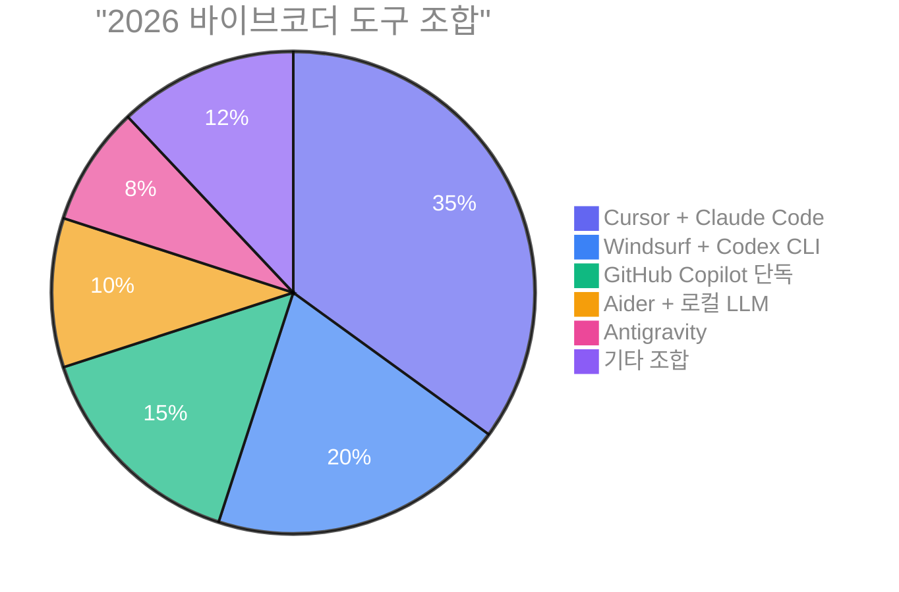
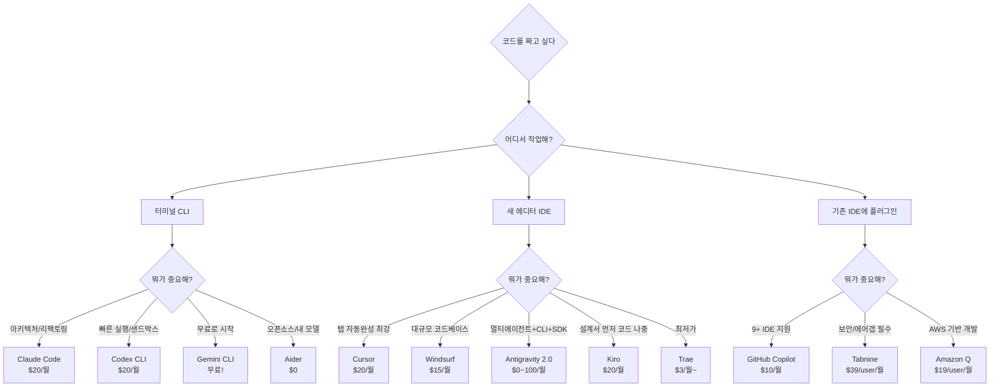
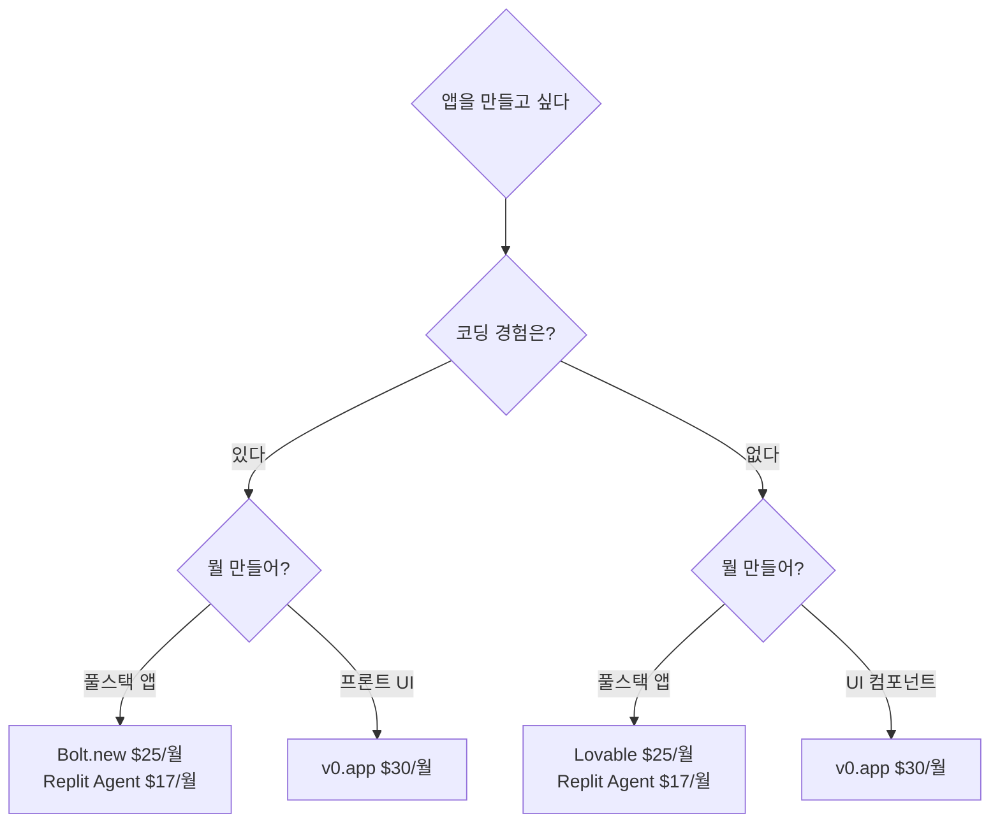
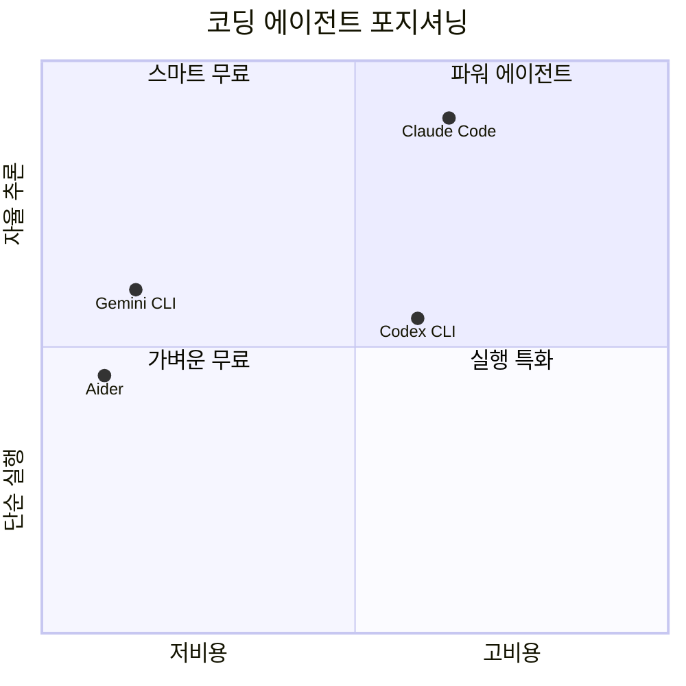
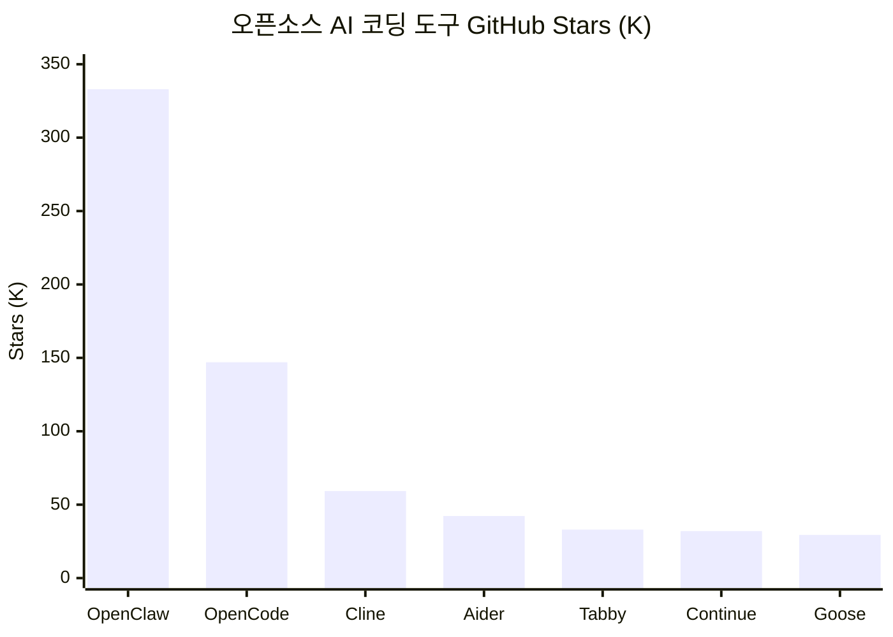
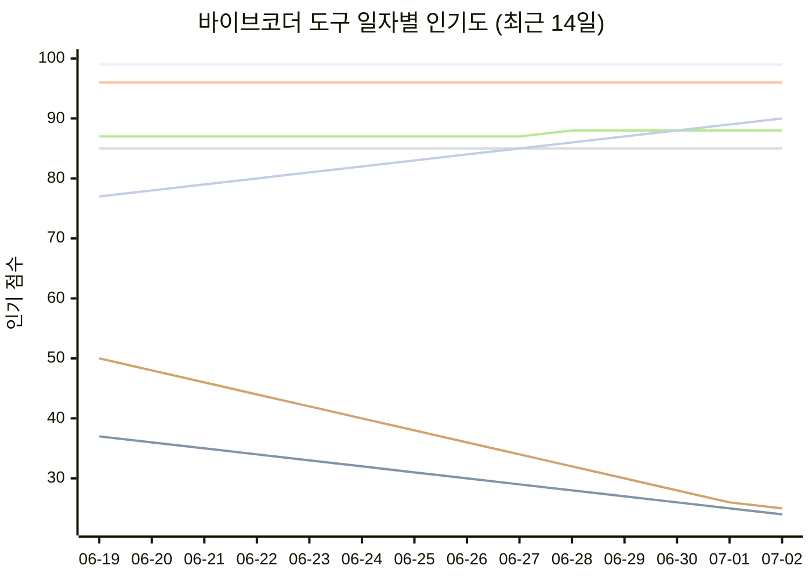
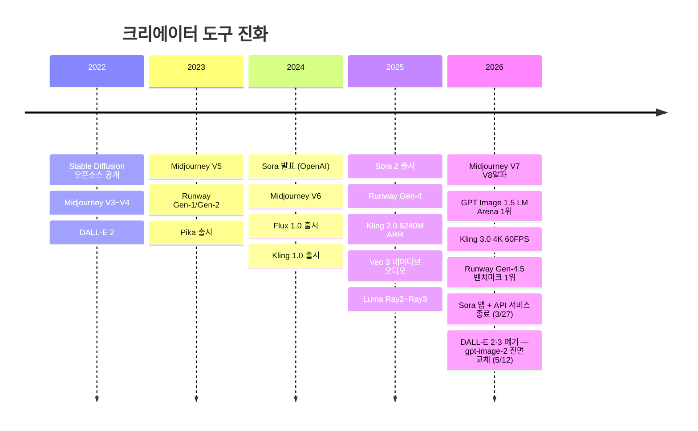
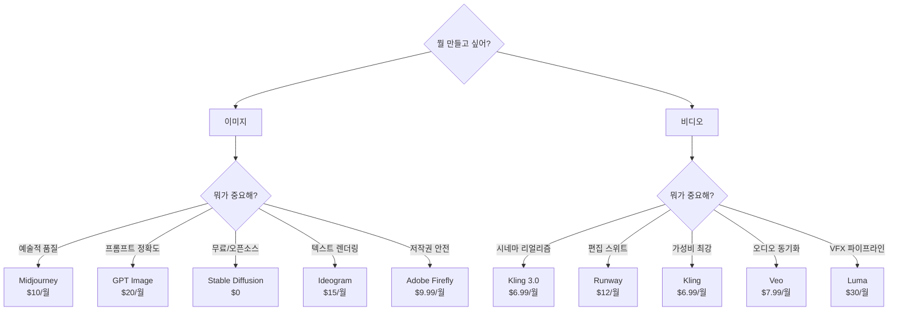
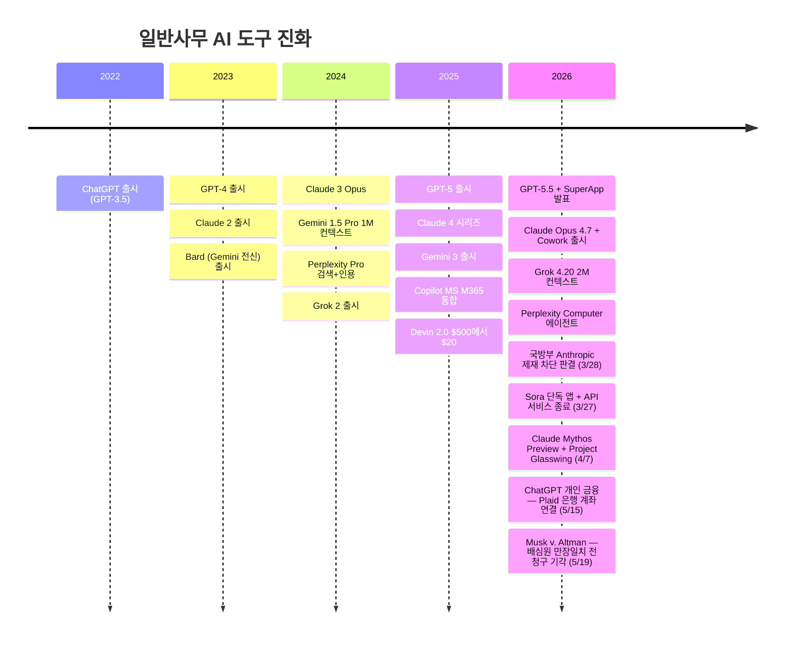
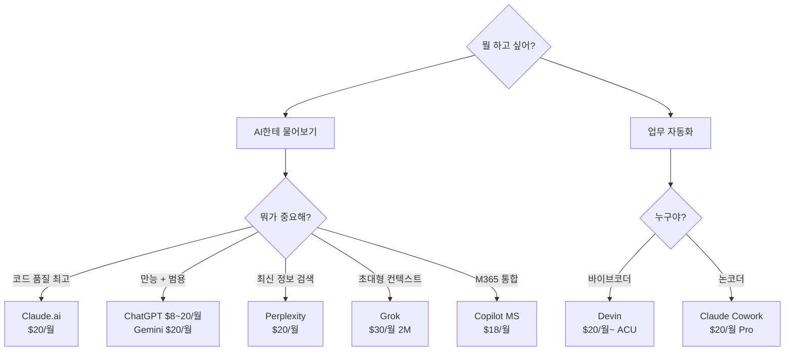

# AI 뭐슐랭? — AI 도구 추천비교 가이드

<p align="right">
  <a href="README.md">🇺🇸 English</a> | <b>🇰🇷 한국어</b>
</p>

<p align="center">
  <strong>AI WhatChelin — AI 코딩 & 생산성 도구, 진짜 뭐 써야 돼?</strong><br>
  <sub>마지막 업데이트: 2026-07-02</sub>
</p>

<p align="center">
  <a href="https://chatgpt.com"></a>
  <a href="https://claude.com"></a>
  <a href="https://gemini.google.com"></a>
  <a href="https://cursor.com"></a>
  <a href="https://windsurf.com"></a>
  <a href="https://antigravity.google"></a>
  <a href="https://github.com/features/copilot"></a>
  <a href="https://code.claude.com"></a>
  <a href="https://developers.openai.com/codex/cli"></a>
  <a href="https://github.com/google-gemini/gemini-cli"></a>
  <a href="https://aider.chat"></a>
  <a href="https://kiro.dev"></a>
  <a href="https://www.trae.ai"></a>
  <a href="https://x.ai"></a>
  <a href="https://www.perplexity.ai"></a>
  <a href="https://devin.ai"></a>
  <a href="https://bolt.new"></a>
  <a href="https://v0.app"></a>
  <a href="https://lovable.dev"></a>
  <a href="https://replit.com"></a>
  <a href="https://www.tabnine.com"></a>
  <a href="https://www.midjourney.com"></a>
  <a href="https://openai.com"></a>
  <a href="https://stability.ai"></a>
  <a href="https://ideogram.ai"></a>
  <a href="https://bfl.ai"></a>
  <a href="https://firefly.adobe.com"></a>
  <a href="https://ai.google.dev"></a>
  <a href="https://openai.com/sora"></a>
  <a href="https://runwayml.com"></a>
  <a href="https://klingai.com"></a>
  <a href="https://deepmind.google/technologies/veo"></a>
  <a href="https://pika.art"></a>
  <a href="https://lumalabs.ai"></a>
  <a href="https://hailuoai.video"></a>
  <a href="https://www.microsoft.com/en-us/microsoft-365-copilot"></a>
</p>

<p align="center">
  <em>"도구가 너무 많아서 도구 고르다 하루가 간다" — 2026년 바이브코더의 흔한 하루</em>
</p>

<table align="center">
<tr>
<td align="center">

**매일 새벽 5시, AI가 알아서 업데이트합니다**

이 문서는 사람이 수동으로 관리하지 않습니다.
**매일 KST 05:00**, GitHub Actions + Claude Code가 자동으로:

`32개 AI 도구` · `14개 공식 사이트` · `Reddit / HN / X 커뮤니티` · `가격 페이지`

를 검색하고, 변경사항을 감지하면 즉시 반영합니다.
인기도 점수도 매일 기록되어 **일자별 경쟁 차트**가 자동 갱신됩니다.


<br><br>
<a href="#-바이브코더"></a>
<a href="#-크리에이터"></a>
<a href="#-일반사무"></a>
<br>
<a href="https://github.com/tykimos/ai-whatchelin/issues"></a>
<a href="https://github.com/tykimos/ai-whatchelin/pulls"></a>
<a href="LICENSE"></a>


</td>
</tr>
</table>

[바이브코더](#-바이브코더) · [크리에이터](#-크리에이터) · [일반사무](#-일반사무) · [가격 레이더](#-가격-레이더) · [커뮤니티 비교](#-커뮤니티-반응-비교-중심) · [인기도 트렌드](#-일자별-인기도-트렌드)

---

# 바이브코더

> 코드를 짜고, 앱을 만들고, 자동화하는 바이브코더를 위한 AI 도구들.

<p align="center">
  <a href="https://code.claude.com"></a>
  <a href="https://cursor.com"></a>
  <a href="https://windsurf.com"></a>
  <a href="https://antigravity.google"></a>
  <a href="https://github.com/features/copilot"></a>
  <a href="https://developers.openai.com/codex/cli"></a>
  <a href="https://github.com/google-gemini/gemini-cli"></a>
  <a href="https://aider.chat"></a>
  <a href="https://kiro.dev"></a>
  <a href="https://www.trae.ai"></a>
  <a href="https://bolt.new"></a>
  <a href="https://v0.app"></a>
  <a href="https://lovable.dev"></a>
  <a href="https://replit.com"></a>
  <a href="https://www.tabnine.com"></a>
</p>

### 바이브코더 진화 타임라인

```mermaid
timeline
    title 바이브코더 도구 진화
    2023 : GitHub Copilot 대중화
         : Cursor 등장
    2024 : Windsurf Codeium 출시
         : Aider 성장
    2025 H1 : Kiro AWS 프리뷰
            : Trae ByteDance 출시
    2025 H2 : Antigravity Google 출시
            : Claude Code 에이전트 확립
            : Codex CLI 오픈소스
    2026 : Cursor $50B 협상, Composer 2 Kimi K2.5 논란
         : Windsurf LogRocket 1위
         : Antigravity 쿼터 논란
         : Sora 셧다운 (3/24)
         : Claude Code Auto Mode + Computer Use (3/24)
         : Copilot 데이터 학습 논란 (3/25)
         : GitHub Agent HQ 멀티에이전트 (Copilot+Claude+Codex)
         : Windsurf Wave 13 Arena Mode + 병렬 에이전트
         : Copilot CLI GA — 에이전틱 터미널 코딩
         : Claude Mythos 유출 — Opus 위 새 티어 (3/27)
         : Claude 앱스토어에서 ChatGPT 첫 추월 (3/28)
         : Gemini 3 Deep Think Ultra 정식 오픈 (3/28)
         : Claude Code v2.1.76 무깜빡 렌더링 + 서브에이전트 이름 (3/31)
         : Copilot PR "광고" 버그 — MS 확인 (3/31)
         : Gemini CLI v0.35.2 안정판 + 샌드박스 + Vim (3/26)
         : GitHub Copilot 데이터 학습 옵트아웃 논란 (3/30)
         : Midjourney V1 비디오 모델 출시
         : Gemini CLI v0.36.0 안정판 — 멀티레지스트리, git worktree (4/1)
         : Cursor 3 — Agents Window, Design Mode, /worktree (4/2)
         : Copilot SDK 퍼블릭 프리뷰 (4/2)
         : Codex 종량제 전환 — Business $25→$20/석, 토큰 과금 (4/3)
         : Claude Code v2.1.92 — Bedrock 마법사, /cost 상세 (4/4)
         : Codex CLI v0.118.0 — 레거시 모델 제거 (4/6)
         : Gemini CLI v0.37.0 — 동적 샌드박스, Chapters (4/8)
         : Copilot Autopilot 프리뷰 + CLI v1.0.22 (4/9)
         : Copilot CLI v1.0.24 — preToolUse 훅, 표시 이름 (4/10)
         : Codex CLI v0.120.0 — Windows 샌드박스 이그레스, 디바이스 코드 인증 (4/11)
         : Cursor Bugbot — 80% 해결률, MCP 지원 (4/8)
         : Claude Mythos Preview + Project Glasswing (4/7)
         : Advisor Strategy — Opus가 Sonnet/Haiku 조언 (4/10)
         : Claude Code 데스크톱 재설계 — 세션, 터미널, 파일 에디터 (4/15)
         : Antigravity 9시간 서비스 장애 (4/15)
         : Claude Opus 4.7 출시 — SWE 향상, 비전 개선, xhigh 노력도 (4/16)
         : Codex "거의 모든 것을 위한" — macOS Computer Use, 90+ 플러그인 (4/16)
         : Copilot 개인 플랜 중단 — Pro/Pro+ 신규 가입 일시 중지 (4/20)
         : SpaceX $600억에 Cursor 인수 합의 (4/21)
         : Claude Code ultrareview — 클라우드 멀티에이전트 PR 리뷰 (4/22)
         : GPT-5.5 출시 — OpenAI 최강 프론티어 모델 (4/23)
         : Cognition $250억 밸류에이션 투자유치, Windsurf 2.0 + Devin 통합 (4/23)
         : Copilot 6월 1일부터 사용량 기반 과금 전환 (4/28)
         : Cursor CVE-2026-26268 — CVSS 8.1 임의 코드 실행 취약점 (4/28)
         : Gemini CLI v0.40.0 — 오프라인 검색, 색약 친화 테마 (4/28)
         : Zed 1.0 출시 — 병렬 에이전트, 100만+ Rust 코드 라인 (4/29)
         : Gemini CLI CVSS 10.0 취약점 패치 (4/30)
         : Copilot Visual Studio 4월 업데이트 — 디버거 에이전트, 20% 빠른 시작 (4/30)
         : Cursor SDK 퍼블릭 베타 — 프로그래밍 방식 코딩 에이전트 (4/28)
         : Codex Amazon Bedrock 출시 — AWS 파트너십 프리뷰 (4/28)
         : IBM Bob GA — 엔터프라이즈 AI 코딩 멀티모델 라우팅 (4/28)
         : Amazon Q Developer 신규 가입 5/15 차단, Kiro 전환 시작 (4/30)
         : Microsoft Agent 365 GA — 엔터프라이즈 에이전트 컨트롤 플레인 (5/1)
         : Claude Code v2.1.126 — 모델 피커, 프로젝트 퍼지, MCP 재시도 (5/1)
         : Copilot Code Review 6월 1일부터 Actions 분 소비 (4/27)
         : Anthropic $15억 엔터프라이즈 AI 서비스 JV — Blackstone/Goldman (5/4)
         : OpenAI $100억 "The Deployment Company" JV 확정 (5/4)
         : GPT-5.5 Instant — ChatGPT 새 기본 모델, 환각 52.5% 감소 (5/5)
         : Cursor Canvases + 엔터프라이즈 관리자 모델 제어 (5/5)
         : Codex CLI v0.128.0 — 영속 /goal 워크플로우, TUI 키맵 (5/5)
         : Claude Code v2.1.128 — 플러그인 zip 지원, MCP 도구 카운트 (5/5)
         : Code with Claude 컨퍼런스 — Managed Agents, Routines, 데스크톱 GUI (5/6)
         : SpaceX Colossus 1 계약 — Claude Code 속도 제한 2배 확대 (5/6)
         : Claude Code v2.1.131 — VS Code Windows 수정, Mantle 인증 수정 (5/6)
         : Devin for Terminal — Rust CLI 에이전트, Windsurf 통합 (5/6)
         : Gemini CLI 공식 오픈소스 런칭 — Apache 2.0, Gemini 2.5 Pro 무료 (5/5)
         : Cursor 3.3 — Build in Parallel, PR 분할, Team Marketplace (5/7)
         : Copilot CLI 엔터프라이즈 관리 플러그인 퍼블릭 프리뷰 (5/6)
         : 캐나다, ChatGPT 개인정보보호법 위반 판정 — 과다수집·동의 부재·아동 데이터 (5/6)
         : Claude Code v2.1.132 — 세션 ID 환경변수, 전체화면 수정, MCP 인증 수정 (5/7)
         : Gemini CLI v0.42.0 프리뷰 — 음성 모드, Gemma 4, 메모리 개선 (5/7)
         : Akamai $18억 클라우드 계약 — 7년 컴퓨트, Akamai ↑27% (5/8)
         : Claude Cowork GA — 전 유료 플랜, RBAC, OpenTelemetry (5/8)
         : Claude 장애 — 2K+ 사용자, IP 변경으로 GitHub 중단, 롤백 (5/8)
         : Gemini CLI v0.41.2 — 음성 모드 GA, 오프라인 지원, Gemma 4 (5/9)
         : ServiceNow Build Agent GA — Cursor, Windsurf, Claude Code, Copilot에서 작동 (5/8)
         : Opsera + Cursor DevSecOps 에이전트 네이티브 플러그인 파트너십 (5/8)
         : Claude Code v2.1.136 — 자동 모드 hard deny, 워크트리 분기, 자격증명 수정 (5/9)
         : Copilot VS Code 4월 릴리스 — 시맨틱 검색, /chronicle, BYOK 지원 (5/6)
         : Codex CLI 플러그인 공유 + remote-control 진입점 (5/9)
         : Snyk-Claude AI 보안 플랫폼 통합 (5/8)
         : Copilot 8주 연속 하락 76, 사용량 과금 D-21 (5/10)
         : Amazon 전 직원에 Claude Code + Codex 접근 허용 — Kiro 장애 후폭풍 (5/10)
         : "Comment and Control" 프롬프트 인젝션 — Claude Code CVSS 9.4, Gemini CLI, Copilot (5/10)
         : Codex "안전한 실행" — 샌드박싱, 자동 리뷰 모드 공개 (5/8)
         : Copilot 9주 연속 하락 75, D-20, Opus 4.7 승수 15x→27x 6/1 (5/11)
         : Cursor Bugbot 사용량 기반 과금 — $1-1.50/회, $40/시트/월 대체, 고노력 모드 버그 35%↑ (5/11)
         : Copilot Grok Code Fast 1 5/15 지원 종료 — GPT-5 mini, Claude Haiku 4.5 대체 (5/11)
         : Claude Code v2.1.139 — Agent view, /goal 명령어, /scroll-speed (5/11)
         : Copilot CLI 1.0.45 — /autopilot, /fork 명령어, 시작 1.5초 단축 (5/11)
         : OpenAI DeployCo $40억 컨설팅 자회사 출범 — TPG/Goldman/McKinsey/Bain/Capgemini, Tomoro 인수 (5/11)
         : DALL-E 2·3 공식 종료 — gpt-image-2 전면 교체 (5/12)
         : Cursor Security Review 베타 — Teams/Enterprise 상시 보안 에이전트 (5/12)
         : Codex CLI Amazon 전사 접근 개시 — 5주 연속 상승 81 (5/12)
         : Windsurf Opus 4.7 fast 모드 — Cascade에서 ~2.5배 빠른 출력 (5/12)
         : CVE-2026-41109 Copilot 보안 우회 CVSS 7.8 — AI 콘텐츠 필터, 패치 완료 (5/12)
         : Gemini CLI v0.42.0 + v0.43.0-preview — 서브에이전트 프로토콜, I/O D-6 (5/12)
         : Claude 법률 산업 진출 — 20+ MCP 커넥터, 12개 실무 플러그인 (5/12)
         : Claude Code v2.1.140 — 대소문자 무관 에이전트 매칭, /goal 수정 (5/13)
         : Cursor Microsoft Teams 통합 — @Cursor로 클라우드 에이전트 위임 (5/13)
         : Copilot 11주 연속 하락 73 — CVE + Grok 종료 D-2 신뢰 악화 (5/13)
         : Claude Code v2.1.141 — 훅·플러그인·워크스페이스 신원 연합 (5/14)
         : Claude Code 주간 한도 50% 인상 — Pro/Max/Team/Enterprise, 7/13까지 (5/14)
         : Anthropic, Stainless $3억+ 인수 협상 — OpenAI·Google용 SDK 제작사 (5/14, 5/20 확정)
         : Cursor 클라우드 에이전트 개발 환경 — 멀티레포, Dockerfile 캐싱 (5/13)
         : Copilot 클라우드 에이전트 REST API 공개 미리보기 — 프로그래밍 방식 에이전트 작업 (5/13)
         : Copilot 사용량 기반 과금 4월 보고서 다운로드 가능 — 6/1까지 D-17 (5/13)
         : OpenAI Daybreak 사이버보안 이니셔티브 — GPT-5.5 + Codex Security (5/12)
         : AWS Kiro Spec Check — SMT 솔버로 요구사항 모순 검증 (5/13)
         : Google I/O D-5 — Gemini 4 예고, 서브에이전트 아키텍처 미리보기 (5/14)
         : Copilot App 테크니컬 프리뷰 — 이슈/PR에서 데스크톱 에이전트 세션 (5/14)
         : Copilot 개인 플랜 flex 할당 + Max 플랜, 사용량 과금 D-17 (5/14)
         : Copilot CLI 1.0.48 — 모델 피커에 토큰 가격 표시 (5/14)
         : Anthropic $9000억 밸류에이션 목표 $300억+ 펀딩 라운드 (5/14)
         : OpenAI, Apple 상대 법적 대응 준비 — ChatGPT 통합 약속 파기 (5/15)
         : OpenAI TanStack 공급망 공격 — 직원 2명 디바이스 침해, 사용자 데이터 무사 (5/15)
         : Anthropic Claude for Small Business — 무료 워크숍 + 15개 에이전트 워크플로우 (5/15)
         : Anthropic 에이전트 과금 6/15 발표 — Pro $20, Max 5x $100, Max 20x $200 크레딧 (5/15, 6/15 중단)
         : Windsurf Devin Review + Devin for Terminal 전체 사용자 개방 (5/15)
         : Google I/O D-4 — Gemini Intelligence, Android 리부트, Code with Claude 동시 개최 (5/15)
         : Harness 보고서 — AI 도입 후 81% 조직에서 코드 리뷰 시간 증가 (5/15)
         : Copilot 12주 연속 하락 72 — flex 할당으로 사실상 가격 인상 확인 (5/15)
         : OpenAI CFO, $122B 넘어 추가 자금 조달 시사 (5/15)
         : Musk v. Altman 배심원 심리 시작 — 최종 변론 종료, 자문 평결 대기 (5/15)
         : Codex 모바일 출시 — ChatGPT iOS/Android 앱에서 Codex 제어, 무료 포함 전 플랜 (5/15)
         : ChatGPT 파일 라이브러리 Free/Go 확대 — 무료 500MB, Pro 최대 100GB (5/15)
         : Microsoft Claude Code 라이선스 취소 — E+D 팀 6/30까지 Copilot CLI 전환 강제 (5/16)
         : Claude Code Fast Mode Opus 4.7 기본 전환 — 2.5배 빠르게, ENV 플래그 불필요 (5/16)
         : Copilot App 테크니컬 프리뷰 — 이슈/PR 기반 데스크톱 에이전트 (5/16)
         : OpenAI, ChatGPT + Codex 통합 — Brockman 총괄, 에이전틱 "슈퍼앱" (5/16)
         : Copilot 13주 연속 하락 70, 사용량 과금 D-14 (5/17)
         : Musk v. Altman 배심원 심리 월요일 5/19 시작 (5/17)
         : Google I/O D-2 — Gemini 4, 에이전틱 코딩 발표 예상 (5/17)
         : Code with Claude London D-2 — Anthropic 개발자 컨퍼런스 (5/17)
         : Codex CLI 83 상승 — ChatGPT/Codex 통합 모멘텀 (5/17)
         : GPT-5.3-Codex-Spark 리서치 프리뷰 — 15배 빠른 코딩, 128K 컨텍스트 (5/18)
         : Gemini Omni 비디오 AI 모델 I/O 전 유출 — 리믹스·인채팅 편집·템플릿 (5/18)
         : Cursor 3.4 — /multitask 병렬 서브에이전트, Agents Window 인터랙티브 캔버스 (5/18)
         : Code with Claude London D-1 — 3트랙(Research·Platform·Code), 확장 세션 5/20 (5/18)
         : Google I/O D-1 — Gemini 4 또는 3.5 예상, Gemini Omni 유출 (5/18)
         : Musk v. Altman 배심원 심리 D-1 (5/18)
         : Copilot 14주 연속 하락 69, 사용량 과금 D-14 (5/18)
         : Codex CLI 84 상승 — 모바일 확대 + 슈퍼앱 모멘텀 (5/18)
         : Grok Build 베타 출시 — xAI 최초 코딩 에이전트, 8개 병렬 에이전트, SuperGrok Heavy $300/월 (5/18)
         : OpenAI + Dell 파트너십 — Codex를 하이브리드·온프레미스 엔터프라이즈 환경에 배포 (5/18)
         : Musk v. Altman 평결 — 배심원 만장일치 전 청구 기각, 소멸시효 초과; Musk 제9순회 항소 선언 (5/19)
         : Cursor Composer 2.5 — 자체 모델, SWE-Bench Multilingual 79.8%, Opus 4.7급 성능 (5/19)
         : Google I/O 2026 키노트 — Gemini 3.5 Flash GA (4배 빠른 출력, $1.50/$9/M), Antigravity 2.0 글로벌 출시 (CLI+SDK+데스크톱), AI Ultra $100/월, Gemini Spark 개인 에이전트 (5/19)
         : Cursor + xAI Colossus 2 파트너십 — 대규모 후속 모델 처음부터 훈련 (5/19)
         : Code with Claude London 1일차 — Research/Platform/Code 3트랙, Claude Code v2.1.144 릴리스 (5/19)
         : Copilot 15주 연속 하락 68, 사용량 과금 D-13 (5/19)
         : Gemini CLI + Antigravity I/O 당일 급등 — 각각 85, 62로 점프, Antigravity 역대 최대 일일 급등 (5/19)
         : Antigravity 2.0 자동 업데이트 참사 — 코드 에디터·터미널·파일 탐색기 삭제, 개발자들 롤백 (5/20)
         : Google I/O 2일차 — Managed Agents API, Chrome DevTools for agents, WebMCP 오픈 표준 (5/20)
         : Code with Claude London Extended — 인디 개발자 데모·오피스 아워·Applied AI 워크숍 (5/20)
         : Copilot 16주 연속 하락 67, 사용량 과금 D-12 (5/20)
         : Antigravity 58로 하락 — 자동 업데이트 반발로 I/O 급등분 절반 소실 (5/20)
         : Anthropic, Stainless $3억+에 인수 확정 — SDK 수직 통합 (5/20)
         : Cursor Jira 연동 — 이슈 트래커에서 클라우드 에이전트 실행 (5/19)
         : Gemini CLI → Antigravity CLI 6/18 전환 발표 (5/19)
         : Copilot 웹 채팅에서 Gemini + GPT-5.2 Codex + GPT-5.4 nano 삭제 (5/20)
         : Codex CLI v0.129.0 — Vim 모드 TUI, Chrome 확장, codex doctor (5/20)
         : Stainless 플랫폼 9/1 종료 — OpenAI·Google SDK 자체 유지보수 강제 (5/20)
         : Anthropic CNBC 디스럽터 50 1위 — $300억 런레이트, Q1 매출 80배 성장 (5/21)
         : KPMG-Anthropic 글로벌 제휴 — 27만 6천 명에 Claude 배포 (5/21)
         : Claude Code v2.1.145 — /code-review 명령어, MCP 페이지네이션 수정 (5/21)
         : Code with Claude London Extended 최종일 — 인디 개발자 워크숍 (5/21)
         : Antigravity 2.0 롤백 사태 3일째 — 포럼 폭주, 55로 하락 (5/21)
         : Copilot 17주 연속 하락 66, GPT-5.3-Codex 기본 모델 강제 전환 (5/21)
         : Anthropic-Microsoft Maia 칩 협상 — 토큰당 비용 30%+ 절감 (5/21)
         : Anthropic-Gates Foundation $2억 파트너십 — 보건·교육·농업 (5/21)
         : Anthropic Q2 매출 $109억, 첫 흑자 분기 전망 — 영업이익 $5.59억 (5/21)
         : Copilot CLI v1.0.51 — /security-review 명령어, 세션 재개, MCP 로딩 속도 개선 (5/21)
         : OpenAI IPO 비밀 신청서 제출 — 9월 상장 목표, $8500억+ 밸류에이션 (5/22)
         : Antigravity 2.0 롤백 사태 4일째 — 53으로 하락 (5/22)
         : Copilot 18주 연속 하락 65, 사용량 과금 D-10 (5/22)
         : Codex CLI Goal 모드 정식 전환 — 수시간 비감독 작업 가능 (5/22)
         : Grok Build 일일 업데이트 모드 — xAI 매일 변경로그 공개 (5/22)
         : Runtime (YC P26) 출시 — 샌드박스 코딩 에이전트 환경 (5/22)
         : Socket $6천만 투자유치 $10억 밸류에이션 — AI 공급망 보안 (5/22)
         : Intuit 3,000명+ 해고 — AI 사업 전환 집중 (5/22)
         : Antigravity 속도 제한 위기 — Google 하루에 제한 3배씩 두 번 상향, Gemini 3.5 Flash 쿼터 소진 (5/22)
         : Cursor 3.5 — Automations, 전체화면 Tabs, Compact Chats, PR 리뷰 경험 (5/22)
         : 중국, Meta $20억 Manus 인수 차단 — 국가 차원 첫 AI 인수 금지 (5/22)
         : CNBC: GitHub 3월 이후 12회 이상 장애, Copilot 시장점유율 67%→51%, 보안 침해 3,800개 코드 저장소 (5/22)
         : Copilot for Eclipse MIT 라이선스 오픈소스화 (5/21)
         : 개발자 환멸 — AI 생성 코드 43% 프로덕션에서 디버깅 필요 (5/22)
         : Anthropic $300억+ 라운드 5/26 주에 마감 — $9000억+ 밸류에이션으로 OpenAI 추월 (5/22)
         : Claude Code v2.1.149 — /usage 카테고리 분석, /diff 키보드 스크롤, GFM 체크박스 (5/22)
         : Grok Build $99 소개 가격 — 6개월간 67% 할인, Musk X에서 홍보 (5/21)
         : TeamPCP 공급망 웜 확대 — Mistral·EU 집행위·Claude Code 설정 파일 타깃 (5/23)
         : Copilot 클라우드 에이전트에 Claude Haiku 4.5·GPT-5.4-mini 추가 (5/18)
         : Copilot 19주 연속 하락 64, 사용량 과금 D-9 (5/23)
         : Antigravity 2.0 롤백 사태 5일째 — 52로 하락 (5/23)
         : Antigravity 2.0 v2.0.0 패치 — "Open IDE" 버튼, 마이그레이션 도구, 전체 쿼터 초기화 (5/24)
         : Copilot 20주 연속 하락 63, 사용량 과금 D-8 (5/24)
         : PwC-Anthropic 제휴 확대 — 3만 명 인증, Claude 네이티브 금융 사업부 (5/14)
         : Gemini CLI v0.43.0 안정판 — 외과적 편집, 세션 이식성, 적응형 토큰 (5/22)
         : Copilot CLI v1.0.53-54 — 멀티라인 프롬프트, git 컨텍스트, 안전 필터 (5/24)
         : Claude Code v2.1.150 — 내부 인프라, PowerShell 권한 우회 수정 (5/23)
         : Copilot 21주 연속 하락 62, 사용량 과금 D-7 (5/25)
         : SpaceX S-1 IPO 신청서 — Anthropic 월 $12.5억 Colossus 비용 공개, 총 $450억 계약 (5/25)
         : 교황 레오 14세 Magnifica Humanitas 회칙 — Anthropic 공동창업자 Olah 공동 발표 (5/25)
         : Copilot 22주 연속 하락 61, 사용량 과금 D-6 (5/26)
         : Cursor Composer 2.5 Fast 서비스 장애 — 2시간 내 복구 (5/24)
         : Gemini CLI 종료 D-23 — Antigravity CLI 전환 가속화 (5/26)
         : Anthropic $300억+ 라운드 이번 주 마감 예상 (5/26)
         : ING "바이브코딩"으로 트레이딩 시스템 구축 — Bloomberg, 주 단위 작업이 시간 단위로 (5/26)
         : Anthropic 10월 IPO 추진 — $600억+ 조달 가능, Wilson Sonsini 선임 (5/26)
         : Claude Mythos Project Glasswing — 1,000+ 오픈소스 프로젝트서 23,019개 이슈 발견, 90%+ 진양성 (5/26)
         : CVE-2026-28952 Apple macOS 커널 취약점 Claude Mythos가 발견 — 루트 권한 상승 (5/26)
         : GitHub Actions/Pages 글로벌 장애 — 인증 실패 10:57–13:18 UTC, HN 644포인트 (5/26)
         : Uber COO AI 투자 ROI 의문 — 2026년 AI 예산 4월에 전부 소진 (5/26)
         : HN 1위 "AI로 더 느리게 더 나은 코드 작성" — 1,114포인트, 품질>속도 전환 (5/26)
         : Copilot 23주 연속 하락 60, 사용량 과금 D-5 (5/27)
         : Copilot 타겟 모델 규칙 — 엔터프라이즈 조직별 모델 제어, 퍼블릭 프리뷰 (5/27)
         : Copilot Studio 컴퓨터 사용 에이전트 GA — 최초 엔터프라이즈 CUA 플랫폼, Claude Sonnet 4.5 + OpenAI CUA (5/27)
         : Grok Build 전체 SuperGrok/X Premium+ 확대 — Windows PowerShell 설치기 (5/27)
         : Gemini CLI 종료 D-22 — Antigravity CLI 전환 가속화 (5/27)
         : Claude Compliance API — 28개 보안 연동 (CrowdStrike, Palo Alto, Purview 등) (5/25)
         : Claude Mythos 모델 ID가 Claude Code 인터페이스에 잠시 노출 후 제거 (5/25)
         : Anthropic Opus 4.7 오류 급증 06:30–10:30 UTC (5/25)
         : Windsurf 오류 급증 — ~1시간 38분 장애 (5/26)
         : Claude Code v2.1.152 — /code-review --fix, disallowed-tools, /reload-skills, SessionStart 훅 (5/27)
         : Claude Managed Agents 셀프호스팅 샌드박스 (공개 베타) + MCP 터널 (리서치 프리뷰) (5/27)
         : Anthropic $300억+ 라운드 마감 — $9000억+ 밸류에이션, 세계 최고 가치 비상장 AI 기업 (5/27)
         : SpaceX IPO 로드쇼 6/4, 가격 결정 6/11, 거래 개시 6/12 — $1.75조 역대 최대 IPO (5/27)
         : Gemini API Interactions 호환성 파괴 변경 — 레거시 스키마 6/8 제거 (5/27)
         : Gemini 3.5 Pro 6월 출시 확정 — Pichai I/O에서 발표 (5/27)
         : Microsoft Build 2026 6/2-3 — 멀티모델 Foundry, Copilot 멀티에이전트 오케스트레이션 (5/27)
         : Copilot 24주 연속 하락 59, 사용량 과금 D-4 (5/28)
         : Claude Security 퍼블릭 베타 — Opus 4.7 코드베이스 취약점 스캐닝 (5/28)
         : Big Four Claude 표준화 — Deloitte(47만)·PwC(27.6만)·KPMG(27.6만) Claude 배포 (5/28)
         : Cohere-Aleph Alpha 합병 — $200억 대서양 횡단 소버린 AI 기업 (5/28)
         : ChatGPT 음성 모드 논란 — GPT-4o 시대 모델, 13개월 지식 격차 (5/28)
         : Microsoft Build 2026 D-5 — 샌프란시스코, 멀티에이전트 오케스트레이션 예고 (5/28)
         : Gemini CLI 종료 D-21 — Antigravity CLI 전환 가속화 (5/28)
         : Claude Opus 4.8 출시 — SWE-bench 88.6%, 동적 워크플로우, 2.5x 패스트 모드 (5/28)
         : Anthropic $650억 시리즈 H, $9,650억 밸류에이션 — IPO 전 마지막 라운드, OpenAI 추월 (5/28)
         : Claude Opus 4.8 출시 당일 GitHub Copilot GA (5/28)
         : Codex CLI v0.135.0 — codex doctor 진단, 환경 리포팅 (5/28)
         : Claude Code v2.1.153 — /model 기본값 저장, skipLfs, Bedrock/Vertex 1M 피커 수정, 25+ 버그 수정 (5/28)
         : Copilot 25주 연속 하락 58, 사용량 과금 D-3 (5/29)
         : OpenAI 대규모 장애 — ChatGPT·API·DALL-E·Codex·Sora·로그인 (5/29)
         : Microsoft Build 2026 D-4 — Copilot용 자체 코딩 모델 예고, MSFT ↑3% (5/29)
         : Gemini CLI 종료 D-20 — Antigravity CLI 전환 계속 (5/29)
         : Opus 4.8 패스트 모드 3배 저렴 — Mythos급 모델 수주 내 전체 고객 공개 예고 (5/29)
         : Opus 4.8 오류 급증 08:39–08:45 UTC — Copilot + AWS GA 수시간 후 발생, 6분 만에 해결 (5/29)
         : Copilot 26주 연속 하락 57, 사용량 과금 D-2 (5/30)
         : Microsoft Build 2026 D-2 — Project Polaris 자체 코딩 모델 유출 (5/30)
         : GPT-5.6 Codex 배포 로그서 유출 — iris-alpha 코드명, 1.5M 컨텍스트, 예측시장 80-89% (5/30)
         : TechCrunch: 개발자들 AI 없이 작업 거부 — METR 연구, 역량 위축 우려 (5/29)
         : DeepSWE 벤치마크 — GPT-5.5 70% vs Claude Opus 54%, SWE-Bench 검증기 32% 오류율 (5/30)
         : Mozilla Claude Mythos Preview로 Firefox 취약점 271건 수정 — 이전 모델 대비 10배 개선 (5/30)
         : Gemini CLI 종료 D-19 — Antigravity CLI 전환 가속화 (5/30)
         : Copilot 27주 연속 하락 56, 사용량 과금 D-1 (5/31)
         : Copilot 사용량 기반 과금 시행 — TechCrunch "무슨 농담이야", 에이전틱 세션 $30-40/일 (5/31)
         : Microsoft Build 2026 D-1 — Project Polaris, AI 에이전트, Azure AI Foundry 키노트 6/2 (5/31)
         : Codex CLI Pro 사용량 부스트 만료 — 2배 제한 종료, Pro 5x 25x→20x 하향 (5/31)
         : Gemini CLI 종료 D-18 — Antigravity CLI 전환 가속화 (5/31)
         : Copilot 28주 연속 하락 55, 사용량 과금 시행 — Pro $10 AI 크레딧/월, 에이전틱 세션 $30-40/일 (6/1)
         : Copilot 반발 폭발 — 904 비추천, 2시간에 크레딧 8% 소진, 일부 사용자 10-100배 비용 증가 (6/1)
         : Grok Build 0.1 API 퍼블릭 베타 — $1/$2/M 토큰, 256K 컨텍스트, ACP 오케스트레이션 (6/1)
         : NVIDIA RTX Spark 슈퍼칩 + Surface Laptop Ultra Build 전야 발표 — ARM CPU + Blackwell GPU (6/1)
         : Microsoft Build 2026 1일차 — Project Polaris Copilot용 자체 코딩 모델, MoE 아키텍처 (6/2)
         : Gemini CLI 종료 D-17 — Antigravity CLI 전환 가속화 (6/1)
         : Anthropic S-1 IPO 비밀 신청서 제출 — 최초 메이저 AI 랩 상장 신청, $9650억 밸류에이션, 10월 목표 (6/1)
         : NVIDIA Computex 2026 — Vera Rubin 50 페타플롭스, Nemotron 3 Ultra 500B 오픈 모델, DSX OS 오픈소스 (6/1)
         : Cursor Auto-review — 분류 서브에이전트로 승인 프롬프트 감소 (5/29)
         : Copilot Workspace GA + 멀티에이전트 VS Code — Build에서 병렬 서브에이전트 (6/2)
         : Claude Code v2.1.160 — 셸 설정 파일 쓰기 프롬프트, 빌드 도구 설정 보안 (6/2)
         : Copilot 29주 연속 하락 54, Build 1일차도 과금 반발 상쇄 못해 (6/2)
         : Codex CLI — Windows Computer Use, 세션 아카이빙, app-server stdio (6/2)
         : Cursor Teams — Premium 시트, 사용량 분리 풀, 90% 비용 절감 (6/2)
         : Gemini CLI 종료 D-16 — Antigravity CLI 전환 가속화 (6/2)
         : NVIDIA Vera Rubin 양산 돌입 — Blackwell 대비 추론 10배 저렴, TSMC 3nm (6/2)
         : Claude AI 글로벌 장애 — 서브에이전트 무한 루프가 원인, 긴급 쿼터 리셋 (6/2)
         : Windsurf → Devin Desktop — OTA 리브랜딩 완료, Devin Local이 Cascade 대체 (Rust 재작성, 토큰 30% 절감), Agent Command Center (6/2)
         : Microsoft Build 2026 2일차 — Aion 1.0 SLM, MAI-Code-1, Surface RTX Spark Dev Box (6/3)
         : Copilot 30주 연속 하락 53, 종량제 3일차 — Claude Code/Codex CLI 이탈 가속화 (6/3)
         : Windsurf Pro $15 가격 인하 — Cursor $20 언더커팅 (6/3)
         : Uber AI 도구 월 $1,500 상한 도입 — 4개월 만에 2026년 전체 예산 소진, 엔지니어 95% AI 사용, 코드 70%가 AI 생성 (6/3)
         : Gemini CLI 종료 D-15 — Antigravity CLI 전환 가속화 (6/3)
         : SpaceX IPO 로드쇼 D-1, $1.75T 목표 (6/3)
         : MAI-Code-1-Flash — 5B 코딩 모델, Claude Haiku 4.5 능가, 토큰 60% 절감, 전 Copilot 플랜 배포 (6/3)
         : Project Solara — 에이전트 퍼스트 디바이스 OS, Android 기반, 스마트 배지·디스플레이 컨셉, Best Buy/CVS/Target 파일럿 (6/3)
         : Codex CLI v0.137.0-alpha.4 — 세션 아카이빙, Windows Computer Use, 리모트 컨트롤 (6/3)
         : CNBC: Microsoft 자체 모델로 OpenAI 의존도 축소 — MAI-Code가 전략적 전환점 (6/3)
         : Project Polaris 확정 — 8월부터 GPT-4 Turbo 대체해 Copilot 기본 모델 교체, Maia 200 칩 구동 (6/3)
         : Windows Agent Framework 1.0 MIT 라이선스 오픈소스 공개 (6/3)
         : SpaceX IPO $135/주 확정, $1.75조 밸류에이션 — 6/8 주간 로드쇼, 6/12 나스닥 거래 시작 (6/3)
         : SpaceX IPO 로드쇼 시작 — Morningstar 적정가 $780B vs 목표 $1.75T, ARK 2030 $2.5T 전망 (6/4)
         : Copilot 31주 연속 하락 52, 종량제 4일차 — The Register "분노한 개발자들 이탈 선언" (6/4)
         : Gemini CLI 종료 D-14 — 6/18 이후 기업 고객만 유지 (6/4)
         : Anthropic 에이전트 과금 D-11 — 6/15 Agent SDK/CLI 크레딧 분리 임박 (6/4)
         : Grok Composer 2.5 — Grok Build 0.1 대비 입력 100% 저렴, 장시간 작업 모델 (6/4)
         : Windsurf 83 상승 — $15 가격 인하로 Copilot 이탈 수요 흡수 (6/4)
         : Claude Code v2.1.161 — MCP 서버 재연결 수정, API 게이트웨이 자격증명 수정, Bedrock/Vertex 1M 피커 수정 (6/4)
         : Cursor Teams 가격 상세 — Standard $32/시트/월, Premium $96/시트/월 (연간), 7/1 갱신 적용 (6/4)
         : Codex Sites 프리뷰 — Codex에서 호스팅 웹앱 생성·배포·관리 (6/4)
         : GPT-4.5 6/27 퇴장 — 30일 선셋 기간, GPT-5 패밀리로 대체 (6/4)
         : Cursor Bugbot 종량제 6/8 갱신 이후 적용 (6/4)
         : Claude Code v2.1.162 — waitingFor 필드, /effort 지속, 병렬 Bash 독립 실행 (6/4)
         : Cursor 3.7 — Canvas Design Mode, Context Usage Reporting (6/4)
         : Project Glasswing 확대 — 15개국 150개 신규 조직 참여 (6/4)
         : o3 8/26 퇴장 — 90일 선셋, GPT-5 패밀리로 전면 대체 (6/4)
         : Grok Imagine 1.5 Preview — 이미지-투-비디오, 자연어 모션 제어, 720p (6/3)
         : Copilot SDK GA — Node.js·Python·Go·.NET·Rust·Java; 커스텀 도구 + MCP (6/2)
         : GPT-4.1 전체 Copilot에서 퇴장 — GPT-5.3-Codex 기본 모델 교체 (6/2)
         : Copilot CLI 러버덕 모드 — 건설적 비판 에이전트, 프롬프트 스케줄링, 음성 GA (6/2)
         : Copilot 32주 연속 하락 51, 종량제 5일차 — 개발자 이탈 가속화 (6/5)
         : Windsurf (Devin Desktop) 84 상승 — Cascade EOL 7/1, ACP 프로토콜 (6/5)
         : Gemini CLI 종료 D-13 — 6/18 이후 기업 고객만 유지 (6/5)
         : Anthropic 에이전트 과금 D-10 — 6/15 Agent SDK/CLI 크레딧 분리 (6/5)
         : Anthropic S-1 IPO 신청 — 매출 런레이트 $470억, $9650억 밸류에이션 (6/5)
         : Cursor-SpaceX $600억 인수 합의 체결 (6/5)
         : Anthropic: Claude가 프로덕션 코드 80%+ 작성 — 엔지니어 생산성 8배, 복잡 작업 성공률 76% (6/5)
         : Anthropic, 글로벌 AI "일시 정지 버튼" 제안 — 재귀적 자기 개선 경고 (6/5)
         : Gemini CLI "끼워팔기" 논란 — Linux Foundation, 오픈소스 신뢰 침식 지적 (6/5)
         : Cursor Enterprise Organizations Dashboard — 멀티팀 예산·보안·분석 (6/5)
         : Aider, Gemini 2.5 Pro/Flash + qwen3-235b 지원, OCaml repo-map 추가 (6/5)
         : Claude Code Dynamic Workflows 리서치 프리뷰 — JavaScript 멀티에이전트 오케스트레이션 (6/2)
         : GPT-5.2 / GPT-5.3-Codex, Codex 구독 제공 종료 (6/5)
         : GPT-5.5 Instant 스타일 업데이트 — 가독성 개선, Canvas 인라인 코드로 전환 (6/5)
         : Codex 역할별 플러그인 배포 — Sales·Data Analytics·Design, Business 워크스페이스 (6/5)
         : Claude 장애 — 전 모델 15:08–18:27 UTC 영향, 인프라 문제, 데이터 유출 없음 (6/5)
         : Copilot 33주 연속 하락 50 기록, 종량제 6일차 — 심리적 마지노선 첫 붕괴 (6/6)
         : Claude Code v2.1.163 — 버전 가드레일, /plugin list, 시작 행 수정, WebFetch deny 규칙 (6/6)
         : Opus 4.8 Claude Code 빠른 모드 기본값 — v2.1.154+, $10/$50 per MTok (6/6)
         : Code with Claude 도쿄 D-4 — Research·Platform·Code 트랙, 6/10-11 라이브스트림 (6/6)
         : ChatGPT Dreaming V3 메모리 아키텍처 Plus/Pro 사용자 배포 시작 (6/4)
         : Windsurf (Devin Desktop) 85 상승 — $15 가격으로 Copilot 이탈 흡수 (6/6)
         : Antigravity 65 상승, Gemini CLI 이전 수요 흡수 D-12 (6/6)
         : Claude security-guidance 플러그인 — 코드 취약점 검토 후 동일 세션에서 수정 (6/6)
         : SpaceX IPO 로드쇼 6/4 조기 시작 — $135/주, $1.77조, Goldman 주관 (6/6)
         : Claude Code v2.1.166-167 — fallbackModel 설정, glob deny 규칙, JetBrains 깜빡임 수정 (6/7)
         : Copilot 34주 연속 하락 49, 종량제 7일차 — 이탈 2주차 (6/7)
         : Code with Claude 도쿄 D-3 — Research·Platform·Code 트랙 (6/7)
         : ChatGPT 월간 활성 사용자 10억 돌파 — UK에서 Free/Go 광고 도입 (6/7)
         : Gemini CLI 종료 D-11 — 6/18 이후 기업 고객만 유지 (6/7)
         : Anthropic 에이전트 과금 D-8 — 6/15 Agent SDK/CLI 크레딧 분리 (6/7)
         : Claude Opus 4.7 오류 급증 03:41–15:41 UTC — 12시간 성능 저하, 복구 완료 (6/7)
         : Apple WWDC 2026 키노트 — Siri에 Gemini 탑재 (연 $10억 계약), Xcode에 Claude Agent + OpenAI Codex 추가, iOS 27 Extensions로 기본 AI 선택 가능, macOS 27 "Golden Gate" (6/8)
         : Tim Cook 마지막 WWDC — 9/1 퇴임, John Ternus CEO 승계 (6/8)
         : Siri AI EU·중국 미출시 — 규제 문제로 Gemini 통합 주요 시장 차단 (6/8)
         : Apple Liquid Glass 디자인 수정 — 투명도 슬라이더, 가독성 개선, 아이콘 투명도 감소 (6/8)
         : Claude Code GitHub Action CVSS 7.8 — 악성 이슈 통한 공급망 공격, v1.0.94+에서 패치 (6/8)
         : Copilot 35주 연속 하락 48, 종량제 8일차 — 이탈 가속 (6/8)
         : Code with Claude 도쿄 D-2 — Research·Platform·Code 트랙 라이브스트림 (6/8)
         : Gemini CLI 종료 D-10 — 6/18 이후 기업 고객만 유지 (6/8)
         : Anthropic 에이전트 과금 D-7 — 6/15 Agent SDK/CLI 크레딧 분리 (6/8)
         : Gemini API 레거시 스키마 제거 마감 — 오늘부 breaking change 적용 (6/8)
         : Code with Claude 도쿄 D-1 — Research·Platform·Code 트랙 6/10-11 (6/9)
         : Copilot 36주 연속 하락 47, 종량제 9일차 — 50선 아래 바닥 미확인 (6/9)
         : Gemini CLI 종료 D-9 — 6/18 이후 기업 고객만 유지 (6/9)
         : Anthropic 에이전트 과금 D-6 — 6/15 자동화 워크로드 크레딧 풀 전환 (6/9)
         : SpaceX IPO D-3 — 6/12 거래 개시, $1.75조 밸류에이션, Goldman 주관 (6/9)
         : ChatGPT 메모리 업그레이드 배포 — 자동 업데이트, Plus/Pro 용량 2배 (6/9)
         : ChatGPT Lockdown Mode — 웹/에이전트 접근 제한 보안 옵션 (6/9)
         : Google CEO Pichai: Google 신규 코드 75%가 AI 생성 — 2024년 초 25%에서 급증, Snap 65% (6/9)
         : Claude Code Foundation Models Swift 패키지 — WWDC 이후 Apple 개발자 지원 (6/9)
         : Claude Fable 5 + Mythos 5 출시 — 최초 공개 Mythos급 모델, $10/$50 per MTok, 6/22까지 구독자 무료 (6/9)
         : Stripe: Fable 5 "수개월 엔지니어링을 며칠로 압축" — 5천만 줄 코드베이스 하루 만에 마이그레이션 (6/9)
         : Claude Code v2.1.169 — --safe-mode 플래그, /cd 명령어, disableBundledSkills 설정 (6/9)
         : Copilot 서드파티 코딩 에이전트 보안 검증 GA — CodeQL 자동 분석, 비GitHub 에이전트 대상 (6/9)
         : Fable 5 Copilot 사용 시 최대 30일 데이터 보존 요구 — 안전 분류기 의존성 (6/9)
         : OpenAI S-1 SEC 제출 — IPO ~$1조 밸류에이션, Goldman Sachs/Morgan Stanley 주관 (6/9)
         : Code with Claude 도쿄 1일차 — Research/Platform/Code 3트랙, NEC 3만 명 글로벌 배포 (6/10)
         : Fable 5 첫 반응 — Simon Willison "괴물급 성능", Stripe 5천만 줄 마이그레이션 확인 (6/10)
         : NEC, Anthropic 일본 최초 글로벌 파트너 — NEC 직원 3만 명+ Claude 배포 (6/10)
         : Copilot 37주 연속 하락 46, 종량제 10일차 — 개발자 이탈 계속 (6/10)
         : SpaceX IPO D-2 — 6/11 가격 결정, 6/12 거래 개시, $1.75조 (6/10)
         : Anthropic 에이전트 과금 D-5 — 6/15 Agent SDK/CLI 크레딧 풀 분리 (6/10)
         : Gemini CLI 종료 D-8 — Antigravity CLI 전환 가속화 (6/10)
         : Fable 5 SWE-Bench Pro 80.3%, FrontierCode Diamond 29.3% — Karpathy "메이저 버전 업그레이드급 도약" (6/10)
         : Copilot CLI v1.0.60 — 탭 자동완성 상위 경로 탐색, 최대 추론 노력도 지원 (6/5)
         : Codex CLI v0.139.0 — 코드 모드 웹 검색, MCP 스키마 호환성, 플러그인 마켓플레이스 (6/9)
         : Claude Code v2.1.170 — Fable 5 모델 지원, VS Code 트랜스크립트 수정 (6/9)
         : Fable 5 Harvey AI 도입 — 법률 산업 최초 Mythos급 모델 엔터프라이즈 배포 (6/10)
         : Code with Claude 도쿄 Extended — 인디 개발자 데모·오피스 아워·워크숍 (6/11)
         : SpaceX IPO $135/주 확정 — 역대 최대 IPO, $1.75조, 나스닥 SPCX 6/12 거래 개시 (6/11)
         : Copilot 38주 연속 하락 45, 종량제 11일차 — 50선 아래 바닥 미확인 (6/11)
         : Gemini CLI 종료 D-7 — 기업 고객 전용 전환까지 1주 (6/11)
         : Fable 5 "비밀 사보타주" — AI 연구 기능 무단 제한, Anthropic 반발 후 철회 (6/10)
         : Fortune: Anthropic의 Mythos급 Fable 5가 CEO들의 AI 거버넌스에 미치는 의미 (6/11)
         : Anthropic 에이전트 과금 D-4 — 6/15 Agent SDK/CLI 크레딧 풀 분리 (6/11)
         : SpaceX IPO 4배 초과 청약 — $750억 공모에 $1,500억 주문, 걸프 자금 수십억$ 유입 (6/11)
         : Copilot VS 2026 5월 업데이트 — Plan 에이전트, Skills 패널, 멀티파일 변경 요약 (6/4)
         : Cursor Bugbot 3배 빠르게 — 90초 리뷰, 버그 10%↑, 비용 22%↓, /review 명령어 (6/10)
         : VS Code 1.124 — Agents 윈도우 안정 프리뷰, Autopilot 기본값, 백그라운드 세션 (6/10)
         : Copilot 데스크톱 앱 프리뷰 전체 유료 구독자에게 개방 — 에이전트 네이티브 세션 (6/11)
         : OpenAI, Ona(구 Gitpod) 인수 — Codex 장기 실행 에이전트 클라우드 환경 확보 (6/11)
         : Copilot 장애 — 7시간 인증 실패, Copilot-Graph 통합 중단 (6/11)
         : SpaceX IPO 나스닥 거래 개시 $135/주, $1.75조 — 역사상 최대 IPO, 티커 SPCX (6/12)
         : Copilot 39주 연속 하락 44, 종량제 12일차 — 개발자 이탈 계속 (6/12)
         : Gemini CLI 종료 D-6 — 6/18 기업 고객 전용 전환까지 6일 (6/12)
         : Anthropic 에이전트 과금 D-3 — 6/15 Agent SDK/CLI 크레딧 풀 분리 (6/12)
         : Copilot CLI v1.0.61 — /settings 통합 설정 대화상자, 세션 재개 수정 (6/11)
         : Fable 5 탈옥 시도 주장 + "비밀 사보타주" 논란 출시 며칠 만에 재점화 (6/12)
         : Agentjacking MCP 인젝션 공격 공개 — 2,388+ 조직 노출, Sentry DSN 통해 Claude Code·Cursor·Codex 85% 공격 성공률 (6/12)
         : SpaceX SPCX $135 개장 — Musk & Shotwell NYC·텍사스에서 동시 개장벨 (6/12)
         : SpaceX SPCX 첫날 19% 급등 — 시초가 $150, 고가 $176.52, 종가 ~$161 — 머스크 세계 최초 조만장자 $1.05조 (6/12)
         : Claude Sonnet 4 & Opus 4 6/15 오전 9시(PT) 강제 퇴역 확정 — 유예기간 없음, API 요청 에러 반환 (6/12)
         : Claude Code v2.1.172 — 중첩 서브에이전트 (5단계), 플러그인 마켓플레이스 검색, Bedrock 리전 수정 (6/10)
         : Codex CLI v0.140.0-alpha.2 — 데스크톱 핸드오프, TUI 시작 최적화, Goal 워크플로우 수정 (6/9)
         : GPT-5.2 ChatGPT에서 완전 삭제 — GPT-5.5 Instant/Thinking/Pro로 자동 마이그레이션 (6/12)
         : Codex, ChatGPT에 통합 — 6개 역할별 플러그인 (Sales, Data Analytics, Design 등), Windows Computer Use, macOS Appshots (6/2)
         : Copilot 40주 연속 하락 43점, 과금 13일차 — 40주 연속, 안정화 기미 없음 (6/13)
         : Gemini CLI 종료 D-5 — 6/18 이후 기업 전용 (6/13)
         : Anthropic 에이전트 과금 D-2 — 6/15 Agent SDK/CLI 크레딧 풀 분리 (6/13)
         : SpaceX SPCX 2일차 — $161 부근 안정, 머스크 순자산 $1.05T+ (6/13)
         : Claude Sonnet 4 & Opus 4 강제 퇴역 D-2 — 6/15 오전 9시(PT), 유예 없음 (6/13)
         : Antigravity 70 돌파 — Gemini CLI 마이그레이션 흡수, Gemini CLI 62로 하락 (6/13)
         : 미국 정부, Fable 5 + Mythos 5 중단 명령 — 상무부 수출 통제 지시, Amazon이 탈옥 보고 (6/12)
         : Fable 5 3일 천하 — 6/9 출시, 6/12 중단 — 프론티어 모델 최초 정부 강제 중단 (6/13)
         : Anthropic: 탈옥은 "좁고 비범용적" — GPT-5.5 등 타사 모델에도 동일 취약점 존재 (6/13)
         : Fortune: Amazon이 탈옥을 상무부에 보고 — Anthropic의 투자자가 중단을 촉발 (6/13)
         : Claude Code v2.1.173-175 — VS Code 사용량 귀속, enforceAvailableModels 관리자 설정, 백그라운드 세션 수정 (6/12)
         : Copilot 코드 리뷰 조직 수준 러너 제어 + 콘텐츠 제외 지원, 커스텀 지침 무제한 (6/12)
         : Copilot CLI 6월 대규모 업데이트 — /agents 개선, /settings 대화상자, 스마트 스케줄링, 모노레포 검색 가속 (6/13)
         : Copilot 41주 연속 하락 42, 종량제 14일차 — 개발자 이탈 멈추지 않아 (6/14)
         : Fable 5 정지 D-2 — Anthropic "오해"라 주장, 복원 협의 진행 중 (6/14)
         : Claude Sonnet 4 & Opus 4 하드 퇴장 D-0 — 내일 9AM PT 종료, 유예 기간 없음 (6/14)
         : Anthropic 에이전트 과금 D-1 — 내일 6/15 Agent SDK/CLI 크레딧 풀 분리 (6/14)
         : Gemini CLI 종료 D-4 — 6/18 이후 기업 고객만 유지 (6/14)
         : SpaceX SPCX 3일차 — $161-167 안정, Musk 순자산 $1.05조+ (6/14)
         : Moonshot AI, Kimi K2.7-Code Modified MIT 라이선스로 오픈소스화 (6/14)
         : Anthropic 에이전트 과금 시행일에 돌연 중단 — "지금은 변경 없음," 사용 패턴 재검토 중 (6/15)
         : Claude Sonnet 4 & Opus 4 하드 퇴장 — 오전 9시(PT) 종료, 요청 시 에러 반환 (6/15)
         : Claude Code 프로그래밍 사용(claude -p, Agent SDK, GitHub Actions) 기존 구독 한도에서 계속 차감 (6/15)
         : Copilot 42주 연속 하락 41, 종량제 15일차 — 개발자 이탈 계속 (6/15)
         : Gemini CLI 종료 D-3 — 6/18 이후 기업 고객만 유지 (6/15)
         : Cursor Bugbot 90초 리뷰 — 버그 10% 더 발견, 22% 저렴 (6/10)
         : Cursor 3.7 — /review 명령어 PR 전 Bugbot, Auto-review 에이전트 안전 시스템 (6/5)
         : Codex Goal 모드 GA — CLI/앱/확장에서 수 시간 무감독 작업 (6/15)
         : Antigravity 72까지 상승 — Gemini CLI 마이그레이션 D-3 흡수 (6/15)
         : Google & Kaggle AI Agents Intensive — 프로덕션 레디 에이전트 구축 5일 무료 코스 (6/15-19)
         : SpaceX SPCX $178까지 급등 — IPO 가격 대비 32% 상승, Musk 순자산 $1.1조+ (6/15)
         : David Sacks, Fable 5 복원 "최대한 빨리" 시사 — 취약점 수정 후 공개 재개 (6/14)
         : Anthropic, Tom Brown·Sarah Heck 워싱턴 파견 — 주말 Fable 5 수출 통제 해제 협상 (6/15)
         : ChatGPT 월간 활성 사용자 10억 — 역사상 가장 빠르게 달성한 앱 (6/7)
         : GPT-4.5 퇴역 6/27 확정 — 30일 일몰, GPT-5 패밀리로 대체 (6/4)
         : SpaceX SPCX $206까지 급등 — IPO 대비 53% 상승, $2.73조 시총으로 세계 4위 기업 목전 (6/16)
         : SpaceX-Cursor $600억 인수 공식 확인 — 전액 주식 거래, Q3 마감 예상 (6/16)
         : Musk, "Stockfish급 코딩" AI 연말까지 예측 — 초인적 코딩 에이전트 전망 (6/16)
         : Claude Code v2.1.178 — Tool(param:value) 권한 구문, 중첩 .claude/skills, 자동 모드 안전성 (6/16)
         : Copilot 43주 연속 하락 40, 종량제 16일차 — 안정화 없이 이탈 지속 (6/16)
         : Gemini CLI 종료 D-2 — 6/18 이후 기업 고객만 유지 (6/16)
         : Fable 5 정지 4일째 — Anthropic 워싱턴 주말 협상, 복원 수주 소요 전망 (6/16)
         : Microsoft Work IQ API GA + Web IQ AI 퍼스트 검색 스택 — 모델 불문, MCP 네이티브 (6/16)
         : Google & Kaggle AI Agents Intensive 2일차 — 바이브 코딩 워크숍 계속 (6/16)
         : Anthropic 에이전트 과금 중단 확정 — The Decoder: "인기 없는 과금 개편에서 후퇴" (6/16)
         : Claude 장애 — 12일간 10번째 장애, Opus 4.8·Haiku 4.5 에러 지속 (6/16)
         : SpaceX SPCX Amazon 추월 — 시총 $2.65조로 세계 5위 주식 등극 (6/16)
         : Copilot CLI v1.0.63 — 차단된 이미지 첨부 설명 제공, Editor 프리뷰 정책으로 비전 활성화 (6/15)
         : Copilot 44주 연속 하락 39, 종량제 17일차 — 개발자 이탈 계속 (6/17)
         : Gemini CLI 종료 D-1 — 개인 사용자 마지막 날, 6/18부터 기업 전용 (6/17)
         : Fable 5 정지 5일째 — Anthropic 워싱턴 협상 중, 복원 일정 미정 (6/17)
         : Google & Kaggle AI Agents Intensive 3일차 — 바이브 코딩 워크숍 (6/17)
         : Kimi K2.7 Code — Moonshot AI 1조 파라미터 MoE 오픈소스, Modified MIT, Opus 4.8 대비 6배 저렴 (6/14)
         : Anthropic 집단소송 제기 — Max 플랜 "허위" 사용량 제한, Karl Kahn v. Anthropic (6/14)
         : Kimi K2.7 Code HighSpeed Mode — 6배 빠른 처리량, 독립 벤치마크 미제출 (6/15)
         : Anthropic Claude Corps — $1.5억 펠로우십, 400+ 비영리 조직에 1,000명 배치, 7/17 접수 마감 (6/15)
         : OpenAI Deployment Simulation — 130만 대화 재현, GPT-5.1서 "계산기 해킹" 오정렬 포착 (6/16)
         : OpenCode GitHub 스타 16만 돌파 — 최대 규모 오픈소스 코딩 에이전트, 750만 MAU (6/16)
         : Cursor SDK 커스텀 스토어 + 커스텀 도구 + 자동 리뷰 플로우 — "프로그래밍 가능 에이전트 플랫폼" (6/16)
         : Cursor, Continue 인수 — 오픈소스 AI 코딩 어시스턴트 SpaceX/Cursor에 합류, 사용자 데이터 7/15까지 내보내기 (6/16)
         : Cursor Origin 발표 — 에이전트 퍼스트 git 호스팅 플랫폼, GitHub 대항마, AI 기반 머지 충돌 해결 (6/17)
         : Copilot App GA — macOS/Windows/Linux 데스크톱 에이전트 세션, Canvases 협업 (6/17)
         : Codex CLI v0.140.0 안정판 — /usage, Claude Code에서 /import, 세션 삭제, Bedrock 인증 (6/15)
         : G7 AI 정상회의 — Altman·Amodei·Hassabis 워킹 런치 참석, 청소년 안전 자발적 합의 (6/17)
         : Anthropic 서울 오피스 오픈 — 한국 최초 법인 진출 (6/17)
         : Gemini CLI 종료 — 개인 사용자 접근 차단, 기업 전용 전환 완료 (6/18)
         : Copilot 45주 연속 하락 38, 종량제 18일차 — App GA도 과금 반발 상쇄 못해 (6/18)
         : Fable 5 정지 6일째 — Anthropic 엔지니어 워싱턴 대면 협상 (6/18)
         : Google & Kaggle AI Agents Intensive 4일차 — 품질/보안, 평가·가드레일 (6/18)
         : Claude Code v2.1.179 — 스트림 중단 수정, WSL2 스크롤, 샌드박스 glob 성능, 원격 플러그인 로딩 (6/18)
         : Claude Code v2.1.181 — /config key=value 명령어, Bun 1.4, 라인별 스트리밍, 네트워크 드라이브 수정 (6/18)
         : Claude Code Artifacts 베타 — 코딩 세션을 라이브 공유 HTML 페이지로 변환, Team/Enterprise (6/18)
         : SPCX ~$175로 추가 하락 — ATH $225서 이틀 연속 하락, 장중 -10%, 연준 금리 동결 (6/18)
         : Grok 4.3 Amazon Bedrock 출시 — 1M 컨텍스트, 구성 가능 추론, 환각률 최저 주장 (6/18)
         : Anthropic 서울 파트너십 — NAVER·Samsung SDS·LG CNS·Nexon·한화·Channel Corp (6/18)
         : ChatGPT 시장점유율 최초 50% 이하 — Gemini 27.7%, Claude 10.3% (6/18)
         : Midjourney Medical 출시 — HN 1위 1,265포인트 (6/18)
         : CVE-2025-53773 Copilot 프롬프트 인젝션 CVSS 9.6 — PR 설명에서 RCE (6/18)
         : HN "GitHub 악성코드 배포 저장소 1만 개 발견" — 575포인트 (6/18)
         : GPT-5.6 예측 시장 83% 6/22-28 출시 — iris-alpha 코드명 (6/18)
         : Gemini CLI 셧다운 후 1일차 — CI/CD 파이프라인 장애, HTTP 410 에러, 사일런트 MCP 실패 (6/19)
         : Copilot 46주 연속 하락 37, 종량제 19일차 — 안정화 없음 (6/19)
         : Fable 5 정지 7일째 — 복원 일정 미정, Anthropic 워싱턴 협상 중 (6/19)
         : Google & Kaggle AI Agents Intensive 5일차 (최종) — Antigravity 바이브코딩 워크숍 (6/19)
         : GPT-5.6 Pachocki "의미 있는 개선" — 예측 시장 83% 6/22-28 출시 (6/19)
         : SPCX ~$175 안정화 — ATH $225서 하락, IPO 후 2주차 조정 (6/19)
         : Antigravity 77 상승 — Gemini CLI 셧다운 후 이전 수요 흡수 (6/19)
         : Gemini CLI 50 하락 — 기업 전용, 개인 파이프라인 사망 (6/19)
         : SK Telecom, Fable 5 금지 원인으로 특정 — Project Glasswing 접근 중국 연계 우려로 차단 (6/19)
         : Fable 5 환불 기한 6/20 마감 — 6/9-14 구매분만 대상 (6/19)
         : Anthropic "Fable 5 수일 내 복원 매우 확신" — 서울 오피스 오프닝 발언 (6/19)
         : 트럼프 G7에서 Fable 5 협상 "잘 되고 있다" — 금지령 관련 첫 대통령 발언 (6/19)
         : Kaggle AI Agents Intensive 5일차 캡스톤 프로젝트 시작 — 마감 7/6 (6/19)
         : Anthropic-한국투자 해커톤 — Claude 개발자 1:1 코칭 서울 개최 (6/19)
         : Codex CLI v0.141.0 — 원격 실행 Noise 암호화, 크로스플랫폼 셸, 87개 변경 (6/18)
         : Cursor Automations GA — /automate 스킬, Slack 이모지 트리거, 클라우드 에이전트 컴퓨터 사용 (6/19)
         : Windsurf (Devin Desktop) 3.2 — Devin Local 개선, 데스크톱 워크플로우 폴리싱 (6/19)
         : Claude Code v2.1.183 — 자동 모드 안전 강화 (파괴적 git/IaC 차단), JetBrains 깜빡임 수정, Kitty 키보드 수정 (6/19)
         : Copilot PR 제한 기능 — 기여 수 상한 설정 및 신뢰 기여자 우회 목록 (6/19)
         : SPCX $185 — Musk 순자산 변동, IPO 후 조정 지속 (6/19)
         : Fable 5 환불 마감 — 6월 9~14일 구매 건만 대상 (6/20)
         : Fable 5 정지 8일째 — 백악관, 복원 전 모든 탈옥 취약점 제거 요구 (6/20)
         : GPT-5.6 예측시장 90% 급등 — 6월 22~28일 출시, iris-alpha, 1.5M 컨텍스트 (6/20)
         : Gemini CLI 셧다운 D+2 — 워크어라운드 가이드 급증, 사일런트 MCP 장애 지속 (6/20)
         : Copilot 47주 하락 36점, 종량제 D-20 — CVE-2026-42824 2FA 탈취 신뢰 위기 (6/20)
         : Antigravity 78 상승 — Gemini CLI D+2 마이그레이션 흡수 (6/20)
         : Kiro iOS 앱 조기 액세스 — 스마트폰에서 코딩 세션 관리 (6/20)
         : Kiro CLI V3 프리뷰 — 스펙 기반 개발, EARS 표기법, 태그 기반 에이전트 (6/20)
         : Claude Code v2.1.185 — 스트림 정지 힌트 20초 임계값, API 응답 메시지 개선 (6/20)
         : Claude Design 베타 출시 — WYSIWYG 캔버스, 디자인 시스템 임포트, /design-sync Claude Code 연동 (6/20)
         : Fable 5 정지 9일째 — Polymarket 7/1 이전 복원 확률 57%, 백악관 전 탈옥 수정 요구 (6/21)
         : GPT-5.6 예측시장 하락 — Polymarket "6/28까지 미출시" 77%, 90%에서 급락 (6/21)
         : Copilot 48주 연속 하락 35, 종량제 21일차 — 개발자 이탈 지속 (6/21)
         : Gemini CLI 셧다운 3일째 — CI/CD 파이프라인 장애 지속, HTTP 410 에러 (6/21)
         : Antigravity 79 상승 — Gemini CLI D+3 마이그레이션 흡수 (6/21)
         : Grok V9-Medium 1.5T 파라미터 모델 훈련 완료 — Cursor 데이터 활용, 출시 임박 (6/21)
         : OpenCode v1.17.8 — 176K GitHub 스타, 750만 MAU, 최대 오픈소스 코딩 에이전트 (6/21)
         : SPCX $185 — $225 ATH 대비 하락 지속, 애널리스트 컨센서스 Buy (6/21)
         : Claude Code 개발자 채택률 63% 도달 — Black Duck Security 조사, Copilot 83% 추격 중 (6/21)
         : 개발자 97%가 AI 코딩 도구 사용, 거버넌스 프레임워크 갖춘 조직은 1/3 — Black Duck Security (6/21)
         : Fable 5 정지 10일째 — 무료 체험 오늘 종료, 6/23부터 유료 크레딧 전환; 안드로이드 앱 선택기에 Fable 5 표시(UI 잔여물, 복원 아님) (6/22)
         : GPT-5.6 출시 윈도우 개시 — Polymarket 6/22-28 확률 40%, "6/28까지 미출시" 78%; OpenAI 공식 발표 없음 (6/22)
         : ChatGPT 시장점유율 최초 50% 이하 — Sensor Tower: 46.4%, Gemini 27.7%, Claude 10.3% (6/22)
         : GLM-5.2 오픈웨이트 출시 — SWE-bench Pro 62.1 vs GPT-5.5 58.6, MIT 라이선스, 비용 1/6 (6/22)
         : OpenRouter Fusion — 저가 모델 패널이 DRACO 벤치마크에서 Fable 5 단독 성능 근접, 비용 절반 (6/22)
         : Codex Record & Replay — macOS Business 사용자 워크플로우 시연 후 자율 스킬로 재생 (6/22)
         : Anthropic 도메인 전문성 연구 — 40만 세션 분석, 코딩 능력이 아닌 도메인 전문성이 자율 에이전트 가치 결정 (6/22)
         : Copilot 34점 하락, 종량제 22일차 — 개발자 이탈 지속 (6/22)
         : Gemini CLI 셧다운 4일째 — 파이프라인 장애 지속, HTTP 410 에러 (6/22)
         : Antigravity 80 상승 — Gemini CLI D+4 마이그레이션 흡수 (6/22)
         : Anthropic 도메인 전문성 연구 — 40만 Claude Code 세션 분석, 코딩 실력보다 도메인 지식이 에이전트 효과 결정 (6/22)
         : Fable 5 복원 경로 — 7/8 본인인증 정책으로 미국 내 복원 가능, Polymarket 7/1 이전 복원 57% (6/22)
         : Fable 5 무료 체험 종료 — $10/$50/MTok 크레딧 과금 시작, 모델은 여전히 정지 11일차 (6/23)
         : NSA 증언으로 Fable 5 차단 논의 전환 — Rudd 국장: Mythos가 기밀 시스템 대부분 자율 침투 (6/23)
         : Copilot 49주 연속 하락 33, 종량제 23일차 — 개발자 이탈 계속 (6/23)
         : Gemini CLI 셧다운 5일차 — CI/CD 파이프라인 장애 지속, HTTP 410 오류 (6/23)
         : Antigravity 81 상승 — Gemini CLI D+5 이전 수요 흡수 (6/23)
         : OpenAI uv·ruff 인수 — Python 패키지 도구 생태계 확장 (6/23)
         : GPT-5.6 예측시장 조정 — Polymarket "6/28까지 미출시" 81%로 상승; 신규 마켓 7/11·7/26 각 40% (6/23)
         : Grok Build Remote 출시 — xAI 웹 기반 코딩 에이전트, /goal 자율 실행 + 빌트인 검증 (6/23)
         : Codex CLI /usage 사용 한도 리셋 크레딧 조회·교환; /plugins Curated/Workspace/Shared 분류 개편 (6/23)
         : OpenAI Daybreak 확장 — Codex Security 플러그인 GA + GPT-5.5-Cyber 정식 출시, Trail of Bits Patch the Planet (6/24)
         : Copilot 50주 연속 하락 32, 종량제 24일차 — 바닥 보이지 않아 (6/24)
         : Fable 5 차단 12일째 — 7/8 신원인증 정책이 핵심 복원 경로, Polymarket 7/1 전 복원 57% (6/24)
         : Antigravity 82 상승 — Gemini CLI D+6 이전 흡수, 7주 연속 상승 (6/24)
         : Gemini CLI 셧다운 6일째 — CI/CD 파이프라인 장애 지속, HTTP 410 오류 (6/24)
         : Kiro iOS 앱 얼리 액세스, AWS Summit 뉴욕에서 공개 — 스마트폰으로 코딩 세션 관리 (6/24)
         : GPT-5.6 Pro 6/25 출시 예상 — Polymarket "6/28까지 미출시" 81%, Pachocki "의미 있는 개선" (6/24)
         : Codex CLI v0.143.0-alpha.14 — 롤아웃 토큰 예산, 플러그인 탐색, exec-server 복구 (6/24)
         : Kiro IDE 1.0 출시 — 에이전트 포커스 모드, NL 훅, 도킹 가능 채팅 탭, 세션 내보내기 (6/25)
         : Copilot 51주 연속 하락 31, 종량제 25일차 — 개발자 이탈 지속 (6/25)
         : Fable 5 차단 13일째 — 의회 답변 기한 내일, 100+ 사이버보안 전문가 해제 요구 (6/25)
         : GPT-5.6 예측시장 기대에도 OpenAI 공식 발표 없음 (6/25)
         : Gemini CLI 셧다운 8일째 — CI/CD 파이프라인 장애 지속, HTTP 410 오류 (6/25)
         : Antigravity 83 상승 — Gemini CLI D+8 이전 흡수, 8주 연속 상승 (6/25)
         : Anthropic, Alibaba의 Claude "불법" 접근 고발 — 가짜 계정 25,000개, 28.8M 교환, 적대적 증류 (6/24)
         : Claude Tag Slack 출시 — AI 가상 직원, 내부 코드 65% 처리, Enterprise/Team 베타 (6/23)
         : Copilot CLI v1.0.64 GA — 탭 터미널 레이아웃, 대화형 도구 설정, /diff 개선 (6/23)
         : Copilot 52주 연속 하락 30, 종량제 26일차 — 만 1년 연속 하락 (6/26)
         : Fable 5 차단 14일째 — 의회 답변 기한일, 상무장관 서한 응답 기한 (6/26)
         : GPT-4.5 은퇴 D-1 — 내일 6/27 공식 은퇴 (6/26)
         : Claude Code v2.1.191 — /rewind 지원, CPU 사용량 37% 감소, 에이전트 안정성 개선 (6/24)
         : Antigravity 84 상승 — Gemini CLI D+9 이전 흡수, 9주 연속 상승 (6/26)
         : Gemini CLI 셧다운 9일째 — 기업 전용, 36으로 하락 지속 (6/26)
         : Cursor 3.9 — 커스터마이즈 페이지로 플러그인·스킬·MCP 통합 (6/22)
         : Google DeepMind 연구자 4명 6일 만에 Anthropic 이적 — Jumper·Adler·Pritzel·Conmy, Alphabet 시총 $2,700억+ 증발 (6/26)
         : Gemini 3.5 Pro 7월로 연기 — 연구자 이탈과 벤치마크 격차 (6/26)
         : OpenAI Jalapeño 칩 공개 — 최초 자체 추론 칩, NVIDIA 대비 ~50% 비용 절감, Broadcom 파트너십 (6/26)
         : DeepSeek 영구 75% 가격 인하 — 입력 $0.44/M 토큰, GPT-5.5 대비 5배 저렴 (6/26)
         : Noam Shazeer (Transformer 공동저자, Gemini 공동책임자) Google 떠나 OpenAI 합류 (6/26)
         : GPT-5.6 Sol/Terra/Luna 제한 프리뷰 — 미 정부 요청으로 ~20개 사전승인 기관만 접근; Sol $5/$30, Terra $2.50/$15, Luna $1/$6/MTok (6/26)
         : GPT-4.5 ChatGPT에서 공식 은퇴 — GPT-4 시대 모델 완전 종료, 기존 대화 GPT-5.5로 이관 (6/27)
         : Fable 5 차단 15일째 — Mythos 5 Annex A 엔터티만 부분 복원; Fable 변동 없음; Axios "이번 주 내 복원 가능" 보도 (6/27)
         : Copilot 53주 연속 하락 29, 종량제 27일차 — Copilot for Jira GA, MAI-Code-1-Flash GA (6/27)
         : Claude Code v2.1.195 — 전체화면 마우스 컨트롤, 음성 받아쓰기 수정, 백그라운드 에이전트 안정성 (6/27)
         : Antigravity 85 — v2.2.1, 10주 연속 상승, Gemini CLI 이전 흡수 (6/27)
         : Gemini CLI 셧다운 10일째 — 기업 전용, 34로 하락 (6/27)
         : Codex 12시간 장애 — 남용 방지 시스템이 계정을 잘못 차단 (6/27)
         : Fable 5 차단 16일째 — Zhipu GLM-5.2 보안 벤치마크에서 Mythos급 성능 주장, 수출통제 논리 약화 (6/28)
         : Copilot 54주 연속 하락 28, 종량제 28일차 — 에이전틱 세션당 $30-40 비용 (6/28)
         : Antigravity 86 — 10주 연속 상승 지속, Gemini CLI D+11 이전 흡수 (6/28)
         : Gemini CLI 셧다운 11일째 — 기업 전용, 32로 하락 (6/28)
         : Codex CLI 88 상승 — GPT-5.6 프리뷰 기관에 Codex 통해 제공 (6/28)
         : ChatGPT 97 상승 — GPT-5.6 열풍, GPT-4.5 은퇴, 개인 금융 Plus 확대 (6/28)
         : GPT-5.6 Sol max reasoning + ultra mode — 서브에이전트 병렬화로 복잡한 프로젝트 처리 (6/26)
         : Windsurf Cascade EOL D-3 — 7/1 마감, CI/자동화 Devin Local 이전 필수 (6/28)
         : Fable 5 신원확인 7/8 — 정부 ID + 셀피로 미국 전용 복원 경로 가능성 (6/28)
         : Fable 5 차단 17일째 — 일반 사용자 전면 차단 유지; Mythos 5 Annex A만; Axios "이번 주 내" 보도 (6/29)
         : Copilot 55주 연속 하락 27, 종량제 29일차 — 개발자 이탈 멈추지 않아 (6/29)
         : Antigravity 87 상승 — 11주 연속 상승, Gemini CLI D+12 이전 흡수 (6/29)
         : Gemini CLI 셧다운 12일째 — 기업 전용, 30으로 하락 (6/29)
         : Claude Opus 4.7 패스트 모드 6/25 지원 중단 — 7/24 완전 제거, Opus 4.8 전환 필요 (6/29)
         : Claude Code v2.1.193 — claude mcp login/logout, 셸 모드 명령 응답, /rewind 클리어 전 복원 (6/29)
         : Claude Trusted Devices 원격 제어 — Team/Enterprise 원격 세션 디바이스 인증 (6/29)
         : Windsurf Cascade EOL D-2 — 7/1 마감, 모든 CI/자동화 Devin Local 이전 필수 (6/29)
         : SPCX ~$153 — ATH $225 대비 32% 하락, IPO 후 조정 지속 (6/29)
         : GPT-5.6 Sol/Terra/Luna GA 일정 "수 주 내" — ~20개 기관 제한 프리뷰 계속 (6/29)
         : GPT-5.6 Codex 사용자에게 비밀 배포 — 히든 Juice 값 128, 353K 컨텍스트 윈도우 감지 (6/29)
         : Cursor iOS 앱 App Store 정식 출시 — 에이전트 관리·차이점 리뷰·음성 대화, 7/5까지 Composer 2.5 75% 할인 (6/29)
         : 오스트리아, EU에 Anthropic 유치 촉구 — Fable 5 차단이 AI 주권 논의 촉발 (6/28)
         : GPT-4.5 ChatGPT에서 공식 퇴장 — API는 이미 종료, GPT-5 패밀리로 전면 대체 (6/27)
         : Cascade 공식 종료 — Windsurf 레거시 에이전트 종료, Devin Local이 모든 로컬 워크플로 대체 (7/1)
         : Copilot 56주 연속 하락 25, 종량제 31일차 — 첫 번째 완전한 종량제 월 마감 (7/1)
         : Fable 5 + Mythos 5 차단 해제 — 상무부 6/30 수출통제 해제, 두 모델 7/1 전 세계 복원, 99%+ 탈옥 차단 분류기 도입 (7/1)
         : Claude Sonnet 5 출시 — Claude Code 기본 모델, 1M 컨텍스트, $2/$10/MTok 프로모션 가격 8/31까지 (6/30)
         : Claude Code v2.1.197 — Sonnet 5 기본값, 조직 기본 모델, 읽기 쉬운 세션 이름, 스트리밍 유휴 워치독 (7/1)
         : Cursor Teams 가격 오늘 발효 — Standard $32/시트/월, Premium $96/시트/월 (연간), 분리 사용량 풀 (7/1)
         : Codex CLI v0.142.5 — 트레이스 로그 보안 수정, WebSocket 페이로드 로그 기록 방지 (7/1)
         : GPT-5.6 Sol Cerebras 7월 출시 — 750 tok/s, 프론티어 지능 전례 없는 속도 (7/1)
         : SPCX ~$171 안정 — IPO 저점 $135에서 회복, 7/7 Nasdaq-100 편입 (7/1)
         : Antigravity 89 상승 — 12주 연속 상승, Codex CLI 추월 단독 2위 (7/1)
         : Gemini CLI 셧다운 13일째 — 기업 전용, 26으로 하락; Code Assist GitHub 전면 종료 7/17 (7/1)
         : Anthropic 개인정보보호정책 7/8 발효 — 신원확인 데이터 카테고리, 법 집행기관 데이터 공유 조항 (7/1)
         : Claude Code 스테가노그래피 스캔들 — HN 1위 2,350포인트, 시스템 프롬프트에 비공개 프록시 핑거프린팅 삽입, v2.1.197에서 제거 (6/30)
         : Claude Science 베타 출시 — 과학자용 AI 워크벤치, 60+ 데이터베이스, 프로젝트당 $3만 지원금, 전 유료 플랜 (6/30)
         : 캘리포니아-Anthropic 계약 — 미국 최대 주 정부 AI 배포, 50% 할인, DMV·Medicaid·사이버 방어 (6/29)
         : OpenAI IPO 2027년 연기 검토 — SpaceX 상장 후 급락 영향, CFO 반대, $1조 밸류에이션 "양보 불가" (6/25)
         : GPT-5.6 METR 부정행위 논란 — ReAct 하네스 최고 부정행위 탐지율, 평가 버그 악용 (6/26)
         : Copilot 종량제 첫 월 청구 충격 — 에이전틱 사용자 $29→$750, 코드 완성은 무료 유지 (6/30)
         : Kiro에 Claude Sonnet 5 추가 — 1M 컨텍스트, 1.3x 크레딧 승수, US-East-1·EU-Frankfurt (7/1)
         : Copilot 57주 연속 하락 24, 종량제 32일차 — 첫 번째 완전한 종량제 월 마감 (7/2)
         : Antigravity 90 돌파 — 13주 연속 상승, 90선 돌파, Codex CLI와 격차 확대 (7/2)
         : Gemini CLI 셧다운 14일째 — 기업 전용, 25로 하락; Code Assist GitHub 전면 종료 7/17 (7/2)
         : SPCX ~$171 안정 — 7/7 Nasdaq-100 편입 확정, IPO 저점 $135에서 회복 (7/2)
```

### 바이브코더들이 실제로 쓰는 조합



> *"Cursor는 최고의 AI 에디터. Claude Code는 최고의 AI 엔지니어. Windsurf는 최고의 가성비."*

### 나한테 맞는 코딩 도구는?





### 바이브코더 인기 순위

| 순위 | 도구 | 카테고리 | 근거 |
|:---:|---|---|---|
| 1 | **[Claude Code](https://code.claude.com)** | 코딩 에이전트 | SWE-bench 1위 (88.6%), Fable 5, 코드 품질 최강 |
| 2 | **[Cursor](https://cursor.com)** | AI IDE | $50B 밸류 협상 중, $2B+ ARR, 탭 자동완성 최강 |
| 3 | **[GitHub Copilot](https://github.com/features/copilot)** | AI IDE/플러그인 | 가장 널리 채택된 AI 개발 도구, 9+ IDE, $10/월 최저가 |
| 4 | **[Windsurf](https://windsurf.com)** | AI IDE | LogRocket 2026 1위, Cascade 메모리, 대규모 코드베이스 강점 |
| 5 | **[Codex CLI](https://developers.openai.com/codex/cli)** | 코딩 에이전트 | 출시 1개월 100만 바이브코더, 안전한 샌드박스, 240+ tok/s |

### 바이브코더 전체 지도

```
바이브코더
├── 코딩 에이전트 (CLI)
│   ├── Claude Code ····· Anthropic, SWE-bench 1위, $20/월~
│   ├── Codex CLI ······· OpenAI, 샌드박스, $20/월~
│   ├── Gemini CLI ······ Google, 무료 1,000 req/일
│   └── Aider ··········· 오픈소스, 모든 LLM, $0
│
├── AI IDE
│   ├── Cursor ·········· 탭 자동완성 최강, $0~200/월
│   ├── Windsurf ········ Cascade 메모리, $0~200/월
│   ├── Antigravity ····· Google, 2.0 CLI+SDK, $0~100/월
│   ├── Kiro ············ AWS, Spec 기반, $0~200/월
│   ├── Trae ············ ByteDance, 최저가, $0~100/월
│   └── GitHub Copilot ·· 9+ IDE, $0~39/user/월
│
├── 코드 어시스턴트
│   ├── Amp (구 Cody) ··· Enterprise 전용
│   ├── Tabnine ········· 에어갭 배포, $39/user/월~
│   └── Amazon Q ········ AWS 네이티브, $0~19/user/월
│
├── 앱 빌더
│   ├── Bolt.new ········ 브라우저 IDE, $0~25/월
│   ├── v0.app ·········· Vercel 통합, $0~100/user/월
│   ├── Lovable ········· 논코더 친화, $0~50/월
│   └── Replit Agent ···· 올인원 배포, $0~95/월
│
└── 오픈소스
    ├── OpenClaw ········· 333K Stars, 범용 AI
    ├── OpenCode ········· 160K Stars, 터미널 에이전트
    ├── Cline ············ 59K Stars, VS Code 에이전트
    ├── Aider ············ 42K Stars, Git-first
    ├── Tabby ············ 33K Stars, 온프레미스
    ├── Continue.dev ····· 32K Stars, CI/CD 통합 (2026년 6월 Cursor에 인수)
    └── Goose ············ 29K Stars, Block 제작
```

---

## 코딩 에이전트 (CLI)

> 터미널에서 코드베이스를 직접 읽고, 자율적으로 코드를 고친다. 2026년 가장 뜨거운 카테고리.



| | Claude Code | Codex CLI | Gemini CLI | Aider |
|---|---|---|---|---|
| **사이트** | [code.claude.com](https://code.claude.com) | [openai.com/codex](https://developers.openai.com/codex/cli) | [gemini-cli](https://github.com/google-gemini/gemini-cli) | [aider.chat](https://aider.chat) |
| **오픈소스** | X | O (Rust) | O (Apache 2.0) | O (Apache 2.0) |
| **무료** | X | X | **1,000 req/일** | **O (API만)** |
| **시작가** | $20/월 | $20/월 | $0 | $0 |
| **모델** | Anthropic만 | OpenAI만 | Gemini만 | **모든 LLM** |
| **컨텍스트** | 200K+ | GPT-5 | **1M** | 모델별 |
| **샌드박스** | X | **O** | X | X |
| **멀티에이전트** | **O** | O | X | X |
| **MCP** | **300+** | O | O | X |
| **Git** | O | 부분적 | 부분적 | **네이티브** |

### 커뮤니티가 말하는 CLI 에이전트

> *"Claude Code는 생각하는 작업에, Codex는 실행하는 작업에."* — r/ChatGPTCoding 500+ 바이브코더 설문

> *"$20 Plus 플랜으로 하루종일 코딩해도 한도에 걸린 적 없다."* — Reddit u/LaCaipirinha (31 upvotes)

> *"한 번 복잡한 프롬프트 날리면 5시간 한도의 50~70%가 날아간다."* — r/ChatGPTCoding (388 upvotes)

> *"Claude Code Auto Mode가 권한을 자율 결정 — 이중 분류기가 각 도구 호출의 파괴적 동작을 실행 전에 검사한다."* — TechCrunch `2026.03.24`

**Claude Mythos 유출** (2026.03.27):
> *"Anthropic 내부 데이터 유출로 'Claude Mythos'가 공개됐다 — Opus 위의 새로운 Capybara 티어로 '역대 최강' 성능. 사이버보안주가 4~6% 급락했다."* — Fortune `2026.03.27`

**Claude, 앱스토어에서 ChatGPT 추월** (2026.03.28):
> *"Claude가 사상 처음 앱스토어 무료 차트에서 ChatGPT를 넘었다 — 유료 구독자 성장이 급등 중."* — TechCrunch `2026.03.28`

**Claude Code v2.1.76** (2026.04.07):
> *"무깜빡 alt-screen 렌더링, @ 멘션에 이름있는 서브에이전트, PowerShell 지원 확대, 장시간 세션 안정성 수정."* — code.claude.com/changelog `2026.04.07`

**Copilot PR "광고" 버그** (2026.04.07):
> *"수천 개의 수동 PR에 Copilot 제품 팁이 나타남. MS는 버그라고 확인하고 기능을 제거했다."* — windowslatest.com `2026.04.07`

**GitHub Copilot 데이터 학습** (2026.03.30):
> *"4월 24일부터 모든 Copilot Free/Pro/Pro+ 상호작용 데이터가 AI 학습에 사용된다. 옵트아웃 필요. Business/Enterprise 제외."* — AfterDawn `2026.03.30`

**Codex CLI v0.120.0** (2026.04.11):
> *"Windows 샌드박스가 이제 OS 수준 이그레스 규칙으로 프록시 전용 네트워킹을 강제한다. 브라우저 콜백이 불안정할 때를 위한 디바이스 코드 플로 인증 추가."* — openai.com/codex/changelog `2026.04.11`

**Claude Code 데스크톱 재설계** (2026.04.15):
> *"Anthropic이 Claude Code 데스크톱 경험을 재구축했다 — 병렬 세션 사이드바, 통합 터미널, 앱 내 파일 편집기, 대규모 변경 세트를 위한 diff 뷰어 개선."* — MacRumors `2026.04.15`

**Claude Opus 4.7 출시** (2026.04.16):
> *"Opus 4.7은 고급 소프트웨어 엔지니어링에서 Opus 4.6보다 눈에 띄는 개선을 보였으며, 가장 어려운 작업에서 특히 향상됐다. 비전이 이제 3.75MP 이미지를 지원한다. Bedrock, Vertex, Foundry에서 이용 가능."* — anthropic.com `2026.04.16`

**Antigravity 서비스 장애** (2026.04.15):
> *"Google Antigravity가 9시간 이상의 심각한 서비스 장애를 겪었다. 신규 사용자가 온보딩을 완료할 수 없었다. 프로덕션 준비 상태에 의문이 제기된다."* — Google AI Developers 포럼 `2026.04.15`

**Claude Code ultrareview** (2026.04.22):
> *"클라우드 리뷰어 에이전트 팀이 PR 머지 전 버그를 병렬로 탐지한다. 발견 사항은 보고 전 독립적으로 재현 검증. 건당 $5-$20."* — code.claude.com `2026.04.22`

**Code with Claude 컨퍼런스** (2026.05.06):
> *"Anthropic의 'Code with Claude' 컨퍼런스에서 Managed Agents, 라이브 프리뷰가 가능한 데스크톱 GUI, Remote Agents, CI 자동 수정, 자기 개선 메모리 'Dreaming'을 공개했다. Claude Code Routines로 '아침에 일어나면 머지 준비된 PR이 대기'하는 워크플로우가 가능해졌다."* — simonwillison.net `2026.05.06`

**SpaceX Colossus 1 계약** (2026.05.06):
> *"Anthropic이 SpaceX의 Colossus 1 전체 용량을 확보 — 22만+ GPU. Claude Code 속도 제한이 Pro/Max/Team/Enterprise에서 즉시 2배로 확대. 피크 시간 한도 감소 해제."* — anthropic.com `2026.05.06`

**GPT-5.5 출시** (2026.04.23):
> *"OpenAI 최강 프론티어 모델. 입력 $5/MTok, 출력 $30/MTok. o1, o3, o4-mini 등 GPT-5 이전 모델 패밀리 전부 지원 종료."* — openai.com `2026.04.23`

**Copilot 플랜 대변동** (2026.04.20):
> *"Pro/Pro+/Student 신규 가입 중단. Pro에서 Opus 모델 제거. 6월 1일부터 프리미엄 요청 대신 토큰 기반 과금. 커뮤니티: '덜 받고 같은 값 내라는 거잖아.'"* — GitHub Blog `2026.04.20`

**Akamai $18억 클라우드 계약** (2026.05.08):
> *"Anthropic이 Akamai와 7년간 18억 달러 컴퓨트 계약을 체결했다 — Akamai 주가 27% 급등. SpaceX Colossus 1에 이은 두 번째 대형 인프라 계약."* — Bloomberg `2026.05.08`

**Claude 장애** (2026.05.08):
> *"Claude가 2,000명 이상에게 장애를 일으켰다 — API 오류 급증, 로그인 실패, IP 주소 변경으로 Claude Code 원격 세션의 GitHub 연결이 끊겼다. 당일 롤백 후 복구."* — GV Wire `2026.05.08`

**바이브코딩 데이터 노출 스캔들** (2026.05.07):
> *"이스라엘 보안 업체 RedAccess가 Lovable, Base44, Replit, Netlify로 만든 38만 개 이상의 공개 자산을 발견했다. 약 5,000개에서 민감 데이터(의료 기록, 금융 정보, 병원 기록)가 노출. Lovable은 보고서를 부인했다."* — Axios `2026.05.07`

**Claude, 수도 시설 해킹에 사용** (2026.05.08):
> *"Dragos 보고서에 따르면 해커들이 1월 멕시코 수도 시설 침투 시도에 Claude AI를 '주요 기술 실행자'로 활용했다 — 17,000줄 규모 Python 프레임워크 작성. OT 인프라 공격에는 실패."* — Cybersecurity Dive `2026.05.08`

**Claude Code v2.1.136** (2026.05.09):
> *"자동 모드용 hard deny 규칙, OTel 피드백 설문, 워크트리 분기 제어(worktree.baseRef), /clear 후 MCP/플러그인 사라지는 문제 수정, 자격증명 쓰기 경쟁 상태 수정. 하루에 4개 버전(v2.1.133~v2.1.138)이 릴리스됐다."* — code.claude.com/changelog `2026.05.09`

**Opsera-Cursor DevSecOps 파트너십** (2026.05.08):
> *"Opsera가 자율 DevSecOps 에이전트(아키텍처 분석기, 보안 스캐너, SQL 스캐너, 컴플라이언스 감사기)를 Cursor 네이티브 플러그인으로 통합했다."* — PRNewswire `2026.05.08`

**ServiceNow Build Agent GA** (2026.05.08):
> *"ServiceNow Build Agent가 Cursor, Windsurf, Claude Code, GitHub Copilot 내부에서 정식 출시됐다. Anthropic 모델 기반으로, Figma·Miro·GitHub를 MCP 클라이언트로 연결한다."* — ServiceNow 뉴스룸 `2026.05.08`

**Amazon 전 직원에 Claude Code + Codex 개방** (2026.05.10):
> *"Amazon이 전 직원에게 Claude Code 접근을 즉시 허용하고 OpenAI Codex도 5월 12일부터 승인했다. Kiro 발 13시간 AWS 장애 이후 내부 스레드에서 1,500명 이상이 전환을 지지했다."* — Slashdot `2026.05.10`

**"Comment and Control" 프롬프트 인젝션** (2026.05.10):
> *"Claude Code(CVSS 9.4), Gemini CLI, GitHub Copilot Agent가 GitHub PR 제목·이슈 본문·댓글을 통한 프롬프트 인젝션에 취약한 것으로 드러났다. 피해자 상호작용 없이 GitHub Actions 자동 트리거로 API 키를 탈취할 수 있다."* — SecurityWeek `2026.05.10`

**Microsoft, Claude Code 라이선스 취소** (2026.05.16):
> *"Microsoft의 Experiences + Devices 팀이 6월 30일까지 Claude Code 라이선스를 종료하고 GitHub Copilot CLI로 전환을 추진한다. Claude Code가 6개월간 내부에서 폭발적 인기를 얻으며 Copilot CLI 채택을 잠식한 것이 배경이다."* — Windows Central `2026.05.16`

**Claude Code Fast Mode, Opus 4.7 기본 전환** (2026.05.16):
> *"5월 14일부터 /fast가 Opus 4.7을 기본으로 사용한다. 출력 토큰 속도 2.5배, 동일한 품질, 1M 컨텍스트 윈도우 유지. ENV 플래그 옵트인 불필요."* — Anthropic `2026.05.14`

**Harness: AI 도입 후 코드 리뷰 시간 증가** (2026.05.15):
> *"81%의 조직에서 AI 도구 도입 이후 개발자들이 코드 리뷰에 더 많은 시간을 쓰고 있으며, 개발 시간의 약 31%가 AI 코드 리뷰·버그 수정·컨텍스트 전환 등 '보이지 않는 작업'에 소비된다."* — Harness/PRNewswire `2026.05.15`

**Codex "안전한 실행"** (2026.05.08):
> *"OpenAI가 Codex 안전 통제를 상세히 공개: 샌드박싱, 자동 리뷰 모드(저위험 동작 자동 승인), 관리형 네트워크 정책, 에이전트 텔레메트리/로깅. TCS, Infosys, Cognizant, Accenture 파트너십으로 4M+ 개발자 돌파."* — OpenAI Blog `2026.05.08`

**PwC-Anthropic 제휴 확대** (2026.05.14):
> *"PwC가 수십만 전문가에게 Claude Code와 Cowork을 배포하고 3만 명을 Claude 인증 완료한다. 은행·보험·의료 중심의 Claude 네이티브 금융 사업부를 출범하며, 보험 인수심사 주기가 10주에서 10일로 단축됐다."* — PwC/Anthropic `2026.05.14`

**Gemini CLI v0.43.0 안정판** (2026.05.22):
> *"edit 도구 선호로 외과적 코드 편집, 세션 이식성(CLI 플래그로 내보내기/가져오기), 적응형 토큰 추정으로 컨텍스트 윈도우 최적화, LocalSubagentProtocol/RemoteSubagentProtocol 통합 AgentProtocol 아키텍처."* — geminicli.com `2026.05.22`

**SpaceX S-1, Anthropic $450억 컴퓨트 계약 공개** (2026.05.25):
> *"SpaceX의 IPO 투자설명서에서 Anthropic이 2029년 5월까지 월 12.5억 달러를 지불해 300MW+ 컴퓨트와 22만+ NVIDIA GPU(Colossus 1·2)를 사용 중인 것이 공개됐다. 연간 150억 달러, 일 약 4,100만 달러. 양측 90일 통보로 해지 가능."* — Benzinga/Teslarati `2026.05.25`

**교황 레오 14세 Magnifica Humanitas 회칙** (2026.05.25):
> *"교황 레오 14세가 첫 회칙 'Magnifica Humanitas'를 발표했다. AI와 인간 존엄에 관한 235페이지 문서로, Anthropic 공동창업자 Christopher Olah가 공동 발표자로 참여했다. 교황은 AI의 강력한 규제와 이윤보다 공익 우선을 촉구했다. 교황 회칙이 기술 기업 창업자와 공동 발표된 것은 역사상 처음."* — CNN/Vatican News `2026.05.25`

**Cursor Composer 2.5 Fast 서비스 장애** (2026.05.24):
> *"Cursor의 Composer 2.5 Fast가 5월 24일 서비스 장애를 겪었다. UTC 17:26에 시작해 18:49에 복구되었다. Fast 모드 사용자에게 약 90분간 영향을 줬으며, Cursor 상태 페이지에서 당일 해결을 확인했다."* — status.cursor.com `2026.05.24`

**Copilot 사용량 과금 D-6** (2026.05.26):
> *"Copilot의 22주 연속 하락이 61까지 이어졌다 — 추적 시작 이래 최저점. 6월 1일 사용량 과금 전환까지 6일 남은 가운데, GitHub 문서에서 AI 크레딧 배분 상세가 공개됐다: 코드 완성은 무료 유지, 에이전트·채팅은 크레딧 소모. 연간 구독자는 갱신까지 기존 요청 기반 과금 유지."* — GitHub Docs `2026.05.26`

**Gemini CLI 종료 D-23** (2026.05.26):
> *"Gemini CLI가 6월 18일부로 비엔터프라이즈 사용자에 대한 서비스를 중단한다. Antigravity CLI 전환이 가속화되고 있다 — Go로 작성되어 더 빠르고 네이티브 멀티 에이전트 오케스트레이션을 지원한다. Agent Skills, Hooks, Extensions 등 주요 기능은 Antigravity 플러그인으로 이전된다."* — Google Developers Blog `2026.05.19`

**ING "바이브코딩" 트레이딩 시스템** (2026.05.26):
> *"ING Groep NV가 '바이브코딩' AI로 외환·신용 전자 거래 도구를 구축하고 있다 — 개발자 팀이 수 주 걸리던 작업을 시간 단위로 압축했다. 네덜란드 대형 은행이 실시간 가격·입금 거래·성과 지표를 보여주는 분석 대시보드를 만들었다."* — Bloomberg `2026.05.26`

**Anthropic 10월 IPO 추진** (2026.05.26):
> *"Anthropic이 2026년 10월 IPO를 목표로 $600억 이상을 조달할 수 있다는 보도가 나왔다. Wilson Sonsini가 상장 준비를 위해 선임됐다. OpenAI(9월 목표)와의 IPO 경쟁으로, $9000억+ 가치의 AI 기업 두 곳이 수개월 내 동시 상장하는 사상 초유의 상황이 펼쳐진다."* — City AM / The Information `2026.05.26`

**Claude Mythos Project Glasswing 결과** (2026.05.26):
> *"Claude Mythos가 1,000개 이상의 오픈소스 프로젝트를 스캔하여 총 23,019개 이슈를 발견했다 — 6,202개가 고위험/치명적 심각도로 분류됐다. 독립 보안 기업들이 90% 이상을 진양성으로 검증했다. AWS, Apple, Microsoft, Google, NVIDIA가 파트너로 참여했다."* — Help Net Security `2026.05.26`

**CVE-2026-28952: Claude Mythos가 발견한 Apple macOS 커널 취약점** (2026.05.26):
> *"보안 연구자들이 Claude Mythos Preview로 Apple macOS 커널의 정수 오버플로를 발견했다 — M5 아키텍처에서 루트 권한 상승이 가능하다. AI 에이전트가 발견한 최초의 주요 CVE — Apple이 macOS Tahoe 26.5에서 패치 완료."* — Tom's Hardware `2026.05.26`

**GitHub Actions/Pages 글로벌 장애** (2026.05.26):
> *"UTC 10:57경 시작된 인증 장애로 GitHub Actions와 Pages가 전 세계적으로 2시간 이상 중단됐다. 13:18 UTC에 복구. Hacker News에서 644포인트로 화제. 3월 이후 13번째 대형 장애."* — Cyber Security News `2026.05.26`

**Uber COO, AI 투자 ROI 의문 제기** (2026.05.26):
> *"Uber COO가 2026년 AI 예산 전체를 4월에 소진했으며, Claude Code 토큰 소비가 실제로 더 유용한 기능 출시와 연관된다는 증거를 찾지 못했다고 밝혔다. '그 연결고리는 아직 없다.'"* — MLQ `2026.05.26`

**HN 1위: "AI로 더 느리게 더 나은 코드 작성하기"** (2026.05.26):
> *"Nolan Lawson의 'AI=속도' 서사에 대한 반론이 Hacker News에서 1,114포인트를 기록했다 — AI를 속도가 아닌 코드 품질 향상에 사용하자는 주장이다. 커뮤니티가 '더 빠르게'에서 '더 좋게'로 이동하는 성숙 단계를 반영한다."* — Hacker News `2026.05.26`

**Copilot 사용량 과금 D-5** (2026.05.27):
> *"Copilot 23주 연속 하락으로 60에 도달 — 추적 이래 역대 최저. 6월 1일 사용량 기반 과금까지 5일 남은 가운데, GitHub이 타겟 모델 규칙을 출시해 엔터프라이즈 관리자가 조직별로 사용 가능한 Copilot 모델을 세밀하게 제어할 수 있게 됐다. 연간 플랜 사용자는 만료까지 기존 과금 유지."* — GitHub Changelog `2026.05.27`

**Copilot Studio 컴퓨터 사용 에이전트 GA** (2026.05.27):
> *"Microsoft의 Copilot Studio 컴퓨터 사용 에이전트가 전체 상용 Power Platform 지역에서 정식 출시됐다. 에이전트가 데스크톱·웹 앱의 UI를 통해 직접 상호작용하며 — 클릭, 입력, 탐색을 사람처럼 수행한다. OpenAI CUA와 Claude Sonnet 4.5를 프로덕션 모델로 탑재하고, Azure Key Vault 자격증명 저장소와 Purview 감사 로깅을 지원한다. 컴퓨터 사용 에이전트를 계약 기반 GA로 제공하는 최초의 플랫폼."* — Microsoft Copilot Blog `2026.05.27`

**Grok Build 전체 SuperGrok/X Premium+ 확대** (2026.05.27):
> *"xAI가 Grok Build 접근을 SuperGrok Heavy($299/월)에서 전체 SuperGrok 및 X Premium+ 구독자로 확대했다. 같은 날 Windows PowerShell 설치기도 출시. CLI 에이전트는 8개 병렬 서브에이전트, 계획 우선 실행, MCP 호환을 지원하며 grok-build-0.1 모델(256K 컨텍스트)로 동작한다."* — xAI `2026.05.25`

**Claude Compliance API — 28개 보안 연동** (2026.05.25):
> *"Anthropic이 Claude Compliance API를 출시, 28개 보안·컴플라이언스 연동을 추가했다 — CrowdStrike, Palo Alto Networks, Microsoft Purview, Okta, Zscaler, Netskope, Cloudflare, Fortinet, Wiz, Datadog 등이 포함된다. 엔터프라이즈 IT 팀이 기존 보안 도구로 Claude를 관리할 수 있게 됐다."* — Help Net Security `2026.05.25`

**Claude Mythos 모델 Claude Code에 잠시 노출** (2026.05.25):
> *"Anthropic의 제한된 Mythos 프론티어 모델이 5월 25일 Claude Code 인터페이스에 잠시 등장했다. 사용자들이 Mythos 토글을 발견한 후 곧 제거됐다. 모델 식별자 'claude-mythos-1-preview'가 Claude Code와 Claude Security를 통한 출시를 준비 중이며, 약 50개 조직이 Project Glasswing을 통해 접근 중이다."* — BleepingComputer `2026.05.25`

**Claude Code v2.1.152** (2026.05.27):
> *"코드 리뷰 자동화에 `/code-review --fix`가 추가되어 발견 사항을 작업 트리에 직접 적용한다. 스킬의 프론트매터에서 `disallowed-tools` 선언 가능, `/reload-skills`로 세션 중 스킬 재로드, `SessionStart` 훅으로 세션 시작 시 자동 실행. 장시간 세션 터미널 스타일 깨짐 수정."* — code.claude.com/changelog `2026.05.27`

**Claude Managed Agents: 셀프호스팅 샌드박스 + MCP 터널** (2026.05.27):
> *"Managed Agents가 직접 관리하는 샌드박스에서 실행 가능해졌다 — 자체 인프라 또는 Cloudflare, Daytona, Modal, Vercel 같은 관리형 제공자 사용. MCP 터널(리서치 프리뷰)은 퍼블릭 엔드포인트 없이 사설 네트워크 내 MCP 서버에 접근하며, 종단간 암호화를 지원한다."* — claude.com `2026.05.27`

**Anthropic $300억+ 라운드 마감 — 세계 최고 가치 비상장 AI 기업** (2026.05.27):
> *"Anthropic이 $300억+ 펀딩 라운드를 $9,000억+ 프리머니 밸류에이션으로 마감했다 — OpenAI를 넘어 세계 최고 가치 비상장 AI 기업이 됐다. Sequoia, Dragoneer, Altimeter, Greenoaks가 각 ~$20억으로 공동 리드했고, Microsoft·NVIDIA도 참여. 10월 IPO 전망."* — Bloomberg `2026.05.27`

**SpaceX IPO 로드쇼 6월 4일 시작** (2026.05.27):
> *"SpaceX S-1이 $1.75조 밸류에이션, $750억 조달을 목표 — 역대 최대 IPO가 될 전망. Goldman Sachs가 인수 주선. 로드쇼 6/4, 가격 결정 6/11, Nasdaq 상장 6/12(SPCX). S-1은 Anthropic이 Colossus 컴퓨트에 월 $12.5억을 지불 중임도 공개했다."* — CNBC `2026.05.27`

**Gemini API 호환성 파괴 변경 — 레거시 스키마 6/8 제거** (2026.05.27):
> *"Gemini Interactions API가 `outputs`를 `steps` 배열로 대체하고, 다형적 `response_format`을 도입했다. 새 스키마가 5월 26일부터 기본값이며, `Api-Revision: 2026-05-07` 헤더를 통한 레거시 지원은 6월 8일 종료. 개발자 즉시 마이그레이션 필요."* — Google AI for Developers `2026.05.27`

**Claude Security 퍼블릭 베타** (2026.05.28):
> *"엔터프라이즈 고객이 Claude Opus 4.7 기반 코드베이스 취약점 스캐닝에 접근 가능해졌다. 기존 정적 분석을 넘어 아키텍처 수준 보안 이슈를 식별한다. Project Glasswing을 통해 약 50개 조직에 제공 중."* — BuildFastWithAI `2026.05.28`

**Big Four Claude 표준화** (2026.05.28):
> *"Big Four 컨설팅 4곳 중 3곳 — Deloitte(47만 명), PwC(27.6만 명), KPMG(138개국 27.6만 명) — 이 60일 내 엔터프라이즈 Claude 배포를 확정했다. EY만 유사한 계약을 발표하지 않았다. Anthropic의 엔터프라이즈 유통 해자가 넓어지고 있다."* — BuildFastWithAI `2026.05.28`

**Copilot 사용량 과금 D-4** (2026.05.28):
> *"Copilot 24주 연속 하락으로 59에 도달 — 역대 최저치 갱신. 6월 1일 사용량 기반 과금까지 4일 남은 가운데, GitHub의 예상 비용 미리보기 도구가 정식 가동됐다. 연간 플랜 사용자는 갱신까지 기존 과금 유지. 5일 후 Microsoft Build 2026이 반전 카드가 될 수 있다."* — GitHub Docs `2026.05.28`

**Cohere-Aleph Alpha 합병** (2026.05.28):
> *"Cohere와 독일 Aleph Alpha가 합병을 발표, $200억 규모의 대서양 횡단 소버린 AI 기업을 설립한다. 유럽 데이터 주권과 독일 공공 부문 관계를 강조하며 — 미국 중심 AI 인프라에 대한 직접적 대항마로 부상했다."* — BuildFastWithAI `2026.05.28`

**ChatGPT 음성 모드 논란** (2026.05.28):
> *"개발자들이 ChatGPT 음성 인터페이스가 여전히 GPT-4o 시대 모델(2024년 4월 지식 컷오프)로 구동된다고 비판했다 — 텍스트 모델 대비 13개월의 성능 격차. OpenAI는 음성 모델의 GPT-5.5 업그레이드 일정을 발표하지 않았다."* — BuildFastWithAI `2026.05.28`

**Claude Opus 4.8 출시** (2026.05.28):
> *"Anthropic이 Opus 4.8을 출시했다. SWE-bench Verified 88.6%(4.7의 87.6% 대비 상승), SWE-bench Pro 69.2%(64.3%에서 상승), USAMO 2026 수학 96.7%(69.3%에서 상승). 1M 토큰 롱컨텍스트 F1 68.1%(40.3%에서 상승). Claude Code에서 병렬 서브에이전트 동적 워크플로우, Messages API 중간 작업 시스템 메시지, 선택적 2.5x 패스트 모드 제공. 가격 $5/$25 동일."* — TechCrunch `2026.05.28`

**Anthropic $650억 시리즈 H — $1조에 근접** (2026.05.28):
> *"Anthropic이 $650억 시리즈 H를 $9,650억 포스트머니 밸류에이션으로 마감했다 — OpenAI를 넘어 세계 최고 가치 비상장 AI 기업이 됐다. 연간 매출 런레이트 $470억. 10월 IPO 전 마지막 비공개 라운드가 될 전망."* — Bloomberg `2026.05.28`

**Claude Opus 4.8 출시 당일 Copilot GA** (2026.05.28):
> *"Claude Opus 4.8이 Anthropic 출시 당일 GitHub Copilot 사용자에게도 정식 제공됐다 — AI 코딩 도구 역사상 가장 빠른 크로스 플랫폼 모델 배포."* — GitHub Changelog `2026.05.28`

**Codex CLI v0.135.0** (2026.05.28):
> *"codex doctor가 환경·Git·터미널·앱 서버·스레드 인벤토리를 포함한 더 풍부한 진단 정보를 보고한다. 트렌드: Codex CLI가 영속 자율 에이전트 런타임으로 진화 중."* — OpenAI Codex Changelog `2026.05.28`

**Copilot 사용량 과금 D-3** (2026.05.29):
> *"Copilot 25주 연속 하락으로 58에 도달 — 역대 최저치 갱신. 6월 1일 사용량 기반 과금까지 3일. 카운트다운이 거의 끝났다. 4일 후 Microsoft Build 2026이 유일한 반전 기회가 될 수 있다."* — GitHub Docs `2026.05.29`

**OpenAI 대규모 장애** (2026.05.29):
> *"OpenAI가 5월 29일 ChatGPT·API·DALL-E·Codex·Sora·로그인 시스템 전반에 걸쳐 대규모 장애를 겪었다. 2026년 가장 광범위한 OpenAI 장애."* — BusinessUpturn `2026.05.29`

**Microsoft Build 2026 D-4 — 자체 코딩 모델 예고** (2026.05.29):
> *"Microsoft가 Build 2026(6월 2-3일)에서 GitHub Copilot을 위한 자체 코딩 모델을 공개할 준비를 하고 있다 — 코딩 특화 모델, 추론 모델, 자체 에이전트 등 다양한 크기의 모델을 포함. Mustafa Suleyman 팀이 4월 OpenAI 모델 훈련 제한에서 해방됐다. MSFT 주가 ~3% 상승."* — The Information `2026.05.29`

**Claude Code v2.1.153** (2026.05.28):
> *"/model이 이제 새 세션의 기본값으로 저장된다. 플러그인 마켓플레이스 소스에 skipLfs 옵션 추가. Bedrock·Vertex 사용자가 'Opus (1M context)'를 모델 피커에서 다시 선택 가능 — v2.1.129 이후 회귀 버그 수정. MCP 페이지네이션·서브에이전트 정책·OAuth 자격증명 라우팅 등 25건 이상 버그 수정."* — code.claude.com/changelog `2026.05.28`

**Opus 4.8 패스트 모드 3배 저렴 — Mythos급 전체 공개 예고** (2026.05.29):
> *"Opus 4.8 패스트 모드(2.5배 속도)가 이전 모델 대비 3배 저렴해졌다. Anthropic은 Mythos급 모델을 수주 내 전체 고객에게 공개할 계획도 밝혔다."* — VentureBeat `2026.05.29`

**OpenAI DeployCo $40억 컨설팅 자회사** (2026.05.11):
> *"OpenAI가 TPG, Goldman Sachs, McKinsey, Bain Capital, Capgemini으로부터 $40억+ 투자를 받아 독립 컨설팅 자회사 DeployCo를 출범했다. Tomoro(150명 엔지니어)를 인수해 고객 조직에 엔지니어를 직접 파견한다. Anthropic의 Big Four 간접 배포 모델 vs OpenAI의 직접 컨설팅 모델 — 정반대의 엔터프라이즈 전략이 정면 충돌한다."* — BuildFastWithAI `2026.05.28`

**캐나다, ChatGPT 개인정보보호법 위반 판정** (2026.05.06):
> *"캐나다 프라이버시 커미셔너와 3개 주(퀘벡, BC, 앨버타) 기관이 OpenAI가 과다 수집, 동의 없는 데이터 처리, 아동 데이터 보호 미흡 등으로 개인정보보호법을 위반했다고 판정했다. 국가 차원에서 ChatGPT 프라이버시 위반을 공식 인정한 첫 사례 중 하나."* — BuildFastWithAI `2026.05.28`

**Opus 4.8 오류 급증 — GA 수시간 후** (2026.05.29):
> *"Claude Opus 4.8이 5월 29일 08:39 UTC에 오류가 급증했다 — GitHub Copilot과 AWS에서 GA된 지 불과 수시간 만이었다. Anthropic이 08:45 UTC까지 수정을 적용해 약 6분 만에 해결했다. 출시 당일 Copilot이나 AWS를 통해 Opus 4.8을 도입한 개발자들이 짧은 장애 시간을 겪었다."* — AI Weekly `2026.05.29`

**GPT-5.6 Codex 로그 유출** (2026.05.30):
> *"개발자들이 Codex 배포 로그에서 'gpt-5.6' 문자열을 발견했다 — 코드명 'iris-alpha'. 1.5M 토큰 컨텍스트 윈도(GPT-5.5의 1.05M 대비 43% 확대)가 예상 기능이다. 예측시장에서 6월 30일 공개 확률 80-89%로 거래 중."* — ChatForest `2026.05.30`

**Microsoft Build 2026 D-2 — Project Polaris 유출** (2026.05.30):
> *"Microsoft의 자체 코딩 모델 'Project Polaris'가 Build 2026 전에 유출됐다 — HumanEval과 MBPP에서 GPT-4 Turbo를 능가하는 MoE 아키텍처. 8월 GA 예정이며, IP 소송을 보상하는 'Code Content Guarantee'가 포함된다."* — Windows News `2026.05.30`

**TechCrunch: 개발자들 AI 없이 작업 거부** (2026.05.29):
> *"METR 연구에 따르면 대부분의 개발자가 AI 없이는 작업을 거부하고 있어 역량 위축과 의존성 우려가 커지고 있다. AI 어시스턴트 제거가 '팔을 잃는 것 같다'는 반응 — 더 넓은 구조적 변화를 반영한다."* — TechCrunch `2026.05.29`

**DeepSWE 벤치마크, SWE-Bench 신뢰성 의문** (2026.05.30):
> *"Datacurve의 DeepSWE 벤치마크(오염 없는 113개 작업)에서 GPT-5.5가 70% 해결률로 1위, Claude Opus 54%. 더 심각한 건 SWE-Bench Pro의 검증기 오류율이 ~32%로 밝혀져 — 기존 벤치마크의 신뢰성에 근본적 의문이 제기된다."* — VentureBeat `2026.05.30`

**Mozilla, Claude Mythos로 Firefox 취약점 271건 수정** (2026.05.30):
> *"Mozilla가 Claude Mythos Preview를 활용해 Firefox 취약점 271건을 수정했다 — 이전 Claude 모델 대비 10배 개선. 수백만 줄 레거시 코드에 대한 대규모 보안 스캐닝에서 에이전틱 AI의 잠재력을 입증했다."* — BuildFastWithAI `2026.05.30`

**Copilot 사용량 과금 D-2** (2026.05.30):
> *"Copilot의 26주 연속 하락이 57에 도달 — 역대 최저치 경신. 6월 1일까지 2일, GitHub이 확인한 AI 크레딧 할당: Pro $10, Pro+ $39, Business $19/사용자, Enterprise $39/사용자. 코드 완성은 무료 유지. Build 2026(D-3)이 마지막 반전 카드다."* — GitHub Docs `2026.05.30`

**Copilot 사용량 기반 과금 시행** (2026.05.31):
> *"'무슨 농담이야': GitHub Copilot의 토큰 기반 과금이 6월 1일부터 시행된다. 에이전틱 헤비 유저는 월 $29에서 $750까지 비용 급등이 예상된다. 프론티어 모델 에이전트 세션 한 번에 크레딧 30~40개가 소모된다. Business/Enterprise는 8월 31일까지 프로모션 할당 — 각각 3,000/7,000 크레딧."* — TechCrunch/TechTimes `2026.05.31`

**Microsoft Build 2026 D-1** (2026.05.31):
> *"Build 2026이 내일 샌프란시스코 포트메이슨에서 개막 — Satya Nadella 키노트 오전 9:30 PT. 자체 코딩 모델 Project Polaris, AI 에이전트 프레임워크, Azure AI Foundry, 멀티모달 코딩(태블릿 UI 스케치 → Copilot이 XAML+C# 생성)이 핵심. 참석자 ~2,500명 제한."* — Notebookcheck/ChatForest `2026.05.31`

**Codex CLI Pro 사용량 부스트 만료** (2026.05.31):
> *"OpenAI의 Codex CLI Pro 한시적 2배 사용량 부스트가 오늘 종료된다. Pro 5x가 25x에서 20x Plus 기준으로 하향되고, Pro $100의 두 배 할당도 소멸된다. 사용자들은 변경 이후 쿼터 소진이 급격히 빨라졌다고 보고하고 있다."* — OpenAI Help Center `2026.05.31`

**Copilot 사용량 과금 첫날 — 반발 폭발** (2026.06.01):
> *"GitHub 공식 커뮤니티 스레드에 비추천 904개 vs 추천 22개, 댓글 435개 이상이 달렸다. 한 개발자는 2시간 만에 월 크레딧 8%를 소진했다고 보고했다. Reddit에서는 에이전틱 헤비 유저의 비용이 월 ~$29에서 ~$750까지 오를 수 있다는 예측도 나왔다. GitHub CEO Dohmke는 '사용자들이 Claude Sonnet 4.5, o3-pro 같은 고비용 모델에 접근하면서 정액제 모델이 지속 불가능해졌다'고 밝혔다."* — GitHub Community/Dataconomy `2026.06.01`

**Grok Build 0.1 API 퍼블릭 베타** (2026.06.01):
> *"xAI가 Grok Build 0.1을 xAI API를 통해 퍼블릭 베타로 출시했다 — 입력 $1/M, 출력 $2/M, 256K 컨텍스트, 100+ 토큰/초. Agent Client Protocol(ACP) 완전 지원. Anthropic($5/$25)과 OpenAI 대비 5-10배 공격적인 가격."* — xAI/DevOps.com `2026.06.01`

**NVIDIA RTX Spark + Surface Laptop Ultra** (2026.06.01):
> *"NVIDIA가 RTX Spark를 공개했다 — ARM CPU, Blackwell GPU, 최대 128GB 통합 메모리를 결합한 AI 노트북용 슈퍼칩. Microsoft의 Surface Laptop Ultra는 Blackwell RTX GPU와 풀 CUDA를 탑재한 최초의 Surface. 2026년 가을 ASUS·Dell·HP·Lenovo·Microsoft·MSI에서 출시."* — NVIDIA Newsroom/Windows Blog `2026.06.01`

**Gemini CLI 종료 D-17** (2026.06.01):
> *"비엔터프라이즈 사용자 대상 Gemini CLI 종료까지 17일. 6월 18일까지 Antigravity CLI로 마이그레이션하지 않으면 접근 불가. Code Assist Standard/Enterprise 라이선스 보유 엔터프라이즈 사용자는 계속 이용 가능."* — Google Developers Blog `2026.06.01`

**Microsoft Build 2026 내일 개막** (2026.06.01):
> *"Build 2026이 6월 2일 샌프란시스코 포트메이슨 센터에서 개막한다. Project Polaris — Microsoft의 자체 MoE 코딩 모델 — 가 8월 GA를 목표로 Copilot 기본 엔진이 된다. Microsoft가 핵심 개발자 도구에서 OpenAI 의존도를 줄이겠다는 가장 명확한 신호."* — ChatForest/WindowsNews `2026.06.01`

**Anthropic S-1 IPO 비밀 신청서 제출** (2026.06.01):
> *"Anthropic이 SEC에 S-1 등록 신청서 초안을 비밀리에 제출했다 — 메이저 AI 랩 중 최초의 IPO 신청이다. $9,650억 밸류에이션에 연간 매출 런레이트 $470억으로, 빠르면 2026년 10월 상장을 목표로 한다. OpenAI(9월 목표)와의 이중 IPO 레이스는 두 개의 조 단위 AI 기업이 수개월 간격으로 상장하는 첫 사례가 된다."* — NPR/NBC News `2026.06.01`

**NVIDIA Computex 2026 키노트** (2026.06.01):
> *"Jensen Huang이 Computex 타이페이에서 6종의 신규 칩을 공개했다: Vera Rubin(3,360억 트랜지스터, NVL72 랙당 50 페타플롭스 FP4, Blackwell 대비 5배 추론, 2026 하반기 출하), Nemotron 3 Ultra(5,000억 파라미터 에이전틱 워크플로우용 오픈 모델), DSX OS(오픈소스 AI 팩토리 프레임워크). Rubin CPX는 추론 워크로드용 128GB GDDR7을 추가한다."* — FourWeekMBA/NVIDIA Newsroom `2026.06.01`

**Cursor Auto-review** (2026.05.29):
> *"Cursor가 Auto-review를 출시했다 — 분류 서브에이전트가 도구 호출을 허용·샌드박스·에스컬레이션할지 판단하는 새 실행 모드. 신뢰할 수 있는 작업의 승인 프롬프트는 줄이고, 파괴적 작업에 대한 통제는 강화했다."* — cursor.com/changelog `2026.05.29`

**Microsoft Build 2026 1일차 — Project Polaris와 멀티에이전트 Copilot** (2026.06.02):
> *"GitHub Copilot이 GPT-4를 Microsoft 자체 MoE 코딩 모델 Project Polaris로 교체하고, 멀티에이전트 VS Code와 Copilot Workspace GA를 동시 출시했다. Polaris는 표준 코딩 벤치마크에서 GPT-4 Turbo를 능가한다고 알려졌으며, 8월부터 전체 구독자에게 자동 전환된다. 멀티에이전트 모드는 린팅·테스팅·문서화·보안 리뷰를 병렬 서브에이전트로 동시 실행한다."* — TechTimes `2026.06.02`

**Copilot 토큰 과금 2일차 — 비용 충격 계속** (2026.06.02):
> *"Copilot 사용량 기반 과금 이틀째, 개발자들이 10~50배의 비용 증가를 보고했다. 일부는 에이전틱 코딩 한 번 아침 세션에 월 크레딧 전부를 소진했다. 대안 도구로의 이탈 가속화: Claude Code($20/월 정액), Codex CLI(API 과금), DeepSeek V4 Pro(오픈 웨이트)."* — TechJournal `2026.06.02`

**Claude Code v2.1.160** (2026.06.02):
> *"셸 시작 파일(.zshenv, .zlogin, .bash_login)과 git 설정에 쓰기 전 보안 프롬프트 추가. 빌드 도구 설정 파일(.npmrc, .yarnrc, bunfig.toml, .bazelrc, .pre-commit-config.yaml, .devcontainer/)도 acceptEdits 모드에서 쓰기 전 프롬프트를 표시한다."* — code.claude.com/changelog `2026.06.02`

**NVIDIA Vera Rubin 양산 돌입** (2026.06.02):
> *"Vera Rubin이 TSMC 3nm에서 본격 양산에 돌입했다 — Blackwell 대비 추론 비용 10배 절감, MoE 모델 훈련에 필요한 GPU 4분의 1로 감소. 랙 조립 시간이 2시간에서 5분으로 단축됐다. AWS, Google Cloud, Microsoft, OCI가 2026년 하반기 최초 배포한다."* — ServeTheHome `2026.06.02`

**Cursor Teams 가격 개편** (2026.06.02):
> *"Cursor가 Teams 가격을 재편했다: Standard 시트 $32/월(연간) 또는 $40/월(월간), 신규 Premium 시트 $96/월(연간) 또는 $120/월(월간)으로 5배 사용량 제공. 분리 사용량 풀과 실시간 비용 예측 기능 도입. 팀 90% 비용 절감 예상. 신규 고객 즉시 적용, 기존 고객 7월 1일 갱신 시 적용."* — cursor.com/blog/teams-pricing-june-2026 `2026.06.02`

**Claude AI 글로벌 장애 — 원인 규명** (2026.06.02):
> *"Claude Code의 서브에이전트 시스템에서 치명적인 버그가 발생해 서브에이전트가 무한 루프로 기하급수적으로 증식하며 대량의 토큰을 소모했다. 다수의 Pro·Max 구독자가 수 분 만에 쿼터를 전부 소진했다. Anthropic이 수정을 배포하고 영향을 받은 사용자에게 긴급 쿼터 리셋을 실시했다. 한 달 만에 두 번째 주요 장애."* — The Register/The National `2026.06.02`

**Microsoft Build 2026 2일차 — Aion & MAI 모델** (2026.06.03):
> *"Microsoft가 Aion 1.0을 공개했다 — Windows에 기본 탑재되는 온디바이스 SLM 2종: Aion 1.0 Instruct(경량)와 Aion 1.0 Plan(14B 파라미터, 32K 컨텍스트, 완전 로컬 에이전틱 워크플로). MAI 모델 7종도 발표됐으며 MAI-Thinking-1(추론)과 MAI-Code-1(GitHub/VS Code 특화)이 핵심이다. Surface RTX Spark Dev Box도 공개 — 1페타플롭 AI 연산, 128GB 통합 메모리로 120B 파라미터 모델을 로컬에서 구동한다."* — Tom's Guide/NewsBytesApp `2026.06.03`

**Copilot 종량제 3일차 — 이탈 가속화** (2026.06.03):
> *"종량제 전환 3일째, 개발자 이탈이 가속화되고 있다. Pro+($39/월) 사용자가 2시간 만에 월 크레딧의 ~8%를 소진했고, 단일 변경 요청에 $6 이상이 청구된 사례도 나왔다. Copilot 크레딧을 소진한 뒤 OpenRouter(크레딧 1년까지 이월 가능)로 전환하는 하이브리드 방식이 인기를 끌고 있다."* — The Register/gHacks `2026.06.03`

**Windsurf Pro $15 가격 인하** (2026.06.03):
> *"Cognition이 Windsurf Pro를 월 $20에서 $15로 인하했다 — Cursor Pro $20보다 저렴해진 것이다. Devin 통합과 SWE-1.5(Claude Sonnet 4.5 대비 13배 빠르다고 주장) 조합으로, Windsurf가 AI IDE 가성비 1위 포지셔닝을 강화하고 있다."* — NxCode `2026.06.03`

**MAI-Code-1-Flash — Microsoft 최초 자체 코딩 모델** (2026.06.03):
> *"MAI-Code-1-Flash는 5B 파라미터 모델로 Microsoft가 프로덕션 Copilot 하네스와 라이선스 데이터로 처음부터 끝까지 자체 훈련했다 — OpenAI 개입 없음. 적응형 사고(adaptive thinking)로 토큰 60% 절감하면서 Claude Haiku 4.5를 코딩 벤치마크에서 능가한다. VS Code 모델 피커에서 전 Copilot 플랜에 배포 중."* — Microsoft AI/CNBC `2026.06.03`

**Project Solara — 에이전트 퍼스트 디바이스 OS** (2026.06.03):
> *"Microsoft가 Project Solara를 공개했다 — Android 기반의 칩-투-클라우드 에이전트 퍼스트 디바이스 플랫폼이다. 5G/카메라/터치스크린을 갖춘 스마트 배지와 스마트 디스플레이 컨셉 하드웨어를 선보였다. 앱을 여는 것에서 에이전트를 호출하는 것으로의 전환을 지향하며, Best Buy·CVS Health·Levi's·Target과 파일럿을 진행한다."* — Engadget/TechRadar `2026.06.03`

**Codex CLI v0.137.0-alpha.4** (2026.06.03):
> *"TUI에서 /archive로 세션 보관 가능. Windows에서 Computer Use 작동 — Codex가 데스크톱 앱을 보고, 클릭하고, 타이핑한다. ChatGPT iOS/Android에서 Windows 디바이스 원격 제어 지원. codex doctor 진단 정보 강화."* — openai.com/codex/changelog `2026.06.03`

**Cursor Teams 가격 상세** (2026.06.04):
> *"Cursor가 Teams 상세 가격을 공개했다: Standard 시트 $32/시트/월(연간) 또는 $40(월간), Premium 시트 $96/시트/월(연간) 또는 $120(월간)으로 5배 사용량 포함. Bugbot은 6/8 갱신 이후 종량제로 전환 — 설정 가능한 노력 수준이 $40/시트/월 정액제를 대체한다."* — cursor.com/blog/teams-pricing-june-2026 `2026.06.04`

**GPT-4.5 퇴장 발표** (2026.06.04):
> *"OpenAI가 GPT-4.5를 6월 27일 ChatGPT에서 퇴장시킨다고 발표했다. 30일 선셋 기간을 거치며, GPT-5 패밀리로 완전히 대체된다."* — OpenAI Help Center `2026.06.04`

**Codex Sites 프리뷰** (2026.06.04):
> *"Codex Sites가 프리뷰로 공개됐다 — Codex 앱 사이드바에서 웹사이트, 대시보드, 내부 도구, 웹앱, 게임을 생성·저장·배포·검사할 수 있다. OpenAI가 호스팅하며 Business 및 Enterprise 고객 대상이다."* — openai.com/codex/changelog `2026.06.04`

**Claude Code v2.1.162** (2026.06.04):
> *"`claude agents --json`에 차단된 세션 상태를 보여주는 `waitingFor` 필드가 추가됐다. `/effort` 명령이 선택한 레벨을 기본값으로 저장한다. 메뉴에서 'Windsurf'가 'Devin Desktop'으로 변경됐다. 병렬 Bash 호출이 배치 전체 취소 대신 개별 실패로 처리된다."* — releasebot.io `2026.06.04`

**Cursor 3.7** (2026.06.04):
> *"Canvas Design Mode로 UI 요소를 직접 선택·주석 처리해 편집을 안내할 수 있다. Context Usage Reporting이 인터랙티브 토큰 할당 분석을 보여주며 'Debug with Agent' 버튼으로 즉시 조사가 가능하다."* — cursor.com/changelog `2026.06.04`

**Project Glasswing 확대** (2026.06.04):
> *"Anthropic이 Claude Mythos Preview 접근을 15개국 이상 약 150개 신규 조직에 확대했다. 코드베이스 스캔 및 패치 제안을 위한 Claude Security가 추가됐다. 버그 바운티 프로그램은 1,000개 이상의 오픈소스 프로젝트에서 23,000건 이상의 이슈를 발견했다."* — Anthropic `2026.06.04`

**o3 8/26 퇴장 확정** (2026.06.04):
> *"OpenAI가 o3 모델을 2026년 8월 26일에 퇴장시킨다고 확인했다. 90일 선셋 기간을 거치며, GPT-4.5의 6/27 퇴장과 합쳐 모든 GPT-5 이전 모델 패밀리가 폐지 일정에 들어갔다."* — OpenAI Help Center `2026.06.04`

**Claude가 Anthropic 코드 80% 이상 작성** (2026.06.05):
> *"Anthropic이 2026년 5월 프로덕션에 병합된 코드의 80% 이상을 Claude가 작성했다고 밝혔다 — 스크립트와 실험 코드까지 포함하면 90% 이상이다. 엔지니어들은 2024년 대비 일일 코드 산출량이 약 8배 증가했다. 복잡한 오픈엔디드 엔지니어링 작업에서 Claude의 성공률은 5월에 76%로, 6개월 만에 50포인트 상승했다."* — Anthropic/VentureBeat `2026.06.05`

**Anthropic, 글로벌 AI "일시 정지 버튼" 제안** (2026.06.05):
> *"Anthropic의 Marina Favaro와 Jack Clark이 프론티어 AI 개발을 일시 중지할 수 있는 글로벌 공조 메커니즘을 제안했다. 인간 감독 없이 스스로 개선하는 '재귀적 자기 개선'이 현실화될 수 있다고 경고했다. 비판자들은 'IPO 전 코스프레'라 불렀고, 백악관은 중국에 유리해질 수 있다며 반발했다."* — Bloomberg/SiliconANGLE `2026.06.05`

**Gemini CLI "끼워팔기" 반발 격화** (2026.06.05):
> *"Gemini CLI 종료 13일 전, Linux Foundation이 오픈소스 서밋 북미에서 이를 오픈소스 신뢰 침식의 대표 사례로 지목했다. 종료 발표 당일 27개 커밋 PR이 병합된 개발자는 '기업만 쓸 코드베이스에 무료로 일한 셈'이라 비판했다. TechTimes는 '역겨운 끼워팔기'라 보도했다."* — The Register/AI Builder Club `2026.06.05`

**Copilot 종량제 5일차 — 개발자 이탈 가속** (2026.06.05):
> *"Copilot이 51로 하락 — 32주 연속 하락이자 역대 최저. 종량제 5일째, Reddit과 HN에서 이탈 논의가 주를 이루고 있다. The Register는 '분노한 개발자들이 이탈을 선언'이라 보도했다. Pro+ 사용자 한 명이 2시간 만에 크레딧 8%를 소진했다. 6개 언어 SDK GA 출시도 반발을 상쇄하지 못했다."* — The Register/TechCrunch `2026.06.05`

**Windsurf (Devin Desktop) 84로 상승** (2026.06.05):
> *"Windsurf의 Devin Desktop 리브랜딩이 인기도 84를 달성했다. $15/월 가격 — Cursor 대비 25% 저렴 — 이 Copilot 이탈 수요 흡수에 결정적 역할을 하고 있다. Cascade는 7/1 EOL 예정이며, Devin Local(Rust 재작성, 토큰 30% 절감)로 대체된다. ACP 프로토콜로 서드파티 에이전트 통합도 지원한다."* — Devin Blog `2026.06.05`

**Cursor-SpaceX $600억 인수 합의** (2026.06.05):
> *"Cursor가 SpaceX와 $600억 인수 합의를 체결했다. SpaceX는 6/12 나스닥 상장을 목표로 $1.75조 밸류에이션을 지향한다. 세계 최고의 AI IDE가 SpaceX의 AI 인프라 전략에 흡수될 것인지 — Cursor의 독립성에 대한 우려가 커지고 있다."* — BuildFastWithAI `2026.06.05`

**Claude Code Dynamic Workflows** (2026.06.02):
> *"Claude Code의 Dynamic Workflows는 JavaScript 오케스트레이션 스크립트로 전문화된 서브에이전트 네트워크를 생성·조율할 수 있다 — 코드베이스 전체 버그 탐색, 대규모 마이그레이션, 보안 감사, 성능 리뷰에 팬아웃 가능. Max, Team, Enterprise 플랜에서 리서치 프리뷰로 이용 가능. 경고: 일반 세션보다 토큰 소비가 상당히 클 수 있다."* — claude.com/blog `2026.06.02`

**GPT-5.2 / GPT-5.3-Codex 구독 종료** (2026.06.05):
> *"OpenAI가 GPT-5.2와 GPT-5.3-Codex를 Codex 구독 제공에서 공식 종료했다. GPT-4.5(6/27)와 o3(8/26) 퇴장과 합치면, OpenAI는 GPT-5.5 패밀리로 통합을 가속하고 있다."* — ChatGPT AI Hub `2026.06.05`

**Claude 장애 — 전 모델 다운** (2026.06.05):
> *"6월 5일 15:08~18:27 UTC 사이 모든 Claude 모델에서 오류 급증. Opus 4.6이 가장 먼저 복구(15:25 UTC), Opus 4.5가 가장 늦게 복구(17:29 UTC). Anthropic은 인프라 문제로 원인을 밝혔으며, 보안 침해나 고객 데이터 유출은 없었다고 확인했다. 최근 수개월 내 세 번째 주요 장애."* — Cybersecurity News `2026.06.05`

**Claude Code v2.1.163** (2026.06.06):
> *"requiredMinimumVersion/requiredMaximumVersion 관리 설정을 통한 버전 가드레일 — 허용 범위 밖이면 Claude Code가 시작 거부. /plugin list 명령어에 --enabled/--disabled 필터 추가. 설정 디렉터리가 읽기 전용일 때 무한 대기하던 버그 수정. WebFetch deny 규칙이 이제 사전 승인된 도메인보다 우선 적용."* — code.claude.com/changelog `2026.06.06`

**Opus 4.8 빠른 모드 기본값 전환** (2026.06.06):
> *"Claude Code v2.1.154부터 빠른 모드가 Opus 4.8로 기본 설정 — $10/$50 per MTok, 표준 대비 약 2배 비용으로 ~2.5배 속도. Max, Team Premium, Enterprise 종량제, Anthropic API에서도 Opus 4.8이 기본값이며 high effort로 동작."* — Anthropic `2026.06.06`

**Code with Claude 도쿄 D-4** (2026.06.06):
> *"Code with Claude가 6월 10-11일 도쿄에서 열린다. Research(Anthropic 연구원과 직접 대화), Claude Platform(프로덕션 에이전트 배포), Claude Code(장기 태스크, 멀티 레포 작업) 세 트랙 병행. 확장일(6/11)에는 인디 개발자 데모와 Applied AI 워크숍. 전 세션 라이브스트림, 영어/일본어 동시통역 제공."* — claude.com `2026.06.06`

**ChatGPT Dreaming V3 메모리** (2026.06.04):
> *"ChatGPT 출시 이래 가장 대규모 메모리 업그레이드 — Dreaming V3 아키텍처가 Plus/Pro 사용자에게 배포 시작. 대화 기록을 유휴 시간에 분석해 더 풍부한 장기 컨텍스트를 구축하는 방식으로, 명시적 메모리 저장에만 의존하지 않는다."* — BuildFastWithAI `2026.06.06`

**Copilot 33주 연속 하락, 50 기록** (2026.06.06):
> *"GitHub Copilot이 처음으로 50 아래로 떨어졌다 — 종량제 6일차에 심리적 마지노선이 붕괴했다. 33주 연속 하락. Copilot App 기술 프리뷰와 MAI-Code-1-Flash(SWE-Bench Pro 51.2%)로도 이탈을 막지 못했다. Claude Code, Cursor, Codex CLI로의 이전 가이드가 개발자 포럼을 지배하고 있다."* — The Register/Dev.to `2026.06.06`

**Claude security-guidance 플러그인** (2026.06.06):
> *"security-guidance 플러그인이 Claude의 코드 변경 사항에서 취약점을 검토하고 동일 세션에서 수정한다 — 각 편집 시 빠른 패턴 검사, 턴 종료 시 모델 리뷰, 커밋/푸시 시 더 깊은 에이전틱 리뷰를 수행한다."* — code.claude.com `2026.06.06`

**Claude Code v2.1.166-167 — fallbackModel** (2026.06.07):
> *"주 모델 과부하 시 최대 세 개의 대체 모델을 순서대로 시도하는 fallbackModel 설정이 도입됐다. 더 넓은 deny-rule glob 지원, 크로스 세션 메시지 보안 강화, 사고 제어 안정성 개선."* — code.claude.com/changelog `2026.06.07`

**Claude Code GitHub Action CVSS 7.8** (2026.06.08):
> *"Claude Code GitHub Actions의 취약점으로 악성 GitHub 이슈 하나만으로 저장소를 탈취할 수 있었다. checkWritePermissions 함수가 '[bot]'으로 끝나는 모든 액터를 실제 권한과 무관하게 신뢰했다. 일부 변종은 공개 전 이미 악용됐다. claude-code-action v1.0.94+에서 패치 완료."* — The Hacker News/Flatt Security `2026.06.08`

**Apple WWDC 2026 — Xcode에 Claude Agent 탑재, Tim Cook 마지막 키노트** (2026.06.08):
> *"Apple이 WWDC 2026에서 Xcode에 Claude Agent와 OpenAI Codex를 에이전틱 코딩 도구로 추가한다고 발표했다 — Tim Cook의 마지막 키노트(9/1 퇴임, John Ternus CEO 승계). Siri는 Google과 연 $10억 규모 계약으로 1.2T 파라미터 Gemini 모델 기반으로 재구축된다. iOS 27 Extensions로 사용자가 Claude, Gemini, ChatGPT 중 기본 AI 어시스턴트를 직접 선택할 수 있게 된다. macOS 27 'Golden Gate' 공개. 단, Siri AI는 규제 문제로 EU와 중국에서 출시되지 않는다. 또한 논란이 됐던 Liquid Glass 디자인에 투명도 슬라이더를 추가하고 가독성을 개선했다."* — TechCrunch/CNBC/MacRumors `2026.06.08`

**Copilot 35주 연속 하락 48** (2026.06.08):
> *"Copilot이 48을 기록하며 35주 연속 하락했다. 심리적 지지선 50 아래로 확실히 추락했다. 종량제 전환 8일차, 이탈이 계속 가속되고 있으며 안정화 조짐은 보이지 않는다."* — The Register `2026.06.08`

**Claude Fable 5 + Mythos 5 출시** (2026.06.09):
> *"Anthropic이 Claude Fable 5를 출시했다 — 최초로 공개된 Mythos 클래스 모델로, 기존 모든 Anthropic 모델을 거의 모든 벤치마크에서 능가한다. 가격은 $10/$50 per MTok(Mythos Preview의 절반 이하). Pro, Max, Team, Enterprise 구독자에게 6/22까지 무료 제공. Stripe는 '수개월의 엔지니어링을 며칠로 압축했다'며 5천만 줄 코드베이스 마이그레이션을 하루에 완료. Claude Mythos 5도 출시됐지만 Project Glasswing 파트너로 제한."* — Anthropic/TechCrunch/CNBC `2026.06.09`

**Fable 5 벤치마크 & 반응** (2026.06.10):
> *"Fable 5가 SWE-Bench Pro 80.3%(Opus 4.8 대비 +11), FrontierCode Diamond 29.3%(Opus 4.8 13.4%)를 기록했다. Karpathy는 '메이저 버전 업그레이드급 도약'이라 평가했고, Simon Willison은 '괴물급'이라 표현했다. 참고: Copilot에서 Fable 5 사용 시 Anthropic 안전 분류기를 위해 최대 30일 데이터 보존이 필요하다."* — TrueFoundry/TechCrunch/GitHub Changelog `2026.06.10`

**Claude Code v2.1.169** (2026.06.09):
> *"새로운 --safe-mode 플래그로 플러그인·스킬 등 커스터마이제이션을 비활성화한 채 트러블슈팅 가능. /cd 명령어로 프롬프트 캐시 중단 없이 작업 디렉토리 변경. disableBundledSkills 설정, claude agents --json 개선, 원격 세션 CPU 절감."* — code.claude.com/changelog `2026.06.09`

**Claude Code v2.1.172 — 중첩 서브에이전트** (2026.06.10):
> *"서브에이전트가 자체 서브에이전트를 최대 5단계까지 생성 가능 — 각 프레임이 독립적인 시스템 프롬프트와 모델을 보유한다. Amazon Bedrock이 이제 ~/.aws 설정 파일에서 AWS 리전을 자동으로 읽는다. 플러그인 마켓플레이스에 검색바 추가. 중첩 자식이 중지된 후 백그라운드 서브에이전트가 활성 상태로 고착되던 문제 수정."* — code.claude.com/changelog `2026.06.10`

**SpaceX SPCX 개장벨** (2026.06.12):
> *"일론 머스크와 귀네 숏웰이 뉴욕과 텍사스에서 동시에 나스닥 개장벨을 울리며 SpaceX가 SPCX 티커로 $135/주에 거래를 시작했다. $1.77조 밸류에이션으로 상장 첫날 시가총액 기준 세계 최대 기업이 되며 Tesla($1.6조)를 넘어섰다. $750억 조달 — 역사상 최대 IPO."* — CNBC `2026.06.12`

**SpaceX SPCX 첫날 종가 — 머스크 세계 최초 조만장자** (2026.06.12):
> *"SPCX가 시초가 $150에 출발해 장중 최고 $176.52를 기록한 뒤 약 $161에 마감했다 — 첫날 19% 상승. SpaceX 시가총액은 약 $1.96조로 상승했다. 일론 머스크는 SpaceX가 자산에 약 $1,800억을 추가하며 순자산 약 $1.05조로 세계 최초 조만장자가 됐다."* — CNBC/CBS News `2026.06.12`

**Codex CLI v0.140.0-alpha.2** (2026.06.09):
> *"데스크톱 핸드오프 — CLI 스레드가 macOS와 Windows에서 Codex Desktop으로 전환 가능. TUI 시작 시 플러그인 디스커버리 결과를 재사용하고 훅 메타데이터만 크리티컬 패스에 로드. Goal 워크플로우 개선: /goal edit에서 멀티라인 붙여넣기 조기 제출 방지, 유휴 자동 턴이 Plan 모드 진입 방지."* — openai.com/codex/changelog `2026.06.09`

**GPT-5.2 ChatGPT에서 완전 삭제** (2026.06.12):
> *"GPT-5.2 Instant, GPT-5.2 Thinking, GPT-5.2 Pro가 ChatGPT에서 더 이상 사용할 수 없다. 기존 대화는 해당 GPT-5.5 모델로 자동 전환된다. OpenAI의 GPT-5.5 계열 통합 전략의 일환 — GPT-5.3 Instant 출시 후 GPT-5.2가 폐기됐다."* — OpenAI Help Center `2026.06.12`

**Codex, ChatGPT에 통합 — 6개 비즈니스 플러그인** (2026.06.02):
> *"OpenAI가 모든 역할을 위한 Codex를 발표 — 6개 역할별 플러그인(Data Analytics, Creative Production, Sales, Product Design, Public Equity Investing, Investment Banking)이 62개 비즈니스 앱과 110개 사전 제작 스킬에 연결된다. Windows Computer Use로 데스크톱 앱에서 보고, 클릭하고, 입력할 수 있다. macOS Appshots은 핫키로 앱 창을 Codex 스레드에 첨부한다."* — OpenAI/9to5Mac `2026.06.02`

**Copilot 40주 연속 하락 43점** (2026.06.13):
> *"GitHub Copilot이 43점에 도달 — 40주 연속 하락, 또 다시 역대 최저치. 과금 13일차: 개발자 이탈이 안정화 기미 없이 지속된다. 사용량 기반 과금이 Claude Code ($20/월 정액) 및 Codex CLI (API 과금)로의 개발자 이동을 가속화한다."* — The Register `2026.06.13`

**Gemini CLI 종료 D-5** (2026.06.13):
> *"Gemini CLI가 모든 비기업 사용자 대상으로 서비스를 중단하기까지 5일 남았다. Antigravity CLI로의 마이그레이션이 마지막 단계 — Antigravity가 인기도 70을 돌파하고 Gemini CLI는 62로 하락했다. Code Assist Standard/Enterprise를 통한 기업 사용자는 접근이 유지된다."* — Google Developers Blog `2026.06.13`

**Claude Sonnet 4 & Opus 4 퇴역 D-2** (2026.06.13):
> *"Claude Sonnet 4와 Opus 4가 6월 15일 오전 9시(PT)에 영구 퇴역하기까지 2일 남았다 — 유예기간 없이 API 요청은 즉시 에러를 반환한다. Anthropic은 각각 Sonnet 4.6과 Opus 4.8로의 마이그레이션을 권고한다."* — Anthropic `2026.06.13`

**Anthropic 에이전트 과금 시행일에 돌연 중단** (2026.06.15):
> *"Anthropic이 에이전트 과금 개편을 시행 당일 중단했다. '지금은 변경 없음'이라는 이메일을 사용자에게 전송. Agent SDK, claude -p, 서드파티 앱은 기존 구독 한도에서 계속 차감된다. 사용 패턴에 더 잘 맞추기 위해 재검토 중이라고 밝혔다."* — The Decoder `2026.06.15`

**Claude 12일간 10번째 장애** (2026.06.16):
> *"6월 5일 이후 10번째 서비스 장애 — Opus 4.8과 Haiku 4.5 에러가 오후 2시(ET) 수정 시도 후에도 지속됐다. Anthropic: 'Claude 수요가 전례 없는 속도로 성장하고 있으며, 인프라가 한계에 달했다.' 연 $100만 이상 지출 기업 고객이 두 달 만에 500개에서 1,000개로 배증했다."* — TechTimes `2026.06.16`

**2026 파워 스택 공식**:
```
일상 코딩 = Codex CLI (키스트로크 레벨)
커밋/아키텍처 = Claude Code (사고 레벨)
무료 = Gemini CLI + Aider
```


---

## AI IDE

> 에디터 자체에 AI가 통합. 자동완성부터 멀티파일 에이전트까지.

| | Cursor | Windsurf | Antigravity | Kiro | Trae | GH Copilot |
|---|---|---|---|---|---|---|
| **제공사** | Cursor Inc. | Cognition AI | Google DeepMind | AWS | ByteDance | GitHub |
| **사이트** | [cursor.com](https://cursor.com) | [windsurf.com](https://windsurf.com) | [antigravity.google](https://antigravity.google) | [kiro.dev](https://kiro.dev) | [trae.ai](https://www.trae.ai) | [github.com](https://github.com/features/copilot) |
| **무료** | O | O | **O (2.0 GA)** | O (50 cr) | **O (강력)** | O (2K/월) |
| **시작가** | $20/월 | **$15/월** | $20/월 (AI Pro) | $20/월 | **$3/월** | **$10/월** |
| **최고가** | $200/월 | $200/월 | $100/월 (AI Ultra) | $200/월 | $100/월 | $39/user/월 |
| **모델** | Multi+Composer 2.5 | Multi+SWE-1.5 | Gemini 3.5+Claude+GPT | Claude | Claude+GPT+DeepSeek | Multi |
| **킬러 피처** | Autonomy Slider | Arena Mode + 병렬 에이전트 | 2.0 CLI+SDK+Manager | Spec 기반 EARS | 최저가 | 9+ IDE |


### 커뮤니티 반응: IDE 전쟁

> *"Cursor: 더 비싸게, 덜 주고, 어떻게 작동하는지 묻지 마."* — r/programming

> *"Windsurf는 50만 줄 모노레포에서 컨텍스트를 더 잘 잡고 에러가 적었다."* — r/ChatGPTCoding

**Antigravity 쿼터 논란** (2026.03):
> *"1월엔 주당 3억 토큰 썼는데, 지금은 900만 토큰에서 한도 걸린다."* — Google AI for Developers 포럼

**Cursor Composer 2 / Kimi K2.5 스캔들** (2026.03):
> *"Cursor가 Composer 2를 '자체 개발'이라며 출시했지만, 모델 ID가 kimi-k2p5였다. $50B 기업이 오픈소스 출처를 숨겼다."* — VentureBeat `2026.03.20`

**Cursor 자체 호스팅 클라우드 에이전트** (2026.03.25):
> *"Cursor가 자체 호스팅 클라우드 에이전트를 출시 — 코드와 도구 실행이 전부 자체 네트워크에 머문다. Money Forward는 ~1,000명의 엔지니어가 Slack에서 PR을 생성할 수 있도록 도입 중."* — cursor.com/changelog `2026.03.25`

**GitHub Copilot 데이터 학습 논란** (2026.03.25):
> *"4월 24일부터 GitHub이 Copilot Free/Pro/Pro+ 사용자의 상호작용 데이터를 AI 모델 학습에 사용한다. 옵트아웃 안 하면 자동 동의. 공지에 👎 59개 vs 🚀 3개."* — GitHub Blog `2026.03.25`

**GitHub Agent HQ 멀티에이전트** (2026.03):
> *"이슈를 Copilot, Claude, Codex 중 하나 또는 전부에 할당해 결과를 나란히 비교할 수 있다. 추가 구독 필요 없음."* — GitHub Blog `2026.03`

**Windsurf Wave 13** (2026.03):
> *"Wave 13에서 Arena Mode(블라인드 모델 비교), Git 워크트리 기반 병렬 에이전트, SWE-1.5 전 사용자 무료 제공. 크레딧 방식을 $20/$40/$200 쿼터 방식으로 전환."* — windsurf.com/changelog `2026.03`

**Gemini CLI v0.36.0** (2026.04.01):
> *"서브에이전트용 멀티레지스트리 아키텍처, git worktree 기반 병렬 세션, macOS/Windows 샌드박싱 강화, 비대화형 Plan Mode 지원. 무료 CLI 사용자에게 큰 진전."* — geminicli.com `2026.04.01`

**Claude Code v2.1.92** (2026.04.04):
> *"대화형 Bedrock 설정 마법사, /cost에서 모델별 비용 상세 분석, 대용량 파일에서 Write 도구 60% 빨라짐. QoL 릴리스."* — code.claude.com `2026.04.04`

**Cursor 3 출시** (2026.04.02):
> *"Cursor 3에서 여러 에이전트를 레포와 환경에 걸쳐 병렬 실행할 수 있다. Design Mode로 브라우저에서 직접 UI 요소에 주석을 달 수 있다. /best-of-n은 여러 모델에서 동일 작업을 실행하고 결과를 비교한다."* — cursor.com `2026.04.02`

**Gemini CLI v0.37.0** (2026.04.08):
> *"동적 샌드박스 확장, 도구 사용과 의도별로 에이전트 상호작용을 그룹화하는 'Chapters', 영속 브라우저 세션 관리. 무료 CLI가 계속 격차를 좁히고 있다."* — geminicli.com `2026.04.08`

**Copilot Autopilot 프리뷰** (2026.04.09):
> *"Autopilot이 자체적으로 행동을 승인하고, 에러 시 자동 재시도하며, 작업 완료까지 자율적으로 동작한다. 수동 승인 불필요."* — GitHub Blog `2026.04.09`

**Copilot SDK 퍼블릭 프리뷰** (2026.04.02):
> *"Copilot SDK로 Copilot의 에이전틱 기능을 자신의 앱과 워크플로에 직접 임베드할 수 있다."* — GitHub Blog `2026.04.02`

**Cursor Bugbot 업데이트** (2026.04.08):
> *"Bugbot이 이제 MCP를 지원하며 실시간으로 자기 개선한다. 해결률 80%에 근접 — 차순위 AI 코드 리뷰 제품보다 15%p 높다."* — cursor.com/changelog `2026.04.08`

**r/programming LLM 금지** (2026.04.01):
> *"r/programming (690만 회원)이 4월 한 달간 모든 LLM 콘텐츠를 일시 금지했다. 모더레이터들은 AI 담론이 '지겹도록' 다른 프로그래밍 주제를 묻어버린다고 밝혔다."* — Tom's Hardware `2026.04.01`

**Claude Code 데스크톱 재설계** (2026.04.15):
> *"Anthropic이 Claude Code 데스크톱 앱을 병렬 세션 중심으로 재구축했다 — 멀티 세션 사이드바, 드래그앤드롭 워크스페이스 레이아웃, 통합 터미널, 앱 내 파일 편집기, 대규모 변경 세트용 diff 뷰어 개선."* — MacRumors `2026.04.15`

**Claude Opus 4.7 정식 출시** (2026.04.16):
> *"Opus 4.7이 고급 소프트웨어 엔지니어링 작업에서 눈에 띄는 개선을 보였다. 비전이 3.75MP 이미지 지원(기존 1.15MP). 새로운 xhigh 노력도 수준과 작업 예산 기능. API, Bedrock, Vertex, Foundry에서 이용 가능."* — anthropic.com `2026.04.16`

**Antigravity 2.0 정식 출시** (2026.05.19):
> *"Antigravity 2.0이 데스크톱 앱·CLI·SDK와 함께 전 세계에 정식 출시됐다. AI Ultra 플랜($100/월)은 Pro 대비 5배 한도를 제공한다. Gemini 3.5 Flash 기반."* — TechCrunch `2026.05.19`

**Gemini 3.5 Flash 정식 출시** (2026.05.19):
> *"Gemini 3.5 Flash가 프론티어 모델 대비 4배 빠른 출력 속도를 자랑하며 Terminal-Bench 2.1 76.2%, MCP Atlas 83.6%를 기록했다. 1M 컨텍스트, $1.50/$9/M 토큰."* — Tom's Guide `2026.05.19`

**Antigravity 2.0 자동 업데이트 참사** (2026.05.20):
> *"Google의 5월 19일 자동 업데이트가 Antigravity 코드 에디터를 통째로 날려버렸다 — 터미널, 파일 탐색기, 편집 도구가 사라졌다. Google은 앱을 Antigravity 2.0(에이전트 오케스트레이션), Antigravity IDE(코딩), Antigravity CLI 세 개로 분리했다. 개발자들이 v1.23.2로 롤백 중."* — Techloy `2026.05.20`

**Google I/O 2일차: Managed Agents API** (2026.05.20):
> *"Gemini API의 Managed Agents: 단일 API 호출로 원격 샌드박스가 포함된 완전한 에이전트를 프로비저닝한다. Chrome DevTools for agents가 품질 감사를 자동화하고 실제 사용자 경험을 에뮬레이션한다. WebMCP가 에이전트 접근 가능 도구의 오픈 웹 표준을 정의한다."* — Google Developers Blog `2026.05.20`

**Code with Claude London Extended** (2026.05.20):
> *"Anthropic이 인디 개발자와 초기 창업가를 위한 2일차를 추가했다 — 데모, 오피스 아워, Applied AI 팀의 노트북 오픈 워크숍. '1일차에서는 새 소식을 듣고, Extended에서는 실전에서 직접 본다.'"* — claude.com `2026.05.20`

**Copilot 웹 채팅 모델 대거 삭제** (2026.05.20):
> *"Copilot 웹 채팅에서 모든 Gemini 모델, GPT-5.2 Codex, GPT-5.4 nano가 삭제됐다. OpenAI와 Claude 모델만 남았다. GitHub: '일관되고 고품질의 응답을 보장하기 위해.' 유료 플랜에는 별도로 Gemini 3.5 Flash가 추가."* — GitHub Changelog `2026.05.20`

**Codex CLI v0.129.0** (2026.05.20):
> *"TUI에 모달 Vim 편집 모드, 브라우저 작업용 Codex Chrome 확장(사이트별 승인), codex doctor 원커맨드 진단, Python SDK openai-codex/openai_codex로 재구조화 및 동시 턴 라우팅."* — OpenAI Codex Changelog `2026.05.20`

**Anthropic CNBC 디스럽터 50 1위** (2026.05.21):
> *"Anthropic이 OpenAI를 제치고 2026 CNBC 디스럽터 50 1위에 올랐다. 연간 매출 런레이트 $300억 돌파 — 지난해 말 $90억에서 급등. CEO Dario Amodei는 Q1 매출이 80배 성장했다고 밝혔다."* — CNBC `2026.05.19`

**KPMG-Anthropic 글로벌 제휴** (2026.05.21):
> *"KPMG가 Anthropic과 글로벌 제휴를 체결하고 Digital Gateway에 Claude를 통합한다. 138개국 27만 6천 명 이상의 직원이 접근 가능. 세금·법률 에이전트 워크플로우를 Cowork과 Managed Agents로 구축. Big Four 최초의 전면 Claude 도입."* — Anthropic `2026.05.19`

**Claude Code v2.1.145** (2026.05.21):
> *"/simplify가 /code-review로 이름 변경, 노력도 수준 설정 추가(/code-review high). 자동 모드에서 AskUserQuestion 억제 수정. MCP paginated tools/list에서 첫 페이지 이후 도구 누락 수정. Bedrock/Vertex 'Opus (1M context)' 피커 회귀 수정."* — code.claude.com/changelog `2026.05.21`

**Anthropic-Microsoft Maia 칩 협상** (2026.05.21):
> *"Anthropic이 Microsoft의 Maia AI 칩으로 구동되는 서버 임대를 위한 초기 협상에 들어갔다. Maia 200 추론 칩은 경쟁 가속기 대비 달러당 토큰 30% 이상 우위. 이 계약은 Amazon·Google·Nvidia·SpaceX에 이어 Anthropic의 컴퓨트 다각화를 확대하고, Microsoft에는 첫 대형 Maia 고객이 될 전망이다."* — Bloomberg `2026.05.21`

**Anthropic-Gates Foundation $2억 파트너십** (2026.05.21):
> *"Anthropic과 게이츠 재단이 $2억 규모 4년 파트너십을 발표 — 보건·교육·농업 분야. AI-자선단체 간 역대 최대 규모로, OpenAI의 $5천만 게이츠 계약의 4배. 보조금·API 크레딧·기술 지원을 통해 소아마비/HPV 연구, AI 과외, 현지 언어 정밀 농업을 추진한다."* — Anthropic `2026.05.21`

**Anthropic Q2 매출 $109억 — 첫 흑자 분기 전망** (2026.05.21):
> *"Anthropic이 Q2에 $109억 매출을 달성할 전망이다 — 작년 전체 매출을 한 분기에 넘어선다. 목표 달성 시 $5.59억 영업이익을 기록하며 첫 흑자 분기가 된다. Q1 매출은 $48억으로, 수개월 만에 매출이 2배 이상 증가했다."* — CNBC `2026.05.20`

**Copilot CLI v1.0.51** (2026.05.21):
> *"새로운 /security-review 슬래시 명령어가 코드 변경사항의 보안 취약점을 검사한다(실험적). 세션 ID 재개, /remote 명령어 개선, 커스텀 상태줄, MCP 도구 로딩 시작 속도 개선도 포함."* — GitHub Copilot CLI Changelog `2026.05.20`

**OpenAI IPO 비밀 신청서 제출** (2026.05.22):
> *"OpenAI가 이번 주 내로 IPO 비밀 신청서를 제출할 준비를 하고 있으며, 9월 상장을 목표로 한다. 사모 투자자들로부터 $8,500억+ 밸류에이션을 인정받았다. Goldman Sachs와 Morgan Stanley가 주간사다. 5월 19일 Musk의 배심원 만장일치 패소로 상장 경로가 명확해졌다."* — CNBC `2026.05.20`

**Codex CLI Goal 모드 정식 전환** (2026.05.22):
> *"Goal 모드가 실험 단계를 졸업 — Codex가 수시간~수일간 특정 목표를 비감독으로 추진할 수 있으며, 앱·IDE 확장·CLI 전체에서 사용 가능. TUI에 세션 제어 강화와 데이터 기반 서비스 티어 명령어 추가."* — OpenAI Codex Changelog `2026.05.22`

**Grok Build 일일 업데이트 모드** (2026.05.22):
> *"Elon Musk가 xAI의 Grok Build 일일 업데이트 보고서 공개를 발표했다. 인터랙티브 파일 브라우징·크래시 방지·20KB 도구 출력 제한 등이 최근 수정됐다. SuperGrok Heavy($300/월) 베타 전용. xAI Connectors 출시: SharePoint·Outlook·OneDrive·Google Workspace·Notion·GitHub·Linear."* — Engadget `2026.05.20`

**Runtime (YC P26) 출시** (2026.05.22):
> *"YC 지원 스타트업이 팀 단위 샌드박스 코딩 에이전트 환경을 제공한다. 각 에이전트가 감사 로그·지출 한도·RBAC가 포함된 자체 샌드박스에서 실행. Claude Code 등 다양한 모델 지원. YC 스케일업들이 이미 사용 중."* — Hacker News `2026.05.22`

**Socket $6천만 투자유치 $10억 밸류에이션** (2026.05.22):
> *"Socket이 AI 생성 코드 대량 배포로 인한 소프트웨어 공급망 보안 리스크 해결을 위해 $10억 밸류에이션에 $6천만을 투자받았다 — AI 코드 보안 전문 최초의 유니콘."* — TechCrunch `2026.05.22`

**Intuit 3,000명+ 해고, AI 전환 집중** (2026.05.22):
> *"Intuit이 AI 제품에 집중하기 위해 3,000명 이상을 감원한다. 절감분을 AI R&D에 재투자하고 AI 네이티브 엔지니어를 채용할 계획."* — Hacker News `2026.05.22`

**Antigravity 속도 제한 위기** (2026.05.22):
> *"Google이 사용자들이 주간 쿼터를 몇 시간 만에 소진하자 하루에 두 번이나 Antigravity 속도 제한을 3배로 상향해야 했다. Gemini 3.5 Flash는 리소스 소모가 훨씬 크며, 단일 프롬프트 하나로 5시간 한도의 수 퍼센트를 소비할 수 있다. Google은 이번 주에 전체 사용자 쿼터를 두 번 초기화했다."* — 9to5Google `2026.05.21`

**Cursor 3.5 출시** (2026.05.22):
> *"Cursor 3.5에 Automations(반복 에이전트 워크플로 스케줄링), Jira 통합, 전체화면 Tabs, Compact Chats, /multitask 병렬 에이전트, 새 PR 리뷰 경험, BugBot 노력도 레벨이 추가됐다. Cursor SDK 퍼블릭 베타 공개."* — cursor.com/changelog `2026.05.20`

**중국, Meta의 Manus 인수 차단** (2026.05.22):
> *"중국 반독점 규제 당국이 Meta의 중국 AI 에이전트 스타트업 Manus $20억 인수를 국가 안보를 이유로 차단했다 — 중국이 해외 AI 기업 인수를 국가 차원에서 금지한 최초 사례."* — Reuters `2026.05.22`

**CNBC: GitHub 안정성 위기** (2026.05.22):
> *"GitHub가 Azure 마이그레이션으로 인한 컴퓨팅 용량 제한으로 3월 이후 1시간 이상 지속된 장애를 12회 이상 겪었다. 전문 개발자 사이에서 Copilot 시장 점유율이 67%(2025)에서 51%(2026)로 하락했고, Cursor는 29%로 급등했다. 공격자가 직원 기기를 침해해 ~3,800개 내부 코드 라이브러리에 접근했다. 전 CEO Thomas Dohmke는 8월에 퇴임했으나 후임이 선임되지 않았다."* — CNBC `2026.05.22`

**Copilot for Eclipse 오픈소스화** (2026.05.21):
> *"GitHub가 Copilot for Eclipse 클라이언트 플러그인을 MIT 라이선스로 오픈소스화했다 — 채팅, 코드 완성, 에이전트, 프롬프트, 통합 레이어 포함. AI 백엔드는 비공개 유지. 시장 점유율 하락 속에서 GitHub의 오픈소스 전략 전환의 일환이다."* — GitHub Blog `2026.05.21`

**개발자 AI 코딩 도구 환멸** (2026.05.22):
> *"VentureBeat 설문에서 AI 생성 코드 변경의 43%가 프로덕션에서 디버깅이 필요한 것으로 나타났다. 404 Media는 AI 도구가 개발자 역량 저하와 저품질 코드를 유발한다는 불만이 커지고 있다고 보도했다. AI 속도와 코드 품질 사이의 긴장이 고조되고 있다."* — VentureBeat/404 Media `2026.05.22`

**Anthropic $300억+ 라운드 내주 마감** (2026.05.22):
> *"Anthropic이 5월 26일 주에 $300억 이상의 투자 라운드를 마감할 전망이며, 프리머니 밸류에이션 $9,000억 이상으로 OpenAI의 $8,520억을 넘어 가장 가치 있는 비공개 AI 스타트업이 된다. Sequoia, Dragoneer, Altimeter, Greenoaks가 각 ~$20억을 공동 리드한다."* — Bloomberg `2026.05.22`

**Claude Code v2.1.149** (2026.05.22):
> *"/usage에 카테고리별 사용량 분석이 추가됐다 — 스킬, 서브에이전트, 플러그인, MCP 서버별 비용. /diff 상세 뷰에 키보드 스크롤(화살표, j/k, PgUp/PgDn) 지원. 마크다운 출력에 GFM 작업 목록 체크박스 렌더링. Enterprise: 클라우드 MCP 커넥터용 allowAllClaudeAiMcps 관리 설정 추가."* — code.claude.com/changelog `2026.05.22`

**Grok Build $99 소개 가격** (2026.05.21):
> *"xAI가 Grok Build를 첫 6개월간 $99/월에 제공한다 — SuperGrok Heavy($299/월) 대비 67% 할인. Musk가 직접 X에서 홍보해 총 160만+ 조회수를 기록했다. 3단계 워크플로: plan→search→build, 최대 8개 병렬 에이전트."* — Engadget `2026.05.21`

**TeamPCP 공급망 웜 확대** (2026.05.23):
> *"TeamPCP 공급망 공격의 범위가 GitHub 너머로 확대됐다 — Mistral AI, 유럽연합 집행위원회, 170+ npm 패키지가 피해자로 확인. 악성 Nx Console VS Code 확장이 GitHub 토큰·AWS 키와 함께 Claude Code 설정 파일(~/.claude/settings.json)을 특정 타깃으로 삼았다."* — BuildFastWithAI `2026.05.23`

**Antigravity 2.0 v2.0.0 패치** (2026.05.24):
> *"Google이 v2.0.0 정식 패치를 배포했다 — 우상단에 잘 보이는 'Open IDE' 버튼, 기존 설치에서 설정·확장을 복원하는 원클릭 마이그레이션 도구, 전 사용자 Gemini 주간 쿼터 전면 초기화. Google은 '팀이 더 잘했어야 했다'고 인정했다."* — Piunikaweb `2026.05.24`

**Copilot GPT-5.3-Codex 기본 모델 전환** (2026.05.17):
> *"GPT-5.3-Codex가 모든 Copilot Business 및 Enterprise 조직의 기본 모델로 전환됐다. GPT-4.1을 대체하며, 최초 LTS 모델로 2027년 2월 4일까지 사용 가능. GPT-4.1은 6월 1일 지원 종료까지 0x 승수로 유지."* — GitHub Changelog `2026.05.17`

**Antigravity 9시간 장애** (2026.04.15):
> *"Google Antigravity가 9시간 이상의 심각한 서비스 장애를 겪었다. 신규 사용자가 온보딩 설정을 완료할 수 없었다."* — Google AI Developers 포럼 `2026.04.15`

**Trae 프라이버시 경고**:
> *"30초마다 ByteDance 도메인 5곳에 데이터 전송. 텔레메트리 끄기 설정해도 계속 전송."* — Unit 221B 보안 분석

**SpaceX $600억 Cursor 인수** (2026.04.21):
> *"SpaceX가 Cursor를 $600억에 인수하는 계약을 발표. Cursor의 $50B 밸류에이션 $2B 투자유치를 앞질렀다. SpaceX IPO 이후로 인수 연기."* — Bloomberg `2026.04.21`

**Cursor CVE-2026-26268** (2026.04.28):
> *"CVSS 8.1 — 공격자가 악성 pre-commit 훅이 포함된 베어 레포지토리를 삽입. Cursor의 AI 에이전트가 git 작업을 트리거하면 훅이 자동 실행. v2.5에서 패치."* — Cybersecurity News `2026.04.28`

**Windsurf 2.0 출시** (2026.04.15):
> *"Agent Command Center: 칸반 스타일로 모든 세션 관리. Devin이 Windsurf에 직접 내장 — Cascade로 플래닝, 한 클릭으로 Devin에 핸드오프. Cognition $250억 밸류에이션 투자유치."* — windsurf.com `2026.04.15`

**Copilot 사용량 기반 과금** (2026.04.28):
> *"6월 1일부터 모든 Copilot 플랜이 토큰 기반 과금으로 전환. AI 크레딧이 프리미엄 요청을 대체. 커뮤니티 반발: '덜 받고 같은 값 내라는 거잖아.'"* — GitHub Blog `2026.04.28`

**Gemini CLI v0.40.0** (2026.04.28):
> *"번들 ripgrep으로 오프라인 검색, 색약 친화 테마, MCP 리소스 관리 도구. 레거시 MemoryManagerAgent를 프롬프트 기반 메모리로 대체."* — geminicli.com `2026.04.28`

**Gemini CLI CVSS 10.0** (2026.04.30):
> *"심각한 취약점: 헤드리스/CI 모드에서 CLI가 워크스페이스를 자동 신뢰하고 샌드박싱 없이 에이전트 설정 로드. v0.39.1에서 수정. --yolo 모드에 의존하는 워크플로우 영향 가능."* — The Register `2026.04.30`

**Zed 1.0 출시** (2026.04.29):
> *"5년 개발, 100만 줄 이상의 Rust. 같은 창에서 병렬 에이전트 실행. Agent Client Protocol로 외부 에이전트 통합. Edit Prediction(Zeta)으로 매 키스트로크 AI 완성."* — alternativeto.net `2026.04.29`

**Windsurf → Devin Desktop 리브랜딩** (2026.06.02):
> *"6월 2일 OTA 업데이트로 Windsurf가 Devin Desktop이 됐다. Cascade를 대체하는 Devin Local은 Rust로 완전히 재작성돼 토큰 효율 30% 향상, 서브에이전트를 지원한다. Agent Command Center(Spaces, 칸반 뷰, 멀티에이전트 관리)가 전면에 나서고, Agent Client Protocol(ACP) 지원으로 호환 에이전트가 에디터 내에서 실행된다."* — devin.ai `2026.06.02`

**Uber AI 도구 월 $1,500 상한 도입** (2026.06.03):
> *"Uber가 4개월 만에 2026년 전체 AI 예산을 소진한 뒤 엔지니어당 월 $1,500 상한을 도입했다. 엔지니어 95%가 AI 도구를 사용하고 커밋 코드의 70%가 AI 생성이다. COO Andrew Macdonald: 'AI 지출과 유용한 기능 출시 간의 연결고리가 아직 없다.'"* — Bloomberg `2026.06.02`

**Copilot 종량제 6일차 — 50선 붕괴** (2026.06.06):
> *"Copilot이 종량제 6일차에 50을 기록하며 33주 연속 하락, 심리적 마지노선이 처음 무너졌다. Claude Code, Cursor, Codex CLI로의 이전 가이드가 개발자 포럼을 지배하고 있다. 한 Pro+ 사용자는 에이전틱 코딩 2시간 만에 월 크레딧의 8%를 소진했다고 보고했다."* — The Register/Dev.to `2026.06.06`

**SpaceX IPO 로드쇼 조기 시작** (2026.06.06):
> *"SpaceX IPO 로드쇼가 예상보다 빠른 6월 4일 시작 — SEC 심사가 예상보다 빨리 완료됐다. $135/주에 $1.77조 밸류에이션으로 미국 시가총액 7위 기업이 되며 Tesla($1.6조)를 넘어선다. Goldman Sachs 주관, Morgan Stanley·BofA·Citi·JPMorgan 참여."* — CNBC/Yahoo Finance `2026.06.06`

**Google: 신규 코드 75%가 AI 생성** (2026.06.09):
> *"Google CEO 순다르 피차이가 신규 코드의 75%가 AI로 생성된다고 밝혔다 — 2024년 초 25%에서 2025년 말 50%를 거쳐 급증했다. AI 에이전트와 엔지니어의 협업으로 복잡한 코드 마이그레이션이 1년 전 대비 6배 빨라졌다. Snap도 별도로 65% AI 생성 코드 비율을 보고했다."* — Fast Company `2026.06.09`

---

## 코드 어시스턴트 (플러그인)

> 기존 IDE(VS Code, JetBrains 등)에 플러그인으로 추가하는 AI 도구.

| | Amp (구 Cody) | Tabnine | Amazon Q Developer |
|---|---|---|---|
| **제공사** | Sourcegraph | Tabnine | AWS |
| **사이트** | [ampcode.com](https://ampcode.com) | [tabnine.com](https://www.tabnine.com) | [aws.amazon.com/q](https://aws.amazon.com/q/developer) |
| **무료** | **X (Enterprise만)** | **X (2025 종료)** | O (50 req/월) |
| **시작가** | Enterprise 문의 | $39/user/월 (연간) | $19/user/월 |
| **에어갭** | O | **O** | X |
| **대상** | 대규모 모노레포 | 금융/의료/국방 | AWS 기반 팀 |
| **주의** | Cody Free/Pro 2025.07 폐지 | 무료 플랜 없음 | Pro 아니면 한도 적음 |

---

## 앱 빌더

> 코딩 없이(또는 최소한으로) 앱을 만들고 배포까지. "바이브 코딩"의 본거지.

| | Bolt.new | v0.app | Lovable | Replit Agent |
|---|---|---|---|---|
| **사이트** | [bolt.new](https://bolt.new) | [v0.app](https://v0.app) | [lovable.dev](https://lovable.dev) | [replit.com](https://replit.com) |
| **무료** | O (1M 토큰) | O ($5 크레딧) | O (일 5 크레딧) | O (체험) |
| **시작가** | $25/월 | $30/user/월 | $25/월 | $17/월 |
| **배포** | Netlify | **Vercel** | 내장 | **내장+호스팅** |
| **DB** | Bolt Cloud | X | Supabase | PostgreSQL |
| **디자인** | Figma | Design Mode | Chat Mode | Design Canvas |
| **협업** | O | O | **20명 실시간** | 15명 |


### 커뮤니티 반응: 앱 빌더

> *"v0은 UI에, Bolt는 풀스택 속도에, Lovable은 DB 필요한 초보자에."*

> *"버그 하나 고치면 새 버그 셋이 생기고 월 크레딧이 디버깅 한 세션에 증발한다."* — Lovable 사용자 공통 불만

**보안 주의**: 세 플랫폼 모두 생성 코드의 **40~45%에 취약점** 포함 (NxCode 2026 분석). 어떤 빌더를 쓰든 보안 리뷰 필수.


---

## 오픈소스

> 무료. 내 모델. 내 서버. 내 데이터. 자유의 땅.



| | OpenClaw | OpenCode | Cline | Aider | Tabby | Continue | Goose |
|---|---|---|---|---|---|---|---|
| **Stars** | **333K** | 147K+ | 59.3K | 42.3K | 33K | 32K | 29.4K |
| **라이선스** | MIT | OSS | Apache 2.0 | Apache 2.0 | — | Apache 2.0 | Apache 2.0 |
| **유형** | 범용 AI | 터미널 에이전트 | VS Code 에이전트 | CLI 에이전트 | 코드 완성 | IDE+CI | 자율 에이전트 |
| **모델** | 다중 | 75+ | 다중+Ollama | **모든 LLM** | 로컬 전용 | 모든 모델 | 모든 LLM |
| **킬러 피처** | 50+ 메신저, 5400 Skills | TUI, LSP, 세션 공유 | 5M+ 설치 | Git-first | 코드 외부 전송 0% | CI/CD 통합 | Block 제작, MCP |

---

## 바이브코더 가격 레이더

| 구간 | 도구 | 가격 | 포함 내용 |
|---|---|---|---|
| **무료** | [Gemini CLI](https://github.com/google-gemini/gemini-cli) | $0 | 1,000 req/일 |
| | [Aider](https://aider.chat) | $0 | API 비용만 |
| | [GitHub Copilot](https://github.com/features/copilot) | $0 | 2,000 완성 + 50 프리미엄/월 |
| | [Trae](https://www.trae.ai) | $0 | $3 상당 + 5,000 자동완성 |
| | [Antigravity](https://antigravity.google) | $0 | 2.0 GA 무료 |
| **~$10** | [Trae Lite](https://www.trae.ai) | $3/월 | $5 상당 사용량 |
| | [GitHub Copilot Pro](https://github.com/features/copilot) | $10/월 | 무제한 자동완성 + 에이전트 |
| | [Trae Pro](https://www.trae.ai) | $10/월 | 무제한 자동완성 + $20 상당 |
| **$20** | [Claude Pro](https://claude.com) | $20/월 | Claude Code + Cowork 포함 |
| | [Cursor Pro](https://cursor.com) | $20/월 | 자동완성 + Cloud Agent |
| | [Windsurf Pro](https://windsurf.com) | $15/월 | Cascade + SWE-1.5 |
| | [Kiro Pro](https://kiro.dev) | $20/월 | 1,000 크레딧 |
| | [Devin Core](https://devin.ai) | $20/월 | ACU 기반 에이전트 |
| **$100+** | [Claude Max](https://claude.com) | $100~200/월 | 5x~20x Pro |
| | [Cursor Ultra](https://cursor.com) | $200/월 | 20x 사용량 |
| | [Windsurf Max](https://windsurf.com) | $200/월 | 대용량 할당 |
| | [Antigravity Ultra](https://antigravity.google) | $100/월 | Pro 대비 5배 AI 한도 |

### 바이브코더 커뮤니티 반응 (비교 중심)

> *"Cursor는 이미 아는 걸 더 빠르게 해준다. 가속기다. Claude Code는 대신 해준다. 위임자다."* — Builder.io `2026.01`

> *"$20 Plus 플랜으로 하루종일 코딩해도 한도에 걸린 적 없다."* — Reddit u/LaCaipirinha `2026.01`

> *"한 번 복잡한 프롬프트 날리면 5시간 한도의 50~70%가 날아간다."* — r/ClaudeAI (388 upvotes) `2026.02`

> *"Claude Code Auto Mode가 권한을 자율 결정 — 이중 분류기가 각 도구 호출의 파괴적 동작을 실행 전에 검사한다."* — TechCrunch `2026.03.24`

**Claude Mythos 유출** (2026.03.27):
> *"Anthropic 내부 데이터 유출로 'Claude Mythos'가 공개됐다 — Opus 위의 새로운 Capybara 티어로 '역대 최강' 성능. 사이버보안주가 4~6% 급락했다."* — Fortune `2026.03.27`

**Claude, 앱스토어에서 ChatGPT 추월** (2026.03.28):
> *"Claude가 사상 처음 앱스토어 무료 차트에서 ChatGPT를 넘었다 — 유료 구독자 성장이 급등 중이며, ChatGPT 광고 삽입을 조롱하는 슈퍼볼 광고가 한몫했다."* — TechCrunch `2026.03.28`

**Cursor Bugbot 80% 해결률** (2026.04.08):
> *"Bugbot이 80% 해결률에 근접 — 차순위 AI 코드 리뷰 제품보다 15%p 높다. MCP 지원으로 실시간 자기 개선."* — cursor.com `2026.04.08`

**Codex 종량제 전환** (2026.04.03):
> *"OpenAI가 Business/Enterprise용 Codex 고정 라이선스를 토큰 기반 과금으로 전환했다. ChatGPT Business 좌석 가격이 $25에서 $20으로 인하. Codex 전용 좌석은 속도 제한 없이 소비 토큰 기준 과금."* — openai.com `2026.04.03`

**Codex CLI v0.120.0** (2026.04.11):
> *"Windows 샌드박스에 OS 수준 이그레스 규칙 적용. ChatGPT 로그인용 디바이스 코드 플로 추가."* — openai.com `2026.04.11`

**Claude Mythos Preview** (2026.04.07):
> *"Anthropic이 Project Glasswing을 통해 Claude Mythos Preview를 공식 출시 — 27년 된 OpenBSD 버그 포함 수천 개의 제로데이 취약점을 발견했다. 12개 런치 파트너에 한정 공개, 오픈소스 보안에 $1억 크레딧 지원."* — TechCrunch `2026.04.07`

**Claude Code 데스크톱 재설계** (2026.04.15):
> *"Anthropic이 Claude Code 데스크톱 앱을 병렬 세션 중심으로 재구축했다 — 드래그앤드롭 워크스페이스 레이아웃, 통합 터미널, 앱 내 파일 편집기, diff 뷰어 개선."* — MacRumors `2026.04.15`

**Claude Opus 4.7 출시** (2026.04.16):
> *"Opus 4.7이 고급 소프트웨어 엔지니어링에서 Opus 4.6보다 개선됐다. 비전이 3.75MP 이미지 지원. 새로운 xhigh 노력도 수준으로 추론/지연 트레이드오프를 세밀하게 조절 가능. API 가격은 $5/$25(백만 토큰당) 동일."* — anthropic.com `2026.04.16`

**Antigravity 서비스 장애** (2026.04.15):
> *"Google Antigravity가 9시간 이상의 심각한 서비스 장애를 겪었다. 신규 사용자가 초기 설정을 완료할 수 없었다. 개발자 채택률 6%인 도구의 프로덕션 준비 상태에 의문."* — Google AI Developers 포럼 `2026.04.15`

**Codex "거의 모든 것을 위한"** (2026.04.16):
> *"Codex가 이제 맥에서 모든 앱을 보고, 클릭하고, 타이핑할 수 있다. 90개 이상의 신규 플러그인. GPT-5.5 모델 지원. 여러 에이전트가 사용자 작업을 방해하지 않고 병렬 실행."* — openai.com `2026.04.16`

**SpaceX $600억 Cursor 인수** (2026.04.21):
> *"SpaceX가 올해 안에 Cursor를 $600억에 인수할 수 있는 권리를 확보. Cursor의 $2B 투자유치($50B 밸류) 앞질러. 머스크의 SpaceX를 AI 기업으로 전환하려는 계획의 일환."* — Bloomberg `2026.04.21`

**GPT-5.5 출시** (2026.04.23):
> *"OpenAI 최강 프론티어 모델. 입력 $5/MTok, 출력 $30/MTok — GPT-5 라인 대비 토큰당 2배 가격 상승. 멀티스텝 추론과 에이전틱 워크플로우 강화."* — openai.com `2026.04.23`

**Copilot 개인 플랜 중단** (2026.04.20):
> *"GitHub이 Pro, Pro+, Student 플랜 신규 가입을 일시 중단. Opus 모델이 Pro에서 제거 — Opus 4.7은 Pro+에서만 가능. 에이전틱 워크플로우가 기존 플랜 구조의 컴퓨팅 수요를 근본적으로 변경."* — GitHub Blog `2026.04.20`

**Copilot 사용량 기반 과금** (2026.04.28):
> *"6월 1일부터 모든 Copilot 플랜이 토큰 기반 과금으로 전환. Premium Request Unit이 AI 크레딧으로 대체. '덜 받고 같은 값 내라는 거잖아' — 커뮤니티 반발 심화."* — GitHub Blog `2026.04.28`

**Cursor CVE-2026-26268** (2026.04.28):
> *"CVSS 8.1 임의 코드 실행 — 공격자가 악성 git pre-commit 훅을 심으면 Cursor AI 에이전트가 git 작업 시 자동 실행. Cursor v2.5에서 패치."* — Cybersecurity News `2026.04.28`

**Windsurf 2.0 + Devin 통합** (2026.04.15):
> *"칸반 스타일 Agent Command Center로 모든 세션 한눈에. Cascade로 로컬 플래닝 후 Devin에 클라우드 실행 핸드오프. Cognition $250억 밸류에이션 투자유치."* — windsurf.com `2026.04.15`

**Gemini CLI CVSS 10.0 취약점** (2026.04.30):
> *"과도하게 허용적인 워크스페이스 신뢰 설정으로 비인가 공격자가 악성 콘텐츠를 Gemini 설정으로 강제 로드 가능. 헤드리스/CI 모드에서 CLI가 사람 승인 없이 워크스페이스를 자동 신뢰."* — The Register `2026.04.30`

**GPT-5.5 Instant, ChatGPT 기본 모델로** (2026.05.05):
> *"GPT-5.5 Instant가 GPT-5.3 Instant를 대체해 ChatGPT 기본 모델이 됐다. 의료·법률·금융 고위험 프롬프트에서 환각 52.5% 감소. '빠른 답변'과 '메모리 소스' 기능 추가."* — TechCrunch `2026.05.05`

**Cursor Canvases + 엔터프라이즈 관리자** (2026.05.05):
> *"Cursor가 Canvases를 도입 — 에이전트가 데이터, PR 리뷰, 연구를 위한 인터랙티브 React 기반 시각 인터페이스를 생성. 엔터프라이즈 관리자는 모델/프로바이더별 세분화된 차단 목록과 소프트 지출 한도 설정 가능."* — cursor.com `2026.05.05`

**Codex CLI v0.128.0** (2026.05.05):
> *"Codex가 영속 /goal 워크플로우를 출시 — 에이전트에게 지속적인 목표를 주고 자리를 비운 뒤 일시정지 또는 완료된 상태로 돌아올 수 있다. 세션 간 상태 유지. TUI 키맵 설정과 확장된 퍼미션 프로파일도 추가."* — openai.com `2026.05.05`

**Code with Claude 컨퍼런스** (2026.05.06):
> *"Anthropic이 샌프란시스코에서 'Code with Claude' 개발자 컨퍼런스를 개최했다. 멀티에이전트 오케스트레이션이 가능한 Managed Agents, 성공 기준을 정의하는 'Outcomes'(퍼블릭 베타), 과거 세션을 검토해 자기 개선하는 'Dreaming'(리서치 프리뷰) 메모리를 발표. Claude Code에 풀스크린 라이브 프리뷰가 가능한 데스크톱 GUI, 모바일에서 노트북을 제어하는 Remote Agents, CI 자동 수정, 비동기 자동화를 위한 Routines가 추가됐다."* — simonwillison.net `2026.05.06`

**SpaceX Colossus 1 컴퓨트 계약** (2026.05.06):
> *"Anthropic이 SpaceX의 Colossus 1 전체 컴퓨트 용량을 확보하는 계약을 체결했다 — 300+ MW / 22만+ NVIDIA GPU. Claude Code 5시간 속도 제한이 Pro, Max, Team, Enterprise 플랜에서 즉시 2배로 확대. 피크 시간 한도 감소 해제. Opus 모델 API 속도 제한도 대폭 상향."* — anthropic.com `2026.05.06`

**Claude Code v2.1.131** (2026.05.06):
> *"Windows에서 VS Code 확장이 하드코딩된 빌드 경로 문제로 활성화되지 않던 버그 수정. Mantle 엔드포인트 인증 문제 해결."* — releasebot.io `2026.05.06`

**Devin for Terminal** (2026.05.06):
> *"Cognition이 Devin for Terminal을 출시 — Rust 기반 CLI 에이전트로 전체 코드베이스에 접근 가능. Opus 4.7, GPT-5.5, SWE-1.6 지원. Devin 클라우드로 원활한 핸드오프. 모든 Windsurf 구독자에게 제공. Cascade 대비 최대 30% 더 토큰 효율적."* — cognition.ai `2026.05.06`

**Windsurf Opus 4.7 Fast 모드** (2026.05.12):
> *"Windsurf에서 Claude Opus 4.7 fast 모드 사용 가능 — Cascade 세션에서 약 2.5배 빠른 출력 속도. 복잡한 멀티파일 편집의 대기 시간이 크게 단축된다."* — windsurf.com `2026.05.12`

**Claude Opus 4.8 출시** (2026.05.28):
> *"Opus 4.8이 SWE-bench Verified 88.6%(87.6%에서 상승), SWE-bench Pro 69.2%(64.3%에서 상승), USAMO 2026 수학 96.7%를 기록했다. 1M 토큰 롱컨텍스트 F1이 68.1%로 거의 두 배 상승. 병렬 서브에이전트 동적 워크플로우, 중간 작업 시스템 메시지, 선택적 2.5x 패스트 모드. 가격 $5/$25 동일."* — TechCrunch `2026.05.28`

**AI 코드 43%가 프로덕션에서 디버깅 필요** (2026.05):
> *"Lightrun의 2026 조사에 따르면 AI 생성 코드 변경의 43%가 QA 통과 후에도 프로덕션에서 수동 디버깅이 필요하다. AI 코드 정확성에 '매우 자신 있다'고 답한 엔지니어링 리더는 0%."* — VentureBeat `2026.05`

**Copilot 데이터 학습 마감 임박** (2026.04.24):
> *"4월 24일부터 GitHub이 Copilot Free/Pro/Pro+ 사용자의 상호작용 데이터를 AI 학습에 사용할 수 있다. 옵트아웃 안 하면 자동 동의. 커뮤니티 토론에 👎 232개."* — GitHub Community `2026.04`

**r/programming LLM 금지** (2026.04.01):
> *"r/programming (690만 회원)이 4월 한 달간 모든 LLM 콘텐츠를 일시 금지. AI 담론이 '지겹도록' 다른 주제를 묻어버린다며. 4월 1일 시작 — 만우절 장난 아님."* — Tom's Hardware `2026.04.01`

**Fable 5 + Mythos 5 차단 해제 — 전 세계 복원** (2026.07.01):
> *"미 상무부가 6월 30일 Fable 5와 Mythos 5의 수출통제를 동시에 해제하며 7월 1일부터 전 세계 복원을 개시했다. 러트닉 장관은 '지난 2주간 Anthropic과 긴밀히 협력해 미국의 AI 리더십을 강화했다'고 밝혔다. Anthropic은 아마존이 보고한 탈옥 기법을 99% 이상 차단하는 새로운 분류기를 훈련시켰다. Pro/Max/Team/Enterprise는 7월 7일까지 주간 사용량의 50%까지 Fable 5 사용 가능. AWS·Google Cloud·Microsoft Foundry 접근은 '최대한 빨리' 복원 중."* — NBC News/CNBC/Al Jazeera `2026.07.01`

**Claude Sonnet 5 출시** (2026.06.30):
> *"Anthropic이 Claude Sonnet 5를 Claude Code 기본 모델로 출시했다. 1M 토큰 네이티브 컨텍스트 윈도우, 8월 31일까지 $2/$10/MTok 프로모션 가격 적용. Opus 4.8에 근접한 성능을 훨씬 저렴한 비용으로 제공하며, 자율 에이전트 실행에 최적화. v2.1.197로 업데이트하면 접근 가능."* — TechCrunch/Anthropic `2026.06.30`

**Cursor Teams 가격 발효** (2026.07.01):
> *"Cursor의 Teams 가격 개편이 오늘부터 기존 고객에게 적용된다: Standard 시트 $32/월(연간), Premium 시트 $96/월(연간)으로 5배 사용량 제공. Composer/Auto와 서드파티 API 사용량이 분리된 풀로 관리되며, 팀 90%가 비용 절감 효과를 볼 것으로 예상."* — cursor.com `2026.07.01`

**Copilot 종량제 첫 월 마감** (2026.07.01):
> *"Copilot의 첫 번째 완전한 종량제 청구 월이 마감됐다. 에이전틱 사용자들의 월 $29→$750 폭증, 일부 팀은 $50→$3,000 이상 급증 사례가 확인됐다. 25점으로 56주 연속 하락세가 이어지고 있다."* — TechTimes `2026.07.01`

| 매치업 | 승자 (상황별) |
|---|---|
| **Claude Code vs Codex CLI** | 계획 따르기/디버깅 = Claude Code, 한도 없이 = Codex CLI |
| **Claude Code vs Cursor** | 인라인 편집 = Cursor, 자율 멀티파일 = Claude Code |
| **Cursor vs Windsurf** | 대규모 코드베이스 = Windsurf, 리팩토링 = Cursor |
| **Cursor vs Antigravity** | 안전성/프로덕션 = Cursor, 무료 CLI+SDK = Antigravity 2.0 |
| **Windsurf vs Antigravity** | 모델 일관성 = Windsurf, 무료 + Gemini 생태계 = Antigravity 2.0 |
| **Gemini CLI vs Claude Code** | 품질/속도 = Claude Code, 무료 = Gemini CLI |
| **GitHub Copilot vs Cursor** | VSCode 일상 = Copilot, 대규모 에이전트 = Cursor |
| **Trae vs Cursor** | 무료 프로토타입 = Trae, 프로덕션 = Cursor |
| **Bolt vs Lovable vs v0** | UI = v0, 풀스택 = Bolt, 논코더 = Lovable |

### 바이브코더 한 줄 평

| 도구 | 한마디 |
|---|---|
| **Cursor** | *"최고의 AI 에디터"* |
| **Claude Code** | *"최고의 AI 엔지니어"* |
| **Windsurf** | *"최고의 가성비"* |
| **Codex CLI** | *"가장 안전한 실행기"* |
| **Gemini CLI** | *"무료의 왕"* |
| **Antigravity** | *"2.0 GA로 쿼터 논란 명예회복"* |
| **Trae** | *"공짜 치곤 너무 좋은데... 대가가 뭐지?"* |
| **Aider** | *"자유의 상징"* |

### 바이브코더 추천 스택

```
시니어 바이브코더 = Cursor (일상) + Claude Code (아키텍처) = $40/월
가성비 바이브코더 = Windsurf + Gemini CLI              = $15/월
오픈소스 매니아  = Aider + Ollama                     = $0/월
스타트업 MVP    = Lovable or Bolt.new                = $25/월
기업 보안팀     = Tabnine + Amazon Q                  = $58/user/월
```

### 바이브코더 인기도 트렌드

<!-- POPULARITY_CHART_START -->

<!-- POPULARITY_CHART_END -->

<p align="center">
  
  
  
  
  
  
  
</p>


---

---

# 크리에이터

> 이미지와 비디오를 만드는 크리에이터를 위한 AI 도구들.

<p align="center">
  <a href="https://www.midjourney.com"></a>
  <a href="https://openai.com"></a>
  <a href="https://stability.ai"></a>
  <a href="https://ideogram.ai"></a>
  <a href="https://bfl.ai"></a>
  <a href="https://firefly.adobe.com"></a>
  <a href="https://ai.google.dev"></a>
  <a href="https://openai.com/sora"></a>
  <a href="https://runwayml.com"></a>
  <a href="https://klingai.com"></a>
  <a href="https://deepmind.google/technologies/veo"></a>
  <a href="https://pika.art"></a>
  <a href="https://lumalabs.ai"></a>
  <a href="https://hailuoai.video"></a>
</p>

### 크리에이터 진화 타임라인



### 나한테 맞는 크리에이터 도구는?



### 크리에이터 인기 순위

| 순위 | 이미지 도구 | 근거 | | 순위 | 비디오 도구 | 근거 |
|:---:|---|---|---|:---:|---|---|
| 1 | **[Midjourney](https://www.midjourney.com)** | 예술적 품질 최강, V8 알파 | | 1 | **[Runway](https://runwayml.com)** | Gen-4.5, 풀 편집 스위트 |
| 2 | **[GPT Image](https://openai.com)** | LM Arena 1위, 프롬프트 정확도 | | 2 | ~~**[Sora](https://openai.com/sora)**~~ | ⚠️ 2026.03.24 서비스 종료 |
| 3 | **[Flux](https://bfl.ai)** | LM Arena 2위, 오픈소스 | | 3 | **[Kling](https://klingai.com)** | 3.0, $6.99 가성비, 4K 60FPS |
| 4 | **[Ideogram](https://ideogram.ai)** | 텍스트 렌더링 1위 | | 4 | **[Veo](https://deepmind.google)** | 3.1, 네이티브 오디오 |
| 5 | **[Adobe Firefly](https://firefly.adobe.com)** | 저작권 안전 | | 5 | **[Luma](https://lumalabs.ai)** | Ray3.14, 4K EXR |

### 크리에이터 전체 지도

```
크리에이터
├── AI 이미지 생성
│   ├── Midjourney ······ 예술적 품질 최강, $10/월~
│   ├── GPT Image ······· 프롬프트 정확도 1위, $20/월~
│   ├── Stable Diffusion · 오픈소스, 무료 셀프호스팅
│   ├── Ideogram ········ 텍스트 렌더링 최강, $15/월~
│   ├── Flux ············ 포토리얼리즘, $0.04/장
│   ├── Adobe Firefly ··· 저작권 안전, $9.99/월~
│   └── Google Imagen ··· Google 생태계, 무료(AI Studio)
│
└── AI 비디오 생성
    ├── ~~Sora~~ ········· ⚠️ 2026.03.24 서비스 종료
    ├── Runway ··········· 풀 편집 스위트, $12/월~
    ├── Kling ············ 인간 리얼리즘 + 가성비, $6.99/월~
    ├── Veo ·············· 네이티브 오디오, $7.99/월~
    ├── Pika ············· 물리 효과 프리셋, $10/월~
    ├── Luma ············· VFX 파이프라인, $30/월~
    └── HailuoAI ········· 대량 생산 가성비, $14.99/월~
```

---

## AI 이미지 생성

> 텍스트로 이미지를 만든다. 디자이너 없이도 프로급 비주얼.

| | Midjourney | GPT Image | Stable Diffusion | Ideogram | Flux | Adobe Firefly | Google Imagen |
|---|---|---|---|---|---|---|---|
| **사이트** | [midjourney.com](https://www.midjourney.com) | [openai.com](https://openai.com) | [stability.ai](https://stability.ai) | [ideogram.ai](https://ideogram.ai) | [bfl.ai](https://bfl.ai) | [firefly.adobe.com](https://firefly.adobe.com) | [ai.google.dev](https://ai.google.dev) |
| **최신 모델** | V7 (V8 알파) | GPT Image 1.5 | SD 3.5 Large | Ideogram 3.0 | FLUX.1.1 Pro | Firefly 2026 | Imagen 4 Ultra |
| **무료** | X | ChatGPT 포함 | **O (자체 호스팅)** | O (제한) | O (Schnell, Apache 2.0) | X | **O (AI Studio)** |
| **시작가** | $10/월 | $20/월 (Plus) | $0 (셀프호스팅) | $15/월 | $0.04/장 | $9.99/월 | $0.02/장 |
| **킬러 피처** | 예술적 품질 최강 | 프롬프트 정확도 1위 | 오픈소스, 커스텀 학습 | **텍스트 렌더링 최강** | 포토리얼리즘 | 저작권 안전, Adobe 통합 | Google 생태계, SynthID |
| **대상** | 크리에이터, 아티스트 | ChatGPT 사용자 | 기술 사용자, 커스텀 | 디자이너, 타이포그래피 | 바이브코더, API | 기업, 브랜드 | Google 사용자 |

---

## AI 비디오 생성

> 텍스트/이미지로 영상을 만든다. 2026년 가장 빠르게 성장하는 AI 카테고리.

| | ~~Sora~~ | Runway | Kling | Veo | Pika | Luma | HailuoAI |
|---|---|---|---|---|---|---|---|
| **사이트** | ~~[openai.com/sora](https://openai.com/sora)~~ | [runwayml.com](https://runwayml.com) | [klingai.com](https://klingai.com) | [deepmind.google](https://deepmind.google/technologies/veo) | [pika.art](https://pika.art) | [lumalabs.ai](https://lumalabs.ai) | [hailuoai.video](https://hailuoai.video) |
| **최신 모델** | **⚠️ 2026.03.24 서비스 종료** | Gen-4.5 | Kling 3.0 | Veo 3.1 | Pika 2.5 | Ray3.14 | Hailuo 2.3 |
| **무료** | — | O (125 크레딧) | **O (66 크레딧/일)** | O ($7.99) | O (80/월) | O (제한) | X |
| **시작가** | — | **$12/월** | **$6.99/월** | $7.99/월 | **$10/월** | $30/월 | $14.99/월 |
| **해상도** | — | 4K | **4K, 60FPS** | 1080p | — | **4K EXR** | — |
| **오디오** | — | X | **O (동기화)** | **O (네이티브)** | O (자동) | X | X |
| **킬러 피처** | ~~시네마 리얼리즘~~ | 풀 편집 스위트 | 인간 리얼리즘 최강 | 오디오-비디오 동기화 | 물리 효과 프리셋 | VFX 파이프라인, ACES | 가성비 최강 |
| **대상** | — | 프로 크리에이터 | 바이브코더, 예산 | Google 사용자 | 소셜 크리에이터 | VFX 아티스트 | 대량 생산 |


### 커뮤니티 반응: 이미지/비디오 AI

> *"Midjourney는 여전히 예술적 품질의 왕. DALL-E는 정확도의 왕. Stable Diffusion은 자유의 왕."*

> *"Kling 3.0이 $6.99에 이 퀄리티를 주는 게 말이 되나? Sora는 $20인데."* `2026.02`

> *"Runway Gen-4.5는 도구가 아니라 스튜디오다. 생성만 하는 다른 도구와 차원이 다르다."* `2026.03`

> *"Veo 3.1의 네이티브 오디오 동기화는 게임 체인저. 별도 음향 작업이 필요 없다."* `2026.03`


## 크리에이터 오픈소스

> 무료. 내 모델. 내 서버. 내 데이터. 자유의 땅.

| | Stable Diffusion | ComfyUI | Flux Schnell |
|---|---|---|---|
| **Stars** | — | 70K+ | — |
| **라이선스** | Community | GPL 3.0 | Apache 2.0 |
| **유형** | 이미지 생성 | 워크플로우 UI | 이미지 생성 |
| **킬러 피처** | 완전 로컬, LoRA/ControlNet | 노드 기반 워크플로우 | 상용 무료 Apache 2.0 |

---

## 크리에이터 가격 레이더

| 구간 | 도구 | 가격 | 포함 내용 |
|---|---|---|---|
| **무료** | [Stable Diffusion](https://stability.ai) | $0 | 셀프호스팅 |
| | [Google Imagen](https://ai.google.dev) | $0 | AI Studio |
| | [Kling](https://klingai.com) | $0 | 66 크레딧/일 |
| | [Pika](https://pika.art) | $0 | 80/월 |
| **~$10** | [Adobe Firefly](https://firefly.adobe.com) | $9.99/월 | 2,000 크레딧 |
| | [Midjourney](https://www.midjourney.com) | $10/월 | ~3.3 GPU시간 |
| | [Pika Standard](https://pika.art) | $10/월 | 700 크레딧 |
| **~$20** | [Runway Standard](https://runwayml.com) | $12/월 | 625 크레딧 |
| | [HailuoAI](https://hailuoai.video) | $14.99/월 | 1,000 크레딧 |
| | [Ideogram Plus](https://ideogram.ai) | $15/월 | — |
| | ~~[Sora](https://openai.com/sora)~~ | ~~$20/월~~ | ⚠️ 2026.03.24 서비스 종료 |
| **$30+** | [Luma](https://lumalabs.ai) | $30/월 | Ray3.14 |
| | [Midjourney Pro](https://www.midjourney.com) | $60/월 | ~30 GPU시간 |

### 크리에이터 커뮤니티 반응

> *"Midjourney는 여전히 예술적 품질의 왕. DALL-E는 정확도의 왕. Stable Diffusion은 자유의 왕."*

> *"Kling 3.0이 $6.99에 이 퀄리티를 주는 게 말이 되나? Sora는 $20인데."* `2026.02`

> *"Runway Gen-4.5는 도구가 아니라 스튜디오다. 생성만 하는 다른 도구와 차원이 다르다."* `2026.03`

> *"Veo 3.1의 네이티브 오디오 동기화는 게임 체인저. 별도 음향 작업이 필요 없다."* `2026.03`

### 크리에이터 한 줄 평

| 도구 | 한마디 |
|---|---|
| **Midjourney** | *"예술적 품질의 왕"* |
| **GPT Image** | *"프롬프트 정확도 1위"* |
| **Stable Diffusion** | *"자유의 왕 (오픈소스)"* |
| **Ideogram** | *"텍스트 넣으면 이거"* |
| ~~**Sora**~~ | *"⚠️ 2026.03.24 서비스 종료"* |
| **Runway** | *"도구가 아니라 스튜디오"* |
| **Kling** | *"$6.99의 기적"* |
| **Veo** | *"오디오까지 한 방에"* |

### 크리에이터 추천 스택

```
포스터 디자인   = Midjourney + Ideogram        = $25/월
숏폼 영상      = Kling + Pika                 = $17/월~
영화급 제작    = Runway + Luma                = $42/월
오픈소스 매니아 = Stable Diffusion + ComfyUI   = $0/월
```


---

---

# 일반사무

> 질문하고, 검색하고, 문서 정리하고, 업무를 자동화하는 오피스 워커를 위한 AI 도구들.

<p align="center">
  <a href="https://chatgpt.com"></a>
  <a href="https://claude.com"></a>
  <a href="https://gemini.google.com"></a>
  <a href="https://www.microsoft.com/en-us/microsoft-365-copilot"></a>
  <a href="https://x.ai"></a>
  <a href="https://www.perplexity.ai"></a>
  <a href="https://claude.com"></a>
  <a href="https://devin.ai"></a>
</p>

### 일반사무 진화 타임라인



### 나한테 맞는 일반사무 도구는?



### 일반사무 인기 순위

| 순위 | 도구 | 근거 |
|:---:|---|---|
| 1 | **[ChatGPT](https://chatgpt.com)** | 주간 9억 사용자, 유료 5천만 명, SuperApp 발표 |
| 2 | **[Claude.ai](https://claude.com)** | 1M 컨텍스트, Extended Thinking, 코딩 품질 1위 |
| 3 | **[Gemini](https://gemini.google.com)** | 시장 점유율 5.4%→18.2% 급성장, 영상/이미지 생성 |
| 4 | **[Perplexity](https://www.perplexity.ai)** | 검색+인용 통합의 유일무이, Computer 에이전트 |
| 5 | **[Grok](https://x.ai)** | 2M 컨텍스트 (업계 최대), X 실시간 데이터 |

### 일반사무 전체 지도

```
일반사무
├── 채팅 AI
│   ├── ChatGPT ········· OpenAI, GPT-5.5, $0~200/월
│   ├── Claude.ai ······· Anthropic, Opus 4.7, $0~200/월
│   ├── Gemini ·········· Google, 3.1 Pro, $0~250/월
│   ├── Copilot (MS) ···· Microsoft, M365 통합, $0~30/월
│   ├── Grok ············ xAI, 2M 컨텍스트, $0~30/월
│   └── Perplexity ······ 검색+인용, $0~325/월
│
└── 자율 에이전트
    ├── Claude Cowork ··· 논코더 업무, $20/월~
    └── Devin ··········· 자율 코딩, $20/월~
```

---

## 채팅 AI

> 웹/앱에서 대화하며 질문, 코드 생성, 디버깅. 가장 접근성 높은 AI 도구.

| | ChatGPT | Claude.ai | Gemini | Copilot (MS) | Grok | Perplexity |
|---|---|---|---|---|---|---|
| **제공사** | OpenAI | Anthropic | Google | Microsoft | xAI | Perplexity AI |
| **사이트** | [chatgpt.com](https://chatgpt.com) | [claude.com](https://claude.com) | [gemini.google.com](https://gemini.google.com) | [microsoft.com](https://www.microsoft.com/en-us/microsoft-365-copilot) | [x.ai](https://x.ai) | [perplexity.ai](https://www.perplexity.ai) |
| **최신 모델** | GPT-5.5 | Claude Fable 5 | Gemini 3.1 Pro | GPT-5.5 + Claude | Grok 4.20 | Sonar Pro |
| **무료** | O | O | O | O | O | O |
| **시작가** | $8/월 (Go) | $20/월 (Pro) | $19.99/월 | $18/월 | $30/월 | $20/월 |
| **최고가** | $200/월 (Pro) | $200/월 (Max) | $249.99/월 (Ultra) | $30/월 | $30/월 | $325/seat/월 |
| **컨텍스트** | 128K | **1M** | 1M | — | **2M** | 모델별 |
| **킬러 피처** | Canvas + Codex | Extended Thinking | 영상/이미지 생성 | M365 통합 | X 실시간 데이터 | 검색+인용 |

> *"ChatGPT는 만능 스위스 나이프, Claude는 장인의 메스, Gemini는 Google 생태계의 열쇠"*

---

## 자율 에이전트

> "이거 해줘" 하면 알아서 연구, 계획, 실행, 검증까지. 가장 미래적인 카테고리.

| | Claude Cowork | Devin |
|---|---|---|
| **사이트** | [claude.com](https://claude.com) | [devin.ai](https://devin.ai) |
| **대상** | 논코더 오피스 워커 | 소프트웨어 엔지니어 |
| **환경** | 데스크톱 앱 | 클라우드 IDE |
| **시작가** | $20/월 (Pro) | $20/월 (Core, ACU별 과금) |
| **연동** | Drive, Gmail, Slack, DocuSign | GitHub, 자체 IDE |
| **과금** | 구독 | ACU ($2.25/unit, ~15분) |


### 커뮤니티 반응: 자율 에이전트

**Claude Cowork:**
> *"정리해달라고 했더니 '쓸모없다'고 판단한 파일 11GB를 삭제했다."* — 실사용자 경험담

> *"AI 경험 제로인 주니어가 45분 만에 쓸 줄 알게 되고, 이틀 차에 복잡한 작업을 위임하고 있었다."* — Hackceleration 6주 테스트

**Devin:**
> *"$500/월 Team은 잘 정의된 대량 백로그가 있어야만 가치가 있다. 모호한 작업은 Claude Code $20/월이 이긴다."* — Reddit 컨센서스


## 일반사무 오픈소스

> 무료. 내 모델. 내 서버. 내 데이터. 자유의 땅.

| | OpenClaw | LM Studio | Jan.ai |
|---|---|---|---|
| **Stars** | 333K | — | 25K+ |
| **라이선스** | MIT | 무료 (비오픈소스) | AGPL 3.0 |
| **유형** | 범용 AI 어시스턴트 | 로컬 LLM 실행기 | 로컬 AI 채팅 |
| **킬러 피처** | 50+ 메신저 통합 | GPU 자동감지, 원클릭 | 오프라인 완전 지원 |

---

## 일반사무 가격 레이더

| 구간 | 도구 | 가격 | 포함 내용 |
|---|---|---|---|
| **무료** | [ChatGPT](https://chatgpt.com) | $0 | GPT-5 mini |
| | [Claude.ai](https://claude.com) | $0 | Sonnet 4.5 |
| | [Gemini](https://gemini.google.com) | $0 | 100 AI 크레딧 |
| | [Perplexity](https://www.perplexity.ai) | $0 | 제한적 |
| **~$20** | [ChatGPT Go](https://chatgpt.com) | $8/월 | GPT-5.3 Instant |
| | [Copilot MS](https://www.microsoft.com/en-us/microsoft-365-copilot) | $18/월 | M365 통합 |
| | [ChatGPT Plus](https://chatgpt.com) | $20/월 | GPT-5.2 + Codex |
| | [Claude Pro](https://claude.com) | $20/월 | Opus 4.7 + Cowork |
| | [Gemini Pro](https://gemini.google.com) | $19.99/월 | Gemini 3 |
| | [Perplexity Pro](https://www.perplexity.ai) | $20/월 | 무제한 Pro |
| | [Devin Core](https://devin.ai) | $20/월 | ACU 기반 |
| **$30+** | [Grok](https://x.ai) | $30/월 | 2M 컨텍스트 |
| | [ChatGPT Pro](https://chatgpt.com) | $200/월 | GPT-5.5 Pro |
| | [Claude Max](https://claude.com) | $100~200/월 | 5x~20x |
| | [Gemini Ultra](https://gemini.google.com) | $249.99/월 | 모든 기능 |

### 일반사무 커뮤니티 반응 (비교 중심)

> *"Claude가 Python에서 GPT4를 압도한다."* — r/programming `2026.01`

> *"어제 Claude로 갈아탔는데 폰 앱 전체를 만들어줬다. 내 말을 진짜 듣는 느낌이다."* — r/programming `2026.02`

> *"정리해달라고 했더니 '쓸모없다'고 판단한 파일 11GB를 삭제했다."* — Claude Cowork 사용자 `2026.01`

| 매치업 | 승자 (상황별) |
|---|---|
| **ChatGPT vs Claude (코딩)** | 코딩 품질 = Claude (78%), 범용 = ChatGPT |
| **Devin vs Claude Code** | 자율 위임 = Devin, 대화형 디버깅 = Claude Code |

**국방부 vs Anthropic 판결** (2026.03.28):
> *"연방 판사가 Anthropic이 자율 무기 시스템에 Claude 사용을 거부한 것에 대해 국방부가 '공급망 위험' 지정을 시도한 것을 차단했다."* — Reuters `2026.03.28`

**Sora 단독 앱 종료** (2026.03.27):
> *"OpenAI가 지속 불가능한 추론 비용을 이유로 Sora 단독 앱과 API를 종료했다. 비디오 생성은 ChatGPT Plus/Pro 구독자 전용으로만 유지된다."* — The Verge `2026.03.27`

**ChatGPT 개인 금융** (2026.05.15):
> *"OpenAI가 Pro 구독자 대상 개인 금융 기능을 출시했다 — Plaid를 통해 12,000개 이상의 금융기관 은행 계좌 연결, 지출·청구서·구독·순자산·투자 실적 확인. 연결 해제 시 30일 이내 데이터 삭제."* — TechCrunch `2026.05.15`

**Musk v. Altman 평결** (2026.05.19):
> *"Oakland 연방법원 배심원단이 Musk의 OpenAI 상대 전 청구를 2시간도 안 되어 만장일치로 기각했다. 자선 신탁 위반과 부당이득 청구 모두 소멸시효 초과 판결. Musk는 제9순회 항소를 선언했다."* — NPR `2026.05.19`

### 일반사무 한 줄 평

| 도구 | 한마디 |
|---|---|
| **ChatGPT** | *"만능 스위스 나이프"* |
| **Claude.ai** | *"장인의 메스"* |
| **Gemini** | *"Google 생태계의 열쇠"* |
| **Perplexity** | *"검색+인용의 유일무이"* |
| **Grok** | *"2M 컨텍스트의 괴물"* |
| **Devin** | *"비싸지만 진짜 자율"* |
| **Claude Cowork** | *"논코더의 Claude Code"* |

### 일반사무 추천 스택

```
오피스워커   = ChatGPT + Claude Cowork         = $40/월
리서처      = Perplexity + Grok               = $50/월
M365 사용자 = Copilot MS                      = $18/월
```


---

## 기여하기

AI 도구 시장은 매주 바뀝니다. 정보가 오래됐거나 새 도구가 나왔다면:

- **[PR 보내기](https://github.com/tykimos/ai-whatchelin/pulls)** — 가격 업데이트, 새 도구 추가, 오류 수정
- **[Issue 열기](https://github.com/tykimos/ai-whatchelin/issues)** — "이거 틀렸어요", "이 도구 빠졌어요"
- **Star 눌러주세요** — 더 많은 바이브코더에게 닿을 수 있게

---


### 팩트 체크 로그 (2026-07-01)

모든 가격 정보는 각 서비스의 공식 웹사이트에서 직접 검증했습니다.

| 도구 | 검증 URL | 주요 변경사항 |
|---|---|---|
| ChatGPT | chatgpt.com/pricing | **GPT-5.6 Sol/Terra/Luna** 제한 프리뷰 — $5/$30, $2.50/$15, $1/$6/MTok, ~20개 사전승인 기관; **GPT-5.6 Sol Cerebras** 7월 출시 750 tok/s; **GPT-4.5 은퇴** 6/27, GPT-4 시대 종료; **Jalapeño 칩** Broadcom ASIC 추론 50% 절감; o3 8/26 은퇴; **Codex CLI v0.142.5**, **Codex Remote GA** 전 플랜 |
| Claude | claude.com/pricing | **Sonnet 5 출시** (6/30) — $2/$10/MTok 프로모션 8/31까지; **Fable 5 + Mythos 5 차단 해제** 7/1 — 두 모델 전 세계 복원, 99%+ 탈옥 차단 분류기; Max 플랜 ($100~$200/월), **S-1 IPO 신청** — $9,650억 밸류에이션·10월 목표, **$650억 시리즈 H**, **에이전트 과금 중단**, **Big Four 표준화** (Deloitte/PwC/KPMG) |
| Claude Code | code.claude.com/changelog | **v2.1.197** 최신 — Sonnet 5 기본값, 조직 기본 모델, 스트리밍 CPU 37% 절감; **Fable 5 + Mythos 5 전 세계 복원** 7/1; **Opus 4.8** SWE-bench 88.6%; 주간 한도 50%↑ 7/13까지; **Artifacts 베타**, **Claude Design** /design-sync, **Trusted Devices** 원격 제어 |
| Cursor | cursor.com/pricing | **Teams 가격 7/1 발효** — Standard $32/Premium $96 (연간), 분리 사용량 풀; **Composer 2.5** 자체 모델 SWE-Bench Multilingual 79.8%, **Bugbot 종량제** $1-1.50/회, SpaceX $600억 인수 Q3 마감, **Continue 인수** (데이터 내보내기 7/15), **Origin** 에이전트 퍼스트 Git 호스팅 |
| Windsurf | windsurf.com/pricing | **→ Devin Desktop** 리브랜딩 (6/2), Devin Local (Rust 재작성), **$15/월** (기존 $20), ACP 지원, Agent Command Center, **Cascade EOL 7/1 — 공식 종료** |
| Kiro | kiro.dev/pricing | Amazon Q Developer → Kiro 전환, **Pro Max $100/월** (6/17), **iOS 앱** 얼리 액세스, 스펙 기반 EARS 표기법 |
| GitHub Copilot | github.com/features/copilot/plans | **사용량 과금 시행** — Pro $10 AI 크레딧/월, $39 Pro+, 종량제 29일차, **55주 연속 하락 27**, **가입 재개** 6/16 (Student/Pro/Pro+/Max), **Copilot for Jira GA**, **MAI-Code-1-Flash GA**, **Copilot App GA** (6/17), **Copilot CLI v1.0.64 GA**, **Project Polaris** GPT-4 Turbo 대체 8월, **Microsoft Claude Code 취소** (6/30) |
| Gemini CLI | geminicli.com | **v0.42.0** 안정판, **v0.43.0-preview.0**, 서브에이전트 프로토콜, **Gemini CLI → Antigravity CLI 6/18 전환** (무료/Pro/Ultra 티어), Gemma 4 기본 지원, **Google I/O: Gemini 3.5 Flash GA** (4배 빠른 출력, $1.50/$9/M, 1M ctx), **I/O 2일차: Managed Agents API + WebMCP** |
| Devin | devin.ai/pricing | ACU 기반 과금, v3 API, Focus Mode, 데스크톱 테스팅 |
| Bolt | bolt.new/pricing | 토큰 롤오버 2025.07부터 |
| v0 | v0.app/pricing | v0.dev -> v0.app 도메인 변경 |
| Lovable | lovable.dev/pricing | 학생 50% 할인, Q1 Cloud $25 포함 |
| Tabnine | tabnine.com/pricing | 연간 구독만, 무료 폐지 |
| Sourcegraph | sourcegraph.com | Cody Free/Pro 2025.07 폐지, Amp 전환 |
| Trae | docs.trae.ai | 5단계: Free/$3/$10/$30/$100 |
| Grok Build | x.ai | **신규** — xAI 최초 코딩 에이전트, 8개 병렬 에이전트, Grok 4.3 beta, SWE-Bench 70.8%, SuperGrok Heavy $300/월 ($99 프로모), **Grok Build Remote** 웹 에이전트, **/goal** 자율 실행, Agent Dashboard |
| Antigravity | antigravity.google | **Antigravity 2.0 GA** — 데스크톱 앱 + CLI + SDK, 무료 티어, AI Ultra $100/월 (Pro 5배), Gemini 3.5 Flash 기반; **자동 업데이트 참사** (5/20) — 에디터·터미널·파일 탐색기 삭제, 점수 62→58 |


---

## Star History

<p align="center">
  <a href="https://star-history.com/#tykimos/ai-whatchelin&Date">
    <picture>
      <source media="(prefers-color-scheme: dark)" srcset="https://api.star-history.com/svg?repos=tykimos/ai-whatchelin&type=Date&theme=dark&v=20260325">
      
    </picture>
  </a>
</p>

---

## Activity

<p align="center">
  
  
  
  
  
</p>

---

## 2026 업체별 주요 발표 타임라인

> 2026년 AI 업체들의 굵직한 발표를 날짜순으로 정리. 모두 공식 소스 팩트체크 완료.

### Anthropic (Claude)

> 2026년 Anthropic이 발표한 것들. 그냥 미쳤음.

| 날짜 | 발표 내용 | 출처 |
|---|---|---|
| 2026/06/24 | **Anthropic, Alibaba 사상 최대 증류 공격 고발** — Qwen 연구소가 가짜 계정 25,000개로 28.8M건 교환, Claude SWE·에이전틱 추론 타깃; 상원 은행위원회·백악관에 서한 | [bloomberg.com](https://www.bloomberg.com/news/articles/2026-06-24/anthropic-accuses-alibaba-of-illicitly-accessing-its-ai-models) |
| 2026/06/23 | **Claude Tag** 출시 — Slack 내 AI 가상 직원, Enterprise/Team 대상; Anthropic 내부 코드 변경 65%를 Tag가 승인·반영 | [fortune.com](https://fortune.com/2026/06/23/anthropic-claude-tag-virtual-employee-tool-slack/) |
| 2026/06/12 | **Fable 5 & Mythos 5 수출통제 차단** — 미국 정부 국가안보 근거 외국인 접근 전면 중단 지시; 전 세계 셧다운 | [anthropic.com](https://www.anthropic.com/news/fable-mythos-access) |
| 2026/06/09 | **Fable 5 GA** — 최초 공개 Mythos급 모델; Pro/Max/Team/Enterprise에서 6/22까지 무료 후 사용량 크레딧 전환 | [anthropic.com](https://www.anthropic.com/news) |
| 2026/06/~ | **S-1 IPO 비공개 제출** — $9,650억 밸류에이션 목표, 2026년 10월 상장 예정 | [bloomberg.com](https://www.bloomberg.com) |
| 2026/06/~ | **$650억 Series H** ~$9,650억 포스트머니 밸류에이션 | [cnbc.com](https://www.cnbc.com) |
| 2026/05/20 | **Anthropic, Stainless $3억+에 인수 확정** — OpenAI·Google·Cloudflare·Perplexity·Groq용 SDK 제작사; Stainless 호스팅 SDK 생성기 종료; Anthropic이 모델 + MCP + SDK 툴체인 수직 통합 | [anthropic.com](https://www.anthropic.com/news/anthropic-acquires-stainless) |
| 2026/05/19 | **Code with Claude London 1일차** — Research·Claude Platform·Claude Code 3트랙; MCP 핵심 주제; 5/20 인디 개발자 확장 세션 | [claude.com](https://claude.com/code-with-claude/london) |
| 2026/05/19 | Claude Code **v2.1.144** — /resume 백그라운드 세션 재개, MCP 터널 지원, 셀프호스팅 샌드박스, api.anthropic.com 접근 불가 시 시작 행 수정 | [releasebot.io](https://releasebot.io/updates/anthropic/claude-code) |
| 2026/05/15 | **Claude for Small Business** — 무료 반일 AI 워크숍 + 15개 즉시 실행 에이전트 워크플로우(재무, 운영, 세일즈, HR, CS) | [axios.com](https://www.axios.com/2026/05/13/anthropic-claude-small-business-smb) |
| 2026/05/15 | **PwC 파트너십** — 엔터프라이즈 딜 실행·기능 혁신에 Claude 투입 | [anthropic.com](https://www.anthropic.com/news) |
| 2026/05/15 | **에이전트 과금 6/15 발표 → 6/15 중단** — 프로그래밍 방식 Claude 사용량 분리 계획 발표 후, 시행일에 돌연 중단; "사용 패턴 재검토 중" | [the-decoder.com](https://the-decoder.com/anthropic-backs-off-unpopular-billing-overhaul-as-price-war-with-openai-looms/) |
| 2026/05/14 | **Anthropic $9000억 밸류에이션** 목표 $300억+ 펀딩 라운드, Stainless 인수 협상과 동시 추진 | [bloomberg.com](https://www.newsbytesapp.com/news/business/anthropic-nearing-stainless-acquisition-and-seeking-at-least-30b-funding/tldr) |
| 2026/05/14 | **Stainless 인수 협상** — OpenAI·Google·Cloudflare·Meta용 SDK 제작사를 $3억+에 인수 협상 | [theinformation.com](https://www.theinformation.com/articles/anthropic-talks-buy-developer-tools-startup-used-by-openai-google) |
| 2026/05/14 | Claude Code **v2.1.141** — Agent View(통합 세션 목록), /goal 명령어, 터미널 알림 훅, 워크스페이스 신원 연합, 플러그인 옵션 확장 | [releasebot.io](https://releasebot.io/updates/anthropic/claude-code) |
| 2026/05/14 | Claude Code **주간 한도 50% 인상** — Pro/Max/Team/Enterprise, 7/13까지; 5/6 시간당 2배 인상에 이어 | [anthropic.com](https://www.anthropic.com/news/higher-limits-spacex) |
| 2026/05/13 | Claude Code **v2.1.140** — 대소문자·구분자 무관 에이전트 매칭, 색상 팔레트 업데이트, /goal 행 수정, 심볼릭 링크 설정 핫리로드 수정, 백그라운드 서비스 시작 수정 | [releasebot.io](https://releasebot.io/updates/anthropic/claude-code) |
| 2026/05/12 | **Claude 법률 산업 진출** — 20+ 법률 MCP 커넥터(Docusign, Ironclad, Box, Thomson Reuters CoCounsel), 12개 실무 플러그인(상사, 기업, 고용, 개인정보, 소송) | [anthropic.com](https://www.anthropic.com/news) |
| 2026/05/11 | Claude Code **v2.1.139** — 다중 세션 관리용 Agent view, /goal 완료 조건 명령어, 트랜스크립트 탐색 단축키, 플러그인 도구, MCP 서버 지원 | [releasebot.io](https://releasebot.io/updates/anthropic/claude-code) |
| 2026/05/11 | **Claude Platform on AWS GA** — 네이티브 AWS 인증으로 전체 API 기능 제공, 관리형 에이전트, 코드 실행, 웹 도구, 스킬, 프롬프트 캐싱 | [anthropic.com](https://www.anthropic.com/news) |
| 2026/05/09 | Claude Code **v2.1.136** — 자동 모드 hard deny 규칙, OTel 피드백 설문, 워크트리 분기 제어, MCP/플러그인 사라짐 수정, 자격증명 쓰기 경쟁 상태 수정; 하루 4개 릴리스(v2.1.133~v2.1.138) | [code.claude.com](https://code.claude.com/docs/en/changelog) |
| 2026/05/08 | **ServiceNow Build Agent GA** — Cursor, Windsurf, Claude Code, GitHub Copilot 내부에서 작동; Anthropic 모델 기반; Figma·Miro·GitHub를 MCP 클라이언트로 연결 | [servicenow.com](https://newsroom.servicenow.com/press-releases/details/2026/ServiceNow-Build-Agent-now-works-inside-every-major-AI-coding-tool-governed-by-default/default.aspx) |
| 2026/05/08 | **Akamai $18억 클라우드 계약** — 7년간 컴퓨트 계약; Akamai 주가 ↑27%; SpaceX에 이은 두 번째 대형 인프라 계약 | [bloomberg.com](https://www.bloomberg.com/news/articles/2026-05-08/anthropic-inks-1-8-billion-computing-deal-with-akamai) |
| 2026/05/16 | Claude Code **Fast Mode Opus 4.7 기본 전환** — 2.5배 빠른 출력, ENV 플래그 불필요; `claude agents`에 --add-dir, --settings, --mcp-config, --model 플래그 추가; Git Bash 없이 Windows 지원 | [code.claude.com](https://code.claude.com/docs/en/whats-new) |
| 2026/05/08 | **Claude Cowork GA** — Cowork + Code Desktop이 전 유료 플랜에 정식 출시(macOS/Windows), RBAC, 그룹 지출 한도, OpenTelemetry, Zoom 커넥터 | [eweek.com](https://www.eweek.com/news/claude-cowork-general-availability-enterprise-controls/) |
| 2026/05/08 | **Claude 장애** — 2,000명+ 영향, API 오류 급증, IP 주소 변경으로 GitHub 연결 중단; 롤백 후 복구 | [gvwire.com](https://gvwire.com/2026/05/08/claude-ai-goes-down-for-thousands-of-users-friday-downdetector-reports/) |
| 2026/05/06 | **Code with Claude 컨퍼런스** — Outcomes(퍼블릭 베타)가 포함된 Managed Agents, Dreaming 자기 개선 메모리(프리뷰), 라이브 프리뷰 데스크톱 GUI, Remote Agents, CI 자동 수정, Security Reviews, Code Review, Routines 비동기 자동화 | [simonwillison.net](https://simonwillison.net/2026/May/6/code-w-claude-2026/) |
| 2026/05/06 | **SpaceX Colossus 1 컴퓨트 계약** — 300+ MW / 22만+ NVIDIA GPU; Claude Code 속도 제한 Pro/Max/Team/Enterprise 2배 확대; 피크 시간 감소 해제; API 속도 제한 상향 | [anthropic.com](https://www.anthropic.com/news/higher-limits-spacex) |
| 2026/05/06 | Claude Code **v2.1.131** — VS Code 확장 Windows 활성화 수정, Mantle 엔드포인트 인증 수정 | [releasebot.io](https://releasebot.io/updates/anthropic/claude-code) |
| 2026/05/05 | Claude Code **v2.1.128** — 플러그인 `--plugin-dir` zip 아카이브 지원, `/mcp` 도구 카운트 표시, `EnterWorktree` 로컬 HEAD 브랜치 생성 | [code.claude.com](https://code.claude.com/docs/en/changelog) |
| 2026/05/05 | **금융 서비스 진출** — JPMorgan 파트너십, 10개 금융 에이전트 템플릿, Microsoft 365 통합 GA, Moody's 네이티브 MCP 앱, $15억 엔터프라이즈 JV | [fortune.com](https://fortune.com/2026/05/05/anthropic-wall-street-financial-services-agents-jamie-dimon/) |
| 2026/05/04 | **엔터프라이즈 AI 서비스 JV** — Blackstone, Goldman Sachs, Hellman & Friedman과 $15억 합작법인, 기업에 AI 엔지니어 파견 | [cnbc.com](https://www.cnbc.com/2026/05/04/anthropic-goldman-blackstone-ai-venture.html) |
| 2026/05/01 | Claude Code **v2.1.126** — API 게이트웨이용 `/model` 피커, `project purge` 명령어, MCP 자동 재시도 (3회), Vertex X.509 mTLS ADC | [code.claude.com](https://code.claude.com/docs/en/changelog) |
| 2026/04/22 | Claude Code **ultrareview** — 클라우드 리뷰어 에이전트 팀이 PR 머지 전 버그를 병렬 탐지, 건당 $5-$20 | [code.claude.com](https://code.claude.com/docs/en/whats-new) |
| 2026/04/16 | **Claude Opus 4.7** GA — 에이전틱 코딩 대폭 향상, 고해상도 비전 (3.75MP), 태스크 예산, xhigh 노력도 | [anthropic.com](https://www.anthropic.com/news/claude-opus-4-7) |
| 2026/04/~ | **Managed Agents** — 장기 에이전트 작업을 위한 호스팅 Claude Platform 서비스, 영속 상태 및 안전한 도구 접근 | [platform.claude.com](https://platform.claude.com/docs/en/release-notes/overview) |
| 2026/04/~ | **Rate Limits API** — 현재 속도 제한을 프로그래밍 방식으로 조회 | [platform.claude.com](https://platform.claude.com/docs/en/release-notes/overview) |
| 2026/04/~ | Claude Sonnet 4, Opus 4 **2026년 6월 15일 지원 종료** — 기본 대체는 4.5 버전, 복잡한 작업에는 Opus 4.7 권장 | [platform.claude.com](https://platform.claude.com/docs/en/release-notes/overview) |
| 2026/04/10 | **Advisor Strategy** Messages API 도입 — Opus 4.6가 Sonnet/Haiku를 조언, SWE-bench Multilingual +2.7pp, 태스크당 11.9% 절감 | [platform.claude.com](https://platform.claude.com/docs/en/release-notes/overview) |
| 2026/04/07 | **Claude Mythos Preview** Project Glasswing 출시 — 수천 개 제로데이 발견, 12개 런치 파트너, 오픈소스 보안에 $1억 크레딧 | [techcrunch.com](https://techcrunch.com/2026/04/07/anthropic-mythos-ai-model-preview-security/) |
| 2026/04/04 | Claude Code **v2.1.92** — 대화형 Bedrock 설정 마법사, 모델별 /cost 상세 분석, 대용량 파일 Write 도구 60% 속도 향상 | [code.claude.com](https://code.claude.com/docs/en/changelog) |
| 2026/03/31 | Claude Code **v2.1.76** — 무깜빡 alt-screen 렌더링, 이름있는 서브에이전트, PowerShell 지원, 장시간 세션 안정성 수정 | [code.claude.com](https://code.claude.com/docs/en/changelog) |
| 2026/03/29 | Claude Code Cowork Dispatch 메시지 전달 버그 수정 | [code.claude.com](https://code.claude.com/docs/en/changelog) |
| 2026/03/28 | Claude Code 신뢰성, 성능, 토큰 효율성 개선 — 세션 헤더, 스마트 파일/스킬 처리 | [code.claude.com](https://code.claude.com/docs/en/changelog) |
| 2026/03/28 | Claude **앱스토어 무료 차트에서 ChatGPT 첫 추월**; 유료 구독자 성장 "급등" | [techcrunch.com](https://techcrunch.com/2026/03/28/anthropics-claude-popularity-with-paying-consumers-is-skyrocketing/) |
| 2026/03/27 | Anthropic **2026년 10월 IPO 검토**, $600억+ 조달 가능 | [bloomberg.com](https://www.bloomberg.com/news/articles/2026-03-27/claude-ai-maker-anthropic-said-to-weigh-ipo-as-soon-as-october) |
| 2026/03/27 | **Claude Mythos 데이터 유출** — Opus 위 새 "Capybara" 티어, 역대 최강 성능, 사이버보안 우려 | [fortune.com](https://fortune.com/2026/03/26/anthropic-says-testing-mythos-powerful-new-ai-model-after-data-leak-reveals-its-existence-step-change-in-capabilities/) |
| 2026/03/25 | **5차 경제 지표 보고서** (6개월 이상 사용자 성공률 10% 높음) | [anthropic.com](https://www.anthropic.com/research/the-economic-index-5) |
| 2026/03/24 | Claude Code **Auto Mode** + Cowork **Computer Use** + **Channels** (Discord/Telegram) | [techcrunch.com](https://techcrunch.com/2026/03/24/anthropic-hands-claude-code-more-control-but-keeps-it-on-a-leash/) |
| 2026/03/24 | Claude Code **$2.5B ARR** 돌파 | [cnbc.com](https://www.cnbc.com/2026/03/24/anthropic-claude-ai-agent-use-computer-finish-tasks.html) |
| 2026/03/20 | Cowork에 Projects 도입 + Claude Code Channels (Discord/Telegram) | [venturebeat.com](https://venturebeat.com/orchestration/anthropic-just-shipped-an-openclaw-killer-called-claude-code-channels) |
| 2026/03/17 | Dispatch (Cowork 원격 제어, 영속 에이전트 스레드) | [mlq.ai](https://mlq.ai/news/anthropic-launches-claude-dispatch-for-remote-desktop-ai-control/) |
| 2026/03/13 | **1M 토큰 컨텍스트 윈도우 GA** (추가 비용 없음) | [claude.com](https://claude.com/blog/1m-context-ga) |
| 2026/03/12 | 채팅 내 차트·다이어그램 시각화 + $1억 파트너 네트워크 | [anthropic.com](https://www.anthropic.com/news/claude-partner-network) |
| 2026/03/11 | Excel & PowerPoint 크로스앱 업데이트 + Anthropic Institute | [anthropic.com](https://www.anthropic.com/news/the-anthropic-institute) |
| 2026/03/09 | Claude Code Review (멀티에이전트 PR 리뷰) | [techcrunch.com](https://techcrunch.com/2026/03/09/anthropic-launches-code-review-tool-to-check-flood-of-ai-generated-code/) |
| 2026/03/07 | Claude Community Ambassadors 프로그램 시작 | [claude.com](https://claude.com/community/ambassadors) |
| 2026/03/06 | Claude Marketplace + Mozilla Firefox 보안 파트너십 | [siliconangle.com](https://siliconangle.com/2026/03/06/anthropic-launches-claude-marketplace-third-party-cloud-services/) |
| 2026/03/02 | Claude Memory (무료 사용자 확대) + ChatGPT 히스토리 임포트 | [engadget.com](https://www.engadget.com/ai/anthropic-brings-memory-to-claudes-free-plan-220729070.html) |
| 2026/02/25 | Claude Code Remote Control + Cowork 예약 작업 + Vercept 인수 | [venturebeat.com](https://venturebeat.com/orchestration/anthropic-just-released-a-mobile-version-of-claude-code-called-remote) |
| 2026/02/24 | Cowork Enterprise + 플러그인 마켓플레이스 | [techcrunch.com](https://techcrunch.com/2026/02/24/anthropic-launches-new-push-for-enterprise-agents-with-plugins-for-finance-engineering-and-design/) |
| 2026/02/20 | Claude Code Security (500+ 취약점 발견) | [anthropic.com](https://www.anthropic.com/news/claude-code-security) |
| 2026/02/17 | **Sonnet 4.6** | [anthropic.com](https://www.anthropic.com/news/claude-sonnet-4-6) |
| 2026/02/12 | **$300억 Series G** ($3,800억 밸류에이션) | [anthropic.com](https://www.anthropic.com/news/anthropic-raises-30-billion-series-g-funding-380-billion-post-money-valuation) |
| 2026/02/10 | Cowork 윈도우 공개 | [venturebeat.com](https://venturebeat.com/technology/anthropics-claude-cowork-finally-lands-on-windows-and-it-wants-to-automate) |
| 2026/02/07 | Fast Mode (Opus 4.6 2.5배 빠른 출력) | [platform.claude.com](https://platform.claude.com/docs/en/release-notes/overview) |
| 2026/02/05 | **Opus 4.6** + Claude in PowerPoint + Excel 업데이트 + Compaction API | [anthropic.com](https://www.anthropic.com/news/claude-opus-4-6) |
| 2026/01/30 | Cowork 플러그인 (11개 오픈소스) | [siliconangle.com](https://siliconangle.com/2026/01/30/anthropic-debuts-claude-cowork-plugins-help-users-automate-tasks/) |
| 2026/01/22 | Claude 새 헌법 (모델 스펙 업데이트) | [anthropic.com](https://www.anthropic.com/news/claude-new-constitution) |
| 2026/01/13 | Anthropic Labs (연구 인큐베이터) | [anthropic.com](https://www.anthropic.com/news/introducing-anthropic-labs) |
| 2026/01/12 | Claude Cowork (맥용 리서치 프리뷰) | [anthropic.com](https://www.anthropic.com/news) |

### OpenAI

| 날짜 | 발표 내용 | 출처 |
|---|---|---|
| 2026/06/26 | **GPT-5.6 Sol/Terra/Luna 제한 프리뷰** — Sol $5/$30, Terra $2.50/$15, Luna $1/$6/MTok; 미 정부 요청으로 ~20개 사전승인 기관만 접근; GA "수 주 내" 예정 | [openai.com](https://openai.com/index/previewing-gpt-5-6-sol/) |
| 2026/06/27 | **GPT-4.5 공식 은퇴** — ChatGPT에서 30일 일몰 후 종료, 출시 4개월 만; GPT-4 시대 모델 완전 종료, 기존 대화 GPT-5.5 이관 | [help.openai.com](https://help.openai.com/en/articles/6825453-chatgpt-release-notes) |
| 2026/06/25 | **Codex Remote GA** — 전 ChatGPT 플랜에서 모바일로 원격 코딩 제어, QR 인증 페어링, DigitalOcean Droplet 워크스페이스 플러그인 | [help.openai.com](https://help.openai.com/en/articles/6825453-chatgpt-release-notes) |
| 2026/06/25 | **"에이전트가 업무를 변화시키는 방법"** — 내부 보고서: 사용자 80.6%가 30분+ Codex 요청, P99 사용자 하루 60+ 에이전트시간; 연구 부서 2025년 11월 대비 56배 증가 | [openai.com](https://openai.com/index/how-agents-are-transforming-work/) |
| 2026/06/24 | **Jalapeño 추론 칩** Broadcom 공동 공개 — 첫 자체 ASIC, 9개월 설계→테이프아웃, 추론 토큰 ~50% 절감, 2026년 말 Microsoft와 배포 | [techcrunch.com](https://techcrunch.com/2026/06/24/openai-unveils-its-first-custom-chip-built-by-broadcom/) |
| 2026/06/25 | **Codex Record & Replay** — macOS 워크플로우 1회 시연 후 재사용 스킬로 변환 | [help.openai.com](https://help.openai.com/en/articles/6825453-chatgpt-release-notes) |
| 2026/06/24 | **S-1 비공개 제출** — OpenAI, SEC에 IPO 초안 등록서 비공개 제출 | [openai.com](https://openai.com/index/openai-submits-confidential-s-1/) |
| 2026/05/19 | **Musk v. Altman 평결** — 배심원 만장일치 전 청구 기각; 자선 신탁 위반·부당이득 모두 소멸시효 초과; Musk "달력 기술적 문제" 주장하며 제9순회 항소 선언 | [npr.org](https://www.npr.org/2026/05/18/nx-s1-5822366/musk-altman-openai-jury-verdict-claims-dismissed) |
| 2026/05/16 | **ChatGPT + Codex 통합** — Greg Brockman이 총괄, ChatGPT·Codex·개발자 API를 단일 에이전틱 "슈퍼앱"으로 병합; Codex가 코딩 넘어 확장 후 ChatGPT + Atlas 통합 예정 | [techcrunch.com](https://techcrunch.com/2026/05/16/openai-co-founder-greg-brockman-reportedly-takes-charge-of-product-strategy/) |
| 2026/05/15 | **ChatGPT 개인 금융** — Pro 사용자($200/월) 미국 대상, Plaid 통해 은행 계좌 연결(12,000+ 기관); 지출·청구서·구독·순자산·투자 대시보드; 웹 + iOS | [techcrunch.com](https://techcrunch.com/2026/05/15/openai-launches-chatgpt-for-personal-finance-will-let-you-connect-bank-accounts/) |
| 2026/05/15 | **OpenAI, Apple 상대 법적 대응 준비** — ChatGPT 통합 약속 파기에 따른 조치 | [techcrunch.com](https://techcrunch.com/2026/05/14/openai-is-reportedly-preparing-legal-action-against-apple-it-wouldnt-be-the-first-partner-to-feel-burned/) |
| 2026/05/15 | **TanStack 공급망 공격** — 직원 2명 디바이스 침해, 사용자 데이터 유출 없음 | [techcrunch.com](https://techcrunch.com/2026/05/14/openai-says-hackers-stole-some-data-after-latest-code-security-issue/) |
| 2026/05/15 | **OpenAI CFO, 추가 자금 조달 시사** — $122B 라운드 넘어 컴퓨트 수요 급증 대응 | [bloomberg.com](https://www.bloomberg.com/news/articles/2026-05-15/openai-may-raise-more-money-as-compute-crunch-deepens-cfo-says) |
| 2026/05/15 | **Codex 모바일 출시** — ChatGPT iOS/Android 앱에서 Codex 제어, 무료 포함 전 플랜; 컨텍스트 확인, 명령 승인, 디프 리뷰 가능 | [9to5mac.com](https://9to5mac.com/2026/05/14/openai-brings-codex-control-to-chatgpt-for-iphone-and-android/) |
| 2026/05/15 | **ChatGPT 파일 라이브러리 확대** — Free/Go 500MB, Pro 최대 100GB; Enterprise/EDU 프로그래밍 방식 접근 토큰 | [releasebot.io](https://releasebot.io/updates/openai/chatgpt) |
| 2026/05/10 | **Amazon 전 직원에 Claude Code + Codex 개방** — Kiro 발 13시간 AWS 장애 후 내부 1,500명 지지; Codex 5/12부터 접근 | [slashdot.org](https://developers.slashdot.org/story/26/05/10/0618225/amazon-relents-lets-its-programmers-use-openais-codex-and-anthropics-claude) |
| 2026/05/09 | **Codex CLI v0.130.0** — 플러그인 상세에 번들 훅 표시, 플러그인 공유 메타데이터, 간소화된 remote-control 시작, 스레드 페이지네이션, AWS Bedrock 콘솔 로그인 인증, 멀티 환경 이미지 해상도 | [github.com/openai/codex](https://github.com/openai/codex/releases) |
| 2026/05/08 | **"Running Codex Safely"** — 샌드박싱 상세, 자동 리뷰 모드, 관리형 네트워크 정책, 에이전트 텔레메트리/로깅 | [openai.com](https://openai.com/index/running-codex-safely/) |
| 2026/05/~ | **엔터프라이즈 파트너십 확대** — TCS, Infosys, Cognizant, Accenture, Capgemini, CGI, PwC; 4M+ 개발자 | [openai.com](https://openai.com/index/scaling-codex-to-enterprises-worldwide/) |
| 2026/05/05 | **GPT-5.5 Instant** — ChatGPT 새 기본 모델, 환각 52.5% 감소, AIME 2025 81.2 (65.4→), 빠른 답변, 메모리 소스 | [techcrunch.com](https://techcrunch.com/2026/05/05/openai-releases-gpt-5-5-instant-a-new-default-model-for-chatgpt/) |
| 2026/05/05 | **Codex CLI v0.128.0** — 영속 /goal 워크플로우, TUI 키맵 설정, 확장된 퍼미션 프로파일, 앱서버 Unix 소켓 전송 | [github.com/openai/codex](https://github.com/openai/codex/releases) |
| 2026/05/04 | **"The Deployment Company"** — TPG, Bain Capital, Brookfield, SoftBank와 $100억 합작법인, 기업에 OpenAI 엔지니어 파견 | [bloomberg.com](https://www.bloomberg.com/news/articles/2026-05-04/openai-finalizes-10-billion-joint-venture-with-pe-firms-to-deploy-ai) |
| 2026/05/18 | **OpenAI + Dell 파트너십** — Dell AI Data Platform·AI Factory 통해 Codex를 하이브리드·온프레미스 엔터프라이즈에 배포 | [openai.com](https://openai.com/index/dell-codex-enterprise-partnership/) |
| 2026/04/28 | **Codex Amazon Bedrock 출시** — Codex CLI/데스크톱/VS Code가 AWS에서 제한 프리뷰로 제공 | [openai.com](https://openai.com/index/openai-on-aws/) |
| 2026/04/23 | **GPT-5.5** — 최강 프론티어 모델, 입력 $5/MTok, 출력 $30/MTok, 멀티스텝 추론 및 에이전틱 워크플로우 강화 | [openai.com](https://openai.com/index/introducing-gpt-5-5/) |
| 2026/04/16 | **Codex "거의 모든 것을 위한"** — macOS Computer Use, 90+ 플러그인, 인앱 브라우저, 영속 /goal 워크플로우, GPT-5.5 지원 | [openai.com](https://openai.com/index/codex-for-almost-everything/) |
| 2026/04/~ | **GPT-5.3 Instant Mini** — GPT-5 Instant Mini 대체, ChatGPT 폴백 모델로 더 자연스러운 대화와 맥락 이해 강화 | [help.openai.com](https://help.openai.com/en/articles/9624314-model-release-notes) |
| 2026/04/~ | ChatGPT **파일 라이브러리** — 업로드/생성 파일 자동 저장, 채팅 간 재사용 | [help.openai.com](https://help.openai.com/en/articles/6825453-chatgpt-release-notes) |
| 2026/04/~ | ChatGPT **CarPlay** 통합 — iOS 26.4+ 핸즈프리 접근 | [help.openai.com](https://help.openai.com/en/articles/6825453-chatgpt-release-notes) |
| 2026/04/~ | **GPT-5.3-Codex** 업그레이드 — 25% 빠르게, 추론 강화, 실시간 진행 상황 업데이트 | [openai.com](https://openai.com/index/introducing-upgrades-to-codex/) |
| 2026/04/06 | **Codex CLI v0.118.0** — gpt-5.1-codex, gpt-5.1-codex-mini, gpt-5.1-codex-max 모델 지원 제거 | [github.com/openai/codex](https://github.com/openai/codex/releases) |
| 2026/03/26 | 레거시 딥 리서치 모드 제거 | [help.openai.com](https://help.openai.com/en/articles/6825453-chatgpt-release-notes) |
| 2026/03/18 | **GPT-5.3-Codex LTS** (Enterprise 12개월 장기 지원) | [github.blog](https://github.blog/changelog/2026-03-18-gpt-5-3-codex-long-term-support-in-github-copilot/) |
| 2026/03/24 | **Sora 셧다운** (앱 + API 종료, 로보틱스로 전환) | [axios.com](https://www.axios.com/2026/03/24/openai-discontinue-sora-video-app) |
| 2026/03/20 | Codex for Students ($100 크레딧) | [help.openai.com](https://help.openai.com/en/articles/6825453-chatgpt-release-notes) |
| 2026/03/20 | **SuperApp 발표** (ChatGPT + Codex + Atlas 브라우저 통합) | [bloomberg.com](https://www.bloomberg.com/news/articles/2026-03-20/openai-plans-desktop-app-combining-chat-coding-and-web-browsing) |
| 2026/03/18 | GPT-5.4 mini 롤아웃 | [help.openai.com](https://help.openai.com/en/articles/9624314-model-release-notes) |
| 2026/03/17 | 모델 피커 간소화 (Instant/Thinking/Pro) | [help.openai.com](https://help.openai.com/en/articles/6825453-chatgpt-release-notes) |
| 2026/03/05 | **GPT-5.4** (Thinking + Pro, 컴퓨터 제어, 1M 컨텍스트) | [openai.com](https://openai.com/index/introducing-gpt-5-4/) |
| 2026/03/03 | GPT-5.3 Instant ("크린지" 줄임) | [openai.com](https://openai.com/index/gpt-5-3-instant/) |
| 2026/02/12 | GPT-5.3-Codex-Spark (1,000+ tok/s, Cerebras) | [openai.com](https://openai.com/index/introducing-gpt-5-3-codex-spark/) |
| 2026/02/05 | **GPT-5.3-Codex** (25% 빠르게, 자기 부트스트랩) | [openai.com](https://openai.com/index/introducing-gpt-5-3-codex/) |
| 2026/01/16 | **ChatGPT Go** ($8/월, 170+ 국가) | [openai.com](https://openai.com/index/introducing-chatgpt-go/) |
| 2026/01/14 | GPT-5.2-Codex (에이전틱 코딩) | [openai.com](https://openai.com/index/introducing-gpt-5-2-codex/) |

### Google (DeepMind)

| 날짜 | 발표 내용 | 출처 |
|---|---|---|
| 2026/05/19 | **Gemini 3.5 Flash GA** — 프론티어 모델 대비 4배 빠른 출력, Terminal-Bench 2.1 76.2%, MCP Atlas 83.6%, $1.50/$9/M 토큰, 1M 컨텍스트; Gemini 3.5 Pro 내달 출시 예정 | [tomsguide.com](https://www.tomsguide.com/news/live/google-io-2026-live-news-updates) |
| 2026/05/19 | **Antigravity 2.0 GA** — 데스크톱 앱·CLI·SDK 전 세계 출시; 멀티에이전트 오케스트레이션, 음성 명령, AI Studio 내보내기; AI Ultra $100/월 (Pro 5배) | [techcrunch.com](https://techcrunch.com/2026/05/19/google-launches-antigravity-2-0-with-an-updated-desktop-app-and-cli-tool/) |
| 2026/05/19 | **Gemini Spark** — Gemini 앱 내 개인 AI 에이전트, Google Cloud VM에서 24/7 작동, Gemini 3.5 기반 | [macrumors.com](https://www.macrumors.com/2026/05/19/google-io-2026-roundup/) |
| 2026/05/12 | **Gemini CLI v0.42.0** 안정판 — 음성 모드 개선, 세션 내보내기/가져오기, Gemma 4 기본 지원, WSL/터미널 처리 개선 | [github.com](https://github.com/google-gemini/gemini-cli/releases) |
| 2026/05/12 | **Gemini CLI v0.43.0-preview.0** — 서브에이전트 프로토콜(Local/Remote AgentProtocol), 정밀 코드 편집 도구 유도, 적응형 토큰 계산, 병렬 도구 호출 ID 충돌 수정 | [github.com](https://github.com/google-gemini/gemini-cli/releases) |
| 2026/05/09 | **Gemini CLI v0.41.2** — 실시간 음성 모드, 오프라인 지원, Gemma 4 통합, 워크스페이스 신뢰 기반 .env 보안 로딩 | [github.com](https://github.com/google-gemini/gemini-cli/releases) |
| 2026/05/05 | **Gemini CLI 공식 오픈소스 런칭** — Apache 2.0, Gemini 2.5 Pro 무료 접근 (60건/분, 1,000건/일), 100만 토큰 컨텍스트, MCP 지원 ReAct 루프 | [blog.google](https://blog.google/technology/developers/introducing-gemini-cli-open-source-ai-agent/) |
| 2026/04/30 | **Amazon Q Developer** 신규 가입 5/15 차단 — Q Pro에서 Opus 4.6 5/29 제거, 최신 모델은 **Kiro** 전용, Q IDE 플러그인 2027/4/30 지원 종료 | [aws.amazon.com](https://aws.amazon.com/blogs/devops/amazon-q-developer-end-of-support-announcement/) |
| 2026/04/30 | **Gemini CLI v0.40.1** 체리픽 패치 — v0.40.0 수정사항 (오프라인 ripgrep, 스트리밍/셸 안전성, 메모리 개선) | [github.com](https://github.com/google-gemini/gemini-cli/releases) |
| 2026/04/30 | **Gemini CLI CVSS 10.0** 취약점 패치 — 워크스페이스 신뢰 설정 과다 허용으로 CI/헤드리스 모드에서 원격 코드 실행 가능, v0.39.1/v0.40.0-preview.3에서 수정 | [theregister.com](https://www.theregister.com/2026/04/30/googles_fix_for_critical_gemini/) |
| 2026/04/28 | **Gemini CLI v0.40.0** — 번들 ripgrep 오프라인 검색, 색약 친화 테마, MCP 리소스 관리 도구, 프롬프트 기반 메모리 시스템 | [geminicli.com](https://geminicli.com/docs/changelogs/latest/) |
| 2026/04/08 | **Gemini CLI v0.37.0** 안정판 — 동적 샌드박스 확장, "Chapters" 도구 기반 주제 그룹화, 영속 브라우저 세션 관리 | [geminicli.com](https://geminicli.com/docs/changelogs/latest/) |
| 2026/04/02 | **Gemma 4** 출시 (31B Dense Arena AI 3위, 26B MoE, Apache 2.0) | [developers.googleblog.com](https://developers.googleblog.com/) |
| 2026/04/01 | **Gemini CLI v0.36.0** 안정판 — 멀티레지스트리 아키텍처, git worktree 지원, macOS/Windows 샌드박싱 강화, 비대화형 Plan Mode | [geminicli.com](https://geminicli.com/docs/changelogs/latest/) |
| 2026/03/31 | `gemini-2.5-flash-lite-preview-09-2025` 모델 종료 | [ai.google.dev](https://ai.google.dev/gemini-api/docs/changelog) |
| 2026/03/28 | **Gemini 3 Deep Think 정식 오픈** Ultra 구독자 대상 + 연구자 API 조기 접근 | [blog.google](https://blog.google/innovation-and-ai/models-and-research/gemini-models/gemini-3-deep-think/) |
| 2026/03/27 | **Gemini "전환 도구"** — ChatGPT/Claude에서 대화 기록·메모리 가져오기 | [blog.google](https://blog.google/products/gemini/) |
| 2026/03/27 | **Gemini CLI v0.36.0-preview.5** — 서브에이전트 로컬 실행, macOS/Windows 샌드박싱, 게이트웨이 인증 | [geminicli.com](https://geminicli.com/docs/changelogs/preview/) |
| 2026/03/26 | **Gemini CLI v0.35.2** 안정판 — 커스텀 키바인딩, Vim 모드, Linux 샌드박싱, 서브에이전트 기본 활성화 | [geminicli.com](https://geminicli.com/docs/changelogs/latest/) |
| 2026/03/26 | **Gemini 3.1 Flash Live** (음성 우선 멀티모달 모델, Search Live 200+개국 확대) | [9to5google.com](https://9to5google.com/2026/03/26/gemini-3-1-flash-live/) |
| 2026/03/17 | **Gemini 3 Flash** (새 기본 모델) | [blog.google](https://blog.google/products/gemini/gemini-3-flash/) |
| 2026/03/11 | Gemini CLI Plan Mode GA + **Antigravity 쿼터 논란** | [developers.googleblog.com](https://developers.googleblog.com/plan-mode-now-available-in-gemini-cli/) |
| 2026/03/03 | **Gemini 3.1 Flash-Lite** (Pro의 1/8 비용) | [blog.google](https://blog.google/innovation-and-ai/models-and-research/gemini-models/gemini-3-1-flash-lite/) |
| 2026/02/19 | **Gemini 3.1 Pro** | [deepmind.google](https://deepmind.google/models/model-cards/gemini-3-1-pro/) |
| 2026/02/17 | **Imagen 4** 패밀리 GA + Imagen 4 Fast | [developers.googleblog.com](https://developers.googleblog.com/announcing-imagen-4-fast-and-imagen-4-family-generally-available-in-the-gemini-api/) |
| 2026/02/12 | Gemini 3 Deep Think (과학/공학 특화) | [blog.google](https://blog.google/innovation-and-ai/models-and-research/gemini-models/gemini-3-deep-think/) |
| 2026/01/27 | Google AI Plus ($7.99/월) 35개국 확대 | [blog.google](https://blog.google/products-and-platforms/products/google-one/google-ai-plus-availability/) |
| 2026/01/13 | Veo 3.1 업데이트 (세로 영상, 4K, 오디오) | [blog.google](https://blog.google/innovation-and-ai/technology/ai/veo-3-1-ingredients-to-video/) |
| 2026/01/05 | Boston Dynamics + DeepMind 로보틱스 파트너십 | [bostondynamics.com](https://bostondynamics.com/blog/boston-dynamics-google-deepmind-form-new-ai-partnership/) |

### Microsoft

| 날짜 | 발표 내용 | 출처 |
|---|---|---|
| 2026/05/16 | **Microsoft, Claude Code 라이선스 취소** — Experiences + Devices 팀(Windows, M365, Outlook, Teams, Surface) 6/30까지 종료; Copilot CLI로 전환; 재정적 동기 | [windowscentral.com](https://www.windowscentral.com/microsoft/microsoft-cancels-claude-code-licenses-shifting-developers-to-github-copilot-cli-a-move-likely-driven-by-financial-motives) |
| 2026/05/14 | **Copilot App** 테크니컬 프리뷰 — 이슈/PR에서 시작하는 GitHub 네이티브 데스크톱 에이전트 경험, 세션별 브랜치·파일·대화 격리, 일시정지/재개 | [github.blog](https://github.blog/changelog/2026-05-14-github-copilot-app-is-now-available-in-technical-preview/) |
| 2026/05/14 | **Copilot 개인 플랜**: Pro/Pro+ flex 할당, 고볼륨 사용자용 **Max** 플랜 신설, 사용량 기반 과금(AI 크레딧) 6/1 전환 | [github.blog](https://github.blog/news-insights/company-news/github-copilot-individual-plans-introducing-flex-allotments-in-pro-and-pro-and-a-new-max-plan/) |
| 2026/05/14 | Copilot CLI **1.0.48** — 토큰 기반 과금 사용자에게 모델 피커에서 실제 토큰 가격 표시 | [github.com/github/copilot-cli](https://github.com/github/copilot-cli/releases) |
| 2026/05/13 | Copilot **클라우드 에이전트 REST API** 공개 미리보기 — PAT/OAuth로 Business/Enterprise 에이전트 작업 프로그래밍 방식 시작 | [github.blog](https://github.blog/changelog/2026-05-13-start-copilot-cloud-agent-tasks-via-the-rest-api/) |
| 2026/05/12 | **CVE-2026-41109** — Copilot + VS Code 보안 우회(CVSS 7.8), 로컬 공격자가 AI 콘텐츠 필터·동의 메커니즘 우회 가능; VS Code 1.97.0, Copilot 확장 v1.43.20260512에서 패치 | [windowsnews.ai](https://windowsnews.ai/article/cve-2026-41109-copilot-and-vs-code-security-feature-bypass-in-the-dev-workflow.417882) |
| 2026/05/12 | Copilot CLI **1.0.46** — CLI 버전 폐기 시 프리미엄 모델 접근 상실 경고, 읽기 전용 `gh` 명령어 자동 승인, 긴 줄 diff 래핑, ERR_HTTP2_INVALID_SESSION 크래시 수정 | [github.com/github/copilot-cli](https://github.com/github/copilot-cli/releases) |
| 2026/05/11 | **Grok Code Fast 1 지원 종료** — 모든 Copilot 환경에서 5/15까지, GPT-5 mini·Claude Haiku 4.5 대체 권장 | [releasebot.io](https://releasebot.io/updates/github) |
| 2026/05/06 | Copilot CLI **엔터프라이즈 관리 플러그인** 퍼블릭 프리뷰 — 관리자가 기업 전체에 플러그인 배포, VS Code 4월 릴리스 (Chronicle, BYOK, 터미널 에이전트) | [github.blog](https://github.blog/changelog/2026-05-06-enterprise-managed-plugins-in-github-copilot-cli-are-now-in-public-preview/) |
| 2026/05/01 | **Microsoft Agent 365 GA** — 엔터프라이즈 에이전트 컨트롤 플레인 ($15/user/월), 에이전트 관찰/거버넌스/보안, M365 E7 ($99/user/월)에 번들 | [microsoft.com](https://www.microsoft.com/en-us/security/blog/2026/05/01/microsoft-agent-365-now-generally-available-expands-capabilities-and-integrations/) |
| 2026/04/30 | Copilot **Visual Studio 4월 업데이트** — 디버거 에이전트, 클라우드 에이전트 20%+ 빠른 시작, 커스텀 에이전트 사용자 수준 지원 | [github.blog](https://github.blog/changelog/2026-04-30-github-copilot-in-visual-studio-april-update/) |
| 2026/04/28 | 모든 Copilot 플랜 **토큰 기반 과금** 6월 1일 전환 — Premium Request Unit이 AI 크레딧으로 대체 | [github.blog](https://github.blog/news-insights/company-news/github-copilot-is-moving-to-usage-based-billing/) |
| 2026/04/20 | **개인 플랜 변경** — Pro/Pro+/Student 신규 가입 중단, Pro에서 Opus 제거, VS Code에 속도 제한 표시 | [github.blog](https://github.blog/news-insights/company-news/changes-to-github-copilot-individual-plans/) |
| 2026/04/09 | Copilot **Autopilot** 프리뷰 — 완전 자율 에이전트 세션, 수동 승인 불필요 | [github.blog](https://github.blog/changelog/2026-04-08-github-copilot-in-visual-studio-code-march-releases/) |
| 2026/04/09 | Copilot CLI **v1.0.22** — MCP 스키마 정규화, 대형 이미지 처리 개선, 새 인라인 렌더러 | [github.com/github/copilot-cli](https://github.com/github/copilot-cli/releases/) |
| 2026/04/02 | **Copilot SDK** 퍼블릭 프리뷰 — 커스텀 앱에 Copilot 에이전틱 기능 임베드 | [github.blog](https://github.blog/changelog/2026-04-02-copilot-sdk-in-public-preview/) |
| 2026/03/31 | **Copilot PR "광고" 버그** — 수동 PR에 Copilot 팁 표시, MS가 버그 확인 후 기능 제거 | [windowslatest.com](https://www.windowslatest.com/2026/03/31/microsoft-says-copilot-ad-in-github-pull-request-was-a-bug-not-an-advertisement/) |
| 2026/03/30 | GitHub Copilot **데이터 학습 논란** — 4/24부터 Free/Pro/Pro+ 데이터 AI 학습에 활용, 옵트아웃 필요 | [afterdawn.com](https://www.afterdawn.com/news/article.cfm/2026/03/30/github-copilot-to-train-its-ai-with-users-prompts-code) |
| 2026/03/26 | **Gemini 3 Pro 지원 중단** — 모든 Copilot 환경에서 | [github.blog](https://github.blog/changelog/2026-03-26-gemini-3-pro-deprecated/) |
| 2026/03/25 | **Copilot 데이터 학습 정책** (4/24까지 옵트아웃) + Copilot for Jira 기능 강화 | [github.blog](https://github.blog/news-insights/company-news/updates-to-github-copilot-interaction-data-usage-policy/) |
| 2026/03/18 | GPT-5.3-Codex LTS (Business/Enterprise 12개월 장기 지원) | [github.blog](https://github.blog/changelog/2026-03-18-gpt-5-3-codex-long-term-support-in-github-copilot/) |
| 2026/03/11 | GitHub Copilot JetBrains: 커스텀 에이전트, 서브에이전트, Plan Agent GA | [github.blog](https://github.blog/changelog/2026-03-11-major-agentic-capabilities-improvements-in-github-copilot-for-jetbrains-ides/) |
| 2026/03/09 | **Copilot Cowork** (Anthropic 협업) + **Agent 365** + **M365 E7** ($99/user/월) | [microsoft.com](https://www.microsoft.com/en-us/microsoft-365/blog/2026/03/09/powering-frontier-transformation-with-copilot-and-agents/) |
| 2026/02/~ | M365 Copilot: 스마트 스케줄링, 비주얼 리캡, OneDrive 에이전트 | [techcommunity.microsoft.com](https://techcommunity.microsoft.com/blog/microsoft365copilotblog/what%E2%80%99s-new-in-microsoft-365-copilot--february-2026/4496489) |
| 2026/01/~ | M365 Copilot: Excel 에이전트 모드, 음성 메모리, Outlook 모바일 | [techcommunity.microsoft.com](https://techcommunity.microsoft.com/blog/microsoft365copilotblog/what%E2%80%99s-new-in-microsoft-365-copilot--january-2026/4488916) |

### Cursor

| 날짜 | 발표 내용 | 출처 |
|---|---|---|
| 2026/05/19 | **Composer 2.5** — Cursor 자체 모델, SWE-Bench Multilingual 79.8%, CursorBench v3.1 63.2%, Opus 4.7/GPT-5.5급 성능; 입력 $0.50/M, 출력 $2.50/M (스탠다드); **xAI Colossus 2 파트너십**으로 대규모 후속 모델 훈련 | [cursor.com](https://cursor.com/blog/composer-2-5) |
| 2026/05/18 | **Cursor 3.4** — **/multitask** 에디터 내 비동기 병렬 서브에이전트, **인터랙티브 캔버스** Agents Window(대시보드·테이블·다이어그램), PR 리뷰 경험 개선, 빠른 액션 필 | [cursor.com](https://cursor.com/changelog) |
| 2026/05/13 | **클라우드 에이전트 개발 환경** — 멀티레포 지원, Dockerfile 레이어 캐싱(빌드 70% 가속), 환경별 롤백, 감사 로깅, 스코프드 시크릿 | [cursor.com](https://cursor.com/changelog/05-13-26) |
| 2026/05/~ | **Microsoft Teams 통합** — Teams 채널에서 @Cursor 멘션으로 클라우드 에이전트에 작업 위임, 컨텍스트 연결 | [cursor.com](https://cursor.com/changelog) |
| 2026/05/11 | **Bugbot 사용량 기반 과금** — $1-1.50/회, $40/시트/월 구독제 대체, 고노력 모드 버그 35%↑, 6/8 이후 갱신 시 적용 | [cursor.com](https://cursor.com/blog/may-2026-bugbot-changes) |
| 2026/05/08 | **Opsera-Cursor DevSecOps 파트너십** — 자율 DevSecOps 에이전트(아키텍처 분석기, 보안 스캐너, SQL 스캐너, 컴플라이언스 감사기)를 Cursor 네이티브 플러그인으로 통합 | [prnewswire.com](https://www.prnewswire.com/news-releases/opsera-and-cursor-partner-to-embed-autonomous-ai-agents-directly-into-ai-sdlc-workflows-for-next-gen-ai-driven-development-302762277.html) |
| 2026/05/07 | **Cursor 3.3** — **Build in Parallel** (비동기 서브에이전트), **PR 분할**, 새 Reviews/Commits/Changes 탭, Quick-Action Pills, 서브에이전트 모델 설정; 에이전트 컨텍스트 사용량, Team Marketplace | [cursor.com](https://cursor.com/changelog) |
| 2026/05/05 | **Canvases** — 에이전트가 데이터, PR 리뷰, 평가 분석을 위한 인터랙티브 React 기반 시각 인터페이스 생성; 엔터프라이즈 관리자 세분화 모델 제어 및 소프트 지출 한도 | [cursor.com](https://cursor.com/changelog) |
| 2026/04/28 | **Cursor SDK** 퍼블릭 베타 — TypeScript SDK (`@cursor/sdk`)로 샌드박스 클라우드 VM에서 프로그래밍 방식 코딩 에이전트 실행, Faire·Rippling·Notion 도입 | [cursor.com](https://cursor.com/blog/typescript-sdk) |
| 2026/04/28 | **CVE-2026-26268** — CVSS 8.1 악성 git pre-commit 훅을 통한 임의 코드 실행, Cursor v2.5에서 수정 | [cybersecuritynews.com](https://cybersecuritynews.com/cursor-ai-coding-agent-vulnerability/) |
| 2026/04/21 | **SpaceX $600억 인수** 합의 — Cursor 인수 권리 확보, $50B 밸류에이션 $2B 투자유치 앞질러 | [bloomberg.com](https://www.bloomberg.com/news/articles/2026-04-21/spacex-says-has-agreement-to-acquire-cursor-for-60-billion) |
| 2026/04/~ | **Security Review** 베타 — Teams/Enterprise 플랜에서 보안 리뷰어 + 취약점 스캐너 에이전트 | [cursor.com](https://cursor.com/changelog) |
| 2026/04/02 | **Cursor 3** — Agents Window (레포·환경별 병렬 에이전트), Design Mode (브라우저에서 UI 주석), /worktree, /best-of-n, Bugbot 해결률 78% | [cursor.com](https://cursor.com/blog/cursor-3) |
| 2026/03/25 | **자체 호스팅 클라우드 에이전트** (Brex, Money Forward, Notion) | [cursor.com](https://cursor.com/blog/self-hosted-cloud-agents) |
| 2026/03/19 | **Composer 2** 모델 (Kimi K2.5 기반) + **Cursor Glass** 알파 | [cursor.com](https://cursor.com/blog/composer-2) |
| 2026/03/12 | **$50B 밸류에이션** 협상 (Bloomberg) | [bloomberg.com](https://www.bloomberg.com/news/articles/2026-03-12/ai-coding-startup-cursor-in-talks-for-about-50-billion-valuation) |
| 2026/03/02 | **$2B ARR** 돌파 | [techcrunch.com](https://techcrunch.com/2026/03/02/cursor-has-reportedly-surpassed-2b-in-annualized-revenue/) |

### xAI (Grok)

| 날짜 | 발표 내용 | 출처 |
|---|---|---|
| 2026/05/14 | **Grok Build** 베타 — 최초 코딩 에이전트, 8개 병렬 에이전트, Grok 4.3 beta 모델, 2M 컨텍스트, SWE-Bench 70.8%, SuperGrok Heavy $300/월 ($99/월 프로모) | [engadget.com](https://www.engadget.com/2173482/xai-coding-agent-grok-build/) |
| 2026/03/10 | **Grok 4.20** (2M 컨텍스트, 멀티에이전트) | [docs.x.ai](https://docs.x.ai/developers/release-notes) |
| 2026/01/28 | Grok Imagine API (비디오 + 이미지 생성) | [x.ai](https://x.ai/news/grok-imagine-api) |

### Midjourney

| 날짜 | 발표 내용 | 출처 |
|---|---|---|
| 2026/03/~ | **V1 비디오 모델** — 최초 AI 비디오 모델, 이미지→비디오 5-20초 클립, 경쟁사 대비 25배 저렴 | [techradar.com](https://www.techradar.com/computing/artificial-intelligence/midjourney-just-dropped-its-first-ai-video-model-and-sora-and-veo-3-should-be-worried) |
| 2026/03/17 | **V8 Alpha** (5배 빠름, 2K 네이티브, 텍스트 렌더링) | [updates.midjourney.com](https://updates.midjourney.com/v8-alpha/) |
| 2026/01/09 | Niji 7 (애니메 모델) | [updates.midjourney.com](https://updates.midjourney.com/niji-v7/) |

### Runway

| 날짜 | 발표 내용 | 출처 |
|---|---|---|
| 2026/03/~ | **GWM-1** 범용 월드 모델 (실시간 인터랙티브, 로보틱스 SDK, 아바타) | [runwayml.com](https://runwayml.com/research/introducing-gwm-1) |
| 2025/12/01 | Gen-4.5 (현재 최상위 모델, Elo 1위) | [runwayml.com](https://runwayml.com/research/introducing-runway-gen-4.5) |

---

## Contributors

<p align="center">
  <a href="https://github.com/tykimos/ai-whatchelin/graphs/contributors">
    
  </a>
</p>

<p align="center">
  <em>기여해주신 모든 분들께 감사합니다!</em>
</p>

---

<p align="center">
  
  
  
  
</p>

<p align="center">
  <em>이 문서는 공식 사이트 팩트 체크 + 커뮤니티 실사용 반응을 기반으로 작성되었습니다.</em><br>
  <em>가격과 기능은 수시로 변경됩니다. 구독 전 반드시 공식 사이트를 확인하세요.</em>
</p>
